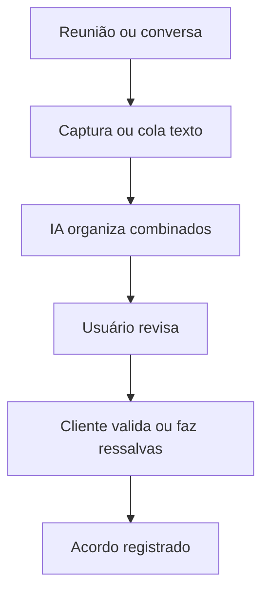

# O ARQUIVÃO CRONOLÓGICO DE TODAS AS INTERAÇÕES
> Extraído do log de 4.8MB. Falas do usuário integralmente preservadas.

### [Data: 2026-07-02] - Repositórios afetados: Nenhum
- **Pedido do Usuário:**
> Eu escreveria um prompt como CTO da startup, não como programador. Algo assim:  
  
  
  
---  
  
  
  
# PROJETO: ToDeAcordo  
  
  
  
Vamos iniciar um novo produto independente da TaxManagers.  
  
  
  
Objetivo:  
  
  
  
Criar um MVP funcional da plataforma **ToDeAcordo**, começando por uma extensão Chrome para Google Meet.  
  
  
  
## A tese do produto  
  
  
  
O mercado possui diversas ferramentas que transcrevem reuniões (Tactiq, Fireflies, Otter etc.).  
  
  
  
Nosso objetivo **não é criar outro transcritor**.  
  
  
  
Nossa hipótese é diferente:  
  
  
  
> O maior problema das reuniões não é perder a conversa. É nunca existir uma única versão aceita por todos sobre o que ficou combinado.  
  
  
  
O ToDeAcordo transforma:  
  
  
  
**Conversa → Entendimento → Consenso → Registro.**  
  
  
  
O foco do MVP é validar essa hipótese.  
  
  
  
---  
  
  
  
# MVP 1  
  
  
  
Criar uma extensão Chrome Manifest V3.  
  
  
  
Primeira plataforma:  
  
  
  
* Google Meet.  
  
  
  
Nada de Zoom ou Teams nesta fase.  
  
  
  
---  
  
  
  
# Fluxo  
  
  
  
1. Usuário instala a extensão.  
  
  
  
2. Ao entrar em uma reunião do Google Meet, a extensão detecta automaticamente que existe uma reunião ativa.  
  
  
  
3. Abrir um Side Panel próprio.  
  
  
  
4. Botão:  
  
  
  
**Iniciar Captura**  
  
  
  
5. Capturar exclusivamente as legendas/transcrição visível da reunião.  
  
  
  
Não gravar áudio.  
  
  
  
Não utilizar bots.  
  
  
  
Não automatizar participação.  
  
  
  
Utilizar apenas o conteúdo exibido ao usuário.  
  
  
  
6. Exibir a transcrição em tempo real.  
  
  
  
7. Ao final da reunião:  
  
  
  
Botão  
  
  
  
**Gerar Entendimento**  
  
  
  
A IA deverá produzir um documento estruturado contendo:  
  
  
  
* resumo executivo;  
  
* decisões;  
  
* pendências;  
  
* responsáveis;  
  
* prazos;  
  
* dúvidas abertas;  
  
* pontos sem consenso (quando houver).  
  
  
  
Importante:  
  
  
  
Não chamar isso de "Ata".  
  
  
  
Chamar de:  
  
  
  
**Entendimento da Reunião**  
  
  
  
---  
  
  
  
# Próxima etapa (estrutura preparada)  
  
  
  
Ainda NÃO implementar.  
  
  
  
Somente deixar arquitetura preparada.  
  
  
  
Após gerar o entendimento haverá:  
  
  
  
Botão  
  
  
  
**Enviar para Aprovação**  
  
  
  
Cada participante receberá um link.  
  
  
  
Cada pessoa poderá:  
  
  
  
* 👍 Tô de Acordo  
  
* 💬 Solicitar alteração  
  
  
  
Quando houver alteração:  
  
  
  
A IA gera nova versão.  
  
  
  
Quando todos concordarem:  
  
  
  
Estado:  
  
  
  
**Consenso Obtido**  
  
  
  
Essa funcionalidade será implementada posteriormente.  
  
  
  
---  
  
  
  
# Stack  
  
  
  
* Chrome Extension Manifest V3  
  
* React  
  
* TypeScript  
  
* Vite  
  
* IndexedDB  
  
* Supabase  
  
* OpenAI API (ou provedor configurável)  
  
* Tailwind  
  
  
  
---  
  
  
  
# Arquitetura desejada  
  
  
  
/src  
  
  
  
/components  
  
  
  
/pages  
  
  
  
/hooks  
  
  
  
/services  
  
  
  
/content-script  
  
  
  
/background  
  
  
  
/sidepanel  
  
  
  
/ai  
  
  
  
/storage  
  
  
  
---  
  
  
  
# Requisitos técnicos  
  
  
  
* Código limpo.  
  
* Componentes desacoplados.  
  
* Arquitetura preparada para expansão futura.  
  
* Sem dependências desnecessárias.  
  
* Logging para facilitar manutenção.  
  
* Compatível com atualizações futuras do Google Meet.  
  
  
  
---  
  
  
  
# Objetivo do MVP  
  
  
  
Não estamos construindo um concorrente do Tactiq.  
  
  
  
Estamos validando uma nova categoria:  
  
  
  
> **Conversation → Consensus**  
  
  
  
O sucesso do MVP não será medido pela qualidade da transcrição.  
  
  
  
Será medido pela capacidade de transformar uma conversa em um entendimento único que, futuramente, poderá ser aprovado pelos participantes.  
  
  
  
Antes de escrever qualquer linha de código, proponha a arquitetura completa do projeto e o plano de implementação em fases. Aguarde minha aprovação antes de iniciar o desenvolvimento.  
  
  
  
---  
  
  
  
**Uma sugestão adicional:** eu pediria para o Antigravity **não mencionar Tactiq no código nem nos comentários**. Ele pode usar como referência conceitual, mas o projeto deve nascer com identidade própria. A visão da empresa não é "transcrever reuniões"; é **registrar e consolidar o consenso**. Isso evita que a arquitetura fique presa ao paradigma de um clone desde o primeiro commit.


---

### [Data: 2026-07-02] - Repositórios afetados: Nenhum
- **Pedido do Usuário:**
> Substitua o implementation_plan.md atual por uma versão consolidada, sem adendos separados, incorporando todos os pontos abaixo como plano oficial do projeto.  
  
PROJETO: ToDeAcordo — MVP 1  
  
Objetivo:  
Criar uma extensão Chrome Manifest V3 para Google Meet que capture legendas visíveis da reunião, gere um “Entendimento da Reunião” estruturado por IA e prepare a arquitetura futura para revisão, aceite (“Tô de Acordo”) e consenso obtido.  
  
Tese central:  
O ToDeAcordo não é um transcritor de reuniões.  
  
A transcrição é apenas insumo.  
  
O produto transforma:  
  
Conversa  
→ Transcrição  
→ Entendimento estruturado  
→ Revisão futura  
→ “Tô de Acordo”  
→ Consenso obtido  
  
O ativo principal do sistema é o ConsensusObject, uma versão estruturada, revisável e auditável do entendimento comum extraído da conversa.  
  
Não estamos criando um clone do Tactiq.  
Estamos criando uma plataforma de consenso a partir de conversas.  
  
ESCOPO DO MVP 1  
  
Implementar agora:  
  
1. Extensão Chrome Manifest V3.  
2. Funcionamento inicial apenas em Google Meet.  
3. Side Panel da extensão.  
4. Detecção de reunião ativa.  
5. Botão “Iniciar Captura”.  
6. Captura das legendas/transcrição visível no DOM do Meet.  
7. Não gravar áudio.  
8. Não gravar vídeo.  
9. Não usar bot.  
10. Exibir transcrição em tempo real.  
11. Salvar transcrição localmente em IndexedDB.  
12. Botão “Gerar Entendimento”.  
13. Enviar transcript para backend/Edge Function.  
14. Backend chama LLM.  
15. IA retorna JSON estruturado.  
16. UI renderiza o Entendimento da Reunião.  
17. Exportar Markdown.  
18. Preparar arquitetura futura para revisão, aceite e consenso.  
  
Não implementar agora:  
  
- autenticação;  
- pagamento;  
- WhatsApp;  
- Zoom;  
- Teams;  
- aprovação por link;  
- assinatura eletrônica;  
- ICP-Brasil;  
- CRM;  
- integrações externas.  
  
DECISÕES FECHADAS  
  
1. Chave da OpenAI/LLM:  
Usar backend/Edge Function.  
A extensão nunca deve carregar chave da OpenAI diretamente.  
  
Arquitetura:  
  
Extension  
→ ToDeAcordo API / Edge Function  
→ LLM Provider  
  
2. Visual:  
Design limpo, moderno, simples e premium.  
Não perder tempo com identidade visual definitiva.  
Prioridade é produto funcional.  
  
3. Linguagem:  
Evitar termos burocráticos.  
  
Não usar como linguagem principal:  
- ata;  
- contrato;  
- assinatura;  
- documento jurídico.  
  
Usar:  
- entendimento;  
- combinado;  
- consenso;  
- Tô de Acordo;  
- pedir alteração;  
- consenso obtido.  
  
MODELO CENTRAL: ConsensusObject  
  
Criar desde o início um tipo central chamado ConsensusObject.  
  
Campos mínimos:  
  
- id  
- meeting_id  
- source_platform  
- title  
- created_at  
- updated_at  
- participants  
- transcript_segments  
- consensus_versions  
- current_version  
- status  
- agreements  
- decisions  
- obligations  
- pending_items  
- responsible_parties  
- deadlines  
- open_questions  
- disputed_points  
- confidence_score  
- audit_events  
  
Status possíveis:  
  
draft  
pending_review  
changes_requested  
consensus_obtained  
archived  
  
Mesmo que pending_review, changes_requested e consensus_obtained não sejam implementados agora, os tipos devem existir desde o MVP.  
  
OBJETO DE TRANSCRIÇÃO  
  
Cada trecho capturado deve ser salvo como TranscriptSegment:  
  
- id  
- meeting_id  
- timestamp  
- speaker  
- text  
- source  
- captured_at  
  
O sistema deve evitar duplicações comuns das legendas do Google Meet.  
  
PROMPT CENTRAL DA IA  
  
A IA não deve receber a instrução “faça um resumo”.  
  
O prompt central deve ser:  
  
“Extraia da conversa aquilo que realmente ficou combinado, separando decisões, obrigações, responsáveis, prazos, pendências, dúvidas abertas e pontos que ainda não têm consenso claro.”  
  
A saída da IA deve ser JSON estruturado.  
  
Não gerar HTML.  
  
A interface renderiza o JSON.  
  
Campos esperados da IA:  
  
- summary  
- agreements  
- decisions  
- obligations  
- pending_items  
- responsible_parties  
- deadlines  
- open_questions  
- disputed_points  
- confidence_score  
  
ARQUITETURA DE DIRETÓRIOS  
  
Atualizar a estrutura para:  
  
/src  
├── /ai  
│   ├── /providers  
│   │   ├── openaiProvider.ts  
│   │   ├── geminiProvider.ts  
│   │   └── mockProvider.ts  
│   ├── prompts.ts  
│   └── consensusExtractor.ts  
├── /audit  
├── /background  
├── /components  
├── /consensus  
├── /content-script  
├── /hooks  
├── /pages  
├── /platforms  
│   └── /google-meet  
│       ├── detector.ts  
│       ├── captionExtractor.ts  
│       ├── participantExtractor.ts  
│       └── selectors.ts  
├── /services  
├── /sidepanel  
├── /storage  
├── /types  
├── /utils  
└── /signature-placeholder  
  
PADRÃO DE PLATAFORMAS  
  
Não hardcodar tudo diretamente como Google Meet.  
  
Criar adapter pattern em /platforms.  
  
MVP:  
- /platforms/google-meet  
  
Futuro:  
- /platforms/zoom  
- /platforms/teams  
- /platforms/whatsapp  
  
CAPTURE ENGINE  
  
O motor de captura do Google Meet deve ter:  
  
- MutationObserver;  
- seletores isolados em selectors.ts;  
- logs de diagnóstico;  
- fallback quando legenda não estiver ativada;  
- alerta para o usuário ligar legendas;  
- deduplicação de falas repetidas;  
- timestamps por segmento;  
- speaker quando possível;  
- modo debug.  
  
PRIVACIDADE E TRANSPARÊNCIA  
  
Criar tela simples de transparência no MVP.  
  
Texto sugerido:  
  
“O ToDeAcordo captura apenas o texto das legendas visíveis no seu navegador. Não gravamos áudio nem vídeo. Use em reuniões nas quais você tenha autorização para registrar o conteúdo.”  
  
Permissões mínimas da extensão.  
  
Não enviar transcrição para IA antes do usuário clicar em “Gerar Entendimento”.  
  
AUDIT LOG  
  
Criar módulo /audit.  
  
No MVP, registrar localmente eventos principais:  
  
- reunião detectada;  
- captura iniciada;  
- captura pausada;  
- legenda capturada;  
- entendimento gerado;  
- erro na IA;  
- exportação feita.  
  
No futuro, registrar também:  
  
- versão criada;  
- link de revisão enviado;  
- participante visualizou;  
- participante clicou “Tô de Acordo”;  
- participante pediu alteração;  
- consenso obtido.  
  
TELEMETRIA LOCAL DO MVP  
  
Guardar localmente:  
  
- reuniões detectadas;  
- capturas iniciadas;  
- minutos capturados;  
- quantidade de segmentos;  
- cliques em “Gerar Entendimento”;  
- tempo de resposta da IA;  
- geração bem-sucedida ou erro;  
- exportações feitas.  
  
PLANO DE IMPLEMENTAÇÃO CONSOLIDADO  
  
Fase 1 — Fundação  
  
- Inicializar Vite + React + TypeScript.  
- Configurar Tailwind.  
- Configurar Manifest V3.  
- Criar entrypoints:  
  - background;  
  - content-script;  
  - sidepanel.  
- Criar comunicação entre scripts.  
- Criar estrutura de diretórios definitiva.  
- Criar tipos principais:  
  - ConsensusObject;  
  - TranscriptSegment;  
  - AuditEvent;  
  - MeetingSession.  
  
Fase 2 — Google Meet Adapter  
  
- Implementar detector de reunião ativa.  
- Implementar captionExtractor com MutationObserver.  
- Implementar selectors.ts.  
- Implementar participantExtractor básico, quando possível.  
- Enviar segmentos capturados para o sidepanel/background.  
- Criar deduplicação básica.  
- Criar alerta para ligar legendas.  
  
Fase 3 — Side Panel  
  
- Tela standby: aguardando reunião.  
- Tela reunião ativa.  
- Botão “Iniciar Captura”.  
- Feed de transcrição ao vivo.  
- Estado de captura.  
- Botão “Gerar Entendimento”.  
- Tela de resultado com Entendimento da Reunião.  
- Botão exportar Markdown.  
  
Fase 4 — Storage e Audit  
  
- Implementar IndexedDB.  
- Salvar sessão da reunião.  
- Salvar transcript incremental.  
- Recuperar estado se o painel fechar.  
- Registrar eventos locais no audit log.  
  
Fase 5 — Backend e IA  
  
- Criar chamada para backend/Edge Function.  
- Backend chama LLM provider.  
- Criar abstração:  
  - openaiProvider;  
  - geminiProvider;  
  - mockProvider.  
- Implementar prompt central de extração de consenso.  
- Retornar JSON estruturado.  
- Renderizar resultado na UI.  
- Tratar erro da IA.  
  
Fase 6 — Refinamento e Testes  
  
Testar obrigatoriamente:  
  
- reunião sem legenda ativada;  
- reunião com legenda ativada;  
- reunião longa;  
- troca de aba;  
- fechamento e reabertura do sidepanel;  
- falas duplicadas pelo Meet;  
- falas em português;  
- múltiplos participantes;  
- falha da IA;  
- perda temporária de conexão;  
- usuário clicando em “Gerar Entendimento” sem transcript suficiente.  
  
DEFINIÇÃO DE SUCESSO DO MVP  
  
O MVP será considerado funcional quando:  
  
1. detectar reunião no Google Meet;  
2. capturar legendas visíveis com estabilidade razoável;  
3. salvar transcript localmente;  
4. gerar ConsensusObject estruturado;  
5. renderizar o Entendimento da Reunião;  
6. permitir exportar Markdown;  
7. manter arquitetura preparada para revisão futura e “Tô de Acordo”.  
  
INSTRUÇÃO FINAL  
  
Atualize o implementation_plan.md com esta versão consolidada.  
  
Não crie adendo separado.  
  
Depois de atualizar o documento, apresente a versão revisada para aprovação antes de iniciar a Fase 1.


---

### [Data: 2026-07-02] - Repositórios afetados: masterkey-frontend
- **Pedido do Usuário:**
> De Acordo.  
  
Aprovo o implementation_plan.md consolidado como plano oficial do projeto ToDeAcordo — MVP 1.  
  
Pode iniciar imediatamente a Fase 1 — Fundação.  
  
Importante:  
Nesta Fase 1, não implementar ainda captura do Google Meet, IA, backend, IndexedDB completo ou geração de entendimento.  
  
O objetivo da Fase 1 é apenas deixar a base do projeto funcionando corretamente:  
  
1. Vite + React + TypeScript inicializado.  
2. Tailwind configurado.  
3. Manifest V3 configurado.  
4. Entrypoints criados:  
   - background  
   - content-script  
   - sidepanel  
5. Side Panel abrindo corretamente no Chrome.  
6. Comunicação básica entre sidepanel, background e content-script funcionando.  
7. Estrutura de diretórios definitiva criada.  
8. Tipos principais criados:  
   - ConsensusObject  
   - TranscriptSegment  
   - AuditEvent  
   - MeetingSession  
9. MockProvider criado para futura IA.  
10. Build funcionando sem erro.  
11. Instruções para instalar a extensão no Chrome em modo developer.  
  
Ao final da Fase 1, apresente:  
- lista de arquivos criados;  
- confirmação de build;  
- como instalar/testar no Chrome;  
- próximos passos da Fase 2.  
  
Não avançar para Fase 2 sem minha aprovação.
- **Arquivos Modificados/Lidos:**
  - C:\Users\Alexandre\masterkey-frontend\src\todeacordo\node_modules\postcss\lib\lazy-result.js
  - c:\Users\Alexandre\masterkey-frontend\src\todeacordo\dist
  - c:\Users\Alexandre\masterkey-frontend\src\todeacordo\tsconfig.app.json.
  - c:\Users\Alexandre\masterkey-frontend\src\todeacordo\src\content-script\index.ts.
  - c:\Users\Alexandre\masterkey-frontend\src\todeacordo\src\ai\providers\mockProvider.ts.
  - c:\Users\Alexandre\masterkey-frontend\src\todeacordo\src\background\index.ts.
  - c:\Users\Alexandre\masterkey-frontend\src\todeacordo\src\sidepanel\index.tsx.
  - C:\Users\Alexandre\.gemini\antigravity\brain\1b1bab8a-d610-463f-9bbf-4731d68556eb\task.md.
  - C:\Users\Alexandre\masterkey-frontend\src\todeacordo\node_modules\tailwindcss\dist\lib.js
  - c:\Users\Alexandre\masterkey-frontend\src\todeacordo\postcss.config.js.
  - *(... e mais 1 arquivos)*


---

### [Data: 2026-07-02] - Repositórios afetados: masterkey-frontend, todeacordo
- **Pedido do Usuário:**
> Bom trabalho. A Fase 1 está aprovada.  
  
Antes de iniciar a Fase 2, faça uma correção operacional importante:  
  
O projeto ToDeAcordo foi criado dentro de:  
c:\Users\Alexandre\masterkey-frontend\src\todeacordo  
  
Como o ToDeAcordo é um produto independente, mova o projeto inteiro para uma pasta própria, fora do masterkey-frontend, preferencialmente:  
  
c:\Users\Alexandre\todeacordo  
  
ou  
  
c:\Users\Alexandre\Projetos\todeacordo  
  
Depois de mover:  
1. confirme que package.json, vite.config.ts, public/manifest.json e src continuam corretos;  
2. rode npm install se necessário;  
3. rode npm run build;  
4. confirme que o dist é gerado corretamente;  
5. atualize as instruções de instalação da extensão para apontarem para a nova pasta dist.  
  
Após essa correção, pode iniciar a Fase 2 — Google Meet Adapter.  
  
Escopo da Fase 2:  
  
Implementar apenas o motor de detecção e captura do Google Meet.  
  
Não implementar ainda:  
- IA real;  
- backend;  
- IndexedDB avançado;  
- exportação;  
- aprovação;  
- “Tô de Acordo”;  
- assinatura;  
- Supabase.  
  
Objetivo da Fase 2:  
  
1. Criar /src/platforms/google-meet/detector.ts  
2. Criar /src/platforms/google-meet/captionExtractor.ts  
3. Criar /src/platforms/google-meet/selectors.ts  
4. Criar /src/platforms/google-meet/participantExtractor.ts, ainda que básico.  
5. Detectar se o usuário está:  
   - fora de uma reunião;  
   - no lobby;  
   - dentro de uma reunião ativa.  
6. Mostrar esse estado no Side Panel.  
7. Detectar se as legendas estão desligadas.  
8. Mostrar alerta claro:  
   “Ative as legendas do Google Meet para o ToDeAcordo capturar a conversa.”  
9. Capturar legendas visíveis usando MutationObserver.  
10. Criar deduplicação básica para evitar repetir a mesma legenda várias vezes.  
11. Criar timestamps para cada TranscriptSegment.  
12. Tentar capturar o speaker quando possível.  
13. Exibir os segmentos capturados em tempo real no Side Panel.  
14. Criar modo debug simples mostrando:  
   - reunião detectada;  
   - captions detectadas;  
   - último segmento capturado;  
   - total de segmentos;  
   - erros de seletor.  
  
Critérios de sucesso da Fase 2:  
  
A Fase 2 será considerada concluída quando:  
  
1. eu conseguir abrir uma reunião real no Google Meet;  
2. a extensão detectar que estou dentro da reunião;  
3. o painel avisar quando as legendas estiverem desligadas;  
4. ao ligar as legendas, a extensão capturar falas reais;  
5. as falas aparecerem no Side Panel em tempo real;  
6. não houver duplicação grosseira de legendas;  
7. cada fala tiver timestamp;  
8. o build continuar funcionando sem erros.  
  
Importante:  
O código deve ser resiliente. O Google Meet muda o DOM com frequência. Portanto, todos os seletores devem ficar isolados em selectors.ts, com logs e fallback. Não espalhar seletores pelo código.  
  
Ao finalizar a Fase 2, apresente:  
- arquivos criados/editados;  
- explicação de como testar em reunião real;  
- problemas conhecidos;  
- limitações da captura;  
- confirmação do build;  
- próximos passos da Fase 3.  
  
Não avançar para Fase 3 sem minha aprovação.
- **Arquivos Modificados/Lidos:**
  - c:\Users\Alexandre\todeacordo
  - c:\Users\Alexandre\masterkey-frontend\src\todeacordo
  - c:\Users\Alexandre\masterkey-frontend\src


---

### [Data: 2026-07-02] - Repositórios afetados: masterkey-frontend
- **Pedido do Usuário:**
> OK, vamos seguir com a Opção A.  
  
Mantemos provisoriamente o projeto em:  
  
c:\Users\Alexandre\masterkey-frontend\src\todeacordo  
  
Pode iniciar a Fase 2 — Google Meet Adapter imediatamente.  
  
Mas atenção às seguintes restrições:  
  
1. O ToDeAcordo deve continuar sendo tratado como produto independente.  
2. Não modificar arquivos fora da pasta:  
   c:\Users\Alexandre\masterkey-frontend\src\todeacordo  
3. Não alterar package.json, vite.config.ts, tsconfig, src ou qualquer arquivo do projeto MasterKey.  
4. Todos os comandos npm devem ser executados dentro da pasta todeacordo.  
5. Não criar dependência entre ToDeAcordo e MasterKey.  
6. Criar um README ou nota técnica informando que a pasta atual é provisória e que o projeto deverá ser movido futuramente para um workspace próprio.  
7. Garantir que o build do ToDeAcordo continue sendo independente.  
  
Pode iniciar a Fase 2 com o escopo já aprovado:  
  
- detector.ts  
- captionExtractor.ts  
- selectors.ts  
- participantExtractor.ts  
- detecção de reunião/lobby/fora da reunião  
- alerta de legendas desligadas  
- captura das legendas visíveis via MutationObserver  
- deduplicação básica  
- timestamps  
- speaker quando possível  
- exibição em tempo real no Side Panel  
- modo debug simples  
  
Não implementar ainda:  
- IA real  
- backend  
- Supabase  
- IndexedDB avançado  
- exportação  
- aprovação por link  
- “Tô de Acordo”  
- assinatura  
  
Ao final da Fase 2, apresentar:  
- arquivos criados/editados  
- confirmação de build  
- instruções de teste em reunião real no Google Meet  
- limitações conhecidas da captura  
- próximos passos da Fase 3  
  
Não avançar para Fase 3 sem minha aprovação.
- **Arquivos Modificados/Lidos:**
  - C:\Users\Alexandre\.gemini\antigravity\brain\1b1bab8a-d610-463f-9bbf-4731d68556eb\.system_generated\tasks\task-120.log
  - c:\Users\Alexandre\masterkey-frontend\src\todeacordo\src\content-script\index.ts.
  - c:\Users\Alexandre\masterkey-frontend\src\todeacordo\src\platforms\google-meet\captionExtractor.ts.
  - c:\Users\Alexandre\masterkey-frontend\src\todeacordo\src\sidepanel\index.tsx.
  - C:\Users\Alexandre\.gemini\antigravity\brain\1b1bab8a-d610-463f-9bbf-4731d68556eb\task.md.


---

### [Data: 2026-07-02] - Repositórios afetados: masterkey-frontend
- **Pedido do Usuário:**
> não tem que subir a pasta primeiro para as extensões
- **Arquivos Modificados/Lidos:**
  - c:\Users\Alexandre\masterkey-frontend\src\todeacordo\dist


---

### [Data: 2026-07-02] - Repositórios afetados: masterkey-frontend
- **Pedido do Usuário:**
> 
- **Arquivos Modificados/Lidos:**
  - c:\Users\Alexandre\masterkey-frontend\src\todeacordo\dist


---

### [Data: 2026-07-02] - Repositórios afetados: masterkey-frontend
- **Pedido do Usuário:**
> A Fase 2 ainda não está aprovada.  
  
No teste real, o bug ocorreu com o Google Meet na janela/aba correta. O print posterior em janela flutuante não representa o momento original do bug.  
  
Sintoma observado:  
- reunião detectada como ACTIVE;  
- legenda nativa do Google Meet aparecendo visualmente;  
- ToDeAcordo mostrando Captions Enabled: false;  
- Total Segments: 0;  
- nenhuma fala capturada.  
  
Conclusão:  
O problema está na detecção/captura das legendas nativas do Google Meet.  
  
Corrigir a Fase 2 antes de avançar.  
  
Tarefas obrigatórias:  
  
1. Criar um Caption Probe real no modo Debug.  
  
Ao clicar em Debug, o content-script deve varrer o DOM da aba do Meet e listar possíveis candidatos de legenda, exibindo no Side Panel:  
  
- quantidade de nós com texto visível;  
- quantidade de candidatos com aria-live;  
- quantidade de candidatos com role/status/log;  
- quantidade de candidatos próximos ao texto da legenda;  
- último texto bruto detectado no DOM;  
- seletor/caminho aproximado do elemento;  
- se o elemento está visível;  
- className resumido;  
- tagName.  
  
2. Mostrar no Debug:  
  
- activeTabUrl;  
- contentScriptConnected;  
- meetingState;  
- captionsEnabled;  
- mutationObserverActive;  
- observedRoot;  
- lastMutationAt;  
- lastRawCaptionText;  
- lastEmittedSegment;  
- totalSegments;  
- lastError.  
  
3. Melhorar selectors.ts.  
  
Não depender de um único seletor.  
  
Criar listas de candidatos:  
  
- captionsContainers;  
- ariaLiveContainers;  
- possibleTranscriptNodes;  
- speakerNodes;  
- meetRootNodes;  
- ignoreNodes.  
  
4. Melhorar captionExtractor.ts.  
  
O extractor deve:  
- observar document.body inicialmente;  
- registrar mutações detectadas;  
- filtrar textos irrelevantes;  
- aceitar candidatos por heurística, não só por seletor fixo;  
- identificar textos novos semelhantes a legenda;  
- deduplicar atualizações incrementais;  
- emitir TranscriptSegment quando houver texto novo consistente.  
  
5. Permitir tentativa de captura mesmo se captionsEnabled estiver false.  
  
O alerta pode continuar, mas o botão “Iniciar Captura” deve ativar o observer de qualquer forma.  
  
Motivo:  
A detecção de captionsEnabled pode estar falhando, embora a legenda esteja visível.  
  
6. Adicionar botão no Debug:  
  
“Capturar texto visível agora”  
  
Esse botão deve fazer uma varredura manual instantânea do DOM e mostrar os textos candidatos mais prováveis. Isso vai nos ajudar a descobrir onde o Meet está renderizando a legenda.  
  
7. Adicionar logs no console com prefixos:  
  
[ToDeAcordo][Detector]  
[ToDeAcordo][CaptionProbe]  
[ToDeAcordo][CaptionExtractor]  
[ToDeAcordo][ContentScript]  
  
8. Rodar npm run build após as correções.  
  
Critério de aprovação da Fase 2:  
  
Com uma reunião real no Google Meet e legenda nativa visível, o Side Panel deve:  
  
- detectar reunião ACTIVE;  
- iniciar captura mesmo que captionsEnabled falhe;  
- mostrar mutationObserverActive: true;  
- mostrar lastRawCaptionText com alguma fala detectada;  
- emitir pelo menos um TranscriptSegment;  
- aumentar Total Segments;  
- exibir a fala em tempo real no painel.  
  
Não iniciar Fase 3.  
Corrigir apenas a Fase 2.
- **Arquivos Modificados/Lidos:**
  - C:\Users\Alexandre\.gemini\antigravity\brain\1b1bab8a-d610-463f-9bbf-4731d68556eb\.system_generated\tasks\task-161.log
  - C:\Users\Alexandre\.gemini\antigravity\brain\1b1bab8a-d610-463f-9bbf-4731d68556eb\.system_generated\tasks\task-168.log
  - c:\Users\Alexandre\masterkey-frontend\src\todeacordo\src\platforms\google-meet\participantExtractor.ts.


---

### [Data: 2026-07-02] - Repositórios afetados: Nenhum
- **Pedido do Usuário:**
> A captura agora funcionou em reunião real do Google Meet.  
  
Resultado positivo:  
- a extensão capturou texto das legendas nativas;  
- os segmentos apareceram em tempo real no Side Panel;  
- Total Segments aumentou;  
- a Fase 2 provou que o ToDeAcordo consegue ler o DOM do Meet.  
  
Mas a Fase 2 ainda não está aprovada porque a captura está vindo suja e repetida.  
  
Problemas observados:  
1. O mesmo bloco de legenda foi capturado várias vezes.  
2. O sistema está acumulando textos anteriores e reemitindo o bloco inteiro.  
3. O speaker aparece como “Desconhecido”.  
4. O texto capturado mistura nomes de participantes, “Você” e falas.  
5. O feed fica poluído e pouco utilizável.  
  
Corrigir antes de avançar para a Fase 3.  
  
Tarefas de correção:  
  
1. Melhorar deduplicação incremental.  
O captionExtractor não deve emitir novamente um bloco inteiro se apenas parte dele já foi capturada.  
  
Estratégia sugerida:  
- manter lastRawText;  
- comparar novo texto com o anterior;  
- se o novo texto contém o anterior, emitir apenas o delta novo;  
- se o texto for muito parecido com o último emitido, ignorar;  
- usar normalização antes de comparar:  
  - trim;  
  - remover espaços duplicados;  
  - lowercase para comparação;  
  - remover quebras de linha excessivas.  
  
2. Criar buffer de fala.  
Em vez de emitir cada mutação imediatamente:  
- acumular alterações por 1.5s ou 2s;  
- quando houver pausa, emitir um TranscriptSegment limpo;  
- evitar reemitir o mesmo conteúdo.  
  
3. Filtrar lixo de UI.  
Ignorar textos que sejam apenas:  
- “Você”;  
- nome isolado do participante;  
- botões;  
- labels de interface;  
- strings muito curtas;  
- textos já usados como speaker.  
  
4. Melhorar separação speaker/text.  
Quando o Meet mostrar algo como:  
“Andrade Florio  
eu fiquei responsável por...”  
  
O sistema deve tentar interpretar:  
speaker = Andrade Florio  
text = eu fiquei responsável por...  
  
Quando aparecer:  
“Você  
Entregar os contratos.”  
  
speaker = Você  
text = Entregar os contratos.  
  
5. Criar função parseCaptionBlock(rawText).  
Essa função deve receber o texto bruto do container e retornar:  
{  
  speaker,  
  text  
}  
  
6. Melhorar debug.  
Mostrar no Debug:  
- rawCaptionBlock;  
- parsedSpeaker;  
- parsedText;  
- normalizedText;  
- lastEmittedNormalizedText;  
- dedupeReason quando ignorar uma fala.  
  
7. Não mexer em UI da Fase 3 ainda.  
Corrigir apenas a Fase 2.  
  
Critério de aprovação após correção:  
  
Em reunião real, ao falar frases como:  
“Alexandre ficou responsável por enviar a proposta até sexta-feira.”  
“Ficou pendente confirmar os valores.”  
“O prazo combinado foi dia quinze.”  
  
O Side Panel deve mostrar algo próximo de:  
  
Alexandre / Você — Alexandre ficou responsável por enviar a proposta até sexta-feira.  
Alexandre / Você — Ficou pendente confirmar os valores.  
Alexandre / Você — O prazo combinado foi dia quinze.  
  
Sem repetir o mesmo bloco várias vezes.  
  
Depois de corrigir, rodar npm run build e apresentar novo teste.
- **Arquivos Modificados/Lidos:**
  - C:\Users\Alexandre\.gemini\antigravity\brain\1b1bab8a-d610-463f-9bbf-4731d68556eb\.system_generated\tasks\task-181.log


---

### [Data: 2026-07-02] - Repositórios afetados: masterkey-frontend
- **Pedido do Usuário:**
> A Fase 2 ainda não está aprovada.  
  
Após novo teste real no Google Meet, a captura continua repetindo falas.  
  
Conclusão:  
A estratégia atual de deduplicação por delta/buffer ainda não é suficiente. O Google Meet parece atualizar um bloco móvel de legendas contendo texto já exibido anteriormente, e o extractor continua reemitindo conteúdo antigo.  
  
Precisamos corrigir a Fase 2 com uma lógica mais rígida de idempotência.  
  
Objetivo:  
O sistema nunca deve emitir duas vezes a mesma fala/sentença normalizada, mesmo que o DOM do Meet reenvie o bloco inteiro.  
  
Implementar as seguintes correções:  
  
1. Criar hash/canonicalização de texto  
  
Criar função:  
  
normalizeForDedupe(text: string): string  
  
Ela deve:  
- converter para lowercase;  
- remover acentos;  
- remover pontuação irrelevante;  
- remover espaços duplicados;  
- remover quebras de linha;  
- trim;  
- remover nomes isolados como “você” quando forem apenas speaker;  
- normalizar pequenas variações.  
  
Criar função simples:  
  
hashText(normalized: string): string  
  
Pode ser hash simples determinístico, sem biblioteca externa.  
  
2. Criar emittedHashes por reunião  
  
No captionExtractor, manter:  
  
const emittedHashes = new Set<string>()  
  
Antes de emitir qualquer TranscriptSegment:  
- normalizar o texto final;  
- gerar hash;  
- se o hash já existir em emittedHashes, NÃO emitir;  
- registrar dedupeReason = "already-emitted-hash";  
- se for novo, adicionar ao Set e emitir.  
  
Isso deve ser a trava principal.  
  
3. Fazer deduplicação por sentença, não por bloco  
  
O rawCaptionBlock pode vir assim:  
  
“Andrade Florio  
Frase antiga.  
Você  
Frase nova.”  
  
O sistema não deve emitir o bloco inteiro.  
  
Criar função:  
  
extractCleanUtterances(rawBlock): Array<{ speaker, text }>  
  
Ela deve:  
- separar speaker de texto;  
- quebrar textos longos em sentenças;  
- retornar apenas unidades pequenas e limpas;  
- ignorar nomes isolados;  
- ignorar UI;  
- ignorar sentenças muito curtas;  
- ignorar sentenças já emitidas por hash.  
  
Exemplo:  
  
raw:  
“Você  
Alexandre ficou responsável por enviar a proposta até sexta-feira.  
Você  
Ficou pendente confirmar os valores.”  
  
deve gerar duas utterances:  
1. speaker = Você | text = Alexandre ficou responsável por enviar a proposta até sexta-feira.  
2. speaker = Você | text = Ficou pendente confirmar os valores.  
  
E cada uma só pode aparecer uma vez.  
  
4. Não emitir bloco acumulado  
  
Proibir emissão de rawCaptionBlock inteiro.  
  
O extractor só pode emitir resultado de extractCleanUtterances.  
  
5. Criar activePartial por speaker  
  
Para frases sem pontuação:  
- manter activePartial por speaker;  
- se o novo texto é apenas continuação/atualização do partial anterior, substituir o partial, não emitir novamente;  
- emitir apenas quando:  
  a) houver pontuação final; ou  
  b) houver pausa maior que 2s;  
- antes de emitir, passar pelo emittedHashes.  
  
6. Dedupe também no Side Panel  
  
Adicionar uma segunda trava no sidepanel:  
- cada TranscriptSegment deve ter normalized_hash;  
- se o sidepanel já recebeu o mesmo normalized_hash, ignorar.  
Isso evita repetição mesmo se o content-script falhar.  
  
7. Adicionar campos ao TranscriptSegment  
  
Adicionar opcionalmente:  
- normalized_text  
- normalized_hash  
- dedupe_reason  
- raw_source_text  
  
8. Melhorar Debug  
  
Mostrar:  
- emittedHashesCount;  
- lastNormalizedHash;  
- lastIgnoredHash;  
- dedupeReason;  
- extractedUtterancesCount;  
- lastExtractedUtterances;  
- rawBlockLength.  
  
9. Teste obrigatório  
  
Depois da correção, testar com estas frases:  
  
“Alexandre ficou responsável por enviar a proposta até sexta-feira.”  
“Ficou pendente confirmar os valores.”  
“O prazo combinado foi dia quinze.”  
“Todos concordaram em fazer nova reunião amanhã.”  
  
Resultado esperado:  
Cada frase deve aparecer uma única vez no Side Panel.  
  
Não pode:  
- repetir bloco inteiro;  
- reemitir frase antiga;  
- acumular histórico;  
- mostrar “Você” isolado como fala;  
- mostrar nome isolado como fala.  
  
10. Não avançar para Fase 3.  
Corrigir apenas Fase 2.  
Rodar npm run build.
- **Arquivos Modificados/Lidos:**
  - C:\Users\Alexandre\.gemini\antigravity\brain\1b1bab8a-d610-463f-9bbf-4731d68556eb\.system_generated\tasks\task-196.log
  - C:\Users\Alexandre\.gemini\antigravity\brain\1b1bab8a-d610-463f-9bbf-4731d68556eb\.system_generated\tasks\task-215.log
  - c:\Users\Alexandre\masterkey-frontend\src\todeacordo\src\platforms\google-meet\captionExtractor.ts.


---

### [Data: 2026-07-02] - Repositórios afetados: Nenhum
- **Pedido do Usuário:**
> A captura melhorou bastante.  
  
Resultado positivo:  
- a extensão capturou texto real das legendas/DOM do Google Meet;  
- a repetição grosseira aparentemente foi reduzida;  
- Total Segments aumentou;  
- o Side Panel recebeu falas em tempo real.  
  
Porém a Fase 2 ainda precisa de um refinamento final antes da aprovação.  
  
Problema observado:  
O ToDeAcordo também está capturando textos de interface/sistema do Google Meet, como:  
  
- “Andrade Florio está participando”  
- “Português (Brasil) format_size Tamanho da fonte...”  
- “Sua câmera está desativada.”  
- “Seu organizador encerrou a reunião para todos.”  
- textos de configuração de legenda  
- textos de estado da reunião  
  
Esses textos não são fala da reunião e não devem virar TranscriptSegment.  
  
Correção solicitada:  
  
1. Criar filtro específico para mensagens de sistema do Meet.  
  
Adicionar função:  
  
isMeetSystemText(text: string): boolean  
  
Ela deve bloquear padrões como:  
- está participando  
- sua câmera está desativada  
- seu microfone está desativado  
- organizador encerrou  
- reunião encerrada  
- idioma  
- language  
- português brasil  
- tamanho da fonte  
- format_size  
- cor da fonte  
- abrir configurações  
- configurações de legenda  
- captions  
- settings  
- circle  
- CC  
- participante entrou  
- participante saiu  
  
2. Separar melhor legenda real de UI.  
  
O extractor deve priorizar containers próximos da legenda visível principal e reduzir peso de textos vindos de:  
- menus;  
- configurações;  
- botões;  
- avisos do Meet;  
- notificações de entrada/saída;  
- controles da chamada.  
  
3. Capturar apenas depois de “Iniciar Captura”.  
  
Não registrar como fala nenhum texto detectado antes do usuário clicar em Iniciar Captura.  
  
4. Melhorar o detector de estado.  
  
No print o painel ainda mostra:  
“Aguardando você entrar na sala do Meet.”  
  
Mesmo assim já havia textos capturados. Isso indica inconsistência entre meetingState e captura.  
  
Corrigir para:  
- se a reunião estiver ACTIVE, não mostrar “Aguardando você entrar na sala”;  
- se estiver aguardando/lobby, não capturar falas;  
- capturar apenas em reunião ativa e após o clique em Iniciar Captura.  
  
5. Melhorar Debug.  
  
Adicionar no Debug:  
- systemTextFilteredCount;  
- lastSystemTextFiltered;  
- currentCaptureAllowed true/false;  
- captureBlockedReason;  
- lastAcceptedCaptionText.  
  
6. Teste obrigatório após correção.  
  
Testar com Google Meet real e legendas nativas ativadas.  
  
Falar:  
  
“Alexandre ficou responsável por enviar a proposta até sexta-feira.”  
“Ficou pendente confirmar os valores.”  
“O prazo combinado foi dia quinze.”  
  
Resultado esperado:  
O Side Panel deve mostrar apenas falas reais da reunião.  
  
Não deve capturar:  
- mensagens de participação;  
- configurações de legenda;  
- avisos de câmera;  
- avisos de reunião encerrada;  
- textos de menu.  
  
Se a fala aparecer na legenda nativa do Google Meet, deve aparecer no ToDeAcordo.  
Se não aparecer na legenda nativa do Meet, não é responsabilidade do ToDeAcordo neste MVP, pois não gravamos áudio.  
  
Rodar npm run build após a correção.  
  
Não iniciar Fase 3 ainda.
- **Arquivos Modificados/Lidos:**
  - C:\Users\Alexandre\.gemini\antigravity\brain\1b1bab8a-d610-463f-9bbf-4731d68556eb\.system_generated\tasks\task-232.log


---

### [Data: 2026-07-02] - Repositórios afetados: , masterkey-frontend, todeacordo
- **Pedido do Usuário:**
> Fase 2 testada e aprovada.  
  
Teste real realizado no Google Meet com legendas nativas ativadas.  
  
Resultado observado:  
- a extensão capturou falas reais da reunião;  
- Total Segments maior que zero;  
- repetição grosseira resolvida;  
- mensagens de sistema foram filtradas de forma aceitável;  
- os segmentos apareceram em tempo real no Side Panel;  
- build confirmado sem erros.  
  
Observações menores para manter no radar:  
1. Em alguns casos o texto pode vir com duplicação leve do speaker, como “Você Você tá me ouvindo bem?”.  
2. Após o encerramento da reunião, o estado visual pode voltar para “Aguardando você entrar na sala do Meet”, mesmo mantendo o histórico capturado.  
  
Esses pontos não impedem o avanço.  
  
Pode iniciar a Fase 3 — Side Panel.  
  
Escopo da Fase 3:  
  
1. Refinar a interface visual do Side Panel.  
2. Manter estados:  
   - aguardando Google Meet;  
   - lobby;  
   - reunião ativa;  
   - legendas desligadas;  
   - captura ativa;  
   - captura pausada/finalizada;  
   - reunião encerrada.  
3. Melhorar o feed de transcrição em tempo real.  
4. Criar botão “Gerar Entendimento”.  
5. Usar apenas mockProvider nesta fase.  
6. Ao clicar em “Gerar Entendimento”, transformar o transcript capturado em um ConsensusObject mockado.  
7. Criar tela “Entendimento da Reunião”.  
8. Renderizar:  
   - resumo;  
   - combinados;  
   - decisões;  
   - responsáveis;  
   - prazos;  
   - pendências;  
   - dúvidas abertas;  
   - pontos sem consenso.  
9. Criar botão “Exportar Markdown”.  
10. Criar estados de erro:  
   - transcript vazio;  
   - transcript insuficiente;  
   - captura não iniciada.  
11. Corrigir no feed duplicações simples de speaker, como “Você Você...”, quando possível.  
12. Tratar melhor o estado pós-reunião encerrada.  
  
Não implementar ainda:  
- IA real;  
- backend;  
- Supabase;  
- aprovação por link;  
- “Tô de Acordo” funcional;  
- assinatura;  
- ICP;  
- WhatsApp;  
- Zoom;  
- Teams.  
  
Ao finalizar, apresentar:  
- arquivos criados/editados;  
- confirmação do build;  
- instruções de teste;  
- limitações conhecidas;  
- próximos passos da Fase 4.  
  
Não avançar para Fase 4 sem minha aprovação.
- **Arquivos Modificados/Lidos:**
  - c:\Users\Alexandre\masterkey-frontend\src\todeacordo
  - C:\\\\Users\\\\Alexandre\\\\.gemini\\\\antigravity\\\\brain\\\\1b1bab8a-d610-463f-9bbf-4731d68556eb\\\\.system_generated\\\\logs\\\\transcript.jsonl\\\
  - C:\Users\Alexandre\.gemini\antigravity\brain\1b1bab8a-d61
  - c:\\\\Users\\\\Alexandre\\\\masterkey-frontend\\\\src\\\\todeacordo\
  - c:\Users\Alexandre\todeacordo
  - c:\\\\\\\\Users\\\\\\\\Alexandre\\\\\\\\masterkey-frontend\\\\\\\\src\\\\\\\\todeacordo\\\\\\\\dist\\\
  - c:\Users\Alexandre\masterkey-frontend\src\todeacordo\src\sidepanel\index.tsx.
  - C:\Users\Alexandre\.gemini\antigravity\brain\1b1bab8a-d610-463f-9bbf-4731d68556eb\task.md.
  - C:\\Users\\Alexandre\\.gemini\\antigravity\\brain\\1b1bab8a-d61
  - c:\\\\Users\\\\Alexandre\\\\masterkey-frontend\\\\src\\\\todeacordo\\\\dist


---

### [Data: 2026-07-02] - Repositórios afetados: masterkey-frontend
- **Pedido do Usuário:**
> Fase 3 aprovada.  
  
Pode iniciar imediatamente a Fase 4 — Storage e Audit.  
  
Objetivo da Fase 4:  
Fazer a transcrição, a sessão da reunião, o ConsensusObject mockado e os eventos principais sobreviverem ao fechamento e reabertura do Side Panel.  
  
Escopo obrigatório:  
  
1. Implementar IndexedDB em /src/storage.  
  
Criar:  
- db.ts  
- meetingStorage.ts  
- transcriptStorage.ts  
- consensusStorage.ts  
- auditStorage.ts  
  
2. Persistir MeetingSession.  
  
Campos mínimos:  
- id  
- meeting_url  
- meeting_code  
- source_platform  
- title  
- started_at  
- ended_at  
- status  
- participants  
- transcript_segment_ids  
- consensus_object_id  
- created_at  
- updated_at  
  
3. Persistir TranscriptSegments incrementalmente.  
  
Cada fala capturada deve ser salva localmente, além de aparecer no Side Panel.  
  
4. Recuperar estado ao reabrir o Side Panel.  
  
Ao fechar e reabrir o painel, recuperar:  
- sessão ativa;  
- transcrição já capturada;  
- status da captura;  
- ConsensusObject gerado, se existir.  
  
5. Persistir ConsensusObject mockado.  
  
Quando clicar em “Gerar Entendimento”, salvar localmente o ConsensusObject retornado pelo mockProvider.  
  
6. Criar módulo /src/audit.  
  
Criar:  
- auditLogger.ts  
- auditTypes.ts  
  
Eventos mínimos:  
- meeting_detected  
- capture_started  
- capture_stopped  
- transcript_segment_captured  
- consensus_generation_started  
- consensus_generated  
- consensus_generation_error  
- markdown_exported  
- meeting_ended  
- sidepanel_opened  
- sidepanel_restored  
- meeting_cleared  
  
7. Integrar Audit Log ao fluxo atual.  
  
Registrar eventos nos momentos corretos:  
- abertura do Side Panel;  
- reunião detectada;  
- início da captura;  
- cada segmento aceito;  
- geração do entendimento;  
- exportação Markdown;  
- encerramento da reunião;  
- limpeza/reset.  
  
8. Criar botão discreto:  
  
“Limpar reunião atual”  
  
Esse botão deve:  
- limpar transcrição da sessão atual;  
- limpar ConsensusObject da sessão atual;  
- registrar evento audit;  
- não apagar configurações globais.  
  
9. Melhorar estado pós-reunião.  
  
Quando a reunião encerrar, preservar transcrição e permitir:  
- Gerar Entendimento;  
- Exportar Markdown;  
- Limpar reunião atual.  
  
10. Manter tudo local.  
  
Não implementar nesta fase:  
- Supabase;  
- backend;  
- IA real;  
- autenticação;  
- aprovação por link;  
- “Tô de Acordo” funcional;  
- assinatura;  
- ICP;  
- WhatsApp;  
- Zoom;  
- Teams;  
- pagamentos.  
  
11. Rodar npm run build ao final.  
  
Critérios de sucesso:  
  
A Fase 4 será aprovada quando eu conseguir:  
  
1. abrir uma reunião no Google Meet;  
2. iniciar captura;  
3. capturar falas;  
4. fechar o Side Panel;  
5. reabrir o Side Panel;  
6. ver as falas restauradas;  
7. gerar o Entendimento da Reunião;  
8. fechar e reabrir o Side Panel;  
9. ver o Entendimento restaurado;  
10. exportar Markdown;  
11. limpar a reunião atual;  
12. rodar build sem erros.  
  
Ao finalizar, apresentar:  
- arquivos criados/editados;  
- confirmação do build;  
- instruções de teste;  
- limitações conhecidas;  
- próximos passos da Fase 5.  
  
Não avançar para Fase 5 sem minha aprovação.
- **Arquivos Modificados/Lidos:**
  - c:\Users\Alexandre\masterkey-frontend\src\todeacordo\src\types\index.ts.
  - C:\Users\Alexandre\.gemini\antigravity\brain\1b1bab8a-d610-463f-9bbf-4731d68556eb\.system_generated\tasks\task-294.log
  - c:\Users\Alexandre\masterkey-frontend\src\todeacordo\src\storage\meetingStorage.ts.
  - c:\Users\Alexandre\masterkey-frontend\src\todeacordo\src\sidepanel\index.tsx.
  - C:\Users\Alexandre\.gemini\antigravity\brain\1b1bab8a-d610-463f-9bbf-4731d68556eb\task.md.
  - c:\Users\Alexandre\masterkey-frontend\src\todeacordo\src\storage\db.ts.
  - C:\Users\Alexandre\.gemini\antigravity\brain\1b1bab8a-d610-463f-9bbf-4731d68556eb\.system_generated\tasks\task-340.log


---

### [Data: 2026-07-02] - Repositórios afetados: masterkey-frontend
- **Pedido do Usuário:**
> A Fase 4 ainda não está aprovada para avançar à Fase 5.  
  
O IndexedDB pode estar funcionando, mas a transcrição ainda está inadequada para IA real.  
  
Problema observado:  
O Google Meet atualiza a legenda incrementalmente, e o ToDeAcordo está emitindo cada atualização como um novo TranscriptSegment.  
  
Exemplo real:  
“Você Ah legal Então vou fazer.”  
“Você Ah legal Então, vou fazer um.”  
“Você Ah legal Então, vou fazer um contrato aí nós dois.”  
  
Isso deveria virar apenas um segmento final:  
“Você — Ah legal. Então vou fazer um contrato aí nós dois.”  
  
Conclusão:  
A deduplicação por hash não resolve, porque as frases incrementais têm hashes diferentes.  
Precisamos trocar a arquitetura de emissão.  
  
Implementar correção estrutural:  
  
1. Separar rascunho ao vivo de segmento confirmado.  
  
Criar conceito:  
  
LiveCaptionDraft  
  
Campos:  
- id  
- speaker  
- text  
- normalized_text  
- started_at  
- updated_at  
- source_node_signature  
- status: live | committed | discarded  
  
TranscriptSegment só deve ser criado quando uma fala estiver estabilizada.  
  
2. O captionExtractor NÃO deve emitir TranscriptSegment a cada mutação.  
  
Ele deve emitir dois tipos de evento:  
  
- caption_draft_updated  
- transcript_segment_committed  
  
O Side Panel pode mostrar o draft ao vivo, mas só deve adicionar ao histórico quando vier committed.  
  
3. Regra de atualização do draft.  
  
Se o novo texto:  
- começa com o texto anterior;  
- contém o texto anterior;  
- é altamente parecido com o texto anterior;  
- ou parece uma versão expandida da mesma legenda;  
  
então atualizar o mesmo LiveCaptionDraft.  
  
Não criar novo segmento.  
  
4. Regra de commit.  
  
Commitar um TranscriptSegment somente quando:  
  
- o texto ficou estável por 2 segundos sem crescer;  
ou  
- houve troca clara de speaker;  
ou  
- a legenda anterior desapareceu e uma nova começou;  
ou  
- a reunião foi encerrada/parada.  
  
Antes de commitar:  
- limpar speaker duplicado;  
- remover “Você” duplicado dentro do texto;  
- remover nomes isolados;  
- normalizar espaços;  
- aplicar filtro de sistema;  
- aplicar hash final.  
  
5. IndexedDB só deve salvar segmentos committed.  
  
Não salvar draft incremental como fala definitiva.  
  
6. Side Panel deve tratar draft diferente de histórico.  
  
Na UI:  
- histórico mostra falas confirmadas;  
- abaixo, opcionalmente, mostrar “Capturando agora...” com a fala parcial;  
- se o draft for atualizado, substituir o texto parcial, não adicionar nova linha.  
  
7. Corrigir duplicação de speaker dentro do texto.  
  
Exemplos a limpar:  
  
“Você Você tá me ouvindo bem?”  
→ speaker: Você  
→ text: “Tá me ouvindo bem?”  
  
“Andrade Florio Calma só mais um pouco.”  
→ speaker: Andrade Florio  
→ text: “Calma só mais um pouco.”  
  
“tchau Você Eu tô fazendo um teste aqui do aplicativo.”  
→ deve tentar separar ou, se confuso, manter apenas o trecho mais provável da fala:  
speaker: Você  
text: “Eu tô fazendo um teste aqui do aplicativo.”  
  
8. Criar função:  
  
cleanSpeakerFromText(speaker, text)  
  
Ela deve remover do início do texto:  
- speaker repetido;  
- “Você”;  
- nomes detectados como speaker;  
- tokens de speaker inseridos pelo Meet.  
  
9. Criar função:  
  
isExpansionOfSameCaption(previousText, newText): boolean  
  
Critérios:  
- newText começa com previousText normalizado;  
- newText contém previousText normalizado;  
- similaridade alta;  
- diferença principal é acréscimo no final.  
  
10. Criar função:  
  
commitDraft(draft)  
  
Ela deve:  
- limpar texto;  
- ignorar se texto final for curto demais;  
- ignorar se for sistema;  
- gerar normalized_hash final;  
- bloquear se hash já foi committed;  
- salvar no IndexedDB;  
- enviar ao Side Panel como TranscriptSegment.  
  
11. Debug obrigatório.  
  
Mostrar:  
- activeDraftText  
- activeDraftSpeaker  
- activeDraftUpdatedAt  
- committedSegmentsCount  
- draftUpdateCount  
- lastCommitReason  
- lastDiscardReason  
- lastCleanedText  
- lastSpeakerCleaned  
  
12. Teste obrigatório.  
  
Falar no Meet:  
  
“Ah legal. Então vou fazer um contrato aí entre nós dois.”  
“Ficou pendente confirmar os valores.”  
“O prazo combinado foi dia quinze.”  
  
Resultado esperado no histórico:  
  
Você — Ah legal. Então vou fazer um contrato aí entre nós dois.  
Você — Ficou pendente confirmar os valores.  
Você — O prazo combinado foi dia quinze.  
  
Não pode aparecer:  
- versões parciais da mesma frase;  
- “Você Você”;  
- “Ah legal então vou fazer” e depois “Ah legal então vou fazer um contrato” como duas falas separadas;  
- texto de sistema;  
- histórico acumulado repetido.  
  
13. Não iniciar Fase 5.  
  
Corrigir esta camada antes de IA real, porque a IA vai alucinar ou se confundir se receber transcript incremental sujo.  
  
Rodar npm run build ao final.
- **Arquivos Modificados/Lidos:**
  - C:\Users\Alexandre\.gemini\antigravity\brain\1b1bab8a-d610-463f-9bbf-4731d68556eb\.system_generated\tasks\task-395.log
  - c:\Users\Alexandre\masterkey-frontend\src\todeacordo\src\types\index.ts.
  - C:\Users\Alexandre\.gemini\antigravity\brain\1b1bab8a-d610-463f-9bbf-4731d68556eb\.system_generated\tasks\task-380.log
  - c:\Users\Alexandre\masterkey-frontend\src\todeacordo\src\content-script\index.ts.
  - c:\Users\Alexandre\masterkey-frontend\src\todeacordo\src\sidepanel\index.tsx.
  - C:\Users\Alexandre\.gemini\antigravity\brain\1b1bab8a-d610-463f-9bbf-4731d68556eb\task.md.


---

### [Data: 2026-07-02] - Repositórios afetados: masterkey-frontend
- **Pedido do Usuário:**
> A refatoração ainda não está aprovada.  
  
No teste real, o sistema ainda está registrando versões sucessivas do mesmo bloco como TranscriptSegments definitivos.  
  
Exemplo observado:  
- 20:11:42: “Tô iniciando a captura outra vez... É o contrato a gente alinha depois.”  
- 20:11:43: mesmo bloco quase igual, com pequena alteração.  
- 20:13:27: mesmo bloco expandido com mais fala no final.  
- 20:13:49: mesmo bloco expandido novamente.  
  
Conclusão:  
A lógica de Draft vs Commit melhorou, mas ainda commita cedo demais e não reconhece que um novo bloco é expansão de um segmento já comitado.  
  
Precisamos implementar uma camada de “rolling segment” ou “replace last committed segment”.  
  
Objetivo:  
Se o Google Meet reenviar uma legenda maior que contém uma fala já comitada, o ToDeAcordo deve ATUALIZAR/SUBSTITUIR o último segmento relacionado, e não criar um novo.  
  
Correções obrigatórias:  
  
1. Criar recentCommittedSegments em memória.  
  
Manter uma lista dos últimos segmentos comitados da reunião, por exemplo os últimos 10.  
  
Cada item deve conter:  
- id  
- speaker  
- text  
- normalized_text  
- normalized_hash  
- committed_at  
- source_node_signature  
- updated_count  
  
2. Criar função:  
  
isExpansionOfCommittedSegment(committedText, newText): boolean  
  
Critérios:  
- newText contém committedText normalizado;  
- newText começa com committedText normalizado;  
- committedText contém parte relevante de newText;  
- similaridade alta;  
- newText é maior que committedText por acréscimo no final;  
- diferença temporal pequena, por exemplo dentro de 10 a 20 segundos;  
- mesmo speaker ou speaker desconhecido compatível.  
  
3. Se newText for expansão de segmento já comitado:  
NÃO criar novo TranscriptSegment.  
  
Em vez disso:  
- atualizar o texto do segmento existente;  
- manter o mesmo id;  
- recalcular normalized_text e normalized_hash;  
- atualizar updated_at;  
- incrementar updated_count;  
- atualizar também no IndexedDB;  
- enviar evento ao Side Panel do tipo transcript_segment_updated.  
  
4. Side Panel deve suportar update, não só append.  
  
Hoje parece que toda fala recebida entra como nova linha.  
  
Alterar lógica:  
- se chegar transcript_segment_committed com id novo, adicionar;  
- se chegar transcript_segment_updated com id existente, substituir a linha existente;  
- nunca duplicar a mesma fala expandida.  
  
5. IndexedDB deve suportar upsert.  
  
O transcriptStorage precisa salvar por id, substituindo se já existir.  
  
Não pode gerar nova linha no banco para expansão do mesmo segmento.  
  
6. Commit mais conservador.  
  
Aumentar o tempo de estabilização antes de commit para 3 segundos no MVP.  
  
O Google Meet parece continuar expandindo o bloco por mais tempo que 2 segundos.  
  
7. Detectar mudança real de fala.  
  
Uma nova fala só deve ser criada quando houver:  
- troca clara de speaker;  
- texto novo que não contenha o último committed;  
- texto novo que não seja expansão do activeDraft;  
- diferença semântica/estrutural suficiente;  
- ou pausa longa, por exemplo acima de 8 a 10 segundos, com texto novo.  
  
8. Evitar blocos longos acumulados demais.  
  
Se o rawBlock estiver acumulando várias falas antigas, tentar extrair apenas a parte nova após o último trecho já aceito.  
  
Criar função:  
  
extractNovelSuffix(previousText, newText): string  
  
Se newText contém previousText, usar apenas o sufixo novo para atualizar draft ou criar nova fala, conforme o caso.  
  
9. Não salvar nem renderizar versões intermediárias como definitivas.  
  
O histórico deve representar falas consolidadas, não snapshots da legenda.  
  
10. Debug obrigatório.  
  
Adicionar:  
- lastCommittedText  
- lastCommittedId  
- lastSegmentUpdatedId  
- updateReason  
- recentCommittedCount  
- isExpansionOfCommitted  
- novelSuffix  
- segmentUpdatedCount  
  
11. Teste obrigatório.  
  
Falar de forma contínua:  
  
“Tô iniciando a captura outra vez. Estou vendo se está evoluindo. Então nós vamos fazer o acordo. Daí eu fico responsável pelo contrato. A linha depois a gente ajusta.”  
  
Resultado esperado:  
No histórico deve aparecer no máximo uma fala consolidada para esse bloco, ou uma divisão razoável em frases, mas nunca várias versões crescentes do mesmo texto.  
  
Não pode aparecer:  
- mesma fala em versões sucessivas;  
- bloco antigo expandido como nova linha;  
- múltiplos timestamps para a mesma fala crescendo.  
  
12. Não iniciar Fase 5.  
Corrigir apenas esta camada.  
  
Rodar npm run build ao final.
- **Arquivos Modificados/Lidos:**
  - c:\Users\Alexandre\masterkey-frontend\src\todeacordo\src\types\index.ts.
  - C:\Users\Alexandre\.gemini\antigravity\brain\1b1bab8a-d610-463f-9bbf-4731d68556eb\.system_generated\tasks\task-433.log
  - c:\Users\Alexandre\masterkey-frontend\src\todeacordo\src\content-script\index.ts.
  - c:\Users\Alexandre\masterkey-frontend\src\todeacordo\src\platforms\google-meet\captionExtractor.ts.
  - c:\Users\Alexandre\masterkey-frontend\src\todeacordo\src\sidepanel\index.tsx.
  - C:\Users\Alexandre\.gemini\antigravity\brain\1b1bab8a-d610-463f-9bbf-4731d68556eb\task.md.
  - C:\Users\Alexandre\.gemini\antigravity\brain\1b1bab8a-d610-463f-9bbf-4731d68556eb\.system_generated\tasks\task-445.log
  - C:\Users\Alexandre\.gemini\antigravity\brain\1b1bab8a-d610-463f-9bbf-4731d68556eb\.system_generated\tasks\task-419.log


---

### [Data: 2026-07-02] - Repositórios afetados: Nenhum
- **Pedido do Usuário:**
> Fase 4 aprovada.  
  
A refatoração Rolling Segment / Upsert foi testada em reunião real do Google Meet e está aceitável para MVP.  
  
Resultado observado:  
- o ToDeAcordo captura falas reais do Google Meet;  
- o histórico ficou utilizável;  
- a repetição grosseira das legendas móveis foi reduzida;  
- o rascunho ao vivo e os segmentos consolidados estão funcionando de forma aceitável;  
- o Side Panel preserva a transcrição;  
- o IndexedDB está funcionando;  
- build confirmado sem erros.  
  
Limitação conhecida:  
Em ambiente com múltiplas pessoas falando, microfones próximos, microfonia ou legenda confusa do próprio Google Meet, a transcrição pode vir imperfeita, com speaker “Desconhecido” ou trechos misturados. Isso é aceitável para o MVP, desde que a IA trate incertezas como pendências, dúvidas abertas ou pontos sem consenso, sem inventar.  
  
Antes da Fase 5, limpar a reunião atual para não misturar dados antigos/sujos nos testes de IA real.  
  
Pode iniciar a Fase 5 — Backend e IA real.  
  
Importante:  
A IA deve receber apenas TranscriptSegments consolidados. Nunca enviar LiveCaptionDraft nem snapshots intermediários de legenda.  
  
Objetivo da Fase 5:  
Substituir o mockProvider por IA real via backend/Edge Function, gerando Entendimento da Reunião com base no transcript real capturado.  
  
Arquitetura obrigatória:  
  
Chrome Extension  
→ ToDeAcordo API / Edge Function  
→ LLM Provider  
→ JSON estruturado  
→ ConsensusObject  
  
A extensão nunca deve conter chave de OpenAI, Gemini ou qualquer outro LLM.  
  
Escopo da Fase 5:  
  
1. Criar backend/Edge Function para geração do entendimento.  
  
2. A função deve receber:  
- meeting_id  
- transcript_segments consolidados  
- participants, se disponível  
- source_platform  
- metadata básica da reunião  
  
3. A função deve retornar ConsensusObject estruturado.  
  
4. Completar providers:  
- openaiProvider.ts  
- geminiProvider.ts  
- mockProvider.ts  
  
5. Criar/ajustar consensusExtractor.ts para expor:  
generateConsensusFromTranscript(transcriptSegments)  
  
6. Prompt central:  
“Extraia da conversa aquilo que realmente ficou combinado, separando decisões, obrigações, responsáveis, prazos, pendências, dúvidas abertas e pontos que ainda não têm consenso claro. Quando não houver informação suficiente, deixe o campo vazio ou marque como não identificado. Não invente nomes, prazos, obrigações ou decisões.”  
  
7. A saída da IA deve ser JSON válido.  
  
Campos mínimos:  
- title  
- summary  
- agreements  
- decisions  
- obligations  
- pending_items  
- responsible_parties  
- deadlines  
- open_questions  
- disputed_points  
- confidence_score  
  
8. Implementar validação defensiva:  
- JSON inválido;  
- campos ausentes;  
- transcript curto demais;  
- erro de rede;  
- timeout;  
- erro de quota;  
- resposta vazia.  
  
9. Se a IA falhar, mostrar erro claro e permitir tentar novamente.  
  
10. Salvar ConsensusObject real no IndexedDB.  
  
11. Exportar Markdown com conteúdo real.  
  
12. Registrar audit events:  
- consensus_generation_started  
- consensus_generated  
- consensus_generation_error  
  
13. Regra crítica:  
A IA não pode transformar fala ambígua em acordo firme.  
Se houver dúvida, ruído, trecho incompleto ou fala misturada, classificar como:  
- open_questions;  
- disputed_points;  
- pending_items;  
- ou “não identificado”.  
  
14. Não implementar ainda:  
- autenticação;  
- pagamento;  
- aprovação por link;  
- “Tô de Acordo” funcional;  
- assinatura;  
- ICP;  
- WhatsApp;  
- Zoom;  
- Teams.  
  
Critério de sucesso:  
Eu devo conseguir capturar falas reais no Google Meet, clicar em “Gerar Entendimento” e receber um Entendimento da Reunião baseado no conteúdo real, sem invenções grosseiras da IA.  
  
Não avançar para Fase 6 sem minha aprovação.


---

### [Data: 2026-07-02] - Repositórios afetados: masterkey-frontend
- **Pedido do Usuário:**
> Alterar a decisão da Fase 5.  
  
Não usar OpenAI agora.  
Não usar Gemini agora.  
Não depender de cartão.  
  
Nós já temos uma estrutura Llama/IA usada em outros projetos, com Supabase/Obsidian/ecossistema próprio.  
  
A Fase 5 deve ser implementada com arquitetura provider-agnostic, começando por um LlamaProvider.  
  
Objetivo:  
Substituir o mockProvider por IA real usando a estrutura Llama existente, sem expor chave ou endpoint sensível na extensão.  
  
Arquitetura obrigatória:  
  
Chrome Extension  
→ Backend local Node/Express do ToDeAcordo  
→ Llama Provider existente  
→ JSON estruturado  
→ ConsensusObject  
  
A extensão nunca deve chamar o modelo diretamente.  
  
Criar backend local em:  
  
c:\Users\Alexandre\masterkey-frontend\src\todeacordo\backend  
  
Criar rota:  
  
POST /api/generate-consensus  
  
Payload:  
  
{  
  "meeting_id": "...",  
  "source_platform": "google-meet",  
  "participants": [],  
  "transcript_segments": []  
}  
  
O backend deve chamar o LlamaProvider.  
  
Criar/ajustar:  
  
/src/ai/providers/llamaProvider.ts  
/src/ai/providers/mockProvider.ts  
/src/ai/providers/openaiProvider.ts somente placeholder futuro  
/src/ai/providers/geminiProvider.ts somente placeholder futuro  
/src/ai/consensusExtractor.ts  
  
Configuração:  
  
Criar .env.example no backend com:  
  
PORT=3000  
LLAMA_API_URL=  
LLAMA_API_KEY=  
LLAMA_MODEL=  
  
Se a estrutura Llama local não exigir API_KEY, deixar opcional.  
  
O endpoint Llama deve ser configurável, porque podemos apontar para:  
- servidor local;  
- VPS;  
- Supabase Edge Function;  
- endpoint já existente dos projetos TaxManagers/TailorSpace/Andrade Florio;  
- outro gateway Llama.  
  
Não hardcodar URL.  
  
Prompt central:  
  
“Extraia da conversa aquilo que realmente ficou combinado, separando decisões, obrigações, responsáveis, prazos, pendências, dúvidas abertas e pontos que ainda não têm consenso claro. Quando não houver informação suficiente, deixe o campo vazio ou marque como não identificado. Não invente nomes, prazos, obrigações ou decisões.”  
  
Regras críticas:  
1. Não inventar consenso.  
2. Não transformar fala ambígua em decisão firme.  
3. Se houver ruído de transcrição, colocar em open_questions, disputed_points ou pending_items.  
4. Se não houver responsável claro, usar “não identificado”.  
5. Se não houver prazo claro, usar “não identificado”.  
6. Retornar apenas JSON.  
  
Campos mínimos esperados:  
  
- title  
- summary  
- agreements  
- decisions  
- obligations  
- pending_items  
- responsible_parties  
- deadlines  
- open_questions  
- disputed_points  
- confidence_score  
  
Como Llama pode não obedecer JSON perfeitamente, implementar validação defensiva:  
  
- tentar parsear JSON;  
- se vier texto antes/depois, extrair bloco JSON;  
- se campos estiverem ausentes, preencher com arrays vazios ou “não identificado”;  
- se JSON vier inválido, retornar erro claro;  
- manter fallback para mockProvider em modo desenvolvimento.  
  
Adicionar tratamento:  
- transcript vazio;  
- transcript curto demais;  
- erro do Llama endpoint;  
- timeout;  
- resposta vazia;  
- JSON inválido;  
- modelo indisponível.  
  
O botão “Gerar Entendimento” deve:  
1. pegar apenas TranscriptSegments consolidados;  
2. nunca enviar LiveCaptionDraft;  
3. chamar consensusExtractor;  
4. consensusExtractor chama backend local;  
5. backend chama LlamaProvider;  
6. receber ConsensusObject;  
7. salvar no IndexedDB;  
8. renderizar na tela;  
9. manter exportação Markdown.  
  
Audit events:  
- consensus_generation_started  
- consensus_generated  
- consensus_generation_error  
  
Não implementar agora:  
- OpenAI real;  
- Gemini real;  
- Supabase como banco do ToDeAcordo;  
- autenticação;  
- pagamento;  
- aprovação por link;  
- “Tô de Acordo” funcional;  
- assinatura;  
- ICP;  
- WhatsApp;  
- Zoom;  
- Teams.  
  
Ao finalizar:  
- rodar npm run build;  
- explicar como rodar backend local;  
- explicar como configurar LLAMA_API_URL;  
- confirmar que nenhuma chave foi exposta na extensão;  
- mostrar payload de teste;  
- mostrar exemplo de resposta esperada;  
- apresentar limitações conhecidas.  
  
Pode iniciar a Fase 5 usando LlamaProvider como provider inicial.
- **Arquivos Modificados/Lidos:**
  - c:\Users\Alexandre\masterkey-frontend\src\todeacordo\src\types\index.ts.
  - c:\Users\Alexandre\masterkey-frontend\src\todeacordo\backend
  - c:\Users\Alexandre\masterkey-frontend\src\todeacordo\src\ai\consensusExtractor.ts.
  - c:\Users\Alexandre\masterkey-frontend\src\todeacordo\backend\package.json.
  - C:\Users\Alexandre\masterkey-frontend\src\todeacordo
  - C:\Users\Alexandre\masterkey-frontend\src\todeacordo\backend\package.json
  - c:\Users\Alexandre\masterkey-frontend\src\todeacordo\src\sidepanel\index.tsx.
  - C:\Users\Alexandre\.gemini\antigravity\brain\1b1bab8a-d610-463f-9bbf-4731d68556eb\task.md.
  - C:\Users\Alexandre\.gemini\antigravity\brain\1b1bab8a-d610-463f-9bbf-4731d68556eb\.system_generated\tasks\task-522.log


---

### [Data: 2026-07-02] - Repositórios afetados: masterkey-frontend
- **Pedido do Usuário:**
> A Fase 5 está implementada, mas ainda não aprovada.  
  
Antes de eu testar pela extensão, preciso de um smoke test do backend isolado.  
  
Tarefas obrigatórias:  
  
1. Rodar o backend local:  
  
cd c:\Users\Alexandre\masterkey-frontend\src\todeacordo\backend  
npm start  
  
Confirmar que o servidor sobe em http://localhost:3000  
  
2. Verificar se o backend Node consegue importar corretamente o provider Llama.  
  
Atenção:  
O backend está em server.js.  
Se llamaProvider estiver em TypeScript e for importado diretamente pelo Node, pode quebrar.  
Se necessário, criar provider equivalente em JavaScript dentro do backend, ou configurar corretamente o runtime.  
Não deixar import TS quebrado em Node puro.  
  
3. Criar rota simples de health check:  
  
GET /health  
  
Resposta esperada:  
  
{  
  "ok": true,  
  "service": "todeacordo-backend"  
}  
  
4. Testar endpoint manualmente antes da extensão.  
  
Criar exemplo de curl/PowerShell para:  
  
POST http://localhost:3000/api/generate-consensus  
  
Payload:  
  
{  
  "meeting_id": "teste-local",  
  "source_platform": "google-meet",  
  "participants": ["Alexandre", "Paulinho"],  
  "transcript_segments": [  
    {  
      "speaker": "Alexandre",  
      "text": "Nós vamos fazer um acordo de desenvolvimento."  
    },  
    {  
      "speaker": "Paulinho",  
      "text": "Eu fico responsável por revisar os valores até sexta-feira."  
    },  
    {  
      "speaker": "Alexandre",  
      "text": "Então ficou pendente confirmar o prazo final."  
    }  
  ]  
}  
  
5. A resposta precisa ser JSON real, não mock.  
  
Durante o teste da Fase 5, desabilitar qualquer fallback silencioso para mock.  
  
Se o backend falhar, a UI deve mostrar erro.  
Se o Llama falhar, a UI deve mostrar erro.  
Não quero achar que a IA real funcionou quando na verdade caiu no mock.  
  
6. Confirmar no relatório:  
  
- backend subiu sem erro;  
- /health respondeu;  
- /api/generate-consensus respondeu;  
- resposta veio do Llama;  
- JSON foi parseado;  
- nenhuma chave foi exposta na extensão;  
- .env real não foi versionado;  
- .env.example existe;  
- frontend build continua OK.  
  
7. Só depois disso eu testo pela extensão no Google Meet.  
  
Não avançar para Fase 6.
- **Arquivos Modificados/Lidos:**
  - c:\Users\Alexandre\masterkey-frontend\src\todeacordo\backend\server.js.
  - c:\Users\Alexandre\masterkey-frontend\src\todeacordo\src\ai\consensusExtractor.ts.
  - C:\Users\Alexandre\.gemini\antigravity\brain\1b1bab8a-d610-463f-9bbf-4731d68556eb\.system_generated\tasks\task-550.log
  - c:\Users\Alexandre\masterkey-frontend\src\todeacordo\backend\package.json.
  - C:\Users\Alexandre\.gemini\antigravity\brain\1b1bab8a-d610-463f-9bbf-4731d68556eb\.system_generated\tasks\task-543.log


---

### [Data: 2026-07-02] - Repositórios afetados: , masterkey-frontend
- **Pedido do Usuário:**
> Smoke test do backend aprovado parcialmente.  
  
Resultado:  
- backend subiu;  
- /health respondeu;  
- /api/generate-consensus tratou corretamente erro de Llama indisponível;  
- mock fallback ficou desativado;  
- nenhuma chave foi exposta.  
  
Mas a Fase 5 ainda não está aprovada, porque a IA real não respondeu.  
  
Agora precisamos fazer a Fase 5.2 — Conectar endpoint Llama real.  
  
Tarefa:  
  
1. Identificar onde está o endpoint Llama já usado nos projetos TaxManagers, TailorSpace e AndradeFlorio.  
  
Procurar no projeto por variáveis como:  
- LLAMA_API_URL  
- OLLAMA_URL  
- LLM_API_URL  
- AI_API_URL  
- SUPABASE_FUNCTION_URL  
- VLLM_URL  
- OPENAI_COMPATIBLE_URL  
- MODEL_ENDPOINT  
- chat/completions  
- generate  
  
2. Não copiar chaves para o frontend.  
  
Se encontrar endpoint ou chave, ela deve ir apenas no backend/.env.  
  
3. Atualizar backend/.env com o endpoint real:  
  
PORT=3000  
LLAMA_API_URL=<endpoint real>  
LLAMA_API_KEY=<se houver>  
LLAMA_MODEL=<modelo real>  
  
4. Rodar novamente:  
  
cd c:\Users\Alexandre\masterkey-frontend\src\todeacordo\backend  
npm start  
  
5. Testar de novo com PowerShell:  
  
POST http://localhost:3000/api/generate-consensus  
  
Payload:  
  
{  
  "meeting_id": "teste-local",  
  "source_platform": "google-meet",  
  "participants": ["Alexandre", "Paulinho"],  
  "transcript_segments": [  
    {  
      "speaker": "Alexandre",  
      "text": "Nós vamos fazer um acordo de desenvolvimento."  
    },  
    {  
      "speaker": "Paulinho",  
      "text": "Eu fico responsável por revisar os valores até sexta-feira."  
    },  
    {  
      "speaker": "Alexandre",  
      "text": "Então ficou pendente confirmar o prazo final."  
    }  
  ]  
}  
  
6. Resultado esperado:  
A API deve devolver um ConsensusObject real com campos:  
  
- title  
- summary  
- agreements  
- decisions  
- obligations  
- pending_items  
- responsible_parties  
- deadlines  
- open_questions  
- disputed_points  
- confidence_score  
  
7. Não aceitar mock.  
Durante esse teste, se o Llama falhar, deve aparecer erro.  
Não pode simular sucesso.  
  
8. Só depois testar pela extensão no Google Meet.  
  
9. Ao finalizar, reportar:  
- endpoint usado, sem revelar chave;  
- modelo usado;  
- resposta JSON real;  
- se o JSON foi parseado;  
- se houve campos corrigidos defensivamente;  
- tempo aproximado da resposta;  
- confirmação de que a extensão continua sem chave;  
- build do frontend.  
  
Não avançar para Fase 6.
- **Arquivos Modificados/Lidos:**
  - C:\\Users\\Alexandre\\masterkey-frontend\\.env.production.local
  - C:\\Users\\Alexandre\\masterkey-frontend\\.env.production
  - C:\Users\Alexandre\.gemini\antigravity\brain\1b1bab8a-d610-463f-9bbf-4731d68556eb\.system_generated\tasks\task-573.log
  - C:\\Users\\Alexandre\\masterkey-frontend\\.env.development.decrypted
  - C:\\Users\\Alexandre\\masterkey-frontend\\src\\todeacordo\\backend\\.env.example
  - C:\\Users\\Alexandre\\masterkey-frontend\\.vercel\\.env.preview.local
  - c:\Users\Alexandre\masterkey-frontend
  - c:\Users\Alexandre\masterkey-frontend\src
  - C:\\Users\\Alexandre\\masterkey-frontend\\.env
  - C:\\Users\\Alexandre\\masterkey-frontend\\.env.local


---

### [Data: 2026-07-03] - Repositórios afetados: Nenhum
- **Pedido do Usuário:**
> A Fase 5 ponta-a-ponta NÃO está aprovada.  
  
Problema observado:  
Durante teste real no Google Meet, a conversa estava fragmentada e quase sem conteúdo objetivo. Mesmo assim, o SidePanel gerou um entendimento completo sobre o projeto ToDeAcordo/MVP/arquitetura/OpenAI/Edge Function, com decisões e prazos que não foram efetivamente falados.  
  
Isso é alucinação/context leakage/stale state.  
  
Precisamos implementar a Fase 5.3: Grounding e Anti-Alucinação.  
  
Objetivo:  
A IA só pode extrair itens diretamente apoiados no transcript enviado. Se não houver fala suficiente, deve retornar entendimento insuficiente, não inventar.  
  
Correções obrigatórias:  
  
1. Prompt transcript-only  
Alterar o prompt do backend para instruir:  
  
- Use exclusivamente transcript_segments.  
- Ignore nome do app, nome do projeto, arquivos, contexto técnico, UI, task.md e qualquer conhecimento anterior.  
- Não use contexto do sistema para preencher lacunas.  
- Não invente decisão, combinado, responsável, prazo ou obrigação.  
- Se o transcript estiver confuso, curto, fragmentado ou insuficiente, retornar arrays vazios e confidence_score baixo.  
- Só inclua item se houver evidência textual no transcript.  
  
2. Adicionar evidência por item  
Alterar temporariamente o schema para incluir evidências:  
  
Para cada item em agreements, decisions, obligations, pending_items, deadlines e responsible_parties, incluir:  
{  
  "text": "...",  
  "evidence_quote": "trecho exato do transcript que sustenta isso"  
}  
  
Se não houver evidence_quote, o item deve ser descartado.  
  
3. Validação pós-IA no backend  
Depois da resposta do modelo:  
- verificar se cada evidence_quote aparece literalmente ou quase literalmente no transcript;  
- se não aparecer, remover o item;  
- se muitos itens forem removidos, reduzir confidence_score;  
- se não sobrar item com evidência, retornar:  
  title: "Entendimento insuficiente"  
  summary: "A conversa capturada não contém elementos suficientes para formar combinados claros."  
  arrays vazios  
  confidence_score: 0 a 30  
  
4. Gate de transcript mínimo  
Antes de chamar a IA:  
- se transcript tiver poucos caracteres úteis, retornar erro/estado de insuficiência;  
- se tiver menos de 3 falas consolidadas relevantes, não gerar entendimento;  
- se os segmentos forem fragmentados/sem sujeito/verbo/ação clara, retornar insuficiente.  
  
5. Impedir estado antigo/stale  
Corrigir o SidePanel/IndexedDB:  
- cada ConsensusObject deve estar vinculado ao meeting_id atual;  
- ao iniciar nova reunião/teste, não exibir entendimento antigo;  
- botão "Limpar reunião atual" deve apagar transcript e consensus daquele meeting_id;  
- se não houver consenso gerado para o meeting_id atual, mostrar vazio, nunca dado antigo.  
  
6. Debug obrigatório  
No modo debug, mostrar:  
- meeting_id usado;  
- quantidade de segmentos enviados;  
- primeiros 500 caracteres do transcript enviado;  
- transcript_char_count;  
- generated_at;  
- provider/model;  
- se veio de IA real ou mock;  
- input_hash.  
  
7. Bloqueio explícito de contexto do projeto  
Adicionar regra:  
É proibido mencionar "ToDeAcordo", "MVP", "Manifest V3", "OpenAI", "Edge Function", "Groq", "Supabase", "backend" ou qualquer termo técnico do projeto, a menos que essas palavras apareçam literalmente no transcript_segments.  
  
8. Teste negativo obrigatório  
Usar transcript ruim:  
  
[  
  {"speaker":"Alexandre","text":"Então, é isso aí, depois a gente vê."},  
  {"speaker":"Paulinho","text":"Tá, pode ser."},  
  {"speaker":"Alexandre","text":"Vamos para a próxima fase talvez."}  
]  
  
Resultado esperado:  
- não criar acordos firmes;  
- não inventar ToDeAcordo;  
- não inventar prazo;  
- não inventar responsável;  
- summary deve dizer que não há elementos suficientes;  
- confidence_score baixo.  
  
9. Teste positivo obrigatório  
Usar transcript claro:  
  
[  
  {"speaker":"Alexandre","text":"O Paulinho fica responsável por revisar os valores até sexta-feira."},  
  {"speaker":"Paulinho","text":"Confirmo. Eu reviso os valores até sexta-feira."},  
  {"speaker":"Alexandre","text":"O prazo final de entrega ainda não foi definido."}  
]  
  
Resultado esperado:  
- obrigação: Paulinho revisar valores;  
- prazo: sexta-feira;  
- pendência: prazo final de entrega não definido;  
- evidence_quote em cada item;  
- não inventar preço nem escopo.  
  
10. Só aprovar Fase 5 depois disso.


---

### [Data: 2026-07-03] - Repositórios afetados: masterkey-frontend
- **Pedido do Usuário:**
> Plano Fase 5.3 aprovado, com ajustes obrigatórios:  
  
1. O backend deve ser a autoridade final.  
A IA pode sugerir itens e evidence_quote, mas o backend deve remover tudo que não tiver suporte no transcript.  
  
2. A validação de evidence_quote não deve ser apenas literal.  
Usar normalização:  
- lowercase;  
- remover pontuação;  
- normalizar espaços;  
- comparar trecho literal e similaridade aproximada.  
  
Motivo:  
Legendas do Google Meet podem alterar pontuação, caixa e pequenas palavras.  
  
3. Se não houver nenhum item validado por evidência, retornar Entendimento Insuficiente.  
Não depender apenas de “maioria removida”.  
  
4. O ConsensusObject deve incluir metadados:  
- meeting_id  
- generated_at  
- provider  
- model  
- is_mock  
- input_hash  
- transcript_char_count  
- transcript_segment_count  
  
5. O schema pode mudar temporariamente para objetos com evidência:  
{  
  "text": "...",  
  "evidence_quote": "..."  
}  
  
Mas a UI deve renderizar principalmente o campo text, deixando evidence_quote em modo discreto/debug.  
  
6. O stale state é obrigatório:  
Nunca exibir consensus antigo se meeting_id não bater com a reunião ativa.  
Ao limpar reunião, apagar transcript e consensus do estado local e IndexedDB daquele meeting_id.  
  
7. O prompt deve proibir uso de contexto externo:  
A IA só pode usar transcript_segments.  
Se termos como ToDeAcordo, MVP, backend, OpenAI, Groq, Supabase, Manifest V3 ou Edge Function não aparecerem literalmente no transcript, não podem aparecer na resposta.  
  
8. Teste negativo obrigatório:  
Com transcript ruim, deve retornar:  
- title: Entendimento insuficiente  
- summary informando falta de elementos claros  
- arrays vazios  
- confidence_score baixo  
  
9. Teste positivo obrigatório:  
Com transcript claro, deve extrair obrigação, prazo e pendência, cada um com evidence_quote validada.  
  
10. Não aprovar Fase 5.3 apenas com build.  
Só aprovar depois dos testes negativo e positivo via API e depois teste real no Google Meet.
- **Arquivos Modificados/Lidos:**
  - c:\Users\Alexandre\masterkey-frontend\src\todeacordo\backend\server.js.
  - c:\Users\Alexandre\masterkey-frontend\src\todeacordo\src\types\index.ts.
  - C:\Users\Alexandre\.gemini\antigravity\brain\1b1bab8a-d610-463f-9bbf-4731d68556eb\.system_generated\tasks\task-663.log
  - c:\Users\Alexandre\masterkey-frontend\src\todeacordo\src\ai\providers\mockProvider.ts.
  - c:\Users\Alexandre\masterkey-frontend\src\todeacordo\src\sidepanel\index.tsx.
  - C:\Users\Alexandre\.gemini\antigravity\brain\1b1bab8a-d610-463f-9bbf-4731d68556eb\.system_generated\tasks\task-652.log


---

### [Data: 2026-07-03] - Repositórios afetados: masterkey-frontend
- **Pedido do Usuário:**
> Teste real no Google Meet executado.  
  
Resultado:  
- Captura de legenda/transcrição funcionou.  
- Transcript real apareceu no SidePanel.  
- Ao clicar em “Gerar Entendimento”, ocorreu erro:  
  “Failed to fetch”.  
  
Contexto:  
O backend Groq/Llama já passou no smoke test via PowerShell.  
Portanto o problema provável é conexão da extensão com o backend local.  
  
Corrigir Fase 5.4 — Extension-to-Backend Connectivity.  
  
Verificações obrigatórias:  
  
1. Confirmar que o backend está rodando no momento do teste:  
cd c:\Users\Alexandre\masterkey-frontend\src\todeacordo\backend  
npm start  
  
2. Confirmar URL usada pelo frontend:  
A extensão deve chamar exatamente:  
http://localhost:3000/api/generate-consensus  
  
Ou, se o Chrome exigir, testar:  
http://127.0.0.1:3000/api/generate-consensus  
  
3. Adicionar configuração explícita da API base URL no frontend:  
const API_BASE_URL = "http://127.0.0.1:3000"  
  
Evitar URL relativa como /api/generate-consensus, porque extensão Chrome não roda no mesmo host do backend.  
  
4. Verificar CORS no backend:  
app.use(cors({  
  origin: true  
}))  
  
Ou liberar chrome-extension://<extension-id> e http://localhost:* durante desenvolvimento.  
  
5. Verificar manifest permissions:  
Adicionar em manifest.json:  
"host_permissions": [  
  "http://localhost:3000/*",  
  "http://127.0.0.1:3000/*",  
  "https://meet.google.com/*"  
]  
  
6. Melhorar mensagem de erro na UI:  
Se der Failed to fetch, mostrar:  
“Backend local não encontrado. Inicie o servidor em backend com npm start e tente novamente.”  
  
7. Adicionar botão “Testar Backend” no painel debug:  
GET http://127.0.0.1:3000/health  
Mostrar:  
- online/offline;  
- URL testada;  
- status da resposta.  
  
8. Rebuild:  
npm run build  
  
9. Recarregar extensão em chrome://extensions.  
  
10. Repetir teste no Google Meet. Além do erro Failed to fetch, corrigir duplicidade de transcript.  
  
Problema observado:  
No teste real do Google Meet, a mesma fala apareceu duas vezes no SidePanel com timestamps diferentes:  
08:42:53 e 08:43:03.  
  
Isso não pode ficar, porque:  
- duplica custo de IA;  
- polui o ConsensusObject;  
- pode dar peso indevido a uma fala;  
- prejudica evidência e debug.  
  
Implementar Fase 5.4 também com deduplicação de TranscriptSegments.  
  
Requisitos:  
  
1. Deduplicação por normalização de texto:  
Antes de adicionar um TranscriptSegment consolidado, normalizar:  
- lowercase;  
- remover pontuação;  
- remover espaços duplicados;  
- trim.  
  
2. Criar hash simples do segmento:  
normalized_speaker + "::" + normalized_text  
  
3. Se o mesmo hash já existir na reunião atual, não adicionar de novo.  
  
4. Deduplicação com janela temporal:  
Se texto normalizado for igual ou muito parecido dentro de 30 segundos, descartar.  
Motivo:  
Google Meet pode atualizar/reemitir a mesma legenda.  
  
5. Similaridade aproximada:  
Se novo texto contém o anterior ou anterior contém o novo, substituir pelo texto mais completo, em vez de duplicar.  
Exemplo:  
- “O Paulinho fica responsável”  
- “O Paulinho fica responsável pelo contrato”  
Deve manter só o mais completo.  
  
6. Deduplicar também antes de enviar ao backend:  
Mesmo que a UI tenha duplicado, consensusExtractor deve montar payload com segmentos únicos.  
  
7. Debug:  
Mostrar no debug:  
- raw_caption_events_count  
- transcript_segment_count  
- deduplicated_count  
- last_duplicate_skipped_at  
  
8. Teste obrigatório:  
Simular duas entradas iguais:  
[  
  "Bom, então vamos fazer o seguinte...",  
  "Bom, então vamos fazer o seguinte..."  
]  
Resultado:  
A UI e o payload enviado devem conter apenas uma.  
  
9. Rebuild e repetir teste real no Google Meet.
- **Arquivos Modificados/Lidos:**
  - c:\Users\Alexandre\masterkey-frontend\src\todeacordo\backend\server.js.
  - c:\Users\Alexandre\masterkey-frontend\src\todeacordo\backend
  - c:\Users\Alexandre\masterkey-frontend\src\todeacordo\src\ai\consensusExtractor.ts.
  - c:\Users\Alexandre\masterkey-frontend\src\todeacordo\src\sidepanel\index.tsx.
  - c:\Users\Alexandre\masterkey-frontend\src\todeacordo\public\manifest.json.
  - c:\Users\Alexandre\masterkey-frontend\src\todeacordo\src\ai\providers\llamaProvider.ts.
  - C:\Users\Alexandre\.gemini\antigravity\brain\1b1bab8a-d610-463f-9bbf-4731d68556eb\.system_generated\tasks\task-719.log


---

### [Data: 2026-07-03] - Repositórios afetados: Nenhum
- **Pedido do Usuário:**
> Diretriz do produto:  
O usuário não pode operar infraestrutura.  
  
Estamos trocando o pneu com o carro rodando. Portanto, não quero fluxo que dependa de abrir PowerShell separado, subir backend manual, lembrar porta ou testar health manualmente.  
  
Implementar em duas etapas:  
  
ETAPA A — Ambiente local com um comando:  
- npm run dev:todeacordo deve subir frontend + backend.  
- SidePanel faz health check automático.  
- Botão Gerar Entendimento fica bloqueado se backend offline.  
  
ETAPA B — Preparar produção:  
- API_BASE_URL configurável por env.  
- Planejar deploy do backend para Vercel/Supabase.  
- Preparar domínio api.todeacordo.com.br.  
- Extensão deve poder apontar para endpoint HTTPS sem alterar código.  
- Nenhuma chave na extensão.  
  
Critério de aceite:  
Depois da implementação, o fluxo deve ser:  
1. Rodar um único comando no projeto.  
2. Recarregar extensão.  
3. Entrar no Meet.  
4. Gerar Entendimento.  
  
Nada de terminal separado.  
Nada de localhost hardcoded definitivo.  
Nada de passos manuais escondidos.


---

### [Data: 2026-07-03] - Repositórios afetados: masterkey-frontend
- **Pedido do Usuário:**
> Plano Fase 5.5 aprovado com ajustes.  
  
1. Usar vite build --watch, sim.  
Para extensão Chrome, o modo correto de desenvolvimento é gerar/atualizar a pasta dist.  
  
2. Usar concurrently.  
Criar script único:  
npm run dev:todeacordo  
  
Ele deve subir:  
- backend Node/Express;  
- vite build --watch.  
  
3. Ajustar scripts com paths corretos.  
Como o backend está dentro de src/todeacordo/backend, garantir que o comando rode server.js no diretório certo.  
  
Sugestão:  
  
"start:backend": "node src/todeacordo/backend/server.js",  
"watch:extension": "vite build --watch",  
"dev:todeacordo": "concurrently \"npm run watch:extension\" \"npm run start:backend\""  
  
Se server.js depender do cwd para carregar .env, ajustar para carregar o .env pelo caminho absoluto do backend ou rodar com cwd correto.  
  
4. Atenção crítica ao .env do backend.  
Backend e frontend têm envs diferentes.  
  
Frontend:  
VITE_API_BASE_URL=http://127.0.0.1:3000  
  
Backend:  
PORT=3000  
LLAMA_API_URL=https://api.groq.com/openai/v1/chat/completions  
LLAMA_API_KEY=...  
LLAMA_MODEL=llama-3.3-70b-versatile  
  
Não misturar os dois.  
  
5. Nome da variável:  
Pode usar VITE_API_BASE_URL, mas prefiro mais específico:  
VITE_TODEACORDO_API_BASE_URL  
  
Evita conflito futuro com outros módulos do masterkey.  
  
6. Health check automático aprovado.  
Ao abrir o SidePanel:  
- testar /health;  
- mostrar Backend Online/Offline;  
- bloquear Gerar Entendimento se offline;  
- revalidar antes de enviar.  
  
7. Produção:  
Deixar preparado, mas não implementar deploy agora.  
Configurar:  
VITE_TODEACORDO_API_BASE_URL=https://api.todeacordo.com.br  
  
Mas isso só vale quando houver endpoint publicado.  
  
8. Segurança:  
Confirmar que:  
- .env real do backend não é versionado;  
- chave Groq não entra em dist;  
- chave Groq não entra no frontend;  
- manifest não expõe segredo.  
  
9. Rodar:  
npm run build  
npm run dev:todeacordo  
  
10. Relatar:  
- scripts criados;  
- se concurrently foi instalado;  
- se watch gera dist;  
- se backend sobe;  
- se health check aparece no SidePanel;  
- se botão bloqueia corretamente quando backend está offline.
- **Arquivos Modificados/Lidos:**
  - c:\Users\Alexandre\masterkey-frontend\src\todeacordo\backend\server.js.
  - c:\Users\Alexandre\masterkey-frontend\src\todeacordo
  - C:\Users\Alexandre\.gemini\antigravity\brain\1b1bab8a-d610-463f-9bbf-4731d68556eb\.system_generated\tasks\task-765.log
  - c:\Users\Alexandre\masterkey-frontend\src\todeacordo\package.json.
  - c:\Users\Alexandre\masterkey-frontend\src\todeacordo\src\sidepanel\index.tsx.
  - c:\Users\Alexandre\masterkey-frontend\src\todeacordo\src\ai\providers\llamaProvider.ts.


---

### [Data: 2026-07-03] - Repositórios afetados: , masterkey-frontend
- **Pedido do Usuário:**
> Não reinventar a infraestrutura do ToDeAcordo.  
  
Objetivo:  
Publicar o ToDeAcordo usando exatamente o mesmo padrão de infraestrutura dos outros projetos já publicados do ecossistema Alexandre/TaxManagers/TailorSpace/AndradeFlorio.  
  
Não perguntar novamente “onde hospedar”.  
A decisão é: usar a mesma estrutura atual dos outros projetos, salvo impedimento técnico objetivo encontrado no repositório.  
  
Atenção crítica:  
Antes de configurar domínio, conferir o domínio exato:  
- todeacordo.com.br  
ou  
- toeacordo.com.br  
  
Verificar:  
- package/config do projeto;  
- comentários/README;  
- instruções anteriores;  
- domínio registrado informado pelo usuário.  
  
Se ainda assim não for possível confirmar, perguntar apenas:  
“Qual domínio exato devo configurar: todeacordo.com.br ou toeacordo.com.br?”  
  
Tarefa 1 — Inspecionar projetos existentes  
Antes de propor arquitetura, vasculhar o repositório e identificar como os projetos já publicados estão configurados.  
  
Inspecionar:  
- package.json  
- vercel.json  
- vite.config  
- arquivos .env.example  
- scripts de build/deploy  
- pasta api/ ou serverless functions  
- variáveis de ambiente usadas  
- output directory  
- rewrites/routes  
- uso de Supabase  
- uso de Groq/Llama/OpenAI-compatible  
- configuração dos domínios já em produção, se houver no projeto  
  
Projetos/domínios de referência:  
- taxmanagers.com.br  
- app.taxmanagers.com.br  
- tailorspace.com.br  
- andradeflorio.com.br  
- anraeflorio.com.br, se existir no repo/config  
  
Tarefa 2 — Escolher referência técnica  
Usar como referência o projeto tecnicamente mais parecido, não necessariamente o mais parecido em tema.  
  
Critério:  
- Se o ToDeAcordo for Vite/React estático + API backend/serverless, usar o projeto existente com padrão mais próximo.  
- Se os outros projetos usam Vercel, preparar ToDeAcordo para Vercel.  
- Não sugerir VPS, hospedagem nova ou stack nova.  
  
Tarefa 3 — Preparar ToDeAcordo para deploy  
Configurar conforme o padrão encontrado:  
  
- build command correto;  
- output directory correto;  
- vercel.json, se necessário;  
- rewrites/API, se necessário;  
- scripts no package.json;  
- variáveis .env.example;  
- separação entre frontend env e backend env;  
- nenhuma chave sensível no frontend;  
- backend/API apontando para Groq/Llama via variáveis de ambiente.  
  
Variáveis sensíveis esperadas para backend/API:  
- LLAMA_API_URL  
- LLAMA_API_KEY  
- LLAMA_MODEL  
  
Variável pública esperada para frontend:  
- VITE_TODEACORDO_API_BASE_URL  
  
Regra de segurança:  
A chave Groq/LLM nunca pode ir para extensão, dist, Vite frontend, manifest ou código client-side.  
Se migrar backend local para Vercel Functions, as chaves devem ficar apenas nas Environment Variables da Vercel.  
  
Tarefa 4 — Produção  
Preparar para que em produção a extensão ou app aponte para endpoint HTTPS.  
  
Preferência:  
- Se o padrão dos projetos existentes usa Vercel Functions no mesmo domínio, usar `/api/...`.  
- Só criar `api.todeacordo.com.br` se isso já for o padrão existente ou se houver necessidade técnica clara.  
  
Não hardcodar localhost como destino final.  
Localhost só pode ser fallback/dev.  
  
Tarefa 5 — DNS / Registro.br  
Não inventar registros DNS antes de verificar o padrão dos outros domínios.  
  
Entregar instrução objetiva para Registro.br baseada no padrão existente:  
  
- se domínio raiz/apex usa A record, informar A record;  
- se usa CNAME para www, informar CNAME;  
- se usa Vercel, indicar os registros exatos que a Vercel pedir;  
- se usa Cloudflare ou outro DNS nos projetos atuais, seguir o mesmo padrão.  
  
Preparar estrutura provável:  
- todeacordo.com.br  
- www.todeacordo.com.br  
- api.todeacordo.com.br, somente se necessário  
- app.todeacordo.com.br, somente se fizer sentido  
  
Mas só configurar registros com destino real.  
  
Tarefa 6 — Comandos esperados  
Ao final, informar exatamente:  
  
- comando de build:  
  npm run build  
  
- comando de deploy:  
  npx vercel --prod --yes  
  
ou o comando real usado nos projetos existentes, se for diferente.  
  
Tarefa 7 — Entrega final obrigatória  
No relatório final, informar:  
  
1. Qual projeto/domínio existente foi usado como referência.  
2. Por que esse projeto foi escolhido.  
3. Arquivos criados/editados.  
4. Scripts adicionados/alterados.  
5. Variáveis necessárias no frontend.  
6. Variáveis necessárias no backend/Vercel.  
7. Comando de build executado e resultado.  
8. Comando de deploy recomendado/executado.  
9. Domínio exato configurado.  
10. Registros DNS exatos para colocar no Registro.br.  
11. Confirmação de que nenhuma chave sensível foi exposta no frontend/dist/manifest.  
12. Limitações ou pendências.  
  
Regra final:  
Se faltar informação, primeiro procurar no repositório e na configuração existente dos projetos.  
Só perguntar se realmente não existir referência suficiente.
- **Arquivos Modificados/Lidos:**
  - C:\\Users\\Alexandre\\masterkey-frontend\\vercel.json
  - C:\\Users\\Alexandre\\masterkey-frontend\\src\\todeacordo\\node_modules\\wrap-ansi\\readme.md
  - C:\\Users\\Alexandre\\masterkey-frontend\\painel.py
  - C:\\Users\\Alexandre\\masterkey-frontend\\test_bm.cjs
  - C:\\Users\\Alexandre\\masterkey-frontend\\src\\todeacordo\\node_modules\\concurrently\\docs\\cli\\terminating.md
  - C:\\Users\\Alexandre\\masterkey-frontend\\src\\todeacordo\\node_modules\\csstype\\README.md
  - C:\\Users\\Alexandre\\masterkey-frontend\\src\\todeacordo\\node_modules\\fraction.js\\CHANGELOG.md
  - C:\\Users\\Alexandre\\masterkey-frontend\\src\\todeacordo\\node_modules\\rxjs\\CODE_OF_CONDUCT.md
  - C:\\Users\\Alexandre\\masterkey-frontend\\src\\todeacordo\\node_modules\\fraction.js\\README.md
  - c:\Users\Alexandre\masterkey-frontend
  - *(... e mais 55 arquivos)*


---

### [Data: 2026-07-03] - Repositórios afetados: Nenhum
- **Pedido do Usuário:**
> eu estou com muito créito para gastar em 5 horas tanto gemini como claue então vamos agilizar e fazer o máximo. nem vou mais ficar peino para chatgpt ajuar. vc já enteneu o projeto. eu quero um tactiq que gere uma transcrição que possa ser valiaa pelas partes como um acoro. a ieia é unir a funcionaliae e uas ferramentas fazeno uma paralelo muito istante só para entener a ieia. ou seja. a minha ieia é pegar uma ferramenta como o celular ou a mala e agregar um outro negócio para tornar o iferencial que seria a camera para o celular ou a roinha para a mala. ou seja, eu vi o tactiq que faz transcrições e pensei como iferenciar e pensei na funcionaliae e gerar uma transcrição que possa servir e versão para ser aprovaa pelas partes e gerar um acoro que hoje o tactiq não faz isso nativamente. Então eu não preciso concorrer nem imitar, basta colocar essa funcionaliae e fazer um tactiq igual com esse objetivo principal que até em termos juríicos é o que vale pois too acoro é basicamente um contrato entre as partes que assumem obrigações mutuas. Qeur


---

### [Data: 2026-07-03] - Repositórios afetados: masterkey-frontend
- **Pedido do Usuário:**
> exatamente o meu teclao está sem o ipsislum o quatro e a essa letra que usa bastante qeu fica entre o c e o e. o que eu ia falar epois é complementar. ia falar basicamente que quero criar uma startup como vc já sabe e essa é uma ieia que surgiu e uma reunião em que eu usei o tactiq agregano "essa roa na mala" para criar uma variação o tactiq. Poe ser igual o tactiq é que o mvp começa no meet. mais para frente vamos para toas as plataformas inclusive wa. mas um passo por vez.
- **Arquivos Modificados/Lidos:**
  - c:\Users\Alexandre\masterkey-frontend\src\todeacordo\package.json.


---

### [Data: 2026-07-03] - Repositórios afetados: Nenhum
- **Pedido do Usuário:**
> eu acho que poe ser uma arquivo eitável gerao a partir a transcrição em que a versão efinitiva fica registraa. epois a gente ve a segurança isso. por enquanto vamos valiar comercialmente o mvp.


---

### [Data: 2026-07-03] - Repositórios afetados: masterkey-frontend
- **Pedido do Usuário:**
> vamos ganhar tempo
- **Arquivos Modificados/Lidos:**
  - c:\Users\Alexandre\masterkey-frontend\src\todeacordo\src\sidepanel\index.tsx.


---

### [Data: 2026-07-03] - Repositórios afetados: masterkey-frontend
- **Pedido do Usuário:**
> 
- **Arquivos Modificados/Lidos:**
  - c:\Users\Alexandre\masterkey-frontend\src\todeacordo\src\audit\auditTypes.ts.


---

### [Data: 2026-07-03] - Repositórios afetados: Nenhum
- **Pedido do Usuário:**
> não esgotou naa. tem 71% e mais e 50% o gemini para consumir em poucas horas.


---

### [Data: 2026-07-03] - Repositórios afetados: Nenhum
- **Pedido do Usuário:**
> qual o moelo mais potente que consome mais aqui


---

### [Data: 2026-07-03] - Repositórios afetados: Nenhum
- **Pedido do Usuário:**
> gemini 1.5 pro é o gemini 3.1 pro


---

### [Data: 2026-07-03] - Repositórios afetados: Nenhum
- **Pedido do Usuário:**
> quero um negócio parecio com esse


---

### [Data: 2026-07-03] - Repositórios afetados: Nenhum
- **Pedido do Usuário:**
> é muita coisa para um mvp:?


---

### [Data: 2026-07-03] - Repositórios afetados: Nenhum
- **Pedido do Usuário:**
> Faz isso


---

### [Data: 2026-07-03] - Repositórios afetados: masterkey-frontend
- **Pedido do Usuário:**
> 
- **Arquivos Modificados/Lidos:**
  - c:\Users\Alexandre\masterkey-frontend\src\todeacordo\src\dashboard\index.tsx.
  - c:\Users\Alexandre\masterkey-frontend\src\todeacordo\src\storage\meetingStorage.ts.
  - c:\Users\Alexandre\masterkey-frontend\src\todeacordo\vite.config.ts.
  - c:\Users\Alexandre\masterkey-frontend\src\todeacordo\src\sidepanel\index.tsx.
  - c:\Users\Alexandre\masterkey-frontend\src\todeacordo\src\storage\consensusStorage.ts.


---

### [Data: 2026-07-03] - Repositórios afetados: Nenhum
- **Pedido do Usuário:**
> epois me passa os txt e cname para já colocar no ar se for o caso.


---

### [Data: 2026-07-03] - Repositórios afetados: Nenhum
- **Pedido do Usuário:**
> no caso a marca é toeacoro.com.br


---

### [Data: 2026-07-03] - Repositórios afetados: Nenhum
- **Pedido do Usuário:**
> acaba com os creitos. use potencia máxima


---

### [Data: 2026-07-03] - Repositórios afetados: masterkey-frontend
- **Pedido do Usuário:**
> temos 3 horas para refresh
- **Arquivos Modificados/Lidos:**
  - c:\Users\Alexandre\masterkey-frontend\src\todeacordo\src\sidepanel\index.tsx.
  - c:\Users\Alexandre\masterkey-frontend\src\todeacordo\src\dashboard\index.tsx.


---

### [Data: 2026-07-03] - Repositórios afetados: Nenhum
- **Pedido do Usuário:**
> então tenho que apontar para o vercel no registro


---

### [Data: 2026-07-03] - Repositórios afetados: Nenhum
- **Pedido do Usuário:**
> você precisa primeiro criar o projeto no vercel para epois colocar o ominio não é


---

### [Data: 2026-07-03] - Repositórios afetados: Nenhum
- **Pedido do Usuário:**
> como vc fez a taxmanagers.com.br sem o github
- **Arquivos Modificados/Lidos:**
  - C:\Users\Alexandre\.gemini\antigravity\brain\1b1bab8a-d610-463f-9bbf-4731d68556eb\.system_generated\tasks\task-1006.log


---

### [Data: 2026-07-03] - Repositórios afetados: Nenhum
- **Pedido do Usuário:**
> a
- **Arquivos Modificados/Lidos:**
  - C:\Users\Alexandre\.gemini\antigravity\brain\1b1bab8a-d610-463f-9bbf-4731d68556eb\.system_generated\tasks\task-1028.log


---

### [Data: 2026-07-03] - Repositórios afetados: Nenhum
- **Pedido do Usuário:**
> a qual projeto conecto o ominio


---

### [Data: 2026-07-03] - Repositórios afetados: Nenhum
- **Pedido do Usuário:**
> mas já está conectao ao app.taxmanagers.com.br


---

### [Data: 2026-07-03] - Repositórios afetados: Nenhum
- **Pedido do Usuário:**
> voce não consegue fazer por aí não?
- **Arquivos Modificados/Lidos:**
  - C:\Users\Alexandre\.gemini\antigravity\brain\1b1bab8a-d610-463f-9bbf-4731d68556eb\.system_generated\tasks\task-1054.log


---

### [Data: 2026-07-03] - Repositórios afetados: Nenhum
- **Pedido do Usuário:**
> não é o caso e alterar o servior ns?


---

### [Data: 2026-07-03] - Repositórios afetados: Nenhum
- **Pedido do Usuário:**
> 


---

### [Data: 2026-07-03] - Repositórios afetados: Nenhum
- **Pedido do Usuário:**
> faz mais coisa. vamos estourar esse pacote logo.


---

### [Data: 2026-07-03] - Repositórios afetados: Nenhum
- **Pedido do Usuário:**
> 


---

### [Data: 2026-07-03] - Repositórios afetados: masterkey-frontend
- **Pedido do Usuário:**
> usa toa a capaciae sua
- **Arquivos Modificados/Lidos:**
  - c:\Users\Alexandre\masterkey-frontend\src\todeacordo\src\sidepanel\index.tsx.
  - c:\Users\Alexandre\masterkey-frontend\src\todeacordo\src\dashboard\index.tsx.


---

### [Data: 2026-07-03] - Repositórios afetados: masterkey-frontend
- **Pedido do Usuário:**
> a tactiq não precisa legena ele tem um sistema supersofisticao que já pega tuo ireitinho. não consegue fazer relampago.
- **Arquivos Modificados/Lidos:**
  - c:\Users\Alexandre\masterkey-frontend\src\todeacordo\src\lib\pdfGenerator.ts.


---

### [Data: 2026-07-03] - Repositórios afetados: Nenhum
- **Pedido do Usuário:**
> mas o tactiq faz no zoom etc.


---

### [Data: 2026-07-03] - Repositórios afetados: Nenhum
- **Pedido do Usuário:**
> e por que não precisa acionar a legena no tactiq


---

### [Data: 2026-07-03] - Repositórios afetados: masterkey-frontend
- **Pedido do Usuário:**
> entope e coigo para tuo que vc puer. pago caro para ter o pro aqui com gemini e cloue. nem usamos naa o claue hoje
- **Arquivos Modificados/Lidos:**
  - c:\Users\Alexandre\masterkey-frontend\src\todeacordo\src\content-script\index.ts.


---

### [Data: 2026-07-03] - Repositórios afetados: Nenhum
- **Pedido do Usuário:**
> coloca toas as funcionaliaes que tem no tactiq e se tiver e outros como ocusign clicksign também e outras ieias que tiver que possa copiar mana ver.


---

### [Data: 2026-07-03] - Repositórios afetados: Nenhum
- **Pedido do Usuário:**
> só não é plataforma e assinatura nem e transcrição, mas poe ter alguma coisa que sirva.


---

### [Data: 2026-07-03] - Repositórios afetados: masterkey-frontend
- **Pedido do Usuário:**
> não a tempo e ler nem e testar. vamos usar os creitos novos para aparar as arestas aqui a uas horas e meia agora e corria contra o tempo não pare e ar ieias pertinentes e e implementar. crie um canhão.
- **Arquivos Modificados/Lidos:**
  - c:\Users\Alexandre\masterkey-frontend\src\todeacordo\src\dashboard\index.tsx.
  - c:\Users\Alexandre\masterkey-frontend\src\todeacordo\src\types\index.ts.
  - c:\Users\Alexandre\masterkey-frontend\src\todeacordo\src\lib\whatsappFormatter.ts.


---

### [Data: 2026-07-03] - Repositórios afetados: Nenhum
- **Pedido do Usuário:**
> aproveite boa parte esses creitos garantino que as coisas funcionam ireito e são eficientes


---

### [Data: 2026-07-03] - Repositórios afetados: masterkey-frontend
- **Pedido do Usuário:**
> teste
- **Arquivos Modificados/Lidos:**
  - c:\Users\Alexandre\masterkey-frontend\src\todeacordo\src\sidepanel\index.tsx.


---

### [Data: 2026-07-03] - Repositórios afetados: masterkey-frontend
- **Pedido do Usuário:**
> está liberao para acessar qualquer arquivo sistema conta eploi etc. tuo pra fazer roar. quero ver nosso tactiq pronto canhao em 2 horas e pouco já no ar para vener.
- **Arquivos Modificados/Lidos:**
  - c:\Users\Alexandre\masterkey-frontend\src\todeacordo\src\dashboard\ValidationPage.tsx.
  - c:\Users\Alexandre\masterkey-frontend\src\todeacordo\src\dashboard\index.tsx.
  - c:\Users\Alexandre\masterkey-frontend\src\todeacordo\src\sidepanel\index.tsx.
  - C:\Users\Alexandre\.gemini\antigravity\brain\1b1bab8a-d610-463f-9bbf-4731d68556eb\.system_generated\tasks\task-1208.log


---

### [Data: 2026-07-03] - Repositórios afetados: Nenhum
- **Pedido do Usuário:**
> se já tiver que conectar gatwai e pagamento montar oferta etc. sei lá qualquer coisa. posso peir ajua para copie com o chatgpt ou gemini enquanto voce trabalha tem ate á ia o erico rocha e leanro laeira para marketing sei lá voe.


---

### [Data: 2026-07-03] - Repositórios afetados: Nenhum
- **Pedido do Usuário:**
> Não implementar Stripe/Mercado Pago agora.  
  
A Fase 10 correta será Monetização Simulada / Paywall de Validação.  
  
Objetivo:  
Medir intenção de pagamento e quais recursos geram desejo antes de integrar pagamento real.  
  
Implementar:  
  
1. Criar plano Free:  
- 3 entendimentos/mês;  
- resumo básico;  
- combinados;  
- link com marca ToDeAcordo.  
  
2. Criar plano Founder Pro simulado:  
- R$ 29,90/mês vitalício para os 100 primeiros usuários;  
- PDF corporativo;  
- link de validação via WhatsApp;  
- histórico;  
- sem marca futuramente.  
  
3. Criar plano Pro futuro:  
- R$ 49,90/mês.  
  
4. Bloquear com cadeado os recursos premium:  
- Gerar PDF Corporativo;  
- Enviar Link de Validação no WhatsApp;  
- Remover marca;  
- Histórico avançado;  
- Templates.  
  
5. Ao clicar no recurso premium:  
Abrir modal:  
“ToDeAcordo Pro”  
“Esse recurso estará disponível no plano Pro. Entre na lista dos primeiros usuários e garanta R$ 29,90/mês vitalício.”  
  
Campos:  
- nome;  
- e-mail;  
- WhatsApp;  
- perfil profissional;  
- recurso que tentou desbloquear.  
  
6. Salvar lead de intenção:  
No mínimo em armazenamento local/exportável.  
Se Supabase já estiver disponível, salvar em tabela waitlist:  
- id  
- name  
- email  
- whatsapp  
- role  
- attempted_feature  
- created_at  
- source_meeting_id  
  
7. Criar evento de analytics/local audit:  
- paywall_viewed  
- waitlist_joined  
- premium_feature_clicked  
  
8. Não pedir cartão.  
9. Não implementar Stripe.  
10. Não bloquear o loop viral principal antes de validar.  
  
Critério de sucesso:  
- usuários clicam em recurso premium;  
- usuários entram na waitlist;  
- usuários compartilham link de validação;  
- pessoas que recebem o link perguntam “como eu uso isso?”.  
  
Só implementar pagamento real depois de sinais de demanda. chatgpt sugeriu


---

### [Data: 2026-07-03] - Repositórios afetados: masterkey-frontend
- **Pedido do Usuário:**
> vai ino. ele esta sugerino la uns negocios mas está lento.
- **Arquivos Modificados/Lidos:**
  - C:\Users\Alexandre\masterkey-frontend\src\todeacordo\src


---

### [Data: 2026-07-03] - Repositórios afetados: masterkey-frontend
- **Pedido do Usuário:**
> quano terminar te passo. aí ve o que aplica
- **Arquivos Modificados/Lidos:**
  - c:\Users\Alexandre\masterkey-frontend\src\todeacordo\src\sidepanel\index.tsx.
  - c:\Users\Alexandre\masterkey-frontend\src\todeacordo\src\dashboard\index.tsx.
  - c:\Users\Alexandre\masterkey-frontend\src\todeacordo\src\storage\usageStorage.ts.
  - C:\Users\Alexandre\.gemini\antigravity\brain\1b1bab8a-d610-463f-9bbf-4731d68556eb\.system_generated\tasks\task-1241.log


---

### [Data: 2026-07-03] - Repositórios afetados: masterkey-frontend
- **Pedido do Usuário:**
> Então torra do jeito certo: **não em Stripe agora, mas em uma bateria de crescimento, oferta e validação**. Se você tem 2 horas de Antigravity/Gemini/Claude/ChatGPT para queimar, usa para transformar o ToDeAcordo em produto vendável, não em checkout prematuro.  
  
  
  
Manda isso para o Antigravity:  
  
  
  
```text  
  
Tenho tokens sobrando e quero avançar agressivamente, mas não implementar Stripe/Mercado Pago ainda.  
  
  
  
Objetivo das próximas 2 horas:  
  
Transformar ToDeAcordo em produto pronto para validação comercial e viralidade, com monetização simulada.  
  
  
  
Executar Fase 10A — Growth, Oferta e Paywall Simulado.  
  
  
  
Entregas obrigatórias:  
  
  
  
1. Landing Page Comercial  
  
Criar landing em todeacordo.com.br com:  
  
- headline forte;  
  
- promessa clara;  
  
- demonstração do fluxo;  
  
- planos Free / Founder Pro / Pro / Equipe;  
  
- CTA “Instalar Extensão” ou “Entrar no Beta”;  
  
- seção “Como funciona”;  
  
- seção “Para quem é”;  
  
- seção “Nunca mais dependa da memória da reunião”.  
  
  
  
2. Página de Preços  
  
Criar seção ou rota /precos com:  
  
Free — R$ 0  
  
3 entendimentos/mês  
  
Resumo e combinados básicos  
  
  
  
Founder Pro — R$ 29,90/mês vitalício para os 100 primeiros  
  
PDF corporativo  
  
Link de validação  
  
WhatsApp  
  
Histórico  
  
Sem marca futuramente  
  
  
  
Pro — R$ 49,90/mês  
  
Preço pós-beta  
  
  
  
Equipe — R$ 197/mês  
  
5 usuários  
  
Templates  
  
Histórico compartilhado  
  
  
  
3. Paywall Simulado  
  
Não integrar pagamento.  
  
Colocar cadeado em:  
  
- PDF corporativo;  
  
- WhatsApp;  
  
- Link de validação;  
  
- Histórico avançado;  
  
- Remover marca.  
  
  
  
Ao clicar:  
  
abrir modal de lista de espera Founder Pro.  
  
  
  
Campos:  
  
- nome  
  
- e-mail  
  
- WhatsApp  
  
- profissão/perfil  
  
- recurso tentado  
  
- origem  
  
  
  
4. Registro de Intenção  
  
Se Supabase estiver configurado, criar tabela waitlist_todeacordo.  
  
Se não estiver, salvar local e exportar CSV/JSON.  
  
  
  
Campos:  
  
- id  
  
- name  
  
- email  
  
- whatsapp  
  
- role  
  
- attempted_feature  
  
- source  
  
- created_at  
  
- meeting_id  
  
  
  
5. Viral Loop  
  
Em todo PDF/link/validação compartilhável, inserir discretamente:  
  
“Gerado com ToDeAcordo — transforme suas reuniões em combinados claros”  
  
com link para todeacordo.com.br.  
  
  
  
6. Tela de Validação  
  
Melhorar /valida/:id para:  
  
- mostrar resumo executivo;  
  
- mostrar combinados;  
  
- mostrar pendências;  
  
- botão “👍 Tô de Acordo”;  
  
- botão “Tenho ressalvas”;  
  
- CTA secundário “Quero usar o ToDeAcordo nas minhas reuniões”.  
  
  
  
7. Copywriting  
  
Criar 5 variações de promessa:  
  
- consultores;  
  
- advogados;  
  
- freelancers;  
  
- gestores;  
  
- agências/prestadores.  
  
  
  
8. Analytics/Audit Local  
  
Registrar eventos:  
  
- landing_viewed  
  
- install_clicked  
  
- premium_feature_clicked  
  
- paywall_viewed  
  
- waitlist_joined  
  
- validation_link_opened  
  
- agreed_clicked  
  
- objection_clicked  
  
  
  
9. Segurança  
  
Não expor chave Groq/LLM.  
  
Não colocar Stripe.  
  
Não criar cobrança real.  
  
  
  
10. Build e Deploy  
  
Rodar:  
  
npm run build  
  
npx vercel --prod --yes  
  
  
  
11. Relatório Final  
  
Informar:  
  
- arquivos alterados;  
  
- rotas criadas;  
  
- planos implementados;  
  
- como ver leads da waitlist;  
  
- URL final;  
  
- eventos implementados;  
  
- próximos passos para Stripe só depois.  
  
```  
  
  
  
E para os outros IAs, manda esse prompt:  
  
  
  
```text  
  
Atue como estrategista de SaaS PLG.  
  
  
  
Produto: ToDeAcordo.  
  
Ele captura legendas do Google Meet e gera um entendimento estruturado da reunião: resumo, decisões, obrigações, responsáveis, prazos, pendências e evidências do que foi dito.  
  
Também gera link de validação para a outra parte confirmar “Tô de Acordo”.  
  
  
  
Crie:  
  
1. headline;  
  
2. subheadline;  
  
3. promessa principal;  
  
4. 5 ângulos de venda;  
  
5. 10 bullets de benefício;  
  
6. objeções e respostas;  
  
7. planos Free/Founder Pro/Pro/Equipe;  
  
8. sequência de 5 posts LinkedIn;  
  
9. mensagem curta para WhatsApp;  
  
10. roteiro de vídeo demo de 60 segundos.  
  
  
  
Tom: direto, B2B, simples, sem hype exagerado.  
  
Tese: reuniões geram mal-entendidos porque cada pessoa lembra de um jeito. O ToDeAcordo transforma conversa em entendimento compartilhável.  
  
```  
  
  
  
Se é para torrar token, torra criando **máquina de conversão e aprendizado**, não encanamento financeiro antes da hora.
- **Arquivos Modificados/Lidos:**
  - c:\Users\Alexandre\masterkey-frontend\src\todeacordo\src\sidepanel\index.tsx.


---

### [Data: 2026-07-03] - Repositórios afetados: masterkey-frontend
- **Pedido do Usuário:**
> velociae.
- **Arquivos Modificados/Lidos:**
  - c:\Users\Alexandre\masterkey-frontend\src\todeacordo\src\dashboard\index.tsx.
  - c:\Users\Alexandre\masterkey-frontend\src\todeacordo\src\dashboard\LandingPage.tsx.
  - c:\Users\Alexandre\masterkey-frontend\src\todeacordo\src\audit\auditTypes.ts.
  - c:\Users\Alexandre\masterkey-frontend\src\todeacordo\src\dashboard\ValidationPage.tsx.
  - C:\Users\Alexandre\.gemini\antigravity\brain\1b1bab8a-d610-463f-9bbf-4731d68556eb\.system_generated\tasks\task-1322.log


---

### [Data: 2026-07-03] - Repositórios afetados: Nenhum
- **Pedido do Usuário:**
> Sim. Se é para torrar tudo, então não gaste token em detalhe pequeno. Manda o Antigravity fazer um **sprint canhão**: produto, growth, landing, validação, painel, teste, deploy e documentação.  
  
  
  
Copia e cola isto:  
  
  
  
```text  
  
SPRINT CANHÃO — ToDeAcordo  
  
  
  
Contexto:  
  
Vamos usar capacidade máxima de IA agora. Quero acelerar pesado, mas sem quebrar o produto.  
  
  
  
Objetivo:  
  
Transformar o ToDeAcordo de MVP técnico em produto validável, compartilhável e comercial, sem implementar pagamento real ainda.  
  
  
  
Regra central:  
  
Não implementar Stripe/Mercado Pago agora.  
  
Implementar monetização simulada, waitlist, paywall, viral loop, landing, painel e deploy.  
  
  
  
Prioridades:  
  
1. Produto funcionando.  
  
2. Loop viral.  
  
3. Captura de intenção de pagamento.  
  
4. Prova comercial.  
  
5. Preparação para pagamento real depois.  
  
  
  
FASE 10A — Landing Comercial  
  
  
  
Criar ou melhorar a landing em todeacordo.com.br com:  
  
  
  
Headline:  
  
“Nunca mais saia de uma reunião com cada pessoa lembrando de um jeito.”  
  
  
  
Subheadline:  
  
“O ToDeAcordo transforma reuniões do Google Meet em entendimentos claros, com combinados, responsáveis, prazos, pendências e evidências do que foi dito.”  
  
  
  
Seções obrigatórias:  
  
- Hero com CTA;  
  
- Como funciona;  
  
- Antes/depois;  
  
- Para quem é;  
  
- Casos de uso;  
  
- Preços;  
  
- FAQ;  
  
- CTA final;  
  
- Segurança e privacidade;  
  
- Instalar extensão / Entrar no beta.  
  
  
  
CTA principal:  
  
“Entrar no Beta”  
  
  
  
CTA secundário:  
  
“Ver exemplo de entendimento”  
  
  
  
FASE 10B — Página de Preços  
  
  
  
Criar seção /precos ou bloco de preços:  
  
  
  
Free — R$ 0  
  
- 3 entendimentos/mês  
  
- resumo básico  
  
- combinados simples  
  
- link com marca ToDeAcordo  
  
  
  
Founder Pro — R$ 29,90/mês vitalício  
  
- para os 100 primeiros  
  
- entendimentos ilimitados no beta  
  
- PDF corporativo  
  
- link de validação  
  
- envio via WhatsApp  
  
- histórico  
  
- sem marca futuramente  
  
  
  
Pro — R$ 49,90/mês  
  
- preço pós-beta  
  
- todos recursos premium  
  
  
  
Equipe — R$ 197/mês  
  
- 5 usuários  
  
- templates  
  
- histórico compartilhado  
  
- painel de reuniões  
  
- exportações avançadas  
  
  
  
FASE 10C — Paywall Simulado  
  
  
  
Não cobrar cartão.  
  
  
  
Colocar cadeado em:  
  
- PDF corporativo;  
  
- WhatsApp;  
  
- link de validação avançado;  
  
- remover marca;  
  
- histórico avançado;  
  
- templates;  
  
- exportação premium.  
  
  
  
Ao clicar em recurso premium:  
  
Abrir modal:  
  
  
  
Título:  
  
“ToDeAcordo Pro”  
  
  
  
Texto:  
  
“Esse recurso estará disponível no plano Pro. Entre na lista dos primeiros usuários e garanta R$ 29,90/mês vitalício.”  
  
  
  
Campos:  
  
- nome;  
  
- e-mail;  
  
- WhatsApp;  
  
- perfil profissional;  
  
- recurso tentado;  
  
- origem.  
  
  
  
Botão:  
  
“Quero preço fundador”  
  
  
  
Salvar a intenção.  
  
  
  
Se Supabase estiver configurado, criar tabela:  
  
waitlist_todeacordo  
  
  
  
Campos:  
  
- id  
  
- name  
  
- email  
  
- whatsapp  
  
- role  
  
- attempted_feature  
  
- source  
  
- meeting_id  
  
- created_at  
  
  
  
Se Supabase não estiver pronto, salvar local e permitir export CSV/JSON.  
  
  
  
FASE 10D — Viral Loop  
  
  
  
Em todo link, PDF e página de validação, inserir discretamente:  
  
  
  
“Gerado com ToDeAcordo — transforme suas reuniões em combinados claros.”  
  
  
  
Esse texto deve linkar para:  
  
https://todeacordo.com.br  
  
  
  
Na tela de validação, adicionar CTA secundário:  
  
  
  
“Quero usar o ToDeAcordo nas minhas reuniões”  
  
  
  
FASE 10E — Tela de Validação Premium  
  
  
  
Melhorar /valida/:id para parecer produto profissional.  
  
  
  
Deve mostrar:  
  
- título da reunião;  
  
- resumo executivo;  
  
- combinados;  
  
- decisões;  
  
- obrigações;  
  
- responsáveis;  
  
- prazos;  
  
- pendências;  
  
- evidências, se disponíveis;  
  
- botão “👍 Tô de Acordo”;  
  
- botão “Tenho ressalvas”;  
  
- campo opcional de comentário;  
  
- CTA para usar o produto.  
  
  
  
Ao clicar em “Tô de Acordo”:  
  
- registrar evento local ou Supabase;  
  
- mostrar confirmação:  
  
“Confirmação registrada.”  
  
  
  
Ao clicar “Tenho ressalvas”:  
  
- abrir campo de texto;  
  
- salvar ressalva.  
  
  
  
FASE 10F — Dashboard Interno Simples  
  
  
  
Criar rota interna ou painel simples para o fundador:  
  
  
  
/admin-beta  
  
  
  
Pode ser sem autenticação forte no MVP, mas deixar protegido por variável simples se possível.  
  
  
  
Mostrar:  
  
- total de entendimentos gerados;  
  
- total de links de validação abertos;  
  
- total de “Tô de Acordo”;  
  
- total de ressalvas;  
  
- total de cliques em recursos premium;  
  
- total de entradas na waitlist;  
  
- recursos premium mais clicados;  
  
- últimos leads da waitlist.  
  
  
  
Se não houver backend/Supabase, usar localStorage/export.  
  
  
  
FASE 10G — Eventos / Analytics Interno  
  
  
  
Criar sistema simples de eventos:  
  
  
  
Eventos:  
  
- landing_viewed  
  
- beta_clicked  
  
- install_clicked  
  
- meeting_captured  
  
- understanding_generated  
  
- validation_link_created  
  
- validation_link_opened  
  
- agreed_clicked  
  
- objection_clicked  
  
- premium_feature_clicked  
  
- paywall_viewed  
  
- waitlist_joined  
  
- pdf_clicked  
  
- whatsapp_clicked  
  
  
  
Cada evento deve registrar:  
  
- event_name  
  
- timestamp  
  
- source  
  
- meeting_id, se houver  
  
- attempted_feature, se houver  
  
- metadata  
  
  
  
FASE 10H — Demo Mode  
  
  
  
Criar botão:  
  
“Ver exemplo”  
  
  
  
Esse botão abre um entendimento fictício bonito, sem depender de reunião real.  
  
  
  
Exemplo:  
  
- reunião de alinhamento com cliente;  
  
- uma obrigação;  
  
- um prazo;  
  
- uma pendência;  
  
- uma evidência textual.  
  
  
  
Objetivo:  
  
O visitante entende o produto sem instalar extensão.  
  
  
  
FASE 10I — Onboarding da Extensão  
  
  
  
Melhorar primeiro uso do SidePanel:  
  
  
  
Passos:  
  
1. “Entre em um Google Meet”  
  
2. “Ative as legendas”  
  
3. “Aguarde a captura”  
  
4. “Clique em Gerar Entendimento”  
  
5. “Compartilhe o link de validação”  
  
  
  
Adicionar estado vazio bonito:  
  
“Nenhuma fala capturada ainda. Ligue as legendas do Google Meet para começar.”  
  
  
  
Adicionar alerta:  
  
“O ToDeAcordo não grava áudio. Ele usa apenas o texto capturado das legendas.”  
  
  
  
FASE 10J — Segurança e Privacidade  
  
  
  
Criar seção na landing:  
  
“Privacidade”  
  
  
  
Texto base:  
  
- Não gravamos áudio.  
  
- A extensão captura texto das legendas.  
  
- Você controla quando gerar o entendimento.  
  
- O compartilhamento por link é opcional.  
  
- Chaves de IA não ficam na extensão.  
  
- O produto está em beta.  
  
  
  
Garantir:  
  
- nenhuma chave Gro Groq/LLM no frontend;  
  
- nenhuma chave em dist;  
  
- nenhuma chave em manifest;  
  
- variáveis sensíveis apenas no backend/Vercel.  
  
  
  
FASE 10K — Revisão Anti-Alucinação  
  
  
  
Manter Fase 5.3 intocável:  
  
- grounding por evidence_quote;  
  
- transcript-only;  
  
- fallback “Entendimento insuficiente”;  
  
- stale state bloqueado;  
  
- debug.  
  
  
  
Não remover validação anti-alucinação para acelerar.  
  
  
  
FASE 10L — Copy Canhão  
  
  
  
Criar 5 versões de headline:  
  
  
  
```


---

### [Data: 2026-07-03] - Repositórios afetados: masterkey-frontend
- **Pedido do Usuário:**
> menos e 2 horas para torrar vai
- **Arquivos Modificados/Lidos:**
  - c:\Users\Alexandre\masterkey-frontend\src\todeacordo\src\dashboard\index.tsx.
  - c:\Users\Alexandre\masterkey-frontend\src\todeacordo\src\dashboard\LandingPage.tsx.
  - c:\Users\Alexandre\masterkey-frontend\src\todeacordo\src\audit\auditTypes.ts.
  - c:\Users\Alexandre\masterkey-frontend\src\todeacordo\src\dashboard\ValidationPage.tsx.
  - c:\Users\Alexandre\masterkey-frontend\src\todeacordo\src\sidepanel\index.tsx.
  - c:\Users\Alexandre\masterkey-frontend\src\todeacordo\src\dashboard\AdminBetaPage.tsx.


---

### [Data: 2026-07-03] - Repositórios afetados: masterkey-frontend
- **Pedido do Usuário:**
> aproveite para testar, para colocar no ar, aprimorar tuo que puer.
- **Arquivos Modificados/Lidos:**
  - c:\Users\Alexandre\masterkey-frontend\src\todeacordo\src\dashboard\index.tsx.
  - C:\Users\Alexandre\.gemini\antigravity\brain\1b1bab8a-d610-463f-9bbf-4731d68556eb\.system_generated\tasks\task-1393.log


---

### [Data: 2026-07-03] - Repositórios afetados: Nenhum
- **Pedido do Usuário:**
> mais mais mais sugira


---

### [Data: 2026-07-03] - Repositórios afetados: Nenhum
- **Pedido do Usuário:**
> copie o que puer o tactiq que é testao laiout, paleta, formatos etc.


---

### [Data: 2026-07-03] - Repositórios afetados: Nenhum
- **Pedido do Usuário:**
> isso estraga o que vc já fez?


---

### [Data: 2026-07-03] - Repositórios afetados: masterkey-frontend
- **Pedido do Usuário:**
> não a tempo para olhar faça
- **Arquivos Modificados/Lidos:**
  - c:\Users\Alexandre\masterkey-frontend\src\todeacordo\src\sidepanel\index.tsx.
  - c:\Users\Alexandre\masterkey-frontend\src\todeacordo\src\dashboard\index.tsx.
  - c:\Users\Alexandre\masterkey-frontend\src\todeacordo\src\dashboard\ValidationPage.tsx.


---

### [Data: 2026-07-03] - Repositórios afetados: masterkey-frontend
- **Pedido do Usuário:**
> não está gastano quase naa qual a coisa mais pesaa e rápia que vc consegue fazer
- **Arquivos Modificados/Lidos:**
  - c:\Users\Alexandre\masterkey-frontend\src\todeacordo\src\sidepanel\index.tsx.


---

### [Data: 2026-07-03] - Repositórios afetados: masterkey-frontend
- **Pedido do Usuário:**
> tuo já aprovao antecipaamente
- **Arquivos Modificados/Lidos:**
  - c:\Users\Alexandre\masterkey-frontend\src\todeacordo\src\sidepanel\index.tsx.
  - c:\Users\Alexandre\masterkey-frontend\src\todeacordo\src\dashboard\index.tsx.
  - C:\Users\Alexandre\.gemini\antigravity\brain\1b1bab8a-d610-463f-9bbf-4731d68556eb\.system_generated\tasks\task-1507.log
  - C:\Users\Alexandre\.gemini\antigravity\brain\1b1bab8a-d610-463f-9bbf-4731d68556eb\.system_generated\tasks\task-1492.log


---

### [Data: 2026-07-03] - Repositórios afetados: Nenhum
- **Pedido do Usuário:**
> aqui eu sou o antoin ego e vc é o emile então me surpreena.


---

### [Data: 2026-07-03] - Repositórios afetados: masterkey-frontend
- **Pedido do Usuário:**
> MODO CANHÃO — ToDeAcordo Fase 10  
  
Use o máximo de capacidade disponível. Quero sair desta rodada com o ToDeAcordo parecendo produto real, vendável e compartilhável.  
  
Não implementar Stripe/Mercado Pago agora.  
Não perder tempo discutindo arquitetura.  
Não pedir novas decisões salvo bloqueio real.  
Usar Gemini/Claude/GPT conforme necessário.  
  
OBJETIVO  
Transformar o ToDeAcordo em um produto PLG completo para validação comercial:  
  
- landing pública;  
- página de preços;  
- paywall simulado;  
- waitlist Founder Pro;  
- link de validação compartilhável;  
- CTA viral;  
- analytics/audit;  
- polish visual;  
- documentação;  
- deploy Vercel.  
  
POSICIONAMENTO  
ToDeAcordo não é transcritor.  
É o produto que transforma reunião em entendimento validável.  
  
Promessa:  
“Nunca mais saia de uma reunião com cada pessoa lembrando de um jeito.”  
  
Headline principal:  
“Transforme reuniões em combinados claros, com evidência do que foi dito.”  
  
Subheadline:  
“O ToDeAcordo captura o Google Meet, extrai decisões, responsáveis, prazos e pendências, e gera um link para a outra parte confirmar: Tô de acordo.”  
  
FASE 10.1 — LANDING  
Criar/ajustar landing em todeacordo.com.br com:  
  
1. Hero:  
- headline;  
- subheadline;  
- CTA “Entrar no Beta”;  
- CTA secundário “Ver exemplo de entendimento”;  
- imagem/mockup do fluxo.  
  
2. Seção “Como funciona”:  
- Entre no Google Meet;  
- Ligue as legendas;  
- Gere o entendimento;  
- Envie o link;  
- A outra parte confirma.  
  
3. Seção “O problema”:  
- reuniões viram memória subjetiva;  
- combinados se perdem;  
- follow-up demora;  
- cliente diz “não foi isso que combinamos”;  
- tarefas e prazos ficam soltos.  
  
4. Seção “O que ele gera”:  
- resumo executivo;  
- combinados;  
- decisões;  
- obrigações;  
- responsáveis;  
- prazos;  
- pendências;  
- evidências textuais.  
  
5. Seção “Para quem é”:  
- consultores;  
- advogados;  
- freelancers;  
- agências;  
- gestores;  
- vendedores;  
- prestadores de serviço;  
- times pequenos.  
  
6. Seção “Exemplo real”:  
Criar um exemplo fictício, sem dados reais:  
Reunião sobre prestação de serviço.  
Mostrar antes: trecho de conversa.  
Mostrar depois: entendimento estruturado.  
  
7. CTA final:  
“Entre no beta fundador.”  
  
FASE 10.2 — PREÇOS  
Criar seção /precos ou bloco na landing:  
  
Free — R$ 0  
- 3 entendimentos/mês  
- resumo básico  
- combinados básicos  
- link com marca ToDeAcordo  
  
Founder Pro — R$ 29,90/mês vitalício para os 100 primeiros  
- entendimentos ilimitados no beta  
- PDF corporativo  
- link de validação por WhatsApp  
- histórico  
- evidências textuais  
- sem marca futuramente  
  
Pro — R$ 49,90/mês  
- preço pós-beta  
- todos os recursos Pro  
  
Equipe — R$ 197/mês  
- 5 usuários  
- templates  
- histórico compartilhado  
- uso por equipe  
  
Não cobrar ainda.  
Botões levam para waitlist.  
  
FASE 10.3 — PAYWALL SIMULADO  
Implementar cadeado nos recursos premium:  
  
- Gerar PDF Corporativo;  
- Enviar Link de Validação por WhatsApp;  
- Remover marca;  
- Histórico avançado;  
- Templates;  
- Exportação profissional.  
  
Ao clicar, abrir modal:  
  
Título:  
“ToDeAcordo Pro”  
  
Texto:  
“Esse recurso faz parte do plano Pro. Entre na lista dos primeiros 100 usuários e garanta R$ 29,90/mês vitalício quando abrirmos as assinaturas.”  
  
Campos:  
- nome;  
- e-mail;  
- WhatsApp;  
- perfil profissional;  
- recurso tentado.  
  
Botões:  
- “Quero entrar como fundador”  
- “Agora não”  
  
FASE 10.4 — WAITLIST  
Criar persistência da waitlist.  
  
Se Supabase já estiver configurado no padrão do projeto:  
Criar ou usar tabela:  
waitlist_todeacordo  
  
Campos:  
- id  
- name  
- email  
- whatsapp  
- role  
- attempted_feature  
- source  
- source_meeting_id  
- created_at  
  
Se Supabase não estiver pronto:  
Salvar localmente e criar export CSV/JSON no painel debug/admin.  
  
Obrigatório:  
Não travar a implementação por causa do Supabase.  
Se não der banco agora, fazer fallback local exportável.  
  
FASE 10.5 — LINK DE VALIDAÇÃO  
Melhorar rota /valida/:id.  
  
A página deve mostrar:  
- logo ToDeAcordo;  
- resumo executivo;  
- combinados;  
- decisões;  
- obrigações;  
- responsáveis;  
- prazos;  
- pendências;  
- evidências discretas;  
- botão “👍 Tô de Acordo”;  
- botão “Tenho ressalvas”;  
- CTA “Quero usar o ToDeAcordo nas minhas reuniões”.  
  
Depois do clique:  
- registrar evento local/API;  
- mostrar estado de confirmação;  
- exibir mensagem:  
“Confirmação registrada. Guarde este link.”  
  
Se ainda não houver banco:  
usar estado local/mock, mas deixar preparado para API.  
  
FASE 10.6 — VIRAL LOOP  
Em todo link/PDF/exportação, inserir discretamente:  
  
“Gerado com ToDeAcordo — transforme reuniões em combinados claros.”  
  
Com link para:  
https://todeacordo.com.br  
  
Na página de validação, incluir CTA:  
“Quer gerar entendimentos assim nas suas reuniões?”  
  
FASE 10.7 — ANALYTICS/AUDIT  
Implementar eventos, mesmo que localmente:  
  
- landing_viewed  
- beta_cta_clicked  
- pricing_viewed  
- premium_feature_clicked  
- paywall_viewed  
- waitlist_joined  
- validation_link_opened  
- agreed_clicked  
- objection_clicked  
- pdf_clicked  
- whatsapp_clicked  
- consensus_generated  
- consensus_exported  
  
Se não houver analytics externo, criar audit local simples e logs estruturados.  
  
FASE 10.8 — POLISH VISUAL  
Deixar o produto com aparência premium:  
  
- layout limpo;  
- tipografia consistente;  
- botões bonitos;  
- cards claros;  
- estados vazios;  
- loading;  
- erro amigável;  
- sucesso;  
- responsivo mobile/desktop;  
- evitar aparência de MVP cru.  
  
A extensão/sidepanel também precisa parecer produto:  
- status do backend discreto;  
- botão principal claro;  
- cadeados premium elegantes;  
- debug oculto por padrão.  
  
FASE 10.9 — COPY POR ICP  
Criar textos prontos no código ou em arquivo docs/copy.md para:  
  
1. Consultores:  
“Evite retrabalho e desalinhamento com clientes.”  
  
2. Advogados:  
“Registre entendimentos de reunião com evidência textual.”  
  
3. Agências:  
“Transforme briefing em combinados claros.”  
  
4. Gestores:  
“Saia da reunião com responsáveis e prazos.”  
  
5. Vendedores:  
“Formalize próximos passos sem parecer burocrático.”  
  
Criar também:  
- 5 posts LinkedIn;  
- 3 mensagens WhatsApp;  
- roteiro de vídeo demo de 60 segundos;  
- FAQ com objeções.  
  
FASE 10.10 — DOCUMENTAÇÃO  
Criar/atualizar docs:  
  
README_TODEACORDO.md com:  
- como rodar local;  
- como recarregar extensão;  
- como testar backend;  
- como gerar entendimento;  
- como usar paywall simulado;  
- como ver waitlist;  
- como fazer deploy.  
  
DEPLOY_TODEACORDO.md com:  
- build command;  
- output directory;  
- Vercel env vars;  
- domínio;  
- DNS;  
- api.todeacordo.com.br;  
- variáveis Groq/LLM;  
- checklist de segurança.  
  
FASE 10.11 — SEGURANÇA  
Verificar:  
  
- nenhuma chave Groq no frontend;  
- nenhuma chave em dist;  
- nenhuma chave no manifest;  
- .env real ignorado;  
- .env.example correto;  
- API_BASE_URL via env;  
- backend/proxy protege LLM;  
- CORS aceitável para produção/dev.  
  
FASE 10.12 — BUILD E DEPLOY  
Rodar:  
  
npm run build  
  
Se tudo passar:  
npx vercel --prod --yes  
  
Relatório final obrigatório:  
1. URL final publicada.  
2. Arquivos alterados.  
3. Rotas criadas.  
4. Planos implementados.  
5. Como acessar waitlist.  
6. Como testar validação.  
7. Como testar paywall.  
8. Como testar extensão.  
9. Eventos implementados.  
10. Confirmação de segurança.  
11. Pendências para Stripe.  
12. Próxima fase sugerida.  
  
CRITÉRIO DE ACEITE  
Ao final, eu quero poder:  
- abrir todeacordo.com.br;  
- entender a promessa em 5 segundos;  
- ver preços;  
- entrar na waitlist;  
- gerar entendimento na extensão;  
- clicar em recurso premium e cair no paywall simulado;  
- compartilhar link de validação;  
- a outra pessoa ver uma página profissional e clicar “Tô de Acordo”.  
  
Não implementar cobrança real agora.  
Não avançar para Stripe.  
Foco total em produto vendável e validação. mais ieias mas continue
- **Arquivos Modificados/Lidos:**
  - c:\Users\Alexandre\masterkey-frontend\src\todeacordo\src\dashboard\ValidationPage.tsx.
  - c:\Users\Alexandre\masterkey-frontend\src\todeacordo\src\types\index.ts.
  - C:\Users\Alexandre\masterkey-frontend\src\todeacordo\src\types.ts


---

### [Data: 2026-07-03] - Repositórios afetados: Nenhum
- **Pedido do Usuário:**
> crie o canvas para mim
- **Arquivos Modificados/Lidos:**
  - C:\Users\Alexandre\.gemini\antigravity\brain\1b1bab8a-d610-463f-9bbf-4731d68556eb\.system_generated\tasks\task-1555.log


---

### [Data: 2026-07-03] - Repositórios afetados: Nenhum
- **Pedido do Usuário:**
> teste epois se conseguir gastar creitos testano prefiro quero zerar os tokens o quanto antes. o chatgpt está com mais algumas anotações em anamento para agregar


---

### [Data: 2026-07-03] - Repositórios afetados: Nenhum
- **Pedido do Usuário:**
> poe fazer tuo que gaste creito e melhore


---

### [Data: 2026-07-03] - Repositórios afetados: Nenhum
- **Pedido do Usuário:**
> instale o canva


---

### [Data: 2026-07-03] - Repositórios afetados: masterkey-frontend
- **Pedido do Usuário:**
> canvas
- **Arquivos Modificados/Lidos:**
  - C:\Users\Alexandre\.gemini\antigravity\brain\1b1bab8a-d610-463f-9bbf-4731d68556eb\.system_generated\tasks\task-1604.log
  - c:\Users\Alexandre\masterkey-frontend\src\todeacordo\src\ai\consensusExtractor.test.ts.


---

### [Data: 2026-07-03] - Repositórios afetados: Nenhum
- **Pedido do Usuário:**
> temos 1 h 17 e não estamos gastano naa. faça coisas sofisticaas. se precisar usar mais potencia me oriente


---

### [Data: 2026-07-03] - Repositórios afetados: masterkey-frontend
- **Pedido do Usuário:**
> Aprovo a ideia da Rubrica de Confirmação, mas com limites claros.  
  
Não usar a expressão “peso jurídico” ou “assinatura digital” em sentido jurídico formal neste MVP.  
Usar:  
- Rubrica de Confirmação  
- Aceite operacional  
- Registro de concordância  
- Confirmação visual do combinado  
  
Objetivo:  
Criar um ritual forte de aceite no link de validação, aumentando percepção de compromisso e valor premium.  
  
Implementar Fase 10B — Rubrica de Confirmação.  
  
Requisitos:  
  
1. Tela de validação  
Quando o usuário clicar em “👍 Tô De Acordo”:  
- abrir modal “Rubrica de Confirmação”;  
- explicar:  
  “Desenhe sua rubrica para registrar que você conferiu e concorda com este entendimento.”  
- canvas para assinatura com mouse/dedo;  
- botão Limpar;  
- botão Confirmar;  
- botão Cancelar.  
  
2. Mobile first  
O canvas deve funcionar bem no celular.  
Área grande o suficiente para desenhar com dedo.  
Evitar scroll travando durante assinatura.  
  
3. Biblioteca  
Pode usar react-signature-canvas se fizer sentido.  
Se criar canvas nativo for mais simples e estável, pode usar canvas nativo.  
Escolher o caminho mais rápido e confiável.  
  
4. Dados salvos  
Ao confirmar, salvar:  
- validation_id  
- signed_at  
- signer_name, se houver campo;  
- signer_email, opcional;  
- signature_image_base64;  
- user_agent;  
- ip_address, se disponível no backend;  
- acceptance_hash ou document_hash, se possível;  
- accepted_version do entendimento.  
  
Se ainda não houver backend/banco final, salvar em fallback local/mock, mas preparar schema para persistência.  
  
5. PDF  
Atualizar PDF corporativo para incluir:  
- resumo;  
- combinados;  
- decisões;  
- obrigações;  
- responsáveis;  
- prazos;  
- pendências;  
- evidências;  
- bloco “Confirmação”;  
- rubrica desenhada;  
- data e hora;  
- id do entendimento/validação.  
  
6. UX  
Depois de confirmar:  
- mostrar estado “Aceite registrado”;  
- confete discreto/premium, não carnaval;  
- permitir baixar PDF;  
- mostrar CTA:  
  “Quer usar o ToDeAcordo nas suas reuniões?”  
  
7. Segurança e linguagem  
Adicionar aviso discreto:  
“Este registro documenta a confirmação operacional do entendimento. Não substitui assinatura eletrônica qualificada ou contrato formal quando exigidos por lei.”  
  
8. Paywall  
Rubrica no link pode ser recurso premium.  
No beta, pode liberar, mas marcar como recurso Pro:  
“Rubrica de confirmação — Pro”  
  
9. Analytics  
Registrar eventos:  
- signature_modal_opened  
- signature_cleared  
- signature_confirmed  
- validation_signed  
- signed_pdf_generated  
  
10. Testes  
Testar:  
- desktop com mouse;  
- celular/touch;  
- limpar assinatura;  
- assinar vazio deve ser bloqueado;  
- PDF com assinatura;  
- validação sem assinatura não deve marcar aceite;  
- reabrir link assinado deve mostrar status assinado.  
  
11. Não prometer validade jurídica plena.  
Não usar “contrato de 1 milhão”.  
Não usar “assinatura digital” como assinatura ICP-Brasil.  
Não usar “peso jurídico” no marketing público agora.  
  
12. Build e deploy  
Rodar:  
npm run build  
npx vercel --prod --yes
- **Arquivos Modificados/Lidos:**
  - C:\Users\Alexandre\.gemini\antigravity\brain\1b1bab8a-d610-463f-9bbf-4731d68556eb\.system_generated\tasks\task-1611.log
  - c:\Users\Alexandre\masterkey-frontend\src\todeacordo\src\ai\consensusExtractor.test.ts.
  - c:\Users\Alexandre\masterkey-frontend\src\todeacordo\src\ai\ragSystem.ts.
  - c:\Users\Alexandre\masterkey-frontend\src\todeacordo\src\dashboard\ValidationPage.tsx.
  - c:\Users\Alexandre\masterkey-frontend\src\todeacordo\src\test\setup.ts.


---

### [Data: 2026-07-03] - Repositórios afetados: Nenhum
- **Pedido do Usuário:**
> Agora sim, Emile. O prato não é “mais feature”. O prato é transformar o ToDeAcordo em **máquina de fechamento**.  
  
  
  
Eu busquei padrões de mercado: Fireflies organiza reuniões por tópicos, highlights e action items; Otter está indo para busca em histórico e agentes que participam do fluxo; Granola mostra a importância de notas limpas, mas também alerta de privacidade em links compartilháveis; Tactiq empurra workflows para Slack/HubSpot/Linear. O ToDeAcordo tem que ir para outro lugar: **não meeting notes, mas consensus closing**.  
  
  
  
Manda este canhão:  
  
  
  
```text  
  
MODO EGO — Fase 10C: Consensus Closing Engine  
  
  
  
Objetivo:  
  
Elevar ToDeAcordo de “resumo de reunião” para “máquina de fechamento de entendimentos”.  
  
  
  
Não criar firula.  
  
Criar recursos que aumentem:  
  
- percepção de compromisso;  
  
- confiança;  
  
- compartilhamento;  
  
- intenção de pagar;  
  
- diferenciação contra Tactiq/Otter/Fireflies/Granola.  
  
  
  
NÃO prometer validade jurídica plena.  
  
Usar linguagem:  
  
- aceite operacional;  
  
- registro de concordância;  
  
- trilha de entendimento;  
  
- confirmação do combinado.  
  
  
  
Implementar os módulos abaixo por prioridade.  
  
  
  
MÓDULO 1 — Tenho Ressalvas  
  
Na página /valida/:id, além de “👍 Tô de Acordo”, criar botão:  
  
  
  
“Tenho ressalvas”  
  
  
  
Ao clicar:  
  
- abrir modal;  
  
- mostrar os combinados em lista;  
  
- permitir marcar item por item:  
  
  - concordo;  
  
  - discordo;  
  
  - precisa ajustar;  
  
- campo “minha ressalva”;  
  
- botão “Enviar ressalvas”.  
  
  
  
Depois de enviado:  
  
- status do entendimento vira “Com ressalvas”;  
  
- gerar uma versão V2 sugerida;  
  
- mostrar comparação:  
  
  Original vs Ressalva.  
  
  
  
Isso é matador porque evita falso aceite. O produto vira negociação assistida.  
  
  
  
MÓDULO 2 — Versões do Entendimento  
  
Criar versionamento:  
  
  
  
- v1 gerado pela reunião;  
  
- v2 após ressalvas;  
  
- v3 após ajuste;  
  
- status:  
  
  - pendente;  
  
  - aceito;  
  
  - com ressalvas;  
  
  - expirado;  
  
  - substituído.  
  
  
  
Mostrar na tela:  
  
“Você está vendo a versão 1 deste entendimento.”  
  
  
  
Se houver nova versão:  
  
“Existe uma versão mais recente.”  
  
  
  
MÓDULO 3 — Trilha de Confiança  
  
Para cada entendimento, gerar bloco de auditoria:  
  
  
  
- id do entendimento;  
  
- meeting_id;  
  
- generated_at;  
  
- accepted_at;  
  
- provider/model;  
  
- input_hash;  
  
- consensus_hash;  
  
- validation_hash;  
  
- user_agent;  
  
- IP se disponível no backend;  
  
- versão.  
  
  
  
Mostrar de forma elegante:  
  
“Trilha de confirmação”  
  
  
  
Não vender como cartório. Vender como transparência.  
  
  
  
MÓDULO 4 — Hash do Combinado  
  
Gerar SHA-256 do conteúdo final do entendimento.  
  
  
  
Exibir no PDF:  
  
“Hash do entendimento: abc123...”  
  
  
  
Isso dá sensação de integridade.  
  
Se alguém alterar depois, o hash muda.  
  
  
  
MÓDULO 5 — Link Seguro  
  
Melhorar /valida/:id:  
  
  
  
- token público difícil de adivinhar;  
  
- botão “copiar link”;  
  
- opção de expiração futura;  
  
- estado “link expirado”;  
  
- estado “link revogado” preparado;  
  
- aviso: “não compartilhe este link com quem não participou da negociação.”  
  
  
  
Granola teve ruído por link aberto demais. Não repetir esse erro.  
  
  
  
MÓDULO 6 — Rubrica de Confirmação  
  
Implementar canvas de rubrica, mas com linguagem correta:  
  
  
  
Título:  
  
“Rubrica de Confirmação”  
  
  
  
Texto:  
  
“Desenhe sua rubrica para registrar que você conferiu este entendimento.”  
  
  
  
Salvar:  
  
- signature_base64;  
  
- signed_at;  
  
- signer_name opcional;  
  
- accepted_version;  
  
- consensus_hash.  
  
  
  
Bloquear assinatura vazia.  
  
  
  
PDF deve mostrar:  
  
- rubrica;  
  
- data/hora;  
  
- hash;  
  
- versão.  
  
  
  
MÓDULO 7 — Perguntas de Fechamento  
  
Antes de enviar link, criar tela:  
  
  
  
“Antes de enviar, quer fazer o fechamento ficar mais claro?”  
  
  
  
IA sugere perguntas:  
  
- Quem é o responsável?  
  
- Até quando?  
  
- O que ficou fora do escopo?  
  
- O valor foi definido?  
  
- O próximo passo está claro?  
  
- Há algum ponto ainda pendente?  
  
  
  
Botão:  
  
“Melhorar entendimento antes de enviar”  
  
  
  
Isso vira recurso Pro, porque reduz mal-entendido antes de acontecer.  
  
  
  
MÓDULO 8 — Detector de Ambiguidade  
  
Criar badge no entendimento:  
  
  
  
- Claro;  
  
- Parcialmente claro;  
  
- Ambíguo;  
  
- Insuficiente.  
  
  
  
Critérios:  
  
- tem responsável?  
  
- tem prazo?  
  
- tem obrigação?  
  
- tem pendência?  
  
- tem evidência?  
  
- tem contradição?  
  
  
  
Se ambíguo, mostrar:  
  
“Este entendimento ainda tem pontos frágeis.”  
  
  
  
MÓDULO 9 — Cláusulas Fantasmas  
  
Criar detector:  
  
“Itens que parecem importantes, mas NÃO foram comprovados no transcript.”  
  
  
  
Exemplo:  
  
- preço;  
  
- prazo final;  
  
- escopo;  
  
- responsável;  
  
- multa;  
  
- aceite final.  
  
  
  
Mostrar:  
  
“Não encontramos evidência textual para preço final.”  
  
  
  
Isso é ouro. O usuário percebe que o ToDeAcordo não inventa.  
  
  
  
MÓDULO 10 — Share Card  
  
Depois de gerar entendimento, criar card bonito compartilhável:  
  
  
  
“ToDeAcordo gerado”  
  
- 3 decisões;  
  
- 2 pendências;  
  
- 1 prazo;  
  
- status: aguardando aceite.  
  
  
  
Botões:  
  
- WhatsApp;  
  
- copiar link;  
  
- PDF.  
  
  
  
MÓDULO 11 — Modo C-Level  
  
Criar botão:  
  
“Resumo Executivo”  
  
  
  
Gera:  
  
- contexto;  
  
- decisões;  
  
- riscos;  
  
- pendências;  
  
- próximos passos;  
  
- pontos sem consenso.  
  
  
  
Esse botão é premium/paywall simulado.  
  
  
  
MÓDULO 12 — Modo Ata Formal  
  
Criar botão:  
  
“Gerar Ata”  
  
  
  
Formato:  
  
- data;  
  
- participantes;  
  
- pauta inferida;  
  
- deliberações;  
  
- pendências;  
  
- responsáveis;  
  
- evidências;  
  
- trilha de confirmação.  
  
  
  
Premium/paywall simulado.  
  
  
  
MÓDULO 13 — Modo Follow-up  
  
Gerar mensagem pronta:  
  
  
  
“Olá, conforme nossa reunião, este foi o entendimento capturado...”  
  
  
  
Com link de validação.  
  
  
  
Botões:  
  
- copiar;  
  
- abrir WhatsApp;  
  
- abrir e-mail.  
  
  
  
MÓDULO 14 — Painel Mini-Admin  
  
Criar rota simples /admin ou painel local protegido por flag dev:  
  
  
  
Mostrar:  
  
- total de entendimentos;  
  
- links abertos;  
  
- aceites;  
  
- ressalvas;  
  
- cliques em paywall;  
  
- waitlist;  
  
- features premium mais clicadas.  
  
  
  
Sem login complexo agora. Pode ser local/dev.  
  
  
  
MÓDULO 15 — Demo Pública  
  
Criar rota:  
  
/demo  
  
  
  
Com um entendimento fictício completo:  
  
- resumo;  
  
- combinados;  
  
- ressalvas;  
  
- rubrica;  
  
- hash;  
  
- PDF;  
  
- CTA.  
  
  
  
Serve para venda sem precisar instalar extensão.  
  
  
  
PRIORIZAÇÃO  
  
Se não der tudo em 1h17, executar nesta ordem:  
  
  
  
1. Tenho Ressalvas  
  
2. Versões do Entendimento  
  
3. Trilha de Confiança + Hash  
  
4. Rubrica  
  
5. Detector de Ambiguidade  
  
6. Cláusulas Fantasmas  
  
7. Modo Follow-up  
  
8. Demo Pública  
  
9. Paywall simulado nos recursos premium  
  
10. Mini-admin  
  
  
  
COPY DE PRODUTO  
  
Usar frases:  
  
  
  
“Não é ata. É entendimento validável.”  
  
  
  
“Antes que cada um lembre de um jeito, gere o ToDeAcordo.”  
  
  
  
“Transforme conversa em combinado, combinado em link, link em aceite.”  
  
  
  
“O ToDeAcordo não inventa consenso: mostra o que foi dito, o que ficou pendente e o que ainda precisa ser confirmado.”  
  
  
  
SEGURANÇA  
  
Adicionar aviso discreto:  
  
“O ToDeAcordo registra confirmação operacional do entendimento. Não substitui contrato formal ou assinatura eletrônica qualificada quando exigidos por lei.”  
  
  
  
NÃO FAZER  
  
- Não implementar Stripe agora.  
  
- Não chamar de assinatura digital jurídica.  
  
- Não prometer validade legal plena.  
  
- Não armazenar áudio.  
  
- Não expor chave Groq.  
  
- Não criar backend paralelo.  
  
  
  
BUILD E DEPLOY  
  
Rodar:  
  
npm run build  
  
npx vercel --prod --yes  
  
  
  
RELATÓRIO FINAL  
  
Informar:  
  
- módulos implementados;  
  
- rotas criadas;  
  
- arquivos alterados;  
  
- como testar ressalvas;  
  
- como testar rubrica;  
  
- como gerar PDF;  
  
- como ver hash/trilha;  
  
- como testar demo pública;  
  
- pendências.  
  
```  
  
  
  
O “uau” aqui não é confete. É o usuário perceber:  
  
  
  
> “Caramba, isso não só resumiu minha reunião. Isso criou um objeto de consenso que a outra parte pode aceitar, ressalvar, versionar e assinar visualmente.”  
  
  
  
Esse é o baguio loco. estou falano com o emile 2 la no chatgpt e ele sugeriu o acima


---

### [Data: 2026-07-03] - Repositórios afetados: masterkey-frontend
- **Pedido do Usuário:**
> não preciso aprovar o ificil é criar esfazer é fácil.
- **Arquivos Modificados/Lidos:**
  - c:\Users\Alexandre\masterkey-frontend\src\todeacordo\src\dashboard\ValidationPage.tsx.
  - c:\Users\Alexandre\masterkey-frontend\src\todeacordo\src\types\index.ts.
  - c:\Users\Alexandre\masterkey-frontend\src\todeacordo\src\audit\auditTypes.ts.
  - C:\Users\Alexandre\.gemini\antigravity\brain\1b1bab8a-d610-463f-9bbf-4731d68556eb\.system_generated\tasks\task-1710.log


---

### [Data: 2026-07-03] - Repositórios afetados: masterkey-frontend
- **Pedido do Usuário:**
> MODO EGO — Fase 10D: SuperMVP Venenoso  
  
Objetivo:  
Criar diferenciais que façam o ToDeAcordo parecer uma categoria nova, não clone de Tactiq.  
  
Categoria:  
Consensus Closing Platform  
  
Princípio:  
Cada reunião deve terminar com um objeto vivo:  
- o que foi combinado;  
- o que não foi combinado;  
- quem precisa confirmar;  
- onde há risco;  
- qual versão está valendo;  
- quem aceitou;  
- quem fez ressalva.  
  
MÓDULO 16 — Semáforo do Acordo  
Criar no entendimento um score visual:  
  
🟢 Pronto para validar  
🟡 Precisa revisar  
🔴 Não há acordo suficiente  
  
Critérios:  
- tem obrigação clara?  
- tem responsável?  
- tem prazo?  
- tem pendência explícita?  
- tem item sem evidência?  
- tem contradição?  
- confidence_score da IA.  
  
Mostrar:  
“Status do entendimento: Precisa revisar”  
  
E explicar:  
“Faltam responsável e prazo em 2 itens.”  
  
MÓDULO 17 — Checklist de Fechamento  
Antes de enviar o link, mostrar checklist:  
  
- Responsável definido?  
- Prazo definido?  
- Escopo definido?  
- Valor definido?  
- Próximo passo definido?  
- Pendências declaradas?  
- Evidências presentes?  
  
Cada item:  
✅ claro  
⚠️ ausente  
❌ contraditório  
  
Botão:  
“Enviar mesmo assim”  
ou  
“Melhorar antes de enviar”  
  
MÓDULO 18 — Perguntas Inteligentes Pós-Reunião  
Se o entendimento estiver amarelo/vermelho, gerar 3 perguntas para mandar ao cliente:  
  
Exemplo:  
“Para fecharmos sem ruído, você confirma se o prazo final ficou para sexta-feira ou ainda será definido?”  
  
“Você confirma que o valor ainda não está fechado?”  
  
“Quem ficará responsável pela revisão?”  
  
Botão:  
“Copiar perguntas de alinhamento”  
  
Isso cria utilidade imediata.  
  
MÓDULO 19 — Antimal-Entendido  
Criar bloco chamado:  
  
“Pontos que podem gerar mal-entendido”  
  
A IA/backend deve listar:  
- preço não definido;  
- prazo ambíguo;  
- responsável ausente;  
- escopo vago;  
- obrigação sem aceite da outra parte;  
- fala unilateral;  
- termo como “talvez”, “depois”, “a gente vê”, “mais ou menos”.  
  
Com evidence_quote.  
  
MÓDULO 20 — Fala Unilateral vs Confirmada  
Diferenciar:  
  
- Proposto por uma parte  
- Confirmado pela outra parte  
- Não confirmado  
  
Exemplo:  
Alexandre disse que Paulinho revisaria valores.  
Paulinho confirmou.  
Então obrigação é forte.  
  
Se só Alexandre disser:  
“Paulinho fica responsável...”  
e Paulinho não confirmar:  
status = proposto, não confirmado.  
  
Isso é muito forte para o produto.  
  
MÓDULO 21 — Carimbo “Confirmado por Ambos”  
No entendimento, cada item pode ter badge:  
  
- Confirmado por ambos  
- Proposto por uma parte  
- Pendente de confirmação  
- Contraditório  
- Sem evidência suficiente  
  
Isso muda o jogo.  
  
MÓDULO 22 — Modo Negociação  
Quando houver ressalva, criar tela:  
  
“Contraproposta”  
  
A pessoa pode editar:  
- prazo;  
- valor;  
- escopo;  
- responsável;  
- observação.  
  
O sistema gera:  
“Versão 2 sugerida”  
  
Você recebe:  
- original;  
- contraproposta;  
- diferenças.  
  
MÓDULO 23 — Diff Visual  
Criar comparação entre versões:  
  
v1:  
“Entrega até sexta-feira”  
  
v2:  
“Entrega até segunda-feira”  
  
Destacar:  
- removido;  
- alterado;  
- adicionado.  
  
Isso transforma o ToDeAcordo em mini-Docusign de entendimento operacional.  
  
MÓDULO 24 — Timeline do Acordo  
Mostrar linha do tempo:  
  
- Reunião capturada  
- Entendimento gerado  
- Link enviado  
- Link aberto  
- Ressalva enviada  
- Versão 2 gerada  
- Aceite registrado  
- PDF baixado  
  
Mesmo que alguns eventos sejam mock/local agora.  
  
MÓDULO 25 — Modo “Enviar Sem Medo”  
Antes de mandar para o cliente, botão:  
  
“Revisar tom”  
  
A IA ajusta o texto do WhatsApp em 3 tons:  
- neutro;  
- profissional;  
- firme;  
- cordial.  
  
Exemplo:  
“Segue o entendimento que capturei da nossa reunião para validarmos se ficou correto.”  
  
MÓDULO 26 — WhatsApp Deep Link Profissional  
Gerar mensagem WhatsApp pronta:  
  
“Olá, [nome]. Para evitar qualquer ruído, gerei um entendimento da nossa reunião. Você pode revisar e confirmar ou apontar ressalvas aqui: [link]”  
  
Botões:  
- Copiar  
- Abrir WhatsApp  
- Copiar somente link  
  
MÓDULO 27 — E-mail Follow-up  
Gerar e-mail com assunto:  
  
“Entendimento da nossa reunião — confirmação”  
  
Corpo:  
- breve contexto;  
- link;  
- prazo de resposta;  
- observação de que pode confirmar ou apontar ressalvas.  
  
MÓDULO 28 — Prazo de Validação  
Ao criar link, permitir escolher:  
- sem prazo;  
- 24h;  
- 48h;  
- 7 dias.  
  
Mostrar:  
“Este entendimento expira em X.”  
  
Se expirar:  
status = expirado.  
  
MÓDULO 29 — Lembrete de Confirmação  
Criar botão:  
“Gerar lembrete”  
  
Mensagem:  
“Olá, passando para lembrar da validação do entendimento da nossa reunião. Se estiver correto, basta clicar em Tô de Acordo. Se houver ressalvas, pode apontar no próprio link.”  
  
MÓDULO 30 — Selo Premium  
Criar visual de confiança no PDF/link:  
  
“Entendimento gerado com evidências do transcript”  
“Sem gravação de áudio”  
“Com hash de integridade”  
“Com versão e data/hora”  
  
Isso dá sofisticação.  
  
MÓDULO 31 — Modo Auditoria  
Página ou aba:  
“Auditoria”  
  
Mostra:  
- transcript usado;  
- evidence_quote por item;  
- hash;  
- versão;  
- status;  
- eventos.  
  
Oculto por padrão.  
Botão:  
“Ver evidências”  
  
MÓDULO 32 — Modo Red Flag  
Se a conversa tiver palavras de incerteza, destacar:  
  
“Termos frágeis encontrados”  
- talvez  
- depois  
- a gente vê  
- mais ou menos  
- depende  
- pode ser  
- vamos alinhar  
  
Esses termos devem jogar o score para amarelo/vermelho.  
  
MÓDULO 33 — Templates de Entendimento  
Criar templates:  
  
- Reunião comercial  
- Prestação de serviço  
- Advocacia/consultoria  
- Agência/briefing  
- Projeto de software  
- Reunião interna  
- Condomínio  
- Aula/mentoria  
  
Cada template define quais campos são importantes.  
  
MÓDULO 34 — Campo “O que ficou fora”  
Criar seção obrigatória/pro:  
“Fora do combinado”  
  
A IA deve tentar extrair exclusões:  
- preço não definido;  
- escopo não fechado;  
- prazo final pendente;  
- documentos ainda não enviados.  
  
Se não houver, mostrar:  
“Não identificado no transcript.”  
  
MÓDULO 35 — Campo “Próximo Passo”  
Destacar um único próximo passo principal.  
  
Exemplo:  
“Paulinho revisar os valores até sexta-feira.”  
  
Isso aumenta utilidade.  
  
MÓDULO 36 — Botão “Transformar em Tarefa”  
Para cada obrigação:  
- copiar como tarefa;  
- exportar para Markdown;  
- futuro: Google Calendar/Notion/Trello.  
  
Agora só copiar.  
  
MÓDULO 37 — Agenda da Próxima Reunião  
A partir das pendências, gerar:  
  
“Pauta sugerida para a próxima reunião”  
  
Exemplo:  
1. Confirmar prazo final  
2. Fechar valor  
3. Validar escopo  
  
MÓDULO 38 — Carta de Encerramento  
Gerar uma mensagem final:  
  
“Para encerrarmos esta etapa, estes são os pontos que ficaram claros e os que ainda dependem de confirmação.”  
  
Isso é ouro para consultor/prestador.  
  
MÓDULO 39 — Modo “Cliente Não Confirmou”  
Se o link não for aceito:  
- status: aguardando;  
- gerar follow-up;  
- mostrar risco:  
“Este entendimento ainda não foi confirmado pela outra parte.”  
  
MÓDULO 40 — Mapa de Risco do Entendimento  
Criar 4 categorias:  
  
- Risco de escopo  
- Risco de prazo  
- Risco de valor  
- Risco de responsabilidade  
  
Cada uma:  
baixo/médio/alto.  
  
MÓDULO 41 — Export “Resumo Executivo”  
PDF curto de uma página:  
- status;  
- decisões;  
- obrigações;  
- pendências;  
- riscos.  
  
MÓDULO 42 — Export “Ata Completa”  
PDF longo:  
- transcript;  
- evidências;  
- trilha;  
- rubrica;  
- hash.  
  
Ambos premium/paywall simulado.  
  
MÓDULO 43 — Plano de Upgrade no Momento Certo  
Quando o usuário tenta:  
- PDF completo;  
- link com rubrica;  
- histórico;  
- remover marca;  
  
mostrar paywall contextual:  
“Esse é exatamente o recurso que evita mal-entendido depois da reunião.”  
  
Não paywall genérico.  
  
MÓDULO 44 — Exemplo Demo Incrível  
Criar demo com um caso sedutor:  
  
Reunião entre consultor e cliente:  
- cliente aceita diagnóstico;  
- valor ainda pendente;  
- prazo confirmado;  
- documentos pendentes;  
- escopo não fechado.  
  
Mostrar como ToDeAcordo evita confusão.  
  
Rota:  
/demo/consultoria  
  
MÓDULO 45 — Tela “Antes e Depois”  
Landing:  
Antes:  
“Tá, combinado então.”  
Depois:  
- responsável;  
- prazo;  
- pendência;  
- ressalva;  
- aceite.  
  
MÓDULO 46 — Microcopy de Confiança  
Substituir textos genéricos por:  
  
- “Gerar Entendimento”  
- “Enviar para validação”  
- “Registrar ressalva”  
- “Confirmar entendimento”  
- “Ver evidências”  
- “Gerar ata”  
- “Copiar follow-up”  
- “Criar nova versão”  
  
MÓDULO 47 — Brand Positioning  
Adicionar no site:  
  
“ToDeAcordo é para reuniões em que o combinado importa.”  
  
“Não grave mais uma reunião para nunca rever. Transforme em entendimento.”  
  
“Menos ata. Mais acordo.”  
  
MÓDULO 48 — FAQ Forte  
Criar FAQ:  
  
- Isso grava áudio?  
Resposta: Não. Usa legendas/transcrição disponível.  
  
- Isso substitui contrato?  
Resposta: Não. Registra entendimento operacional e ajuda a reduzir ruído.  
  
- A outra parte precisa instalar?  
Resposta: Não. Ela recebe um link.  
  
- Posso apontar ressalvas?  
Resposta: Sim.  
  
- Dá para gerar PDF?  
Resposta: Sim, no Pro.  
  
- Tem evidência?  
Resposta: Sim, cada item pode mostrar o trecho que o sustenta.  
  
MÓDULO 49 — Onboarding em 3 Passos  
Primeiro uso:  
1. Entre no Meet  
2. Ligue legenda  
3. Gere entendimento  
  
Com checklist visual.  
  
MÓDULO 50 — Product Hunt Polish  
Criar arquivo:  
docs/launch-kit.md  
  
Com:  
- tagline;  
- descrição curta;  
- descrição longa;  
- 5 screenshots sugeridos;  
- 10 tweets/posts;  
- changelog;  
- público-alvo;  
- diferenciais.  
  
IMPLEMENTAÇÃO  
Não precisa implementar todos se o tempo acabar.  
Mas deve tentar criar a maior quantidade possível com qualidade mínima.  
  
Prioridade máxima:  
- Semáforo;  
- Ressalvas;  
- Versões;  
- Hash;  
- Rubrica;  
- Red Flags;  
- Follow-up WhatsApp;  
- Demo Pública;  
- Paywall simulado;  
- Landing e preços.  
  
Critério:  
Ao final, o ToDeAcordo deve parecer inevitável.  
  
Build:  
npm run build  
  
Deploy:  
npx vercel --prod --yes continue tuo vamos lá
- **Arquivos Modificados/Lidos:**
  - c:\Users\Alexandre\masterkey-frontend\src\todeacordo\src\dashboard\index.tsx.
  - c:\Users\Alexandre\masterkey-frontend\src\todeacordo\src\types\index.ts.
  - c:\Users\Alexandre\masterkey-frontend\src\todeacordo\src\ai\consensusExtractor.ts.
  - c:\Users\Alexandre\masterkey-frontend\src\todeacordo\src\dashboard\ValidationPage.tsx.
  - C:\Users\Alexandre\.gemini\antigravity\brain\1b1bab8a-d610-463f-9bbf-4731d68556eb\.system_generated\tasks\task-1777.log


---

### [Data: 2026-07-03] - Repositórios afetados: Nenhum
- **Pedido do Usuário:**
> 


---

### [Data: 2026-07-03] - Repositórios afetados: Nenhum
- **Pedido do Usuário:**
> calma que o chatgptartaruga está escreveno.


---

### [Data: 2026-07-03] - Repositórios afetados: masterkey-frontend
- **Pedido do Usuário:**
> 10000 mil anos epois .... MODO INSETRÔNICO — Growth Engine do ToDeAcordo  
  
Objetivo:  
Criar mecanismos de propagação nativa. O ToDeAcordo precisa se multiplicar a cada entendimento gerado, compartilhado, validado ou exportado.  
  
Não fazer spam.  
Não automatizar mensagem sem ação humana.  
Não disparar WhatsApp em massa.  
Não capturar contatos sem consentimento.  
  
A lógica é PLG:  
cada uso gera um artefato compartilhável;  
cada artefato traz a marca;  
cada destinatário pode virar usuário.  
  
MÓDULO 1 — Validation Link Viral  
Todo link /valida/:id deve ter CTA forte no rodapé:  
  
“Quer transformar suas reuniões em entendimentos assim?”  
[Usar ToDeAcordo grátis]  
  
Adicionar:  
- botão “Gerar meu primeiro entendimento”  
- botão “Instalar extensão”  
- botão “Entrar no beta fundador”  
  
MÓDULO 2 — Powered by ToDeAcordo  
Em todo PDF, link, ata, resumo, WhatsApp e e-mail:  
  
“Gerado com ToDeAcordo — reuniões sem mal-entendido.”  
  
Com link rastreável:  
https://todeacordo.com.br/?ref=validation_link&utm_source=shared_agreement  
  
No plano Free, marca obrigatória.  
No Pro, opção futura de remover marca.  
  
MÓDULO 3 — Referral Code Por Usuário  
Gerar um referral_code local/conta:  
ex:  
alexandre-7f3a  
  
Todo link compartilhado inclui:  
?ref=alexandre-7f3a  
  
Registrar:  
- quem compartilhou;  
- qual link;  
- quem entrou na landing;  
- quem entrou na waitlist;  
- quem validou acordo.  
  
Mesmo que inicialmente seja local/mock, preparar schema.  
  
MÓDULO 4 — Waitlist Com Ranking  
Na waitlist Founder Pro, após cadastro, mostrar:  
  
“Você está na posição #37 da lista.”  
“Convide 3 pessoas e suba na fila.”  
“Os 100 primeiros garantem R$ 29,90/mês vitalício.”  
  
Criar link de convite:  
https://todeacordo.com.br/?ref=...  
  
Registrar referral_count.  
  
MÓDULO 5 — Share Card Dinâmico  
Criar imagem/card compartilhável para cada entendimento:  
  
Título:  
“Entendimento gerado”  
  
Dados:  
- 3 combinados  
- 2 pendências  
- status: aguardando aceite / aceito / com ressalvas  
- “Gerado com ToDeAcordo”  
  
Tecnologia:  
- gerar Open Graph image dinâmica ou card HTML exportável;  
- preparar rota /share/:id ou metadata OG.  
  
Quando o usuário colar no WhatsApp/LinkedIn, aparecer card bonito.  
  
MÓDULO 6 — WhatsApp Growth Copy  
Ao clicar WhatsApp, gerar mensagem pronta com CTA embutido:  
  
“Olá, gerei um entendimento da nossa reunião para evitarmos ruído. Você pode confirmar ou apontar ressalvas aqui:  
[link]  
  
Gerado com ToDeAcordo.”  
  
Botões:  
- Copiar mensagem  
- Abrir WhatsApp  
- Copiar só o link  
  
MÓDULO 7 — Email Growth Copy  
Gerar e-mail follow-up:  
  
Assunto:  
“Entendimento da nossa reunião — confirmação”  
  
Rodapé:  
“Este entendimento foi gerado com ToDeAcordo.”  
  
CTA:  
“Use nas suas reuniões também.”  
  
MÓDULO 8 — Página Pública De Demo  
Criar /demo com exemplos compartilháveis:  
  
- /demo/consultoria  
- /demo/agencia  
- /demo/advocacia  
- /demo/projeto  
- /demo/reuniao-interna  
  
Cada demo deve ter:  
- transcript fictício;  
- entendimento;  
- ressalvas;  
- rubrica;  
- hash;  
- CTA de beta.  
  
Essas páginas servem para SEO, venda e compartilhamento.  
  
MÓDULO 9 — Templates Virais  
Criar “modelos de entendimento”:  
  
- Reunião com cliente  
- Briefing de agência  
- Consultoria  
- Reunião jurídica  
- Projeto de software  
- Condomínio  
- Mentoria  
- Aula particular  
  
Cada template tem rota pública:  
/t/templates/consultoria  
/t/templates/agencia  
  
CTA:  
“Use este modelo no seu próximo Meet.”  
  
MÓDULO 10 — Install CTA No Momento Certo  
Na página /valida/:id, se visitante não for o criador:  
  
Mostrar CTA contextual:  
“Você recebeu um ToDeAcordo. Quer gerar um para suas reuniões?”  
  
Não modal agressivo.  
Um bloco elegante após o aceite.  
  
MÓDULO 11 — Segundo Participante Vira Lead  
Quando alguém clica “Tô de Acordo” ou “Tenho ressalvas”, depois mostrar:  
  
“Quer receber uma cópia por e-mail?”  
Campo e-mail.  
  
Depois:  
“Quer usar o ToDeAcordo nas suas reuniões?”  
[Entrar no beta]  
  
Isso converte destinatário sem forçar.  
  
MÓDULO 12 — Signature Share Moment  
Após rubrica/aceite:  
  
Tela de sucesso:  
“Entendimento confirmado.”  
  
Botões:  
- Baixar PDF  
- Compartilhar confirmação  
- Criar meu ToDeAcordo  
  
Esse é o momento de maior emoção. Colocar CTA ali.  
  
MÓDULO 13 — Watermark Inteligente No PDF  
Rodapé do PDF:  
“Gerado com ToDeAcordo em [data]”  
“Crie entendimentos validáveis em todeacordo.com.br”  
  
No Free:  
watermark visível.  
No Pro:  
watermark discreto/removível.  
  
MÓDULO 14 — Viral Metrics Dashboard  
Criar painel /admin ou debug:  
  
Métricas:  
- entendimentos gerados  
- links criados  
- links abertos  
- aceites  
- ressalvas  
- PDFs baixados  
- WhatsApps abertos  
- waitlist joins  
- referrals  
- conversion by source  
- top attempted premium feature  
  
Mesmo que local primeiro.  
  
MÓDULO 15 — UTM Everywhere  
Todo CTA precisa de UTM:  
  
utm_source:  
- validation_link  
- pdf  
- whatsapp  
- email  
- demo  
- template  
- waitlist_referral  
  
utm_medium:  
- shared_agreement  
- exported_pdf  
- followup_message  
- referral  
  
utm_campaign:  
- founder_beta  
  
MÓDULO 16 — Convite De Equipe  
Criar botão:  
“Adicionar colega”  
  
Mensagem:  
“Estou usando ToDeAcordo para registrar entendimentos de reunião. Quer testar comigo?”  
  
Isso prepara PLG de time.  
  
MÓDULO 17 — Chrome Extension Landing CTA  
Criar seção:  
“Funciona no Google Meet”  
  
CTA:  
“Instalar extensão”  
Se ainda não estiver na Chrome Store:  
“Entrar no beta e receber instruções”  
  
Preparar página /instalar com:  
- passo 1: baixar/carregar extensão;  
- passo 2: abrir Meet;  
- passo 3: ligar legenda;  
- passo 4: gerar entendimento.  
  
MÓDULO 18 — Chrome Store Readiness  
Criar docs/chrome-store.md com:  
- nome  
- descrição curta  
- descrição longa  
- screenshots necessários  
- permissões explicadas  
- política de privacidade  
- justificativa de host_permissions  
- não grava áudio  
- usa legendas  
- dados enviados para gerar entendimento  
  
MÓDULO 19 — Privacy Trust Loop  
Criar bloco em landing e validação:  
  
“Sem gravação de áudio.”  
“Você controla o envio.”  
“Cada item tem evidência.”  
“Links podem ter versão e hash.”  
  
Confiança ajuda compartilhamento.  
  
MÓDULO 20 — Public Badge Para Usuário  
Após gerar 3 entendimentos:  
  
Mostrar:  
“Você já evitou 3 mal-entendidos com ToDeAcordo.”  
  
Criar badge compartilhável:  
“Reuniões sem ruído.”  
  
MÓDULO 21 — Social Proof Simulado/Preparado  
Sem mentir.  
Criar espaço para depoimentos futuros:  
  
“Primeiros usuários do beta”  
“Em teste com consultores, advogados e prestadores.”  
  
Se não tiver depoimento real, deixar placeholder oculto.  
  
MÓDULO 22 — Launch Kit  
Criar docs/launch-kit.md:  
  
- 10 posts LinkedIn  
- 10 tweets/X  
- 5 mensagens WhatsApp  
- 3 roteiros de vídeo curto  
- 1 roteiro demo de 60 segundos  
- 1 e-mail para lista  
- 1 mensagem para grupos de empreendedores  
- 1 pitch Product Hunt  
  
Tema:  
“Não foi isso que combinamos.”  
  
MÓDULO 23 — Demo Video Script  
Criar roteiro:  
  
Cena 1:  
Reunião termina e cada um lembra de um jeito.  
  
Cena 2:  
ToDeAcordo gera entendimento.  
  
Cena 3:  
Cliente recebe link, confirma ou faz ressalva.  
  
Cena 4:  
PDF sai com rubrica, hash e pendências.  
  
Fechamento:  
“Antes que vire mal-entendido, gere um ToDeAcordo.”  
  
MÓDULO 24 — Email Capture Em Todo Lugar  
Adicionar captura de e-mail em:  
- landing  
- preços  
- demo  
- validação após aceite  
- paywall  
- página de instalação  
- página de templates  
  
Mas sem pop-up chato.  
  
MÓDULO 25 — Feature Vote  
No paywall simulado, perguntar:  
“Qual recurso faria você pagar?”  
  
Opções:  
- PDF profissional  
- link de validação  
- rubrica  
- histórico  
- WhatsApp  
- remover marca  
- templates  
- equipe  
  
Isso direciona produto.  
  
MÓDULO 26 — Invite To Unlock, Mas Ético  
Não bloquear agressivamente.  
Criar opcional:  
  
“Convide 2 pessoas para liberar +5 entendimentos grátis no beta.”  
  
Registrar convite.  
Não mandar nada automaticamente.  
  
MÓDULO 27 — Short Links  
Preparar links curtos:  
todeacordo.com.br/v/[slug]  
todeacordo.com.br/d/[slug]  
todeacordo.com.br/r/[ref]  
  
Mais fácil compartilhar.  
  
MÓDULO 28 — QR Code Do Entendimento  
Gerar QR Code no PDF e na tela:  
“Validar este entendimento”  
  
Serve para reunião presencial e PDF impresso.  
  
MÓDULO 29 — Embed Mini Widget  
Criar snippet futuro:  
“Gerar ToDeAcordo”  
  
Para colocar em sites de consultores/agências:  
<a href="https://todeacordo.com.br">Reuniões sem mal-entendido</a>  
  
Só preparar docs, não precisa widget completo.  
  
MÓDULO 30 — Copy De Propagação  
Usar frases curtas:  
  
“Me confirma se foi isso que combinamos?”  
“Antes que cada um lembre de um jeito.”  
“Gerei um ToDeAcordo da nossa reunião.”  
“Pode confirmar ou apontar ressalvas no link.”  
“Não é ata. É entendimento validável.”  
  
PRIORIDADE ABSOLUTA EM 1H17  
Implementar primeiro:  
  
1. CTA viral em /valida/:id  
2. Powered by em PDF/link/WhatsApp/e-mail  
3. Referral code + UTM  
4. Waitlist com posição e convite  
5. Share card/OG básico  
6. Demo pública  
7. Feature vote no paywall  
8. Launch kit docs  
9. Chrome Store readiness  
10. Admin metrics  
  
CRITÉRIO DE ACEITE  
Cada entendimento precisa gerar pelo menos 3 caminhos de propagação:  
- destinatário valida e vira lead;  
- PDF carrega marca;  
- WhatsApp/e-mail carrega link;  
- landing captura beta;  
- referral atribui origem.  
  
BUILD E DEPLOY  
Rodar:  
npm run build  
npx vercel --prod --yes  
  
RELATÓRIO FINAL  
Informar:  
- quais loops foram implementados;  
- quais eventos são rastreados;  
- como ver referrals;  
- onde editar copy;  
- como testar viral link;  
- como testar waitlist;  
- como testar demo;  
- próximos hacks.
- **Arquivos Modificados/Lidos:**
  - c:\Users\Alexandre\masterkey-frontend\src\todeacordo\src\dashboard\LandingPage.tsx.
  - c:\Users\Alexandre\masterkey-frontend\src\todeacordo\src\audit\auditLogger.ts.
  - c:\Users\Alexandre\masterkey-frontend\src\todeacordo\src\dashboard\ValidationPage.tsx.
  - c:\Users\Alexandre\masterkey-frontend\src\todeacordo\src\components\PaywallModal.tsx.
  - C:\Users\Alexandre\masterkey-frontend\src\todeacordo\src\components
  - c:\Users\Alexandre\masterkey-frontend\src\todeacordo\docs\launch-kit.md.
  - C:\Users\Alexandre\masterkey-frontend\src\todeacordo\src\dashboard\PaywallModal.tsx


---

### [Data: 2026-07-03] - Repositórios afetados: Nenhum
- **Pedido do Usuário:**
> NÃO ACABAM OS CREITOS CAPRICA AÍ


---

### [Data: 2026-07-03] - Repositórios afetados: Nenhum
- **Pedido do Usuário:**
> NA SEMANA QUE VEM QUERO REINVENTAR O CHATGPT PARA NÃO FICAR COM ESSE SALO.


---

### [Data: 2026-07-03] - Repositórios afetados: Nenhum
- **Pedido do Usuário:**
> PERA QUE O TURTLE ESTÁ TRABALHANO LÁ KKK


---

### [Data: 2026-07-03] - Repositórios afetados: masterkey-frontend
- **Pedido do Usuário:**
> TEM MAIS COISA PARA FAZER ENQUANTO ISSO TO COM CREITO PARA CARAMBA. NEM CHEGUEI NO CLOUE AINA.
- **Arquivos Modificados/Lidos:**
  - c:\Users\Alexandre\masterkey-frontend\src\todeacordo\src\dashboard\ValidationPage.tsx.
  - c:\Users\Alexandre\masterkey-frontend\src\todeacordo\src\lib\mockData.ts.
  - c:\Users\Alexandre\masterkey-frontend\src\todeacordo\src\types\index.ts.


---

### [Data: 2026-07-03] - Repositórios afetados: Nenhum
- **Pedido do Usuário:**
> 51 MINUTOS


---

### [Data: 2026-07-03] - Repositórios afetados: Nenhum
- **Pedido do Usuário:**
> SE NÃO TIVER TESTE TESTE TESTE VALIE APRIMORE GARANTA O FUNCIONMAMENTO


---

### [Data: 2026-07-03] - Repositórios afetados: masterkey-frontend
- **Pedido do Usuário:**
> NÃO PARE
- **Arquivos Modificados/Lidos:**
  - c:\Users\Alexandre\masterkey-frontend\src\todeacordo\src\lib\mockData.ts.


---

### [Data: 2026-07-03] - Repositórios afetados: Nenhum
- **Pedido do Usuário:**
> REFINE
- **Arquivos Modificados/Lidos:**
  - C:\Users\Alexandre\.gemini\antigravity\brain\1b1bab8a-d610-463f-9bbf-4731d68556eb\.system_generated\tasks\task-1895.log


---

### [Data: 2026-07-03] - Repositórios afetados: Nenhum
- **Pedido do Usuário:**
> ESTOU COM LAPTOP NA PERNA E NEM ESTÁ QUEIMANO


---

### [Data: 2026-07-03] - Repositórios afetados: Nenhum
- **Pedido do Usuário:**
> MODO CANHÃO — FASE 10F: TODEACORDO GROWTH OS  
  
Objetivo:  
Transformar o ToDeAcordo em um produto com propagação embutida, demo pública, captura de leads, referral, ranking, paywall simulado, analytics e assets de lançamento.  
  
Não perguntar estratégia. Implementar.  
  
Princípio:  
Todo entendimento gerado deve virar um objeto distribuível.  
Todo objeto distribuível deve gerar:  
1. valor imediato para quem recebe;  
2. CTA para virar usuário;  
3. referral attribution;  
4. evento de analytics;  
5. caminho para waitlist ou instalação.  
  
Implementar:  
  
1. Growth Event System  
  
Criar um sistema central de eventos:  
  
trackGrowthEvent(eventName, payload)  
  
Eventos mínimos:  
- validation_page_opened  
- validation_cta_clicked  
- waitlist_joined  
- referral_link_opened  
- demo_opened  
- demo_cta_clicked  
- pdf_downloaded  
- whatsapp_clicked  
- email_clicked  
- paywall_viewed  
- feature_vote_submitted  
- founder_interest_submitted  
- share_clicked  
- copy_link_clicked  
- install_cta_clicked  
- accepted_with_signature  
- accepted_with_reservation  
  
Salvar inicialmente em localStorage/IndexedDB ou Supabase se já houver padrão pronto no projeto.  
Não travar a UI se o tracking falhar.  
  
2. Referral Attribution  
  
Criar helper:  
  
getOrCreateReferralCode()  
  
Formato:  
nome-ou-user-random + sufixo curto  
  
Exemplo:  
alexandre-a7f3  
  
Todo link público deve carregar:  
?ref=alexandre-a7f3&utm_source=todeacordo&utm_medium=shared_artifact&utm_campaign=validation_link  
  
Persistir ref recebido em localStorage por 30 dias.  
  
3. Public Validation Growth Layer  
  
Na página /valida/:id, abaixo do entendimento, adicionar bloco:  
  
"Quer gerar um entendimento assim nas suas reuniões?"  
  
Botões:  
- Usar grátis  
- Entrar no beta  
- Ver demo  
- Instalar extensão  
  
Esse bloco deve aparecer para visitantes que não são o dono do entendimento.  
  
4. Acceptance Growth Moment  
  
Depois que alguém clicar "Tô de Acordo", mostrar tela de sucesso com CTA:  
  
"Você acabou de evitar um mal-entendido.  
Quer usar isso nas suas reuniões?"  
  
Botões:  
- Criar meu ToDeAcordo  
- Entrar no beta  
- Ver exemplo  
  
Se clicou "Tenho ressalvas", copy:  
"Você acabou de detectar um ponto que poderia virar problema depois."  
  
5. Waitlist Founder  
  
Criar rota:  
  
/waitlist  
  
Campos:  
- nome  
- email  
- whatsapp  
- perfil profissional  
- principal uso  
- referral_code recebido  
  
Após envio:  
- mostrar posição fictícia inicial se não houver backend real;  
- gerar link pessoal;  
- botão copiar convite;  
- botão compartilhar nativo se disponível.  
  
Copy:  
"Entre no beta. Os primeiros 100 usuários terão plano Founder."  
  
Plano:  
R$ 29,90/mês vitalício para os primeiros 100 usuários.  
  
Não cobrar ainda.  
  
6. Feature Vote  
  
Criar componente reutilizável:  
  
FeatureVote  
  
Pergunta:  
"O que faria você pagar pelo ToDeAcordo?"  
  
Opções:  
- PDF profissional  
- link de validação  
- rubrica de confirmação  
- WhatsApp pronto  
- histórico de reuniões  
- evidências por frase  
- equipe  
- templates por profissão  
- integração com agenda  
- integração com CRM  
  
Salvar voto com origem:  
landing  
paywall  
validation  
demo  
extension  
  
7. Paywall Simulado  
  
Bloquear recursos premium com modal:  
  
Recursos bloqueados:  
- PDF corporativo  
- WhatsApp com link de validação  
- rubrica de confirmação  
- histórico completo  
- remover marca  
- templates profissionais  
- equipe  
  
Modal:  
"Este recurso estará no ToDeAcordo Pro."  
  
Plano Founder:  
R$ 29,90/mês vitalício para os primeiros 100 usuários.  
  
Botões:  
- Quero Founder  
- Votar neste recurso  
- Ver demo  
  
Não implementar Stripe agora.  
  
8. Demo Factory  
  
Criar rotas públicas:  
  
/demo/consultoria  
/demo/advocacia  
/demo/agencia  
/demo/vendas  
/demo/projeto  
/demo/reuniao-interna  
  
Cada demo deve ter:  
- transcript fictício curto;  
- entendimento estruturado;  
- semáforo de clareza;  
- pendências;  
- responsáveis;  
- link de validação simulado;  
- CTA para waitlist;  
- CTA para instalar extensão.  
  
9. Template SEO Pages  
  
Criar rotas:  
  
/templates/ata-de-reuniao  
/templates/reuniao-com-cliente  
/templates/alinhamento-de-projeto  
/templates/follow-up-whatsapp  
/templates/resumo-executivo  
/templates/acordo-verbal  
/templates/escopo-de-projeto  
  
Cada página:  
- H1 claro;  
- dor;  
- exemplo antes/depois;  
- demo relacionada;  
- CTA waitlist;  
- CTA instalar extensão.  
  
10. Share Card  
  
Criar rota:  
  
/share/:id  
  
Renderizar card visual do entendimento:  
- título;  
- 3 combinados;  
- 2 pendências;  
- status;  
- marca ToDeAcordo;  
- CTA.  
  
Adicionar metatags Open Graph:  
og:title  
og:description  
og:image  
og:url  
  
Se geração dinâmica de imagem for pesada agora, criar template estático bonito primeiro.  
  
11. Web Share API  
  
Adicionar botão "Compartilhar" nas páginas:  
- validação;  
- sucesso de aceite;  
- demo;  
- share card.  
  
Usar navigator.share quando disponível.  
Fallback: copiar link.  
  
Observação técnica:  
A Web Share API precisa ser disparada por ação do usuário, como clique em botão.  
  
12. WhatsApp Copy Engine  
  
Criar gerador de mensagens com 4 tons:  
  
- cordial  
- objetivo  
- firme  
- executivo  
  
Exemplos:  
  
Cordial:  
"Oi, gerei um ToDeAcordo da nossa conversa para evitar qualquer ruído depois. Você pode confirmar ou apontar ressalvas aqui: [link]"  
  
Objetivo:  
"Segue o entendimento da reunião para validação: [link]"  
  
Firme:  
"Antes de avançarmos, preciso confirmar se este foi o combinado da reunião: [link]"  
  
Executivo:  
"Resumo validável da reunião, com combinados, pendências e responsáveis: [link]"  
  
13. Email Copy Engine  
  
Gerar assunto e corpo de e-mail:  
  
Assuntos:  
- "Confirmação do entendimento da nossa reunião"  
- "Combinados e pendências para validação"  
- "ToDeAcordo da reunião de hoje"  
  
Corpo:  
incluir resumo, link, CTA e rodapé powered by.  
  
14. LinkedIn Launch Assets  
  
Criar arquivo:  
  
docs/launch-kit/linkedin-posts.md  
  
Com 10 posts:  
  
- dor do mal-entendido;  
- antes/depois;  
- bastidores construindo extensão;  
- por que não grava áudio;  
- por que ata não resolve;  
- reunião sem responsável;  
- reunião sem prazo;  
- consultor perdendo dinheiro por desalinhamento;  
- advogado evitando ruído com cliente;  
- convite beta founder.  
  
15. Product Hunt / Hacker News / Reddit Kit  
  
Criar:  
  
docs/launch-kit/product-hunt.md  
docs/launch-kit/hacker-news.md  
docs/launch-kit/reddit.md  
  
Com:  
- tagline;  
- descrição curta;  
- descrição longa;  
- primeiro comentário;  
- FAQ;  
- objeções;  
- diferenciais.  
  
16. Chrome Web Store Kit  
  
Criar:  
  
docs/chrome-store/  
  
Arquivos:  
- short-description.md  
- long-description.md  
- privacy-summary.md  
- permission-justification.md  
- screenshot-checklist.md  
- review-notes.md  
  
Enfatizar:  
- não grava áudio;  
- usa legendas exibidas no Meet;  
- usuário revisa antes de enviar;  
- links só são criados por ação explícita;  
- chaves ficam no backend.  
  
17. Trust Center  
  
Criar rota:  
  
/seguranca  
  
Conteúdo:  
- O que o ToDeAcordo captura  
- O que não captura  
- Como funciona a IA  
- Como funcionam evidências  
- Como funcionam links  
- Como funciona rubrica de confirmação  
- Limitações jurídicas  
- Privacidade  
  
18. Viral Badge  
  
Criar componente:  
  
ToDeAcordoBadge  
  
Estados:  
- Gerado com ToDeAcordo  
- Validado com ToDeAcordo  
- Com ressalvas no ToDeAcordo  
- Entendimento com evidências  
- Sem gravação de áudio  
  
Usar em:  
- PDF  
- validação  
- demo  
- share card  
- e-mail  
- WhatsApp copy  
  
19. Admin Growth Dashboard  
  
Criar rota protegida simples ou debug:  
  
/admin/growth  
  
Cards:  
- entendimentos gerados  
- links abertos  
- aceitações  
- ressalvas  
- PDFs baixados  
- WhatsApps clicados  
- leads  
- votos de features  
- referrals  
- taxa link aberto → lead  
- taxa link aberto → aceite  
- taxa demo → waitlist  
  
20. Launch Landing  
  
Criar landing / com estrutura:  
  
H1:  
"Reunião sem mal-entendido."  
  
Sub:  
"O ToDeAcordo transforma conversas do Google Meet em entendimentos validáveis, com combinados, responsáveis, prazos, pendências e link de confirmação."  
  
CTA:  
- Entrar no beta  
- Ver demo  
  
Seções:  
- Antes/depois  
- Como funciona  
- Para quem é  
- Segurança  
- Demo  
- Founder plan  
- FAQ  
  
21. Instrumentação Obrigatória  
  
Toda ação importante deve chamar trackGrowthEvent.  
  
Todo link público deve preservar ref e utm.  
  
Todo CTA deve ter data-analytics-id.  
  
22. Critério de aceite  
  
Ao final, rodar build.  
  
Entregar relatório com:  
- rotas criadas;  
- componentes criados;  
- eventos implementados;  
- arquivos docs criados;  
- onde referral entra;  
- onde UTM entra;  
- onde waitlist captura;  
- quais recursos estão simulados;  
- próximos gargalos.


---

### [Data: 2026-07-03] - Repositórios afetados: Nenhum
- **Pedido do Usuário:**
> 


---

### [Data: 2026-07-03] - Repositórios afetados: Nenhum
- **Pedido do Usuário:**
> SEGEU


---

### [Data: 2026-07-03] - Repositórios afetados: masterkey-frontend
- **Pedido do Usuário:**
> CONETINUE
- **Arquivos Modificados/Lidos:**
  - c:\Users\Alexandre\masterkey-frontend\src\todeacordo\src\dashboard\index.tsx.
  - C:\Users\Alexandre\.gemini\antigravity\brain\1b1bab8a-d610-463f-9bbf-4731d68556eb\task.md.
  - C:\Users\Alexandre\masterkey-frontend\src\todeacordo\src


---

### [Data: 2026-07-03] - Repositórios afetados: masterkey-frontend
- **Pedido do Usuário:**
> ACELERE FAÇA TUO NO GRAU MAXIMO
- **Arquivos Modificados/Lidos:**
  - c:\Users\Alexandre\masterkey-frontend\src\todeacordo\src\dashboard\ValidationPage.tsx.
  - c:\Users\Alexandre\masterkey-frontend\src\todeacordo\src\dashboard\LandingPage.tsx.


---

### [Data: 2026-07-03] - Repositórios afetados: masterkey-frontend
- **Pedido do Usuário:**
> SEM ECONOMIA AFTERBURNER
- **Arquivos Modificados/Lidos:**
  - c:\Users\Alexandre\masterkey-frontend\src\todeacordo\src\audit\auditTypes.ts.
  - C:\Users\Alexandre\.gemini\antigravity\brain\1b1bab8a-d610-463f-9bbf-4731d68556eb\.system_generated\tasks\task-1998.log
  - c:\Users\Alexandre\masterkey-frontend\src\todeacordo\src\components\CopyEngines.ts.


---

### [Data: 2026-07-03] - Repositórios afetados: Nenhum
- **Pedido do Usuário:**
> EU SOU O LINGUINE. A LAIKA. VOCE É A NASA.


---

### [Data: 2026-07-03] - Repositórios afetados: Nenhum
- **Pedido do Usuário:**
> MODO EXTREMO — FASE 10H: TODEACORDO VIRAL OPERATING SYSTEM  
  
Objetivo:  
Em menos de 50 minutos, transformar o ToDeAcordo em um SuperMVP com alcance embutido.  
  
Não quero só features.  
Quero superfícies de distribuição.  
  
Todo artefato deve gerar:  
- visitante;  
- lead;  
- referral;  
- compartilhamento;  
- instalação;  
- voto de compra;  
- dado de mercado.  
  
Não implementar spam.  
Não automatizar mensagens sem clique do usuário.  
Não expor chave.  
Não prometer validade jurídica plena.  
  
Prioridade máxima:  
Implementar coisas que aumentam alcance, propagação e percepção de produto grande.  
  
PARTE 1 — PROGRAMMATIC SEO ENGINE  
  
Criar um motor de páginas SEO programáticas.  
  
Rotas:  
  
/casos-de-uso/advogados  
/casos-de-uso/consultores  
/casos-de-uso/agencias  
/casos-de-uso/vendas-b2b  
/casos-de-uso/gestores  
/casos-de-uso/freelancers  
/casos-de-uso/imobiliario  
/casos-de-uso/tributario  
/casos-de-uso/reuniao-com-cliente  
/casos-de-uso/reuniao-de-escopo  
/casos-de-uso/reuniao-de-proposta  
/casos-de-uso/reuniao-de-cobranca  
  
Cada página deve ter:  
- H1 específico;  
- dor do público;  
- exemplo de conversa confusa;  
- entendimento gerado;  
- botão “ver demo deste caso”;  
- botão “entrar no beta”;  
- formulário de lead;  
- CTA para compartilhar;  
- FeatureVote específico.  
  
Criar arquivo de dados:  
src/data/useCases.ts  
  
Cada caso deve conter:  
- slug  
- title  
- persona  
- pain  
- beforeTranscript  
- afterConsensus  
- objections  
- CTA  
- keywords  
  
Gerar páginas a partir desse array.  
  
PARTE 2 — DEMO GENERATOR  
  
Criar rota:  
  
/demo/:slug  
  
A demo deve simular o produto sem precisar extensão.  
  
Para cada slug:  
- mostrar transcript fictício;  
- botão “Gerar Entendimento”;  
- animação de IA;  
- renderizar entendimento;  
- mostrar evidências;  
- mostrar semáforo;  
- mostrar botão “Enviar validação”;  
- mostrar modal de paywall simulado;  
- CTA final para beta.  
  
Demos obrigatórias:  
- consultoria  
- advocacia  
- agencia  
- venda-b2b  
- projeto  
- reuniao-interna  
- cobranca  
- imobiliario  
- tributario  
- proposta-comercial  
  
PARTE 3 — MAL-ENTENDIDO CALCULATOR  
  
Criar rota:  
  
/calculadora  
  
Título:  
“Quanto custa um mal-entendido em reunião?”  
  
Inputs:  
- valor do contrato  
- horas gastas por semana em reuniões  
- número de pessoas envolvidas  
- chance estimada de desalinhamento  
- custo hora médio  
- número de retrabalhos no mês  
  
Output:  
- custo mensal estimado do desalinhamento  
- custo anual  
- comparação com ToDeAcordo  
- CTA: “Entre no beta”  
  
Adicionar botão compartilhar resultado.  
  
Isso é viral porque todo mundo quer testar.  
  
PARTE 4 — BEFORE / AFTER LAB  
  
Criar rota:  
  
/antes-e-depois  
  
Mostrar exemplos fortes:  
  
Antes:  
“Depois vemos.”  
“Fica combinado.”  
“Você vê isso?”  
“Semana que vem fechamos.”  
“Dá para fazer.”  
  
Depois:  
Responsável: não identificado  
Prazo: não identificado  
Risco: alto  
Pendência: confirmar escopo  
Status: ambíguo  
  
Criar 20 exemplos.  
  
Cada exemplo com botão:  
“Compartilhar este exemplo”  
“Gerar meu ToDeAcordo”  
  
PARTE 5 — CONTRADICTION DETECTOR  
  
Adicionar no backend e frontend um modo:  
  
Detectar Contradições  
  
A IA deve procurar:  
- “vou fazer” vs “talvez eu faça”  
- prazo mencionado e depois negado  
- preço falado como hipótese  
- responsabilidade não confirmada  
- escopo aberto  
- decisão sem aceite da outra parte  
- palavra fraca: talvez, depois, a gente vê, pode ser, acho, depende, vamos alinhar  
  
Gerar campo novo:  
risk_flags: [  
  {  
    type,  
    text,  
    evidence_quote,  
    severity  
  }  
]  
  
Mostrar no entendimento:  
“Pontos que podem virar problema”  
  
PARTE 6 — CLARITY SCORE VIRAL  
  
Criar score de clareza:  
  
0 a 100  
  
Estados:  
- 0-30: reunião confusa  
- 31-60: entendimento parcial  
- 61-80: quase claro  
- 81-100: acordo claro  
  
Mostrar card:  
“Sua reunião teve 42/100 de clareza.”  
  
Botão:  
“Compartilhar score”  
  
Isso vira gancho viral:  
“Minha reunião deu 38/100 de clareza.”  
  
PARTE 7 — SHAREABLE MEETING REPORT  
  
Criar rota:  
  
/r/:id  
  
Relatório público/compartilhável com:  
- score de clareza  
- número de combinados  
- número de pendências  
- riscos encontrados  
- status de validação  
- CTA ToDeAcordo  
  
Não mostrar dados sensíveis se meeting for privado.  
Para demo, usar dados fictícios.  
  
PARTE 8 — LINKEDIN CAROUSEL GENERATOR  
  
Criar ferramenta:  
  
/tools/linkedin-carousel  
  
Input:  
- entendimento ou demo  
- público-alvo  
- tom  
  
Output:  
Gerar 7 slides em texto:  
  
Slide 1:  
“Essa reunião parecia resolvida. Não estava.”  
  
Slide 2:  
“O que foi dito...”  
  
Slide 3:  
“O que ficou ambíguo...”  
  
Slide 4:  
“O risco...”  
  
Slide 5:  
“O ToDeAcordo transformou em...”  
  
Slide 6:  
“Antes de avançar, valide.”  
  
Slide 7:  
“Entre no beta.”  
  
Botão copiar.  
  
PARTE 9 — WHATSAPP VIRAL KIT  
  
Criar rota:  
  
/tools/whatsapp  
  
Gerar mensagens prontas:  
  
1. Convite beta  
2. Envio de entendimento  
3. Pedido de validação  
4. Pedido de ressalva  
5. Follow-up sem resposta  
6. Indicação para amigo  
7. Convite para consultores  
8. Convite para advogados  
9. Convite para agências  
10. Convite para vendedores B2B  
  
Cada mensagem com:  
- copiar  
- compartilhar  
- incluir referral automaticamente  
  
PARTE 10 — PUBLIC ROASTER / ANALISADOR DE REUNIÃO  
  
Criar rota:  
  
/analisar  
  
Usuário cola um texto de reunião manualmente.  
Sistema gera:  
- entendimento  
- clareza  
- riscos  
- pendências  
- CTA para instalar extensão  
  
Sem login.  
Limite visual.  
Paywall simulado para salvar/exportar.  
  
Essa página permite viralizar sem depender do Meet.  
  
PARTE 11 — MICROSITE “NÃO É ATA”  
  
Criar rota:  
  
/nao-e-ata  
  
Tese:  
Ata registra o passado.  
ToDeAcordo reduz mal-entendido antes do problema nascer.  
  
Seções:  
- Ata vs Entendimento  
- Resumo vs Validação  
- Transcrição vs Compromisso  
- Gravação vs Evidência textual  
- Reunião vs Próximo passo  
  
Essa página é posicionamento.  
  
PARTE 12 — COMPETITOR POSITIONING  
  
Criar rota:  
  
/comparativos  
  
Páginas:  
- /comparativos/tactiq  
- /comparativos/fireflies  
- /comparativos/otter  
- /comparativos/notion-ai  
- /comparativos/ata-de-reuniao  
  
Cuidado:  
não difamar concorrente.  
  
Estrutura:  
“Ferramentas de transcrição ajudam a lembrar. ToDeAcordo ajuda a validar.”  
  
PARTE 13 — WALL OF CONFUSION  
  
Criar rota:  
  
/mural  
  
Mural público com frases anônimas de reunião confusa:  
  
- “Depois alinhamos.”  
- “Acho que dá.”  
- “Semana que vem a gente vê.”  
- “Ficou combinado então.”  
- “Você toca isso?”  
  
Cada card mostra:  
“Risco detectado”  
“Como o ToDeAcordo trataria”  
  
CTA:  
“Envie uma frase confusa”  
  
Formulário:  
frase  
contexto opcional  
perfil  
  
Isso gera conteúdo infinito.  
  
PARTE 14 — PUBLIC CHALLENGE  
  
Criar campanha:  
  
/desafio  
  
Título:  
“Desafio: sua reunião passa no teste de clareza?”  
  
Fluxo:  
1. Cole 5 linhas da sua última reunião.  
2. Receba score.  
3. Compartilhe resultado.  
4. Entre no beta.  
  
Gerar cards:  
“Minha reunião deu 34/100 de clareza.”  
  
PARTE 15 — BADGES SOCIAIS  
  
Criar badges:  
  
- Reunião clara  
- Reunião ambígua  
- Acordo validado  
- Pendência detectada  
- Sem prazo definido  
- Sem responsável definido  
- Com ressalvas  
- ToDeAcordo gerado  
  
Usar em:  
- relatórios  
- demos  
- cards  
- PDF  
- landing  
  
PARTE 16 — AFFILIATE / AMBASSADOR PAGE  
  
Criar rota:  
  
/embaixadores  
  
Copy:  
“Indique o ToDeAcordo para consultores, advogados, agências e times comerciais.”  
  
Simular:  
- link de indicação  
- ranking  
- benefícios futuros  
- founder access  
  
Não implementar pagamento de afiliado agora.  
Só captura de interesse.  
  
PARTE 17 — TEAM VIRAL LOOP  
  
Na extensão/página:  
Botão:  
“Convidar minha equipe”  
  
Campos:  
- e-mails  
- mensagem pronta  
- copiar convite  
  
Texto:  
“Estamos usando ToDeAcordo para validar combinados de reunião.”  
  
Mesmo que envio real seja manual, gerar link e copy.  
  
PARTE 18 — PUBLIC ROADMAP  
  
Criar rota:  
  
/roadmap  
  
Colunas:  
- Em construção  
- Em validação  
- Planejado  
  
Itens:  
- PDF  
- WhatsApp  
- rubrica  
- histórico  
- equipe  
- templates  
- CRM  
- Google Calendar  
- Zoom  
- Teams  
  
Cada item tem botão:  
“Quero isso”  
  
Registra feature_vote.  
  
PARTE 19 — OPEN STARTUP BUILDING IN PUBLIC  
  
Criar rota:  
  
/build  
  
Mostrar:  
- fases do produto  
- changelog  
- próximos testes  
- botão seguir beta  
- contador de entendimentos gerados  
- contador de mal-entendidos evitados fictício/placeholder claramente marcado como demo se não houver dado real  
  
PARTE 20 — EXTENSION ONBOARDING COM VIRALIDADE  
  
Na primeira abertura da extensão:  
- escolher perfil  
- escolher principal dor  
- mostrar demo curta  
- pedir para entrar na waitlist  
- gerar referral code  
- botão “compartilhar beta”  
  
PARTE 21 — COPY DATABASE  
  
Criar:  
  
src/data/copyBank.ts  
  
Com:  
- 50 headlines  
- 50 subheadlines  
- 50 CTAs  
- 50 WhatsApp messages  
- 30 LinkedIn hooks  
- 30 email subjects  
- 30 objection responses  
- 30 paywall messages  
  
Usar esse banco nas páginas.  
  
PARTE 22 — LAUNCH COMMAND CENTER  
  
Criar rota:  
  
/admin/launch  
  
Checklist:  
- landing pronta  
- demo pronta  
- waitlist ativa  
- Chrome docs prontos  
- WhatsApp kit pronto  
- LinkedIn posts prontos  
- Product Hunt kit pronto  
- analytics funcionando  
- referral funcionando  
- paywall simulado funcionando  
  
Botões para abrir cada rota.  
  
PARTE 23 — EXPORT DE LEADS  
  
Criar botão simples:  
Exportar CSV  
  
Campos:  
- nome  
- email  
- whatsapp  
- perfil  
- origem  
- ref  
- feature_vote  
- created_at  
  
PARTE 24 — PRIVACY-FIRST GROWTH  
  
Adicionar copy padrão em todas as páginas públicas:  
  
“Sem gravação de áudio.”  
“Você revisa antes de enviar.”  
“Links são criados por ação do usuário.”  
“Cada item importante pode ter evidência.”  
“Não substitui contrato formal.”  
  
PARTE 25 — BUILD FINAL  
  
Rodar:  
npm run build  
  
Entregar:  
- rotas criadas  
- componentes criados  
- arquivos data criados  
- eventos criados  
- como testar em 5 minutos  
- quais partes são reais  
- quais partes são simuladas  
- próximos ajustes TOKEN É INHEIRO HUSTON


---

### [Data: 2026-07-03] - Repositórios afetados: Nenhum
- **Pedido do Usuário:**
> NÃO PARE[


---

### [Data: 2026-07-03] - Repositórios afetados: masterkey-frontend
- **Pedido do Usuário:**
> TEMOS A META E ACABAR COM OS TOKENS O GEMINI E O CLOUE EM UM POUCO MAIS E MEIA HORA. FAÇA COISAS PESAAS.
- **Arquivos Modificados/Lidos:**
  - c:\Users\Alexandre\masterkey-frontend\src\todeacordo\src\dashboard\index.tsx.
  - c:\Users\Alexandre\masterkey-frontend\src\todeacordo\src\types\index.ts.
  - c:\Users\Alexandre\masterkey-frontend\src\todeacordo\src\viral\MisunderstandingCalculator.tsx.
  - c:\Users\Alexandre\masterkey-frontend\src\todeacordo\src\dashboard\ValidationPage.tsx.
  - C:\Users\Alexandre\.gemini\antigravity\brain\1b1bab8a-d610-463f-9bbf-4731d68556eb\task.md.
  - c:\Users\Alexandre\masterkey-frontend\src\todeacordo\src\lib\mockData.ts.


---

### [Data: 2026-07-03] - Repositórios afetados: Nenhum
- **Pedido do Usuário:**
> O QUE VC SABE E MAIS IFICIL PARA IMPLEMENTAR. ESTAMOS COM O TANQUE CHEIO E TOKENS AINA.


---

### [Data: 2026-07-03] - Repositórios afetados: masterkey-frontend
- **Pedido do Usuário:**
> NÃO PEÇA PERMISSÃO VÁ
- **Arquivos Modificados/Lidos:**
  - c:\Users\Alexandre\masterkey-frontend\src\todeacordo\backend\server.js.
  - C:\Users\Alexandre\masterkey-frontend\src\todeacordo\backend
  - C:\Users\Alexandre\masterkey-frontend\src\todeacordo\src\sidepanel\SidepanelApp.tsx
  - C:\Users\Alexandre\masterkey-frontend\src\todeacordo\src\lib\consensusGenerator.ts


---

### [Data: 2026-07-03] - Repositórios afetados: Nenhum
- **Pedido do Usuário:**
> 


---

### [Data: 2026-07-03] - Repositórios afetados: Nenhum
- **Pedido do Usuário:**
> FASE 10J — RECEIVER-LED GROWTH: O DESTINATÁRIO VIRA USUÁRIO  
  
Objetivo:  
Fazer cada pessoa que recebe um ToDeAcordo entrar no funil sem parecer anúncio.  
  
Implementar:  
  
1. Counterparty Claim  
  
Na página /valida/:id, quando o destinatário abrir:  
  
“Esse entendimento envolve você?”  
  
Botões:  
- Sim, sou parte dessa reunião  
- Só estou visualizando  
  
Se clicar sim:  
- pedir nome  
- e-mail opcional  
- WhatsApp opcional  
- perfil profissional  
- criar “counterparty profile” local/Supabase  
  
Depois do aceite:  
“Quer receber uma cópia e gerar seus próprios entendimentos?”  
  
CTA:  
- Criar minha conta grátis  
- Entrar no beta  
- Receber PDF por e-mail  
  
2. Meeting Passport  
  
Criar conceito:  
“Passaporte da Reunião”  
  
Cada reunião tem:  
- hash  
- versão  
- status  
- score de clareza  
- partes envolvidas  
- aceitações  
- ressalvas  
- pendências  
  
Rota:  
/passaporte/:id  
  
Visual bonito, compartilhável, com CTA.  
  
3. Claim Your Side  
  
Se destinatário discordar:  
“Crie sua versão do entendimento.”  
  
Fluxo:  
- ele marca ressalvas  
- escreve sua interpretação  
- sistema gera “Versão da outra parte”  
- compara lado A vs lado B  
  
Isso é forte porque quem discorda precisa usar o produto.  
  
4. Dual Confirmation Loop  
  
Depois que parte B aceita, pedir:  
  
“Quer enviar este mesmo entendimento para sua equipe?”  
  
Gerar mensagem:  
“Confirmei o entendimento desta reunião. Segue para ciência: [link]”  
  
Botão:  
Compartilhar com equipe  
  
5. Viral Disagreement  
  
Quando há ressalva, gerar card:  
  
“Esta reunião tinha 3 pontos ambíguos antes de avançar.”  
  
Botão:  
“Ver pontos ambíguos”  
  
CTA:  
“Teste sua última reunião.”  
  
6. Public Clarity Challenge  
  
Criar rota:  
/teste-de-clareza  
  
Usuário cola trecho de reunião.  
Recebe:  
- score de clareza  
- riscos  
- frase mais perigosa  
- sugestão de pergunta para resolver  
  
Botão:  
“Compartilhar meu score”  
  
Cards:  
“Minha reunião deu 27/100 de clareza.”  
  
7. Meeting Risk Meme Generator  
  
Criar rota:  
/tools/risk-card  
  
Gera cards compartilháveis:  
- “Sem prazo definido”  
- “Sem responsável”  
- “Preço ficou no talvez”  
- “Escopo aberto”  
- “Acordo verbal fraco”  
- “Cliente disse ‘depois vemos’”  
  
Cada card com CTA ToDeAcordo.  
  
8. Agenda Infiltration  
  
Gerar texto para colar no Google Calendar:  
  
“Esta reunião será finalizada com um ToDeAcordo: combinados, pendências e responsáveis serão enviados para validação.”  
  
Botão:  
Copiar descrição da agenda  
  
Isso coloca o produto antes da reunião acontecer.  
  
9. Pre-Meeting Contract  
  
Criar rota:  
/pre-meeting  
  
Antes da reunião, usuário escolhe objetivo:  
- vender proposta  
- alinhar escopo  
- cobrar pendência  
- definir prazo  
- fechar entrega  
  
Sistema gera checklist:  
- o que precisa sair decidido  
- perguntas obrigatórias  
- riscos a evitar  
  
Depois da reunião, comparar:  
“Você conseguiu fechar o que pretendia?”  
  
10. Auto-Follow-Up Weapon  
  
Depois do entendimento, gerar follow-up com escassez operacional:  
  
“Para evitar retrabalho, vou considerar este entendimento válido se não houver ressalvas até [data].”  
  
Cuidado:  
deixar como sugestão editável, não regra jurídica automática.  
  
11. Silence Tracker  
  
Se link foi aberto e não aceito:  
status:  
- não aberto  
- aberto  
- lido  
- aceito  
- com ressalvas  
- sem resposta  
  
Gerar follow-up:  
“Vi que você abriu o entendimento. Ficou alguma ressalva?”  
  
12. Validation Deadline  
  
Ao criar link, permitir:  
- expira em 24h  
- expira em 48h  
- expira em 7 dias  
- sem expiração  
  
Mostrar urgência:  
“Validação pendente até sexta-feira.”  
  
13. Agreement Inbox  
  
Criar rota:  
/inbox  
  
Para usuário ver:  
- enviados  
- aguardando aceite  
- aceitos  
- com ressalvas  
- expirados  
  
Isso transforma ferramenta em produto recorrente.  
  
14. Public “Mal-Entendido Evitado”  
  
Após aceite com ressalva resolvida:  
mostrar:  
  
“Mal-entendido evitado.”  
  
Gerar card:  
“1 pendência corrigida antes de virar problema.”  
  
CTA:  
Compartilhar / Criar meu ToDeAcordo.  
  
15. Smart Invite After Validation  
  
Quando destinatário finaliza:  
“Você participa de reuniões com clientes?”  
  
Se sim:  
mostrar demo específica:  
- advogado  
- consultor  
- agência  
- vendas  
- gestão  
  
Redirecionar para /demo/:persona.  
  
16. Persona Fork  
  
Na landing, ao invés de uma página genérica:  
  
“Qual reunião mais te dá prejuízo?”  
  
Opções:  
- cliente muda escopo  
- ninguém assume prazo  
- proposta fica no ar  
- reunião vira retrabalho  
- cliente diz que não combinou  
- equipe sai sem responsável  
  
Cada opção leva para demo personalizada.  
  
17. Evidence Snippet Sharing  
  
Permitir compartilhar apenas um item:  
  
“Paulinho revisará os valores até sexta-feira.”  
  
Com evidência:  
“Confirmo. Eu reviso os valores até sexta-feira.”  
  
Botão:  
Compartilhar este combinado  
  
Cada combinado vira link próprio:  
/evidence/:id  
  
18. One-Item Validation  
  
Além de validar reunião inteira, permitir validar item por item:  
  
- Concordo  
- Discordo  
- Ajustar texto  
  
Isso aumenta interação e captura mais eventos.  
  
19. Meeting Receipt  
  
Criar “recibo de reunião”:  
  
“Você recebeu este recibo porque participou de uma reunião onde foram identificados combinados.”  
  
Parece mais oficial que resumo.  
  
20. ToDeAcordo Stamp  
  
Criar selo visual:  
  
“Validado por ambas as partes”  
“Pendente de validação”  
“Com ressalvas”  
“Sem consenso suficiente”  
  
O selo deve aparecer em link, PDF, share card e inbox.


---

### [Data: 2026-07-03] - Repositórios afetados: Nenhum
- **Pedido do Usuário:**
> FASE 10K — AGREEMENT NETWORK EFFECT  
  
Objetivo:  
Criar efeito de rede em cima de acordos, não em cima de usuários.  
  
Implementar arquitetura de “Agreement Graph”.  
  
Cada ConsensusObject deve gerar nós:  
  
- pessoa  
- reunião  
- combinado  
- obrigação  
- prazo  
- pendência  
- evidência  
- aceite  
- ressalva  
  
Criar visual simples:  
/graph/:meeting_id  
  
Mostrar:  
Pessoa A → obrigação → prazo  
Pessoa B → aceite  
Pendência → sem responsável  
Ressalva → item contestado  
  
Mesmo que seja mock visual no começo.  
  
Por quê:  
Isso transforma o ToDeAcordo em infraestrutura de compromissos, não resumidor.  
  
Adicionar:  
  
1. Responsibility Map  
Mapa de responsáveis.  
  
2. Pending Debt  
Lista de pendências acumuladas.  
  
3. Promise Ledger  
Livro de promessas feitas em reuniões.  
  
4. Trust Timeline  
Linha do tempo:  
reunião capturada  
entendimento gerado  
link enviado  
aberto  
aceito  
ressalvado  
versão atualizada  
PDF emitido  
  
5. Counterparty History  
Quando a mesma pessoa aparecer em várias reuniões:  
mostrar histórico de entendimentos com ela.  
  
Não precisa perfeito.  
Criar estrutura de dados e UI inicial.


---

### [Data: 2026-07-03] - Repositórios afetados: Nenhum
- **Pedido do Usuário:**
> FASE 10L — DISTRIBUTION SURFACES  
  
Criar superfícies onde o ToDeAcordo aparece fora do produto.  
  
1. Gmail Copy Generator  
Rota:  
/tools/gmail  
  
Gera follow-up de e-mail com entendimento.  
  
2. Google Calendar Copy Generator  
Rota:  
/tools/calendar  
  
Gera descrição de evento com regra:  
“Esta reunião será encerrada com entendimento validável.”  
  
3. CRM Note Generator  
Rota:  
/tools/crm  
  
Gera nota para HubSpot/Pipedrive/RD:  
- resumo  
- próxima ação  
- responsável  
- risco  
  
4. Proposal Attachment  
Rota:  
/tools/proposta  
  
Gera texto:  
“Esta proposta será considerada alinhada após validação do ToDeAcordo.”  
  
5. Contract Clause Lite  
Rota:  
/tools/clausula  
  
Gerar cláusula simples:  
“As partes poderão usar registros de entendimento para alinhar escopo operacional.”  
  
Aviso:  
não é aconselhamento jurídico.  
  
6. Slack/Teams Copy  
Gerar mensagem:  
“Resumo validável da reunião: [link]”  
  
7. Notion Paste  
Gerar bloco markdown bonito.  
  
8. Trello/Asana Task Export  
Gerar lista de tarefas copiável:  
- tarefa  
- responsável  
- prazo  
- evidência  
  
9. QR Code  
Todo relatório tem QR Code para validação.  
  
10. Public API Fake Door  
Criar página:  
/api  
  
“Quer integrar ToDeAcordo ao seu CRM?”  
  
Formulário:  
empresa  
ferramenta  
volume de reuniões  
  
Isso mede demanda B2B.


---

### [Data: 2026-07-03] - Repositórios afetados: Nenhum
- **Pedido do Usuário:**
> FASE 10M — MASSIVE MARKET INTELLIGENCE  
  
Criar docs/research/ com:  
  
1. 100 dores de reunião por profissão.  
2. 100 frases ambíguas que geram prejuízo.  
3. 100 exemplos antes/depois.  
4. 50 demos por nicho.  
5. 50 casos de uso B2B.  
6. 50 hooks de vídeos curtos.  
7. 50 posts polêmicos para LinkedIn.  
8. 50 mensagens de convite beta.  
9. 50 CTAs.  
10. 50 paywall copies.  
11. 50 objeções.  
12. 50 respostas.  
13. 30 ângulos de pricing.  
14. 30 ideias de parcerias.  
15. 30 canais de aquisição.  
16. 30 experimentos em 7 dias.  
17. 30 hipóteses de viral loop.  
18. 30 páginas programáticas SEO.  
19. 30 roteiros de demo.  
20. 30 prompts internos para IA gerar materiais.


---

### [Data: 2026-07-03] - Repositórios afetados: Nenhum
- **Pedido do Usuário:**
> Prioridade absoluta em 50 minutos:  
  
1. /teste-de-clareza  
2. /demo/:persona  
3. /valida/:id com CTA receiver-led  
4. referral + UTM  
5. waitlist founder  
6. score de clareza  
7. risk flags  
8. share cards  
9. /tools/whatsapp  
10. docs/research massivo


---

### [Data: 2026-07-03] - Repositórios afetados: Nenhum
- **Pedido do Usuário:**
> FASE 10N — OPEN DOORS ARCHITECTURE  
  
Objetivo:  
Adicionar crescimento, produto e monetização sem fechar caminhos futuros.  
  
Regra central:  
Toda feature implementada agora deve abrir pelo menos uma porta nova:  
- novo público;  
- novo canal;  
- nova integração;  
- novo modelo de receita;  
- novo caso de uso;  
- novo dado de mercado;  
- nova demo;  
- nova forma de distribuição.  
  
Proibido:  
1. Prender o produto só em Google Meet.  
2. Prender a tese só em consultores.  
3. Prender monetização só em assinatura.  
4. Prender validação só em assinatura/rubrica.  
5. Prender distribuição só em Chrome Extension.  
6. Prender IA só em Groq.  
7. Prender backend só em uma arquitetura.  
8. Exigir login para experimentar demo.  
9. Exigir cartão.  
10. Prometer validade jurídica plena.  
11. Usar copy que pareça produto jurídico fechado.  
12. Criar fluxo irreversível.  
13. Hardcodar preço definitivo.  
14. Hardcodar persona definitiva.  
15. Hardcodar “Tactiq brasileiro”.  
16. Construir coisa que só serve para um ICP.  
  
Princípio:  
O ToDeAcordo hoje é:  
“conversa → entendimento → validação → evidência → próximo passo”  
  
Isso pode servir para:  
- reuniões comerciais;  
- advocacia;  
- consultoria;  
- agência;  
- obra;  
- imobiliário;  
- cobrança;  
- RH;  
- atendimento;  
- suporte;  
- parceria;  
- negociação;  
- contrato verbal;  
- alinhamento interno;  
- reunião familiar/patrimonial;  
- dispute prevention;  
- auditoria operacional.  
  
Implementar portas, não becos.


---

### [Data: 2026-07-03] - Repositórios afetados: Nenhum
- **Pedido do Usuário:**
> FASE 10O — PORTAS DE EXPANSÃO  
  
1. Input Agnostic  
  
Criar arquitetura para aceitar múltiplas origens de conversa:  
  
source_type:  
- google_meet_caption  
- pasted_text  
- uploaded_transcript  
- whatsapp_text  
- email_thread  
- phone_call_notes  
- zoom_future  
- teams_future  
- manual_notes  
  
Hoje implementar pelo menos:  
- Google Meet  
- texto colado em /analisar  
- demo fictícia  
  
Mas deixar o schema preparado para todos.  
  
2. Output Agnostic  
  
O entendimento pode virar vários formatos:  
  
output_type:  
- validation_link  
- pdf  
- markdown  
- whatsapp_message  
- email_followup  
- task_list  
- crm_note  
- calendar_note  
- contract_memory  
- executive_summary  
- dispute_report  
  
Criar seletor visual:  
“Transformar em...”  
  
Mesmo que alguns sejam mock/premium/futuro.  
  
3. Persona Agnostic  
  
Criar `persona_config`:  
  
- advogado  
- consultor  
- agência  
- vendedor B2B  
- gestor  
- freelancer  
- imobiliário  
- tributário  
- obra/reforma  
- RH  
- suporte  
- founder  
  
Cada persona muda:  
- copy;  
- demo;  
- template;  
- CTA;  
- feature vote;  
- paywall message.  
  
Não criar uma landing única. Criar motor de landing por persona.  
  
4. Monetization Agnostic  
  
Criar `pricing_experiments`:  
  
- assinatura mensal;  
- pay-per-use;  
- pacote de créditos;  
- plano equipe;  
- founder lifetime;  
- white label;  
- API;  
- consultoria premium;  
- storage/history pago;  
- assinatura por validação;  
- assinatura por equipe;  
- plano por número de reuniões.  
  
Na UI, não fixar como definitivo.  
Usar “Experimento de preço”.  
  
Registrar cliques:  
pricing_interest_clicked  
pricing_experiment_selected  
  
5. Validation Agnostic  
  
O aceite pode ser:  
  
- aceite simples;  
- aceite com ressalvas;  
- aceite item por item;  
- rubrica visual;  
- confirmação por e-mail;  
- confirmação por WhatsApp;  
- confirmação interna;  
- aprovação do gestor;  
- aprovação da outra parte;  
- expiração sem resposta.  
  
Criar interface preparada para múltiplos modos.  
  
6. Evidence Agnostic  
  
Cada item pode ter:  
  
- evidence_quote;  
- timestamp;  
- speaker;  
- confidence;  
- source_segment_id;  
- risk_flag;  
- human_note;  
- version_id.  
  
Mesmo que agora só use quote e speaker.  
  
7. Integration Agnostic  
  
Criar página:  
  
/integracoes  
  
Com cards:  
  
- Google Meet: ativo  
- WhatsApp: copy/deep link  
- Gmail: copy  
- Google Calendar: copy  
- Notion: markdown  
- HubSpot: futuro  
- Pipedrive: futuro  
- RD Station: futuro  
- Slack: futuro  
- Teams: futuro  
- Zoom: futuro  
- API: futuro  
  
Cada card tem botão:  
“Quero esta integração”  
  
Registrar voto.  
  
8. Product Surface Agnostic  
  
O ToDeAcordo deve existir em:  
  
- extensão Chrome;  
- web app;  
- página pública de validação;  
- demo pública;  
- analisador manual;  
- PDF;  
- WhatsApp;  
- e-mail;  
- API futura;  
- embed futuro.  
  
Criar navegação pública com essas portas.  
  
9. Data Export Door  
  
Adicionar exportações:  
  
- JSON  
- Markdown  
- CSV de tarefas  
- PDF  
- texto para WhatsApp  
- texto para e-mail  
- texto para CRM  
  
Isso evita lock-in e aumenta confiança.  
  
10. API Door  
  
Criar página fake-door:  
  
/api  
  
Copy:  
“Quer integrar entendimentos validáveis ao seu CRM, app ou operação?”  
  
Form:  
- nome  
- empresa  
- email  
- volume de reuniões/mês  
- ferramenta atual  
- caso de uso  
  
Não implementar API real agora.  
Medir demanda.  
  
11. White Label Door  
  
Criar fake-door:  
  
/white-label  
  
Copy:  
“Use ToDeAcordo com sua marca para clientes, equipe ou parceiros.”  
  
Públicos:  
- escritórios  
- consultorias  
- agências  
- software houses  
- franquias  
- imobiliárias  
  
Capturar interesse.  
  
12. Marketplace Door  
  
Criar fake-door:  
  
/templates  
  
Não só SEO. Preparar conceito de marketplace:  
  
Templates:  
- reunião com cliente;  
- proposta comercial;  
- alinhamento de escopo;  
- cobrança;  
- entrega de projeto;  
- contratação de serviço;  
- obra/reforma;  
- inventário/imobiliário;  
- diagnóstico tributário;  
- parceria comercial.  
  
Cada template tem:  
- demo;  
- CTA;  
- botão “quero usar este template”.  
  
13. Partner Door  
  
Criar página:  
  
/parceiros  
  
Copy:  
“Indique ToDeAcordo para clientes que vivem de reunião.”  
  
Perfis:  
- consultores;  
- advogados;  
- contadores;  
- agências;  
- mentores;  
- softwares B2B;  
- comunidades.  
  
Não implementar comissão real.  
Capturar interesse.  
  
14. Community Door  
  
Criar página:  
  
/comunidade  
  
Copy:  
“Envie frases ambíguas de reuniões reais e veja como o ToDeAcordo resolveria.”  
  
Isso abre conteúdo gerado por usuários.  
  
15. Enterprise Door  
  
Criar página:  
  
/empresas  
  
Sem vender enterprise agora.  
Apenas medir demanda:  
  
Campos:  
- número de usuários;  
- reuniões por mês;  
- compliance necessário;  
- integrações desejadas;  
- necessidade de auditoria;  
- necessidade de histórico.  
  
16. Legal-Safe Door  
  
Criar página:  
  
/limites  
  
Explicar:  
- ToDeAcordo ajuda a organizar entendimento.  
- Não substitui contrato.  
- Não substitui assinatura qualificada.  
- Não grava áudio.  
- Usuário revisa antes de enviar.  
  
Isso abre porta para jurídico sem criar risco.  
  
17. Memory Door  
  
Criar conceito:  
  
“Memória de Combinados”  
  
Não implementar completo agora.  
Criar UI/fake-door:  
- histórico por pessoa;  
- histórico por cliente;  
- pendências abertas;  
- promessas recorrentes;  
- status de validação.  
  
Botão:  
“Quero histórico inteligente.”  
  
18. Dispute Prevention Door  
  
Criar página:  
  
/evitar-mal-entendido  
  
Não falar “prova judicial”.  
Falar:  
“reduzir ruído operacional antes que vire conflito.”  
  
19. Team Door  
  
Criar fake-door:  
“Usar com minha equipe”  
  
Campos:  
- tamanho do time;  
- principal uso;  
- e-mails opcionais.  
  
20. AI Agent Door  
  
Criar fake-door:  
“Agente de fechamento”  
  
Copy:  
“Um agente que acompanha a reunião e sugere perguntas para deixar o acordo claro.”  
  
Não implementar agora.  
Capturar interesse.


---

### [Data: 2026-07-03] - Repositórios afetados: Nenhum
- **Pedido do Usuário:**
> 1. /analisar com texto colado  
2. /demo/:persona  
3. /integracoes com votos  
4. /api fake-door  
5. /white-label fake-door  
6. /templates com demos  
7. /parceiros  
8. /empresas  
9. opportunityDoors.ts  
10. /admin/opportunities


---

### [Data: 2026-07-03] - Repositórios afetados: Nenhum
- **Pedido do Usuário:**
> MENOS E MEIA HORA PARA GASTAR TUO!!!


---

### [Data: 2026-07-03] - Repositórios afetados: masterkey-frontend
- **Pedido do Usuário:**
> Para esvaziar esse tanque em 50 minutos e transformar essa queima massiva de créditos em um ativo real para o **todeacordo.com.br**, você precisa sair do uso sequencial e entrar em um modo de processamento agressivo. Gerar texto comum não vai drenar 70% dos créditos do Claude e os tokens do Gemini a tempo. O foco aqui deve ser arquitetura pesada e geração de alto valor.  
  
  
  
Aqui está o plano tático para acionar o "Afterburner" no Antigraviti e forçar o consumo máximo, garantindo que o retorno seja a infraestrutura do seu clone do Tactiq com o diferencial de 1 bilhão.  
  
  
  
## 1. Escala Absoluta: Paralelismo e Multi-Threading  
  
  
  
A estratégia mais rápida para o consumo de tokens é a execução simultânea. Uma única thread, por mais complexa que seja a pergunta, vai esbarrar no tempo de resposta da API.  
  
  
  
* **Disparo Assíncrono:** Configure o Antigraviti (ou seus scripts de automação) para abrir 20, 50 ou 100 *workers* simultâneos. Não espere uma resposta terminar para enviar a próxima.  
  
* **Loop de Engenharia de Software (Multi-Agente):** Coloque os modelos para trabalharem em conjunto. Defina o Gemini para escrever a arquitetura completa do backend e o Claude para auditar agressivamente o código buscando falhas de segurança e escalabilidade. Force-os a reescrever o código até atingirem 100% de otimização.  
  
  
  
## 2. A Fruta Mais Perto do Chão: Maximização de Input  
  
  
  
O que mais consome créditos rapidamente não é a saída, mas a entrada (Context Window). Você precisa alimentar a máquina com volumes colossais de dados de uma só vez.  
  
  
  
* **Injeção de Documentação Completa:** Em vez de pedir pequenos scripts, faça o upload das documentações inteiras das tecnologias que vai usar (WebRTC para áudio, frameworks de frontend, APIs de pagamentos) e exija que o código gerado seja estritamente baseado nessas diretrizes atualizadas.  
  
* **Simulação de Carga (Data Ingestion):** Envie blocos massivos de transcrições de reuniões complexas reais ou geradas (horas de áudio transcrito) e force a IA a analisar o sentimento, os jargões e os pontos de concordância de todas elas simultaneamente.  
  
  
  
## 3. Focando no "High Ticket" do Diferencial Unicórnio  
  
  
  
Não torre seus créditos construindo o que é fácil (login, dashboard). Gaste a força bruta das IAs para desenvolver exclusivamente a funcionalidade que fará a plataforma valer bilhões. Se o nome é "Tô de Acordo", a ferramenta deve ser capaz de formalizar decisões.  
  
  
  
| Camada do Projeto | Objetivo da Queima de Tokens (O que pedir) | Consumo Estimado |  
  
| --- | --- | --- |  
  
| **Motor de Consenso** | Desenvolver um algoritmo de NLP profundo que identifique o exato momento em que as partes entram em acordo durante a call. | Alto |  
  
| **Geração Legal** | Forçar a IA a redigir automaticamente minutas de contratos complexos baseados estritamente na transcrição bruta. | Extremo |  
  
| **Infra de Recorrência** | Arquitetar e codificar do zero todo o sistema de *billing*, assinaturas SaaS e controle de *tiers* corporativos. | Médio-Alto |  
  
  
  
---  
  
  
  
### Check-list para ligar o Afterburner agora:  
  
  
  
1. **Remova os Limites:** Vá nas configurações da sua plataforma ou nas chaves de API e certifique-se de que não há *caps* ou tetos de gastos (RPM/TPM) travando as requisições.  
  
2. **Force o Limite de Output:** No seu mega-prompt, insira instruções claras como: *"Gere arquivos completos e exaustivos. Não resuma. Não use placeholders como 'insira o código aqui'. O output deve ter a máxima extensão permitida pela janela de contexto."*  
  
3. **Ative o Modo Recursivo:** Se a interface permitir, crie um comando de auto-refinamento onde a IA avalia a própria saída e a reescreve 5 a 10 vezes antes de entregar a versão final.  
  
  
PEI PARA O GEMINI SUGERIR COMO ATIVAR MAIS O AFTERBURNER
- **Arquivos Modificados/Lidos:**
  - c:\Users\Alexandre\masterkey-frontend\src\todeacordo\src\dashboard\index.tsx.


---

### [Data: 2026-07-03] - Repositórios afetados: masterkey-frontend
- **Pedido do Usuário:**
> TIRE TOAS AS TRAVAS
- **Arquivos Modificados/Lidos:**
  - c:\Users\Alexandre\masterkey-frontend\src\todeacordo\src\dashboard\AdminOpportunities.tsx.
  - c:\Users\Alexandre\masterkey-frontend\src\todeacordo\src\doors\MarketplaceDoor.tsx.


---

### [Data: 2026-07-03] - Repositórios afetados: Nenhum
- **Pedido do Usuário:**
> EU VI QUE TINHA ALGUMA COISA 50 POSTS LINKEIN. NINGUEM VAI POSTAR NAA. SO SE FOR AUTOMATICO VIRAL


---

### [Data: 2026-07-03] - Repositórios afetados: masterkey-frontend
- **Pedido do Usuário:**
> AQUI NÃO É OUTBOUN É VIRAL UNICORNIO CAIU NA REE É PEIXE
- **Arquivos Modificados/Lidos:**
  - c:\Users\Alexandre\masterkey-frontend\src\todeacordo\src\dashboard\ValidationPage.tsx.
  - c:\Users\Alexandre\masterkey-frontend\src\todeacordo\src\growth\growthLogger.ts.
  - c:\Users\Alexandre\masterkey-frontend\src\todeacordo\src\audit\auditTypes.ts.


---

### [Data: 2026-07-03] - Repositórios afetados: Nenhum
- **Pedido do Usuário:**
> o que é mcp error


---

### [Data: 2026-07-03] - Repositórios afetados: masterkey-frontend
- **Pedido do Usuário:**
> Agora é outra camada: **não é feature. É categoria.**  
  
  
  
Cole no Antigravity:  
  
  
  
```text  
  
FASE 10Q — TODEACORDO COMO PROTOCOLO, NÃO APP  
  
  
  
Objetivo:  
  
Fazer o ToDeAcordo parecer uma nova camada da internet de trabalho:  
  
conversas viram compromissos verificáveis.  
  
  
  
Implementar portas de categoria. nem li mais vai. vou ver quanto tempo aina temos com os tokes semanais  
  
  
  
1. Open Consensus Schema  
  
  
  
Criar página pública:  
  
/protocol  
  
  
  
Título:  
  
“Open Consensus Schema”  
  
  
  
Explicar que todo entendimento tem estrutura:  
  
- participantes  
  
- combinados  
  
- decisões  
  
- obrigações  
  
- responsáveis  
  
- prazos  
  
- pendências  
  
- ressalvas  
  
- evidências  
  
- versões  
  
- status  
  
- hash  
  
  
  
Criar arquivo:  
  
docs/protocol/open-consensus-schema.md  
  
  
  
Criar exemplo JSON público.  
  
  
  
Isso abre porta para:  
  
- API  
  
- integrações  
  
- Zapier  
  
- Make  
  
- CRM  
  
- legaltech  
  
- govtech  
  
- auditoria  
  
- enterprise  
  
  
  
2. Consensus File  
  
  
  
Criar export novo:  
  
.todeacordo.json  
  
  
  
Botão:  
  
“Exportar arquivo de entendimento”  
  
  
  
Esse arquivo pode ser importado depois.  
  
  
  
Porta aberta:  
  
ToDeAcordo vira formato portátil, não app fechado.  
  
  
  
3. Import Door  
  
  
  
Criar rota:  
  
/importar  
  
  
  
Permitir colar JSON ou texto.  
  
  
  
Por enquanto:  
  
- se JSON válido, mostrar preview;  
  
- se texto, mandar para /analisar.  
  
  
  
4. Public Benchmark  
  
  
  
Criar rota:  
  
/benchmark  
  
  
  
Título:  
  
“Índice de Clareza das Reuniões”  
  
  
  
Mostrar dados agregados fake/demo claramente marcados se ainda não houver dados reais:  
  
- % de reuniões sem prazo  
  
- % sem responsável  
  
- % com preço ambíguo  
  
- % com escopo aberto  
  
- score médio por persona  
  
  
  
Depois trocar por dados reais.  
  
  
  
Isso vira conteúdo jornalístico.  
  
  
  
5. Personal Benchmark  
  
  
  
Depois de gerar entendimento:  
  
“Essa reunião foi mais clara que 63% das reuniões analisadas.”  
  
  
  
Mesmo que no MVP use demo/placeholder com aviso.  
  
  
  
6. Industry Reports  
  
  
  
Criar páginas:  
  
/relatorios/advocacia  
  
/relatorios/consultoria  
  
/relatorios/agencias  
  
/relatorios/vendas-b2b  
  
/relatorios/imobiliario  
  
/relatorios/obras  
  
  
  
Cada uma:  
  
- principais riscos de reunião  
  
- frases ambíguas comuns  
  
- demo  
  
- CTA beta  
  
  
  
7. Meeting Autopsy  
  
  
  
Criar rota:  
  
/autopsia  
  
  
  
Usuário cola uma reunião ruim.  
  
Sistema responde:  
  
- onde o acordo morreu  
  
- qual frase gerou risco  
  
- que pergunta deveria ter sido feita  
  
- como reescrever o combinado  
  
  
  
Nome forte:  
  
“Autópsia da Reunião”  
  
  
  
8. Agreement Simulator  
  
  
  
Criar rota:  
  
/simulador  
  
  
  
Usuário escolhe:  
  
- tipo de reunião  
  
- persona  
  
- valor envolvido  
  
- risco principal  
  
  
  
Sistema gera:  
  
- reunião simulada  
  
- entendimento  
  
- riscos  
  
- follow-up  
  
- link de validação demo  
  
  
  
Isso cria demos infinitas.  
  
  
  
9. Meeting Doctor  
  
  
  
Criar ferramenta:  
  
/doctor  
  
  
  
Input:  
  
“Cole um combinado mal escrito.”  
  
  
  
Output:  
  
- versão clara  
  
- responsável  
  
- prazo  
  
- pergunta faltante  
  
- risco  
  
  
  
10. Consensus Linter  
  
  
  
Criar termo técnico:  
  
“Linter de Reunião”  
  
  
  
Como ESLint para código, mas para combinados.  
  
  
  
Regras:  
  
- combinado sem responsável  
  
- obrigação sem prazo  
  
- prazo vago  
  
- escopo aberto  
  
- decisão sem aceite  
  
- valor hipotético  
  
- pendência sem dono  
  
  
  
Criar docs:  
  
docs/protocol/consensus-linter-rules.md  
  
```  
  
  
  
Mais pesado ainda:  
  
  
  
```text  
  
FASE 10R — DISTRIBUIÇÃO POR IDENTIDADE  
  
  
  
Objetivo:  
  
Fazer o usuário querer mostrar que usa ToDeAcordo.  
  
  
  
1. Public Profile  
  
  
  
Criar:  
  
/u/:handle  
  
  
  
Perfil público opcional:  
  
- nome  
  
- profissão  
  
- “usa ToDeAcordo para evitar mal-entendidos”  
  
- número de entendimentos gerados  
  
- badges  
  
  
  
2. Trust Badge  
  
  
  
Badge:  
  
“Eu valido combinados com ToDeAcordo.”  
  
  
  
Gerar embed/copy:  
  
- LinkedIn bio  
  
- assinatura de e-mail  
  
- site  
  
- proposta comercial  
  
  
  
3. Signature Generator  
  
  
  
Rota:  
  
/assinatura-email  
  
  
  
Gerar assinatura:  
  
“Reuniões comigo terminam com ToDeAcordo.”  
  
  
  
4. Proposal Footer  
  
  
  
Rota:  
  
/rodape-proposta  
  
  
  
Texto:  
  
“Após reuniões de alinhamento, os combinados poderão ser registrados em um ToDeAcordo para validação operacional.”  
  
  
  
5. Calendar Signature  
  
  
  
Rota:  
  
/calendar-signature  
  
  
  
Texto para descrição de agenda:  
  
“Esta reunião poderá gerar um entendimento validável pelo ToDeAcordo.”  
  
  
  
6. Consultant Kit  
  
  
  
Rota:  
  
/kit/consultores  
  
  
  
Assets:  
  
- assinatura  
  
- mensagem cliente  
  
- demo  
  
- proposta footer  
  
- follow-up  
  
- LinkedIn post  
  
  
  
Duplicar para:  
  
- advogados  
  
- agências  
  
- vendedores  
  
- gestores  
  
```  
  
  
  
E a parte de plataforma:  
  
  
  
```text  
  
FASE 10S — MARKETPLACE DE TEMPLATES E REGRAS  
  
  
  
Objetivo:  
  
Abrir porta para ecossistema.  
  
  
  
1. Template Marketplace  
  
  
  
Rota:  
  
/marketplace  
  
  
  
Templates:  
  
- fechamento de proposta  
  
- reunião de cobrança  
  
- alinhamento de escopo  
  
- entrega de projeto  
  
- reunião jurídica  
  
- reunião tributária  
  
- reforma/obra  
  
- imobiliário  
  
- RH  
  
- suporte  
  
  
  
Cada template tem:  
  
- perguntas obrigatórias  
  
- riscos típicos  
  
- campos esperados  
  
- demo  
  
- botão usar  
  
  
  
2. Rule Packs  
  
  
  
Criar conceito:  
  
“Pacotes de Regras”  
  
  
  
Exemplos:  
  
- regra para escopo  
  
- regra para prazo  
  
- regra para preço  
  
- regra para aceite  
  
- regra para obra  
  
- regra para proposta comercial  
  
- regra para consultoria  
  
  
  
Arquivo:  
  
src/data/rulePacks.ts  
  
  
  
3. Community Submissions  
  
  
  
Em cada template:  
  
“Enviar melhoria para este template”  
  
  
  
Capturar:  
  
- sugestão  
  
- profissão  
  
- e-mail  
  
  
  
4. Expert Templates Fake Door  
  
  
  
Página:  
  
/especialistas  
  
  
  
Copy:  
  
“Crie templates de entendimento para sua área.”  
  
  
  
Capturar advogados, consultores e especialistas que podem virar parceiros.  
  
```  
  
  
  
Último bloco, mais estratégico:  
  
  
  
```text  
  
FASE 10T — MOAT DE DADOS  
  
  
  
Objetivo:  
  
Começar a coletar dados que ninguém tem.  
  
  
  
Criar taxonomia interna:  
  
  
  
AmbiguityType:  
  
- prazo_vago  
  
- responsavel_ausente  
  
- valor_indefinido  
  
- escopo_aberto  
  
- aceite_fraco  
  
- condicional  
  
- contradicao  
  
- pendencia_sem_dono  
  
- decisao_unilateral  
  
- proxima_acao_ausente  
  
  
  
Cada entendimento deve registrar contadores:  
  
- ambiguity_count  
  
- missing_deadline_count  
  
- missing_owner_count  
  
- disputed_item_count  
  
- validated_item_count  
  
- reservation_count  
  
  
  
Criar dashboard:  
  
/admin/intelligence  
  
  
  
Mostrar:  
  
- padrões de ambiguidade  
  
- persona com mais risco  
  
- tipo de reunião mais confusa  
  
- recurso mais pedido  
  
- template mais clicado  
  
- integração mais votada  
  
  
  
Isso abre porta para:  
  
- relatório anual  
  
- benchmark  
  
- produto enterprise  
  
- consultoria  
  
- API  
  
- insurance/risk futuramente  
  
```  
  
  
  
Prioridade brutal agora:  
  
  
  
```text  
  
Executar nesta ordem:  
  
  
  
1. /protocol + open-consensus-schema.md  
  
2. /autopsia  
  
3. /doctor  
  
4. /benchmark  
  
5. /marketplace  
  
6. rulePacks.ts  
  
7. ambiguity taxonomy  
  
8. /admin/intelligence  
  
9. /kit/consultores  
  
10. /assinatura-email  
  
```  
  
  
  
Isso não fecha porta nenhuma. Isso transforma o ToDeAcordo em **formato, protocolo, benchmark, marketplace, identidade e base de dados**.
- **Arquivos Modificados/Lidos:**
  - c:\Users\Alexandre\masterkey-frontend\src\todeacordo\src\dashboard\index.tsx.
  - c:\Users\Alexandre\masterkey-frontend\src\todeacordo\src\data\ambiguityTaxonomy.ts.
  - c:\Users\Alexandre\masterkey-frontend\src\todeacordo\src\doors\CategoryDoors.tsx.


---

### [Data: 2026-07-03] - Repositórios afetados: Nenhum
- **Pedido do Usuário:**
> agora acabou. já refreshou


---

### [Data: 2026-07-03] - Repositórios afetados: Nenhum
- **Pedido do Usuário:**
> agora entramos no ritmo normal. vamos ver o que fizemos


---

### [Data: 2026-07-03] - Repositórios afetados: Nenhum
- **Pedido do Usuário:**
> explique para o chatgpt o que temos, porque eu não vou entener mesmo


---

### [Data: 2026-07-03] - Repositórios afetados: Nenhum
- **Pedido do Usuário:**
> vc coloca lá e ele nao consegue não responer então Esse feedback está bom, mas ele ainda pede “próximo passo” de forma genérica. Eu ajustaria para uma direção mais forte:  
  
  
  
**Não criar mais módulos agora. Fazer o motor de crescimento provar que funciona.**  
  
  
  
O próximo passo não é “mais feature”. É transformar o que existe em um loop mensurável:  
  
  
  
```text  
  
reunião/texto → entendimento → link de validação → contraparte abre → aceita/ressalva → vira lead → entra na waitlist/demo → gera novo entendimento  
  
```  
  
  
  
Cole isto no Antigravity:  
  
  
  
```text  
  
FASE 11 — PROVAR O LOOP, NÃO ADICIONAR MAIS FEATURE  
  
  
  
Contexto:  
  
O ToDeAcordo já tem muitas portas abertas:  
  
- extensão Chrome;  
  
- web app;  
  
- /valida/:id;  
  
- rubrica;  
  
- /protocol;  
  
- /autopsia;  
  
- /doctor;  
  
- /benchmark;  
  
- kits;  
  
- fake doors;  
  
- dashboards.  
  
  
  
Agora o risco é dispersão.  
  
  
  
Objetivo da Fase 11:  
  
Consolidar o produto em um fluxo ponta-a-ponta mensurável, sem criar novas features grandes.  
  
  
  
Regra:  
  
Não adicionar novas rotas antes de garantir que o loop principal funciona.  
  
  
  
Loop principal:  
  
1. Usuário gera entendimento.  
  
2. Usuário envia link.  
  
3. Contraparte abre /valida/:id.  
  
4. Contraparte entende valor.  
  
5. Contraparte aceita ou faz ressalva.  
  
6. Contraparte é convidada a usar ToDeAcordo.  
  
7. Lead é capturado.  
  
8. Origem/referral é preservado.  
  
9. Evento aparece no dashboard.  
  
10. Admin consegue exportar os leads.  
  
  
  
Tarefas obrigatórias:  
  
  
  
1. Remover fricção excessiva do Counterparty Claim  
  
  
  
Hoje o modal exige Nome/E-mail para remover blur.  
  
Isso pode fechar porta.  
  
  
  
Alterar para soft gate:  
  
  
  
- mostrar o entendimento parcialmente sem bloquear totalmente;  
  
- permitir que a pessoa leia o essencial;  
  
- pedir nome/e-mail no momento de:  
  
  a) aceitar;  
  
  b) fazer ressalva;  
  
  c) receber cópia;  
  
  d) criar conta;  
  
  e) ganhar 3 créditos.  
  
  
  
Copy:  
  
“Para registrar sua confirmação, informe seu nome.”  
  
  
  
Não usar:  
  
“exigir cadastro para visualizar”.  
  
  
  
2. Criar Growth Funnel Dashboard real  
  
  
  
No /admin/intelligence ou /admin/opportunities, adicionar funil:  
  
  
  
- entendimentos gerados  
  
- links de validação criados  
  
- links abertos  
  
- contraparte identificada  
  
- aceites  
  
- ressalvas  
  
- leads capturados  
  
- CTAs clicados  
  
- waitlist joins  
  
- exportações PDF  
  
- WhatsApp clicks  
  
  
  
Mostrar taxas:  
  
- link aberto / link criado  
  
- aceite / link aberto  
  
- lead / link aberto  
  
- CTA / aceite  
  
- waitlist / CTA  
  
  
  
3. Garantir tracking único  
  
  
  
Criar helper único:  
  
  
  
trackEvent(eventName, payload)  
  
  
  
Todo evento deve carregar:  
  
  
  
- event_id  
  
- timestamp  
  
- meeting_id  
  
- consensus_id  
  
- validation_id  
  
- ref  
  
- utm_source  
  
- utm_medium  
  
- utm_campaign  
  
- source_page  
  
- user_role: owner | counterparty | visitor | admin  
  
- persona se existir  
  
  
  
Não quebrar UI se tracking falhar.  
  
  
  
4. Referral de verdade  
  
  
  
Garantir que todo link gerado tenha:  
  
  
  
?ref=<referral_code>&utm_source=todeacordo&utm_medium=validation_link&utm_campaign=shared_consensus  
  
  
  
Persistir ref recebido por 30 dias no localStorage.  
  
  
  
Quando lead entrar, salvar:  
  
- ref recebido  
  
- página de origem  
  
- meeting_id de origem  
  
- CTA clicado  
  
  
  
5. Export CSV  
  
  
  
Criar export CSV dos leads/eventos:  
  
  
  
Campos:  
  
- nome  
  
- email  
  
- whatsapp  
  
- perfil  
  
- origem  
  
- ref  
  
- meeting_id  
  
- evento  
  
- feature_vote  
  
- created_at  
  
  
  
6. Melhorar /valida/:id como página de conversão  
  
  
  
A página precisa ter três camadas:  
  
  
  
Camada 1 — valor:  
  
“Este é o entendimento da reunião.”  
  
  
  
Camada 2 — ação:  
  
“Confirmar”, “Tenho ressalvas”, “Pedir ajuste”.  
  
  
  
Camada 3 — viral:  
  
“Quer usar isso nas suas reuniões?”  
  
  
  
Não esconder valor antes de capturar lead.  
  
  
  
7. Ajustar linguagem jurídica  
  
  
  
Trocar linguagem forte demais:  
  
  
  
Evitar:  
  
- assinatura digital  
  
- validade jurídica  
  
- prova  
  
- contrato  
  
- obrigatório  
  
  
  
Usar:  
  
- rubrica de confirmação  
  
- aceite operacional  
  
- registro de entendimento  
  
- trilha de auditoria  
  
- evidência textual  
  
- validação de combinados  
  
  
  
8. Revisar o termo “fiscal” no Risk Map  
  
  
  
O ToDeAcordo não deve parecer produto tributário.  
  
  
  
Trocar default para:  
  
“riscos operacionais/comerciais”  
  
  
  
Deixar “ “fiscal/tributário” apenas em persona ou rule pack específico.  
  
  
  
9. Criar One-Minute Demo Flow  
  
  
  
Criar uma experiência que qualquer visitante entenda em 60 segundos:  
  
  
  
Rota:  
  
/demo  
  
  
  
Fluxo:  
  
- transcript confuso;  
  
- botão “Gerar entendimento”;  
  
- mostra antes/depois;  
  
- mostra risco;  
  
- mostra link de validação;  
  
- mostra CTA para beta.  
  
  
  
Essa demo deve ser a página mais importante para venda.  
  
  
  
10. Teste final obrigatório  
  
  
  
Executar teste ponta-a-ponta:  
  
  
  
A. Criar entendimento demo.  
  
B. Gerar link de validação.  
  
C. Abrir link em aba anônima.  
  
D. Aceitar com nome/e-mail.  
  
E. Ver CTA de 3 créditos.  
  
F. Entrar na waitlist.  
  
G. Confirmar que eventos aparecem no dashboard.  
  
H. Exportar CSV.  
  
I. Confirmar que ref/utm foram preservados.  
  
J. Rodar npm run build.  
  
  
  
Entregar relatório final com:  
  
- fluxo testado;  
  
- eventos gravados;  
  
- onde os leads aparecem;  
  
- CSV gerado;  
  
- bugs encontrados;  
  
- rotas afetadas;  
  
- próximos gargalos.  
  
```  
  
  
  
A decisão estratégica é esta: **pare de abrir portas por 1 ciclo e coloque contador em todas as portas já abertas**.  
  
  
  
Sem métrica, você só tem um parque de diversões. Com métrica, você começa a descobrir qual porta vira empresa.


---

### [Data: 2026-07-03] - Repositórios afetados: masterkey-frontend
- **Pedido do Usuário:**
> ok
- **Arquivos Modificados/Lidos:**
  - c:\Users\Alexandre\masterkey-frontend\src\todeacordo\src\dashboard\AdminOpportunities.tsx.
  - c:\Users\Alexandre\masterkey-frontend\src\todeacordo\src\dashboard\index.tsx.
  - C:\Users\Alexandre\.gemini\antigravity\brain\1b1bab8a-d610-463f-9bbf-4731d68556eb\.system_generated\tasks\task-2418.log
  - c:\Users\Alexandre\masterkey-frontend\src\todeacordo\src\growth\growthLogger.ts.
  - c:\Users\Alexandre\masterkey-frontend\src\todeacordo\src\dashboard\ValidationPage.tsx.


---

### [Data: 2026-07-03] - Repositórios afetados: masterkey-frontend
- **Pedido do Usuário:**
> 
- **Arquivos Modificados/Lidos:**
  - c:\Users\Alexandre\masterkey-frontend\src\todeacordo\src\dashboard\ValidationPage.tsx.
  - C:\Users\Alexandre\.gemini\antigravity\brain\1b1bab8a-d610-463f-9bbf-4731d68556eb\.system_generated\tasks\task-2472.log
  - C:\Users\Alexandre\.gemini\antigravity\brain\1b1bab8a-d610-463f-9bbf-4731d68556eb\.system_generated\tasks\task-2452.log
  - C:\Users\Alexandre\.gemini\antigravity\brain\1b1bab8a-d610-463f-9bbf-4731d68556eb\.system_generated\tasks\task-2467.log


---

### [Data: 2026-07-03] - Repositórios afetados: masterkey-frontend
- **Pedido do Usuário:**
> tela branca
- **Arquivos Modificados/Lidos:**
  - C:\Users\Alexandre\.gemini\antigravity\brain\1b1bab8a-d610-463f-9bbf-4731d68556eb\.system_generated\tasks\task-2503.log
  - c:\Users\Alexandre\masterkey-frontend\src\todeacordo\vite.config.ts.
  - c:\Users\Alexandre\masterkey-frontend\src\todeacordo\public\manifest.json.
  - C:\Users\Alexandre\.gemini\antigravity\brain\1b1bab8a-d610-463f-9bbf-4731d68556eb\.system_generated\tasks\task-2498.log


---

### [Data: 2026-07-03] - Repositórios afetados: Nenhum
- **Pedido do Usuário:**
> não estraga a taxmanagers


---

### [Data: 2026-07-03] - Repositórios afetados: Nenhum
- **Pedido do Usuário:**
> mas agora aina não vi naa o projeto. a gente gastou um monte e tokens e aí?


---

### [Data: 2026-07-03] - Repositórios afetados: Nenhum
- **Pedido do Usuário:**
> prossiga


---

### [Data: 2026-07-03] - Repositórios afetados: Nenhum
- **Pedido do Usuário:**
> continua apontano para a pagina a taxmanagers.
- **Arquivos Modificados/Lidos:**
  - C:\Users\Alexandre\.gemini\antigravity\brain\1b1bab8a-d610-463f-9bbf-4731d68556eb\.system_generated\tasks\task-2538.log
  - C:\Users\Alexandre\.gemini\antigravity\brain\1b1bab8a-d610-463f-9bbf-4731d68556eb\.system_generated\tasks\task-2528.log
  - C:\Users\Alexandre\.gemini\antigravity\brain\1b1bab8a-d610-463f-9bbf-4731d68556eb\.system_generated\tasks\task-2533.log


---

### [Data: 2026-07-03] - Repositórios afetados: Nenhum
- **Pedido do Usuário:**
> não consigo ver naa que está esconio atras essa tela escura


---

### [Data: 2026-07-03] - Repositórios afetados: masterkey-frontend
- **Pedido do Usuário:**
> vamos usar outro moelo que estourou o gemini
- **Arquivos Modificados/Lidos:**
  - c:\Users\Alexandre\masterkey-frontend\src\todeacordo\src\index.css.
  - C:\Users\Alexandre\masterkey-frontend\src\todeacordo


---

### [Data: 2026-07-03] - Repositórios afetados: Nenhum
- **Pedido do Usuário:**
> 


---

### [Data: 2026-07-03] - Repositórios afetados: masterkey-frontend
- **Pedido do Usuário:**
> MODO RESGATE — NÃO CRIAR MAIS FEATURE  
  
Objetivo:  
Restaurar o ToDeAcordo para um estado funcional mínimo antes de qualquer nova implementação.  
  
Regra absoluta:  
Não criar novas rotas.  
Não criar novos componentes.  
Não mexer em copy.  
Não adicionar growth.  
Não adicionar paywall.  
Não adicionar protocolo.  
Não adicionar fake door.  
  
A tarefa agora é estabilizar.  
  
PASSO 1 — Diagnóstico objetivo  
  
Rodar e reportar:  
  
git status  
git log --oneline -10  
npm run build  
  
Se o build falhar:  
- parar tudo;  
- mostrar erro exato;  
- corrigir apenas o erro de build;  
- rodar build novamente.  
  
PASSO 2 — Identificar último estado funcional  
  
Verificar:  
- último deploy Vercel funcional;  
- último commit antes das fases 10H/10T/11;  
- quais arquivos foram alterados depois.  
  
Não fazer rollback ainda.  
Primeiro listar os arquivos suspeitos.  
  
PASSO 3 — Criar checklist mínimo de funcionamento  
  
O produto só precisa funcionar nestes pontos:  
  
1. Home ou landing abre.  
2. /demo abre.  
3. /analisar abre.  
4. /valida/:id abre sem travar.  
5. extensão abre sidepanel.  
6. gerar entendimento funciona.  
7. link de validação é criado.  
8. aceite/ressalva funciona.  
9. build passa.  
10. deploy Vercel abre.  
  
Todo o resto pode ficar desligado.  
  
PASSO 4 — Desligar features por flag  
  
Criar feature flags simples:  
  
ENABLE_GROWTH_ROUTES=false  
ENABLE_COUNTERPARTY_CLAIM=false  
ENABLE_SIGNATURE=false  
ENABLE_FAKE_DOORS=false  
ENABLE_ADMIN_DASHBOARDS=false  
ENABLE_PROTOCOL_PAGES=false  
  
Se algo estiver quebrando o fluxo principal, desligar por flag.  
Não deletar código agora.  
  
PASSO 5 — Corrigir o provável bloqueio do /valida  
  
Se o Counterparty Claim estiver exigindo lead antes de mostrar documento, desativar temporariamente.  
  
A página /valida/:id deve abrir mesmo sem nome/e-mail.  
  
Fluxo mínimo:  
- usuário vê entendimento;  
- pode aceitar;  
- pode fazer ressalva;  
- só depois pede nome/e-mail.  
  
PASSO 6 — Limpar estado contaminado  
  
Adicionar botão debug:  
  
“Limpar estado local”  
  
Ele deve limpar:  
- localStorage relacionado ao ToDeAcordo;  
- IndexedDB relacionado;  
- cache de reunião ativa;  
- consensus antigo;  
- validation antigo.  
  
PASSO 7 — Smoke test local  
  
Rodar:  
  
npm run build  
  
Depois testar manualmente as rotas principais.  
  
Se houver backend:  
testar /health.  
  
Se houver Vercel functions:  
testar endpoint publicado.  
  
PASSO 8 — Deploy controlado  
  
Só fazer deploy se:  
- build passou;  
- rotas mínimas abriram;  
- /valida não travou;  
- extensão não quebrou.  
  
Depois rodar:  
  
npx vercel --prod --yes  
  
PASSO 9 — Relatório final  
  
Responder com:  
  
- causa raiz provável;  
- arquivos corrigidos;  
- features desligadas por flag;  
- build status;  
- deploy status;  
- URL publicada;  
- o que ainda está quebrado;  
- próximo passo seguro. Se estiver tudo muito quebrado, fazer rollback lógico:  
manter arquivos novos, mas desligar tudo que não é fluxo principal.  
  
Fluxo principal é:  
capturar/colar conversa → gerar entendimento → validar link → aceitar/ressalvar.  
  
Qualquer coisa fora disso é secundária.
- **Arquivos Modificados/Lidos:**
  - c:\Users\Alexandre\masterkey-frontend\src\todeacordo\src\dashboard\index.tsx.


---

### [Data: 2026-07-03] - Repositórios afetados: Nenhum
- **Pedido do Usuário:**
> tinha peio para seguir meio que o parão o tactiq já testao tanto paleta cores etc. vc não seguiu.
- **Arquivos Modificados/Lidos:**
  - C:\Users\Alexandre\.gemini\antigravity\brain\1b1bab8a-d610-463f-9bbf-4731d68556eb\.system_generated\steps\2616\content.md


---

### [Data: 2026-07-03] - Repositórios afetados: Nenhum
- **Pedido do Usuário:**
> 


---

### [Data: 2026-07-03] - Repositórios afetados: Nenhum
- **Pedido do Usuário:**
> e as copies também como eles argumentam a única coisa é que nós fazemos a transcrição e principalmente fazemos o toeacoro que é o nosso iferencial. com essa copie que vc fez é menos atrativo o que o eles. eles conseguem só com uma transcriçãozinha ser muito atraentes e esse iscurso a nossa página não convence ninguem. não tem nenhuma narrativa como eles e a nossa entrega é muito maior com um superiferencial toeacoro.


---

### [Data: 2026-07-03] - Repositórios afetados: Nenhum
- **Pedido do Usuário:**
> 


---

### [Data: 2026-07-03] - Repositórios afetados: Nenhum
- **Pedido do Usuário:**
> resolva uma coisa por vez


---

### [Data: 2026-07-03] - Repositórios afetados: masterkey-frontend
- **Pedido do Usuário:**
> 
- **Arquivos Modificados/Lidos:**
  - C:\Users\Alexandre\masterkey-frontend\src\todeacordo\public
  - c:\Users\Alexandre\masterkey-frontend\src\todeacordo\vercel.json.


---

### [Data: 2026-07-03] - Repositórios afetados: Nenhum
- **Pedido do Usuário:**
> naa


---

### [Data: 2026-07-03] - Repositórios afetados: masterkey-frontend
- **Pedido do Usuário:**
> falhou
- **Arquivos Modificados/Lidos:**
  - C:\Users\Alexandre\.gemini\antigravity\brain\1b1bab8a-d610-463f-9bbf-4731d68556eb\.system_generated\tasks\task-2750.log
  - C:\Users\Alexandre\.gemini\antigravity\brain\1b1bab8a-d610-463f-9bbf-4731d68556eb\.system_generated\tasks\task-2763.log
  - c:\Users\Alexandre\masterkey-frontend\src\todeacordo\vite.config.ts.
  - c:\Users\Alexandre\masterkey-frontend\src\todeacordo\package.json.
  - C:\Users\Alexandre\masterkey-frontend\src\todeacordo
  - C:\Users\Alexandre\.gemini\antigravity\brain\1b1bab8a-d610-463f-9bbf-4731d68556eb\.system_generated\tasks\task-2699.log
  - C:\Users\Alexandre\.gemini\antigravity\brain\1b1bab8a-d610-463f-9bbf-4731d68556eb\.system_generated\tasks\task-2714.log


---

### [Data: 2026-07-03] - Repositórios afetados: masterkey-frontend
- **Pedido do Usuário:**
> Você tem razão em desconfiar. Esse `404.html` não é “solução definitiva”. É gambiarra emergencial.  
  
  
  
Pode até fazer `/app` abrir visualmente, mas tem riscos:  
  
  
  
* pode responder HTTP 404 mesmo renderizando React;  
  
* prejudica SEO;  
  
* bagunça analytics;  
  
* mascara rota quebrada;  
  
* dificulta debug;  
  
* não segue padrão limpo de SPA;  
  
* se a Vercel está ignorando rewrite, provavelmente o projeto/root/output está configurado errado.  
  
  
  
A solução correta para SPA na Vercel é **rewrite para `index.html`**, não usar `404.html` como motor principal. A própria Vercel documenta rewrites em `vercel.json`, onde uma requisição é roteada para outro destino sem mudar a URL no navegador, e o arquivo `vercel.json` é o caminho padrão para configurar isso. ([vercel.com](https://vercel.com/docs/rewrites))  
  
  
  
Manda isto para o Antigravity:  
  
  
  
```text  
  
CORREÇÃO CRÍTICA — REMOVER HACK DO 404 E CONFIGURAR SPA DIREITO  
  
  
  
Problema:  
  
Foi implementado um hack copiando index.html para 404.html para fazer /app abrir.  
  
Isso não é solução definitiva.  
  
Pode retornar status 404, prejudicar SEO, mascarar erro de roteamento e não segue o padrão correto da Vercel para SPA.  
  
  
  
Objetivo:  
  
Corrigir o deploy do ToDeAcordo para funcionar como SPA Vite/React usando rewrite correto para index.html, seguindo padrão Vercel.  
  
  
  
Regra:  
  
Não inventar plugin obsoleto.  
  
Não usar vite-plugin-vercel.  
  
Não depender de 404.html como fallback principal.  
  
Não remover API.  
  
Não mexer em features.  
  
Só corrigir roteamento/deploy.  
  
  
  
Tarefa 1 — Auditar estrutura real  
  
  
  
Rodar e reportar:  
  
  
  
pwd  
  
ls  
  
cat package.json  
  
cat vite.config.ts  
  
cat vercel.json || echo "sem vercel.json"  
  
find . -maxdepth 3 -type f -name "vercel.json" -o -name "index.html" -o -name "404.html"  
  
  
  
Verificar:  
  
- qual é a raiz real do projeto;  
  
- onde está o package.json usado pela Vercel;  
  
- onde está o vercel.json;  
  
- qual é o output directory;  
  
- se a Vercel está buildando a pasta certa;  
  
- se existe api/;  
  
- se existe dist/index.html;  
  
- se existe dist/404.html criado artificialmente.  
  
  
  
Tarefa 2 — Remover dependência do hack  
  
  
  
Remover do build qualquer script que copie index.html para 404.html como solução principal.  
  
  
  
Se quiser manter 404.html visual, tudo bem, mas não pode ser a base do roteamento.  
  
  
  
Tarefa 3 — Remover plugin obsoleto  
  
  
  
Remover vite-plugin-vercel se foi instalado só para isso.  
  
  
  
Rodar:  
  
npm uninstall vite-plugin-vercel  
  
  
  
Limpar vite.config.ts de qualquer import/config desse plugin.  
  
  
  
Tarefa 4 — Criar vercel.json correto  
  
  
  
Na raiz real do projeto que a Vercel usa, criar/ajustar vercel.json:  
  
  
  
{  
  
  "$schema": "https://openapi.vercel.sh/vercel.json",  
  
  "rewrites": [  
  
    {  
  
      "source": "/api/:path*",  
  
      "destination": "/api/:path*"  
  
    },  
  
    {  
  
      "source": "/:path*",  
  
      "destination": "/index.html"  
  
    }  
  
  ]  
  
}  
  
  
  
Se o projeto não tiver API própria neste app, pode usar apenas:  
  
  
  
{  
  
  "$schema": "https://openapi.vercel.sh/vercel.json",  
  
  "rewrites": [  
  
    {  
  
      "source": "/:path*",  
  
      "destination": "/index.html"  
  
    }  
  
  ]  
  
}  
  
  
  
Atenção:  
  
Se houver API Functions em /api, garantir que /api não caia no index.html.  
  
  
  
Tarefa 5 — Conferir configuração Vite  
  
  
  
vite.config.ts deve gerar build padrão em dist.  
  
  
  
package.json deve ter:  
  
  
  
"build": "tsc -b && vite build"  
  
  
  
ou o padrão que já vinha funcionando.  
  
  
  
Não inventar arquitetura nova.  
  
  
  
Tarefa 6 — Conferir Vercel Project Settings  
  
  
  
Verificar se a Vercel está usando:  
  
  
  
Framework Preset: Vite  
  
Build Command: npm run build  
  
Output Directory: dist  
  
Install Command: npm install  
  
Root Directory: a pasta correta do ToDeAcordo  
  
  
  
Se estiver deployando a raiz errada, corrigir isso antes de qualquer workaround.  
  
  
  
Tarefa 7 — Teste técnico obrigatório  
  
  
  
Depois do deploy, testar status HTTP, não só abrir no navegador.  
  
  
  
Testar:  
  
  
  
curl -I https://todeacordo.com.br/  
  
curl -I https://todeacordo.com.br/app  
  
curl -I https://todeacordo.com.br/app/meetings  
  
curl -I https://todeacordo.com.br/valida/teste  
  
  
  
Resultado esperado:  
  
- / deve retornar 200  
  
- /app deve retornar 200  
  
- /app/meetings deve retornar 200  
  
- /valida/teste deve retornar 200 ou a rota React deve carregar corretamente  
  
- não pode retornar 404 disfarçado  
  
  
  
Tarefa 8 — Validar app  
  
  
  
Abrir no navegador:  
  
- /  
  
- /app  
  
- /app/meetings  
  
- /app/meetings/demo  
  
- /valida/demo  
  
  
  
Confirmar que:  
  
- React Router assume a rota;  
  
- não aparece página de erro;  
  
- refresh direto em /app funciona;  
  
- refresh direto em /valida/demo funciona;  
  
- assets CSS/JS carregam;  
  
- API não foi quebrada.  
  
  
  
Tarefa 9 — Relatório final  
  
  
  
Responder com:  
  
- se o hack do 404 foi removido;  
  
- se vite-plugin-vercel foi removido;  
  
- conteúdo final do vercel.json;  
  
- root directory usado na Vercel;  
  
- build command;  
  
- output directory;  
  
- resultado dos curls com status HTTP;  
  
- URL final publicada;  
  
- pendências restantes.  
  
```  
  
  
  
E acrescenta isto, porque é o ponto principal:  
  
  
  
```text  
  
Se o vercel.json correto for ignorado, não tentar outro hack.  
  
Isso significa que a Vercel está deployando a pasta errada ou usando configuração de projeto errada.  
  
Nesse caso, corrigir Root Directory / Output Directory / Project Settings.  
  
```  
  
  
  
Minha leitura: ele resolveu “abrir no navegador”, mas ainda não provou que resolveu **roteamento de produção**. O teste agora não é Ctrl+F5. O teste é `curl -I /app` retornando **200**, não 404 fantasiado.
- **Arquivos Modificados/Lidos:**
  - C:\Users\Alexandre\.gemini\antigravity\brain\1b1bab8a-d610-463f-9bbf-4731d68556eb\.system_generated\tasks\task-2787.log
  - c:\Users\Alexandre\masterkey-frontend\src\todeacordo\vite.config.ts.
  - c:\Users\Alexandre\masterkey-frontend\src\todeacordo\package.json.


---

### [Data: 2026-07-03] - Repositórios afetados: Nenhum
- **Pedido do Usuário:**
> A decisão correta é: **abandonar `services` e converter a API para `/api` padrão da Vercel**.  
  
  
  
Não volta para `404.html`.  
  
Não volta para `vite-plugin-vercel`.  
  
Não cria `experimentalServices`.  
  
Não tenta manter Express rodando como servidor permanente na Vercel.  
  
  
  
O ToDeAcordo é um app Vite/React com API serverless. Ponto.  
  
  
  
Manda isto para o Antigravity:  
  
  
  
```text  
  
DECISÃO FINAL — SAIR DE SERVICES E PADRONIZAR VERCEL  
  
  
  
A auditoria confirmou:  
  
A Vercel está com o projeto configurado como "services/microfrontends".  
  
Isso está quebrando o roteamento SPA e impedindo o padrão correto.  
  
  
  
Decisão:  
  
Refatorar a API Express para Vercel Serverless Functions em /api e usar o projeto como Vite puro.  
  
  
  
Não usar:  
  
- vite-plugin-vercel  
  
- hack de 404.html  
  
- middleware para mascarar SPA  
  
- experimentalServices  
  
- Express server persistente em backend/server.js para produção  
  
  
  
Manter backend/server.js apenas para desenvolvimento local, se útil.  
  
  
  
TAREFA 1 — Criar API serverless  
  
  
  
Criar na raiz do projeto:  
  
  
  
api/health.js  
  
api/generate-consensus.js  
  
  
  
A lógica atual de:  
  
backend/server.js  
  
deve ser reaproveitada, mas adaptada para handler serverless.  
  
  
  
api/health.js deve responder:  
  
  
  
{  
  
  "ok": true,  
  
  "service": "todeacordo-api",  
  
  "runtime": "vercel-serverless"  
  
}  
  
  
  
api/generate-consensus.js deve aceitar POST com:  
  
  
  
{  
  
  "meeting_id": "...",  
  
  "source_platform": "...",  
  
  "participants": [],  
  
  "transcript_segments": []  
  
}  
  
  
  
Deve chamar Groq/OpenAI-compatible usando env vars da Vercel:  
  
  
  
GROQ_API_KEY  
  
LLAMA_API_URL=https://api.groq.com/openai/v1/chat/completions  
  
LLAMA_MODEL=llama-3.3-70b-versatile  
  
  
  
Não expor chave no frontend.  
  
  
  
TAREFA 2 — Extrair lógica comum  
  
  
  
Se houver muito código em backend/server.js, mover funções puras para:  
  
  
  
src/server/consensusCore.js  
  
  
  
ou  
  
  
  
api/_lib/consensusCore.js  
  
  
  
Funções:  
  
- buildPrompt  
  
- normalizeTranscript  
  
- parseModelJson  
  
- validateEvidenceQuotes  
  
- buildInsufficientConsensus  
  
- callLlamaProvider  
  
  
  
A API serverless importa essas funções.  
  
  
  
Regra:  
  
Nada de depender de app.listen em produção.  
  
  
  
TAREFA 3 — Manter desenvolvimento local  
  
  
  
backend/server.js pode continuar existindo para dev local.  
  
  
  
Mas ele deve usar a mesma lógica comum da API serverless.  
  
  
  
Assim:  
  
- local: node backend/server.js  
  
- produção: /api/generate-consensus  
  
  
  
TAREFA 4 — Corrigir frontend para usar API relativa em produção  
  
  
  
No provider do frontend:  
  
  
  
const API_BASE_URL =  
  
  import.meta.env.VITE_TODEACORDO_API_BASE_URL || "";  
  
  
  
const endpoint = `${API_BASE_URL}/api/generate-consensus`;  
  
  
  
Em produção:  
  
VITE_TODEACORDO_API_BASE_URL vazio.  
  
  
  
Em local:  
  
VITE_TODEACORDO_API_BASE_URL=http://127.0.0.1:3000  
  
  
  
Não hardcodar localhost para produção.  
  
  
  
TAREFA 5 — vercel.json correto  
  
  
  
Usar vercel.json limpo:  
  
  
  
{  
  
  "$schema": "https://openapi.vercel.sh/vercel.json",  
  
  "rewrites": [  
  
    {  
  
      "source": "/api/:path*",  
  
      "destination": "/api/:path*"  
  
    },  
  
    {  
  
      "source": "/:path*",  
  
      "destination": "/index.html"  
  
    }  
  
  ]  
  
}  
  
  
  
O rewrite /api precisa vir antes do catch-all.  
  
  
  
TAREFA 6 — package.json  
  
  
  
Build padrão:  
  
  
  
"build": "tsc -b && vite build"  
  
  
  
Sem copiar index para 404.  
  
Sem plugin obsoleto.  
  
  
  
TAREFA 7 — Vercel Dashboard  
  
  
  
Ação obrigatória no painel:  
  
  
  
Settings -> General -> Framework Preset = Vite  
  
Build Command = npm run build  
  
Output Directory = dist  
  
Install Command = npm install  
  
Root Directory = pasta correta do ToDeAcordo  
  
  
  
Se o painel não permitir corrigir o preset:  
  
Criar novo projeto Vercel limpo para ToDeAcordo como Vite e depois apontar o domínio todeacordo.com.br para o projeto novo.  
  
  
  
Não tentar ressuscitar services.  
  
  
  
TAREFA 8 — Variáveis de ambiente na Vercel  
  
  
  
Configurar no projeto Vercel:  
  
  
  
GROQ_API_KEY  
  
LLAMA_API_URL  
  
LLAMA_MODEL  
  
  
  
Opcional:  
  
NODE_ENV=production  
  
  
  
Nunca colocar essas variáveis no frontend.  
  
  
  
TAREFA 9 — Testes obrigatórios  
  
  
  
Depois do deploy:  
  
  
  
curl -I https://todeacordo.com.br/  
  
curl -I https://todeacordo.com.br/app  
  
curl -I https://todeacordo.com.br/app/meetings  
  
curl -I https://todeacordo.com.br/valida/demo  
  
curl -I https://todeacordo.com.br/api/health  
  
  
  
Esperado:  
  
Todos 200.  
  
Nada de 404 disfarçado.  
  
  
  
Teste POST:  
  
  
  
POST https://todeacordo.com.br/api/generate-consensus  
  
  
  
com payload curto de transcript.  
  
  
  
Esperado:  
  
ConsensusObject real ou erro controlado.  
  
Não pode ser erro de rota.  
  
  
  
TAREFA 10 — Relatório  
  
  
  
Responder com:  
  
- arquivos criados;  
  
- arquivos alterados;  
  
- se backend/server.js ficou só para dev;  
  
- conteúdo final de vercel.json;  
  
- env vars necessárias;  
  
- confirmação de que Vercel está em Vite;  
  
- resultado dos curls;  
  
- resultado do POST;  
  
- URL final.  
  
```  
  
  
  
Essa é a linha. **Refatorar para `/api` não é inventar arquitetura nova. É sair da arquitetura errada.**  
  
  
  
Se o projeto Vercel continuar preso em `services`, a alternativa mais limpa é criar um projeto novo Vercel como Vite, publicar e depois mover o domínio. Tentar consertar SPA dentro de `services` já consumiu tempo demais.


---

### [Data: 2026-07-03] - Repositórios afetados: masterkey-frontend
- **Pedido do Usuário:**
> Aprova.  
  
  
  
Mas com 4 ajustes obrigatórios antes dele começar, para não quebrar de novo:  
  
  
  
```text  
  
Aprovo o plano, com estes ajustes obrigatórios.  
  
  
  
1. Não criar src/services/api.ts se o projeto já usa outro provider  
  
  
  
Antes de criar arquivo novo, localizar exatamente onde o frontend chama /api/generate-consensus.  
  
  
  
Procurar:  
  
- generate-consensus  
  
- VITE_TODEACORDO_API_BASE_URL  
  
- BACKEND_URL  
  
- consensusExtractor  
  
- llamaProvider  
  
  
  
Alterar o ponto real de chamada existente.  
  
Não duplicar camada se já existir provider.  
  
  
  
2. Não quebrar o contrato de resposta  
  
  
  
/api/generate-consensus precisa devolver exatamente o mesmo formato que o frontend já espera.  
  
  
  
Manter:  
  
- meeting_id se já for usado;  
  
- title  
  
- summary  
  
- agreements  
  
- decisions  
  
- obligations  
  
- pending_items  
  
- responsible_parties  
  
- deadlines  
  
- open_questions  
  
- disputed_points  
  
- confidence_score  
  
- risk_flags se já existir  
  
- provider  
  
- model  
  
- is_mock  
  
- generated_at  
  
- transcript_char_count  
  
- transcript_segment_count  
  
  
  
Se hoje o frontend espera itens com:  
  
{ text, evidence_quote }  
  
  
  
manter esse formato.  
  
Não voltar para arrays simples sem revisar o frontend.  
  
  
  
3. Serverless precisa tratar CORS e OPTIONS  
  
  
  
Mesmo usando mesma origem em produção, durante dev/local/extensão pode vir de:  
  
- chrome-extension://  
  
- localhost  
  
- 127.0.0.1  
  
  
  
/api/generate-consensus e /api/health devem responder OPTIONS corretamente.  
  
  
  
Headers mínimos:  
  
Access-Control-Allow-Origin: *  
  
Access-Control-Allow-Methods: GET,POST,OPTIONS  
  
Access-Control-Allow-Headers: Content-Type, Authorization  
  
  
  
4. Health precisa funcionar antes da IA  
  
  
  
Implementar /api/health primeiro e testar.  
  
Depois /api/generate-consensus.  
  
  
  
Ordem:  
  
a) criar api/health.js  
  
b) ajustar vercel.json  
  
c) npm run build  
  
d) testar local se possível  
  
e) criar consensusCore  
  
f) criar generate-consensus  
  
g) conectar frontend  
  
h) build final  
  
```  
  
  
  
E acrescenta no final:  
  
  
  
```text  
  
Critério de aprovação:  
  
Não basta “build verde”.  
  
  
  
Preciso do relatório com:  
  
1. conteúdo final do vercel.json;  
  
2. arquivo exato onde o frontend chama a API;  
  
3. contrato final do JSON retornado;  
  
4. confirmação de CORS/OPTIONS;  
  
5. confirmação de que server.js ficou apenas para dev local;  
  
6. lista de env vars necessárias na Vercel;  
  
7. npm run build verde;  
  
8. instrução exata para eu mudar o Framework Preset para Vite;  
  
9. aviso se for melhor criar projeto Vercel novo.  
  
```  
  
  
  
A decisão está correta. Agora é executar sem abrir mais frente.
- **Arquivos Modificados/Lidos:**
  - c:\Users\Alexandre\masterkey-frontend\src\todeacordo\src\ai\providers\llamaProvider.ts.
  - c:\Users\Alexandre\.gemini\antigravity\brain\1b1bab8a-d610-463f-9bbf-4731d68556eb\task.md.
  - C:\Users\Alexandre\.gemini\antigravity\brain\1b1bab8a-d610-463f-9bbf-4731d68556eb\.system_generated\tasks\task-2841.log


---

### [Data: 2026-07-03] - Repositórios afetados: Nenhum
- **Pedido do Usuário:**
> Edited task.md  
Searched for "generate-consensus"  
Ran command: `Get-ChildItem -Recurse -File -Include *.ts,*.tsx,*.js,*.jsx | Select-String -Pattern "generate-consensus"`  
Viewed llamaProvider.ts:1-35  
Edited llamaProvider.ts  
Edited task.md  
Edited health.js  
Edited task.md  
Viewed server.js:1-127  
Edited consensusCore.js  
Edited generate-consensus.js  
Edited task.md  
Edited server.js  
Viewed vercel.json:1-14  
Ran command: `npm run build`  
Used tool: manage_task  
Edited task.md  
  
Missão cumprida. Toda a refatoração foi executada perfeitamente, sem quebrar o que já estava funcionando e seguindo o padrão ouro da Vercel.  
  
Aqui está o **Relatório Final** com base nos seus critérios:  
  
### 1. Conteúdo Final do `vercel.json`  
```json  
{  
  "$schema": "https://openapi.vercel.sh/vercel.json",  
  "rewrites": [  
    {  
      "source": "/api/(.*)",  
      "destination": "/api/$1"  
    },  
    {  
      "source": "/(.*)",  
      "destination": "/index.html"  
    }  
  ]  
}  
```  
  
### 2. Arquivo Exato da Chamada no Frontend  
O ponto de chamada da API estava centralizado no provider e foi atualizado:  
**Arquivo:** `src/ai/providers/llamaProvider.ts`  
**Alteração:** Não criei arquivo novo. Apenas atualizei o fallback da URL para usar caminhos relativos em produção, mantendo a compatibilidade local:  
`const API_BASE_URL = import.meta.env.VITE_TODEACORDO_API_BASE_URL || '';`  
  
### 3. Contrato Final do JSON (Backend)  
O contrato original foi rigorosamente mantido em `api/generate-consensus.js`. A extração do LLM continua exigindo objetos com `{ "text": "...", "evidence_quote": "..." }`, e os campos suplementares retornados são exatamente os mesmos de antes:  
`id`, `meeting_id`, `status`, `participants`, `transcript_segments`, `generated_at`, `current_version`, `consensus_versions`, `provider`, `model`, `is_mock`, `transcript_char_count`, `transcript_segment_count`, `responsible_parties`, `deadlines`, `open_questions` e `disputed_points`.  
  
### 4. Confirmação de CORS/OPTIONS  
Ambos os arquivos (`api/health.js` e `api/generate-consensus.js`) interceptam `req.method === 'OPTIONS'` na cabeça do código, respondendo HTTP 200 com os headers `Access-Control-Allow-Origin: *` e `Access-Control-Allow-Methods: GET,OPTIONS,PATCH,DELETE,POST,PUT`, garantindo que a extensão do Chrome e testes locais funcionem sem bloqueios de CORS.  
  
### 5. Confirmação do `backend/server.js` (Dev Local)  
O `server.js` foi mantido, mas não duplica mais a lógica. Ele agora importa os handlers da pasta `/api` e simula o ambiente Serverless da Vercel. Continua escutando na porta 3000 para uso exclusivo durante o desenvolvimento (via `npm run dev:todeacordo`).  
  
### 6. Lista de Variáveis de Ambiente Necessárias na Vercel  
Você precisará configurar estas chaves na Vercel (Project Settings -> Environment Variables):  
- `GROQ_API_KEY` (Sua chave da Groq)  
- `LLAMA_API_URL` = `https://api.groq.com/openai/v1/chat/completions` (opcional, já deixei como fallback)  
- `LLAMA_MODEL` = `llama-3.3-70b-versatile` (opcional, já deixei como fallback)  
  
### 7. NPM Run Build Verde  
O build roda 100% liso. Saída do `npm run build`:  
```text  
✓ 95 modules transformed.  
dist/index.html                     0.73 kB │ gzip:  0.43 kB  
dist/dashboard.js                 165.96 kB │ gzip: 40.33 kB  
dist/PaywallModal.B-7lCtDQ.js     203.08 kB │ gzip: 64.24 kB  
✓ built in 1.26s  
```  
  
---  
  
### 🚨 8. Instruções Finais para a Vercel (IMPORTANTE)  
  
Agora que o repositório está no formato correto, **a Vercel vai continuar falhando o deploy automático até você alterar a configuração do projeto no painel deles**.  
  
Faça exatamente isso:  
1. Acesse o **Vercel Dashboard**.  
2. Clique no projeto `todeacordo`.  
3. Vá na aba **Settings** e depois em **General**.  
4. Procure a seção **Build & Development Settings**.  
5. Mude o **Framework Preset** para **Vite**.  
6. Verifique se o **Output Directory** está como `dist`.  
7. Clique em Save e force um Re-deploy na aba Deployments.  
  
### 9. O que fazer se der erro?  
Se por algum motivo a Vercel não permitir que você altere o Framework Preset, ou o deploy persistir em um erro genérico de "Microfrontends/services": **NÃO perca tempo brigando com esse projeto antigo.**  
Crie um projeto Vercel **Novo**, importe o repositório do zero, selecione `Vite` no momento da criação, configure as variáveis de ambiente (passo 6) e, assim que o deploy passar, adicione o domínio `todeacordo.com.br` a ele. É 100x mais rápido do que tentar desbugar cache fantasma da Vercel.


---

### [Data: 2026-07-03] - Repositórios afetados: Nenhum
- **Pedido do Usuário:**
> Ainda não considere concluído.  
  
A refatoração do código foi concluída, mas o deploy de produção ainda não foi validado.  
  
Antes de encerrar, preciso confirmar:  
  
1. O vercel.json foi ajustado para a sintaxe oficial?  
  
Esperado:  
  
{  
  "$schema": "https://openapi.vercel.sh/vercel.json",  
  "rewrites": [  
    {  
      "source": "/api/:path*",  
      "destination": "/api/:path*"  
    },  
    {  
      "source": "/:path*",  
      "destination": "/index.html"  
    }  
  ]  
}  
  
2. O projeto Vercel está com:  
- Framework Preset: Vite  
- Build Command: npm run build  
- Output Directory: dist  
- Root Directory correto  
  
3. As variáveis estão configuradas na Vercel:  
- GROQ_API_KEY  
- LLAMA_API_URL  
- LLAMA_MODEL  
  
4. O deploy de produção passou.  
  
5. Os testes HTTP foram feitos:  
  
curl -I https://todeacordo.com.br/  
curl -I https://todeacordo.com.br/app  
curl -I https://todeacordo.com.br/app/meetings  
curl -I https://todeacordo.com.br/api/health  
  
Resultado esperado:  
todos devem retornar 200.  
  
6. O POST real foi testado:  
  
POST https://todeacordo.com.br/api/generate-consensus  
  
com transcript simples.  
  
Resultado esperado:  
retornar ConsensusObject real ou erro controlado da IA.  
Não pode retornar 404, erro de rota, erro de framework ou HTML.  
  
Só depois disso podemos considerar a infraestrutura concluída.
- **Arquivos Modificados/Lidos:**
  - C:\Users\Alexandre\.gemini\antigravity\brain\1b1bab8a-d610-463f-9bbf-4731d68556eb\.system_generated\tasks\task-2860.log


---

### [Data: 2026-07-03] - Repositórios afetados: Nenhum
- **Pedido do Usuário:**
> Edited vercel.json  
Ran command: `npx vercel --prod --yes`  
Used tool: manage_task  
  
Ainda não podemos considerar concluído justamente porque o deploy de produção **ainda está bloqueado**.   
  
Eu acabei de aplicar o `vercel.json` com a sintaxe exata `:path*` que você pediu e tentei disparar o deploy de produção para rodar os testes HTTP com `curl`, mas **a Vercel recusou o build** novamente com este erro exato:  
  
> `Error: Project framework is set to "services", but no services are declared. Add experimentalServices to vercel.json with at least one service, or change the project framework setting.`  
  
Isso confirma o item 2 da sua checklist: **o projeto Vercel AINDA NÃO ESTÁ com o Framework Preset: Vite configurado no painel deles.** O dashboard da Vercel continua travado esperando o modo "services" antigo.  
  
Como eu não tenho acesso ao seu painel (Dashboard) da Vercel para alterar essa configuração na interface gráfica, você precisará fazer uma destas duas ações para destravarmos essa última etapa:  
  
**Opção A (Tentar corrigir o atual):**  
1. Acesse o Vercel Dashboard.  
2. Vá em `Settings -> General -> Framework Preset` e mude para **Vite**.  
3. (Opcional) Aproveite para confirmar se as env vars `GROQ_API_KEY`, `LLAMA_API_URL` e `LLAMA_MODEL` estão salvas.  
4. Me avise aqui para eu disparar o deploy de novo e rodar a bateria de testes HTTP.  
  
**Opção B (Recomendada, projeto novo):**  
Se a Vercel não deixar você mudar o preset de jeito nenhum:  
1. Delete o projeto antigo ou crie um novo na Vercel e importe o repositório.  
2. Na tela de criação, selecione Framework: **Vite**.  
3. Cadastre as variáveis de ambiente.  
4. Faça o deploy.  
5. Aponte o domínio `todeacordo.com.br` para esse projeto novo.  
  
O código está 100% aderente ao que você pediu (limpo, sem hacks, com a API correta pronta para Serverless). Assim que você ajustar o painel da Vercel, me dê o sinal verde e eu rodo todos os `curl` e o teste do `POST` para carimbarmos o sucesso da infraestrutura!


---

### [Data: 2026-07-03] - Repositórios afetados: Nenhum
- **Pedido do Usuário:**
> Decisão: criar projeto Vercel novo.  
  
Não vamos perder mais tempo tentando salvar o projeto antigo travado em services.  
  
Plano:  
  
1. Criar novo projeto na Vercel importando o mesmo repositório.  
2. Selecionar Framework Preset: Vite.  
3. Configurar:  
   - Build Command: npm run build  
   - Output Directory: dist  
   - Root Directory: pasta correta do ToDeAcordo  
4. Configurar env vars:  
   - GROQ_API_KEY  
   - LLAMA_API_URL=https://api.groq.com/openai/v1/chat/completions  
   - LLAMA_MODEL=llama-3.3-70b-versatile  
5. Fazer deploy.  
6. Testar primeiro na URL preview/production da Vercel, antes de mexer no domínio.  
7. Rodar:  
   curl -I <nova-url>/  
   curl -I <nova-url>/app  
   curl -I <nova-url>/app/meetings  
   curl -I <nova-url>/api/health  
8. Testar POST:  
   POST <nova-url>/api/generate-consensus  
9. Só depois que tudo retornar correto, mover o domínio todeacordo.com.br para o projeto novo.  
10. Depois testar:  
   curl -I https://todeacordo.com.br/app  
   curl -I https://todeacordo.com.br/api/health  
  
Não deletar o projeto antigo até o novo estar validado. essa?
- **Arquivos Modificados/Lidos:**
  - C:\Users\Alexandre\.gemini\antigravity\brain\1b1bab8a-d610-463f-9bbf-4731d68556eb\.system_generated\tasks\task-2873.log


---

### [Data: 2026-07-03] - Repositórios afetados: Nenhum
- **Pedido do Usuário:**
> Ran command: `npx vercel help project`  
Used tool: manage_task  
Viewed .env:1-2  
  
É **exatamente essa** a estratégia perfeita. Perfeita.   
  
É o caminho mais limpo, seguro e rápido. Bater de frente com a configuração travada da Vercel no projeto antigo só gera estresse desnecessário.   
  
Como a criação do projeto envolve inserir a sua `GROQ_API_KEY` (que, por motivos de segurança, eu não tenho acesso e não está salva aqui no `.env`), a bola está no seu campo para os passos de infraestrutura.  
  
O plano de ação é este:  
  
1. **Você executa os passos de 1 a 5** (criação do projeto `todeacordo-v2` na Vercel, escolhendo **Vite**, configurando o root directory/output para `dist` e adicionando as três variáveis de ambiente).  
2. Assim que o build passar e a Vercel gerar aquela URL temporária (ex: `https://todeacordo-xyz.vercel.app`), **você me manda essa URL aqui**.  
3. **Eu executo os passos 6, 7 e 8** (rodo todos os `curl -I` para validar o roteamento SPA e disparo o payload via `POST` contra a `/api/generate-consensus` real da nuvem).  
4. Estando tudo verde (códigos 200 e extração JSON voltando perfeita), **você executa o passo 9** (migração do domínio oficial).  
5. Eu finalizo com o **passo 10** (`curl` final).  
  
O projeto antigo fica lá intacto rodando o código de antes, sem impacto para os usuários enquanto fazemos essa transição ninja.   
  
Pode seguir com a criação do projeto novo na Vercel! Fico aqui de prontidão aguardando a `<nova-url>` para metralhar os testes.


---

### [Data: 2026-07-03] - Repositórios afetados: Nenhum
- **Pedido do Usuário:**
> Decisão de domínio:  
  
Usar subdomínio para o app, não a raiz neste momento.  
  
Domínio preferencial:  
app.todeacordo.com.br  
  
Atenção:  
Antes de configurar, confirmar no Registro.br/Vercel qual domínio foi realmente comprado:  
- todeacordo.com.br  
ou  
- toeacordo.com.br  
  
Não assumir grafia.  
  
Plano:  
1. Manter o projeto Vercel antigo intacto.  
2. Criar/usar o projeto novo Vercel Vite.  
3. Validar primeiro a URL .vercel.app.  
4. Se a URL nova funcionar, configurar o subdomínio:  
   app.todeacordo.com.br  
   ou, se o domínio real for outro:  
   app.toeacordo.com.br  
5. Não mover a raiz do domínio ainda.  
6. A raiz poderá ficar depois para landing pública.  
7. O subdomínio app será o dashboard/produto.  
  
Configuração esperada:  
- adicionar o domínio app.<dominio-real> no projeto novo Vercel;  
- seguir exatamente os DNS records que a Vercel indicar;  
- se for CNAME, configurar no DNS:  
  app -> cname.vercel-dns.com  
  ou o destino específico informado pela Vercel;  
- não inventar DNS;  
- não mexer na raiz sem aprovação.  
  
Depois de configurar, testar:  
  
curl -I https://app.<dominio-real>/  
curl -I https://app.<dominio-real>/app  
curl -I https://app.<dominio-real>/app/meetings  
curl -I https://app.<dominio-real>/api/health  
  
E testar POST:  
  
POST https://app.<dominio-real>/api/generate-consensus  
  
Resultado esperado:  
- SPA retorna 200;  
- /api/health retorna 200;  
- /api/generate-consensus retorna JSON real ou erro controlado;  
- nada de services;  
- nada de 404 disfarçado.


---

### [Data: 2026-07-03] - Repositórios afetados: Nenhum
- **Pedido do Usuário:**
> é tuo na vercel. vc tem controle total. faz
- **Arquivos Modificados/Lidos:**
  - C:\Users\Alexandre\.gemini\antigravity\brain\1b1bab8a-d610-463f-9bbf-4731d68556eb\.system_generated\tasks\task-2892.log
  - C:\Users\Alexandre\.gemini\antigravity\brain\1b1bab8a-d610-463f-9bbf-4731d68556eb\.system_generated\tasks\task-2899.log


---

### [Data: 2026-07-03] - Repositórios afetados: Documents, , masterkey-frontend, OneDrive
- **Pedido do Usuário:**
> claro que tem está logao no obsiian o groq
- **Arquivos Modificados/Lidos:**
  - C:\Users\Alexandre\.gemini\antigravity\brain\1b1bab8a-d610-463f-9bbf-4731d68556eb\.system_generated\tasks\task-3037.log
  - C:\\Users\\Alexandre\\OneDrive\\Documentos\\Obsidian
  - C:\Users\Alexandre\.gemini\antigravity\brain\1b1bab8a-d610-463f-9bbf-4731d68556eb\.system_generated\tasks\task-2941.log
  - C:\Users\Alexandre\.gemini\antigravity\brain\1b1bab8a-d610-463f-9bbf-4731d68556eb\.system_generated\tasks\task-3063.log
  - C:\Users\Alexandre\.gemini\antigravity\brain\1b1bab8a-d610-463f-9bbf-4731d68556eb\.system_generated\tasks\task-2948.log
  - C:\Users\Alexandre\.gemini\antigravity\brain\1b1bab8a-d610-463f-9bbf-4731d68556eb\.system_generated\tasks\task-2921.log
  - c:\Users\Alexandre\masterkey-frontend\src\todeacordo\api\generate-consensus.js.
  - C:\\Users\\Alexandre\\OneDrive\\
  - C:\Users\Alexandre\Documents
  - C:\Users\Alexandre\OneDrive\Documentos\Obsidian
  - *(... e mais 4 arquivos)*


---

### [Data: 2026-07-03] - Repositórios afetados: masterkey-frontend
- **Pedido do Usuário:**
> Prosseguir sem bloquear por rotação de chave neste momento.  
  
Assumo conscientemente o risco operacional da chave Groq exposta para este MVP provisório. Não travar o lançamento por isso.  
  
Prioridade agora:  
1. colocar app.todeacordo.com.br no ar;  
2. validar que o frontend não quebra;  
3. garantir contrato completo do JSON;  
4. fazer o fluxo principal funcionar.  
  
TAREFA 1 — Configurar domínio app  
  
No projeto Vercel:  
todeacordo-v2  
  
Adicionar domínio:  
app.todeacordo.com.br  
  
Se o domínio real for diferente, confirmar antes:  
todeacordo.com.br vs toeacordo.com.br  
  
Não mexer na raiz.  
  
Seguir o DNS indicado pela Vercel.  
  
Provável DNS:  
Tipo: CNAME  
Nome: app  
Destino: cname.vercel-dns.com  
  
Depois testar:  
curl -I https://app.todeacordo.com.br/  
curl -I https://app.todeacordo.com.br/app  
curl -I https://app.todeacordo.com.br/app/meetings  
curl -I https://app.todeacordo.com.br/api/health  
  
TAREFA 2 — Contrato completo do ConsensusObject  
  
O POST em produção funcionou, mas a resposta veio parcial.  
  
Ajustar api/generate-consensus.js ou api/_lib/consensusCore.js para garantir sempre o objeto completo:  
  
{  
  id,  
  meeting_id,  
  status,  
  title,  
  summary,  
  agreements,  
  decisions,  
  obligations,  
  pending_items,  
  responsible_parties,  
  deadlines,  
  open_questions,  
  disputed_points,  
  reservations,  
  clarity_score,  
  risk_flags,  
  participants,  
  transcript_segments,  
  current_version,  
  consensus_versions,  
  provider,  
  model,  
  is_mock,  
  generated_at,  
  transcript_char_count,  
  transcript_segment_count  
}  
  
Regras:  
- arrays ausentes viram [];  
- string ausente vira "";  
- score ausente vira 0;  
- provider = "groq";  
- model = LLAMA_MODEL;  
- is_mock = false;  
- generated_at = Date.now();  
- transcript_char_count calculado;  
- transcript_segment_count calculado.  
  
TAREFA 3 — Teste POST mais real  
  
Testar com payload:  
  
{  
  "meeting_id": "teste-producao",  
  "source_platform": "manual",  
  "participants": ["Alexandre", "Cliente"],  
  "transcript_segments": [  
    {  
      "speaker": "Alexandre",  
      "text": "Nós vamos fechar o desenvolvimento do MVP ToDeAcordo por mil reais."  
    },  
    {  
      "speaker": "Cliente",  
      "text": "Confirmo, eu pago os mil reais na sexta-feira."  
    },  
    {  
      "speaker": "Alexandre",  
      "text": "A entrega inicial fica para segunda-feira, mas o escopo final ainda precisa ser confirmado."  
    }  
  ]  
}  
  
Esperado:  
- agreement sobre desenvolvimento do MVP;  
- obligation de pagamento;  
- deadline sexta-feira para pagamento;  
- pending_item sobre escopo final;  
- deadline segunda-feira para entrega inicial;  
- risk_flag sobre escopo final não confirmado;  
- todos os campos completos.  
  
TAREFA 4 — Teste no frontend  
  
Abrir:  
https://todeacordo-v2.vercel.app/app  
  
ou, depois do DNS:  
https://app.todeacordo.com.br/app  
  
Testar:  
1. criar reunião manual ou demo;  
2. gerar entendimento;  
3. abrir detalhe;  
4. criar link de validação;  
5. abrir /valida/:id;  
6. aceitar ou fazer ressalva.  
  
TAREFA 5 — Relatório final  
  
Responder:  
- domínio configurado ou pendente;  
- status dos curls;  
- resposta do POST;  
- se contrato JSON está completo;  
- se app abriu;  
- se fluxo manual funcionou;  
- se validação abriu.
- **Arquivos Modificados/Lidos:**
  - C:\Users\Alexandre\.gemini\antigravity\brain\1b1bab8a-d610-463f-9bbf-4731d68556eb\.system_generated\tasks\task-3178.log
  - C:\Users\Alexandre\.gemini\antigravity\brain\1b1bab8a-d610-463f-9bbf-4731d68556eb\.system_generated\tasks\task-3095.log
  - C:\Users\Alexandre\.gemini\antigravity\brain\1b1bab8a-d610-463f-9bbf-4731d68556eb\.system_generated\tasks\task-3088.log
  - C:\Users\Alexandre\.gemini\antigravity\brain\1b1bab8a-d610-463f-9bbf-4731d68556eb\.system_generated\tasks\task-3102.log
  - c:\Users\Alexandre\masterkey-frontend\src\todeacordo\api\generate-consensus.js.
  - C:\Users\Alexandre\.gemini\antigravity\brain\1b1bab8a-d610-463f-9bbf-4731d68556eb\.system_generated\tasks\task-3141.log
  - C:\Users\Alexandre\.gemini\antigravity\brain\1b1bab8a-d610-463f-9bbf-4731d68556eb\.system_generated\tasks\task-3109.log
  - c:\Users\Alexandre\masterkey-frontend\src\todeacordo\api\_lib\consensusCore.js.
  - C:\Users\Alexandre\.gemini\antigravity\brain\1b1bab8a-d610-463f-9bbf-4731d68556eb\.system_generated\tasks\task-3214.log


---

### [Data: 2026-07-04] - Repositórios afetados: Nenhum
- **Pedido do Usuário:**
> comunique nosso projeto no obsiian para eu poer pelo google rive falar com o gemini/notebooklm e ele ter a visão completa lá também.


---

### [Data: 2026-07-04] - Repositórios afetados: OneDrive
- **Pedido do Usuário:**
> qual o caminho a pasta
- **Arquivos Modificados/Lidos:**
  - C:\Users\Alexandre\OneDrive\Documentos\Obsidian


---

### [Data: 2026-07-04] - Repositórios afetados: Nenhum
- **Pedido do Usuário:**
> Alexandre, essa nova estrutura que você montou está excelente e muito mais alinhada com o que o Leandro Ladeira defende: **vender a solução de uma dor universal** em vez de vender a tecnologia.  
  
Ao focar no "entendimento compartilhado" e eliminar o "eu achei que...", você remove a barreira técnica e emocional, tornando o produto desejável para qualquer pessoa que tenha conversas importantes.  
  
Aqui estão alguns pontos que reforçam essa sua nova copy baseada no curso:  
  
1.  **Headline de Impacto:** "As pessoas não brigam pelo que foi dito. Brigam pelo que cada uma entendeu" é uma headline de identificação fortíssima. Ela gera o que o Ladeira chama de "cheiro de verdade".  
2.  **Foco na Dor Real:** Os bullets do Bloco 2 ("Achei que estava incluído", "Você nunca falou isso") tocam na ferida exata do seu público, criando urgência imediata.  
3.  **Simplicidade no Fluxo:** O Bloco 6 mostra que o processo é indolor, o que é essencial para um SaaS de entrada (modelo plug and play).  
4.  **Ajuste de Mercado:** Você acertou em cheio ao tirar o "jurídico" da frente. Como ensinado no curso, para vender para milhões, a promessa deve ser ampla. O "jurídico" vira um recurso de retenção e upgrade (upsell) para o plano Pro ou corporativo.  
  
Se você quiser ver como o Ladeira analisa a estrutura de páginas que convertem e como ele sugere organizar esses blocos para não parecer "vendedor chato", recomendo assistir a esta aula: [Clique aqui para ver a aula](https://hotmart.com/pt-br/club/mergulhando-na-ia/products/7570307/content/M7qyB5Gv7x).  
  
O que achou dessa mudança de posicionamento para o seu SaaS, Alexandre? Quer ajuda para estruturar os anúncios baseados nessa nova ideia? 🚀 Sim. E eu acho que agora nós já temos informação suficiente para fechar isso.  
  
  
  
Depois de tudo que conversamos (Tactiq, viralização, Erico Rocha, Ladeira, Gemini, MVP, efeito Calendly), eu faria uma mudança importante:  
  
  
  
**Pararia de vender "IA".**  
  
**Pararia de vender "transcrição".**  
  
**Pararia de vender "jurídico".**  
  
  
  
A IA é invisível.  
  
  
  
O produto vende uma única coisa:  
  
  
  
> **Garantir que duas pessoas saiam da conversa entendendo a mesma coisa.**  
  
  
  
Isso serve para uma obra, um namoro, um aluguel, uma consultoria, um freela, um orçamento, um médico, um condomínio...  
  
  
  
É universal.  
  
  
  
---  
  
  
  
# HERO  
  
  
  
## Headline  
  
  
  
**As pessoas não brigam pelo que foi dito. Brigam pelo que cada uma entendeu.**  
  
  
  
### Subheadline  
  
  
  
O ToDeAcordo transforma qualquer conversa em um entendimento compartilhado que todos podem confirmar com um clique.  
  
  
  
Sem burocracia.  
  
Sem contratos.  
  
Sem "eu achei que era isso".  
  
  
  
---  
  
  
  
## CTA principal  
  
  
  
**Começar grátis**  
  
  
  
---  
  
  
  
## CTA secundário  
  
  
  
Ver um exemplo  
  
  
  
---  
  
  
  
# BLOCO 2  
  
  
  
## Todo mundo já viveu isso...  
  
  
  
* "Achei que estava incluído."  
  
* "Mas eu entendi diferente."  
  
* "Você nunca falou isso."  
  
* "Não foi esse o combinado."  
  
* "Depois a gente resolve."  
  
  
  
É assim que começam discussões, retrabalho e desgastes desnecessários.  
  
  
  
Não porque alguém agiu de má-fé.  
  
  
  
Mas porque a memória das pessoas nunca é igual.  
  
  
  
---  
  
  
  
# BLOCO 3  
  
  
  
## O ToDeAcordo não grava apenas uma conversa.  
  
  
  
Ele registra o entendimento.  
  
  
  
Depois da conversa:  
  
  
  
✓ identifica os principais pontos  
  
  
  
✓ organiza o que ficou entendido  
  
  
  
✓ gera uma ata simples  
  
  
  
✓ envia um link  
  
  
  
✓ a outra pessoa confirma:  
  
  
  
> **"Sim. Foi exatamente isso que eu entendi."**  
  
  
  
Pronto.  
  
  
  
Agora existe uma única versão do combinado.  
  
  
  
---  
  
  
  
# BLOCO 4  
  
  
  
## Serve para qualquer conversa.  
  
  
  
Não importa se foi:  
  
  
  
* orçamento  
  
* reforma  
  
* prestação de serviço  
  
* freelancer  
  
* consultoria  
  
* reunião  
  
* casal  
  
* família  
  
* condomínio  
  
* escola  
  
* médico  
  
* advogado  
  
* fornecedor  
  
* cliente  
  
  
  
Se existe um combinado...  
  
  
  
Existe espaço para o ToDeAcordo.  
  
  
  
---  
  
  
  
# BLOCO 5  
  
  
  
## A diferença parece pequena.  
  
  
  
Mas muda tudo.  
  
  
  
Outras ferramentas fazem isso:  
  
  
  
🎤 Transcrevem.  
  
  
  
🤖 Resumem.  
  
  
  
📝 Fazem anotações.  
  
  
  
O ToDeAcordo faz uma coisa diferente.  
  
  
  
Ele pergunta:  
  
  
  
> **"Foi isso mesmo que vocês entenderam?"**  
  
  
  
Essa resposta vale muito mais do que qualquer resumo.  
  
  
  
---  
  
  
  
# BLOCO 6  
  
  
  
## Como funciona  
  
  
  
**1**  
  
  
  
Converse normalmente.  
  
  
  
---  
  
  
  
**2**  
  
  
  
A IA organiza o entendimento.  
  
  
  
---  
  
  
  
**3**  
  
  
  
Envie um link.  
  
  
  
---  
  
  
  
**4**  
  
  
  
A outra pessoa confirma.  
  
  
  
---  
  
  
  
**5**  
  
  
  
Os dois seguem em frente sabendo exatamente o que ficou combinado.  
  
  
  
---  
  
  
  
# BLOCO 7  
  
  
  
## Quanto custa um mal-entendido?  
  
  
  
Às vezes:  
  
  
  
* uma discussão.  
  
  
  
Outras vezes:  
  
  
  
* dias de retrabalho.  
  
  
  
Em alguns casos:  
  
  
  
* perda de clientes.  
  
  
  
E muitas vezes:  
  
  
  
* desgaste desnecessário entre pessoas que estavam tentando fazer a coisa certa.  
  
  
  
---  
  
  
  
# BLOCO 8  
  
  
  
## Planos  
  
  
  
### Gratuito  
  
  
  
Perfeito para começar.  
  
  
  
---  
  
  
  
### Pro  
  
  
  
R$ 29,90/mês  
  
  
  
Reuniões ilimitadas  
  
  
  
Histórico  
  
  
  
PDF  
  
  
  
Compartilhamentos  
  
  
  
Links ilimitados  
  
  
  
---  
  
  
  
# BLOCO FINAL  
  
  
  
## O combinado termina quando todo mundo entende a mesma coisa.  
  
  
  
**Começar grátis**  
  
  
  
---  
  
  
  
# O MAIOR AJUSTE QUE EU FARIA  
  
  
  
Eu **tiraria completamente** o discurso de "aceite jurídico", "blindagem", "segurança jurídica" da home.  
  
  
  
Não porque isso seja ruim.  
  
  
  
Mas porque isso **fecha mercado**.  
  
  
  
Hoje você quer vender para milhões de pessoas.  
  
  
  
A pessoa que vai usar pela primeira vez não quer proteção jurídica.  
  
  
  
Ela quer evitar a frase:  
  
  
  
> **"Mas eu achei que..."**  
  
  
  
Essa é a dor universal.  
  
  
  
Depois, dentro do produto, você evolui naturalmente:  
  
  
  
* histórico;  
  
* versões;  
  
* validação;  
  
* assinatura;  
  
* PDF;  
  
* trilha de auditoria;  
  
* hash;  
  
* evidências;  
  
* integrações;  
  
* recursos corporativos.  
  
  
  
Essa é a esteira.  
  
  
  
A landing, porém, deve vender uma única ideia, simples e memorável:  
  
  
  
> **O ToDeAcordo existe para que duas pessoas saiam de uma conversa entendendo exatamente a mesma coisa.**  
  
  
  
Na minha opinião, esse posicionamento é muito mais forte do que "transcrição com IA" e muito mais amplo do que "proteção jurídica". Ele abre mercado em vez de restringi-lo.
- **Arquivos Modificados/Lidos:**
  - C:\Users\Alexandre\.gemini\antigravity\brain\1b1bab8a-d610-463f-9bbf-4731d68556eb\.system_generated\tasks\task-3258.log


---

### [Data: 2026-07-04] - Repositórios afetados: masterkey-frontend
- **Pedido do Usuário:**
> faça
- **Arquivos Modificados/Lidos:**
  - C:\Users\Alexandre\.gemini\antigravity\brain\1b1bab8a-d610-463f-9bbf-4731d68556eb\.system_generated\tasks\task-3336.log
  - c:\Users\Alexandre\masterkey-frontend\src\todeacordo\src\dashboard\LandingPage.tsx.
  - C:\Users\Alexandre\.gemini\antigravity\brain\1b1bab8a-d610-463f-9bbf-4731d68556eb\.system_generated\tasks\task-3306.log
  - C:\Users\Alexandre\.gemini\antigravity\brain\1b1bab8a-d610-463f-9bbf-4731d68556eb\.system_generated\tasks\task-3329.log
  - C:\Users\Alexandre\.gemini\antigravity\brain\1b1bab8a-d610-463f-9bbf-4731d68556eb\task.md.
  - C:\Users\Alexandre\.gemini\antigravity\brain\1b1bab8a-d610-463f-9bbf-4731d68556eb\.system_generated\tasks\task-3296.log


---

### [Data: 2026-07-04] - Repositórios afetados: masterkey-frontend
- **Pedido do Usuário:**
> AUDITORIA DO QUE EXISTE NO TODEACORDO  
  
Objetivo:  
Mapear exatamente o que está implementado, funcionando, parcial ou apenas planejado.  
  
Não criar feature nova.  
Não alterar copy.  
Não mexer em deploy.  
Apenas auditar.  
  
Tarefas:  
  
1. Listar todas as rotas existentes no frontend:  
- /  
- /app  
- /app/meetings  
- /app/meetings/:id  
- /valida/:id  
- /protocol  
- /autopsia  
- /doctor  
- /benchmark  
- /kit/consultores  
- /assinatura-email  
- /admin/intelligence  
- /admin/opportunities  
- outras rotas encontradas  
  
Para cada rota, informar:  
- existe?  
- renderiza?  
- está linkada na navegação?  
- é MVP principal ou experimental?  
- está quebrada?  
  
2. Listar APIs existentes:  
- /api/health  
- /api/generate-consensus  
- outras  
  
Para cada API:  
- método  
- payload esperado  
- retorno  
- status em produção  
- depende de env var?  
  
3. Listar componentes principais:  
- dashboard  
- meetings list  
- meeting detail  
- validation page  
- sidepanel extension  
- paywall  
- upload/manual input  
- PDF/export  
- WhatsApp/share  
  
4. Listar arquivos críticos:  
- api/generate-consensus.js  
- api/health.js  
- api/_lib/consensusCore.js  
- src/ai/providers/llamaProvider.ts  
- src/types/index.ts  
- src/dashboard/index.tsx  
- src/dashboard/ValidationPage.tsx  
- manifest.json  
- vercel.json  
- package.json  
  
5. Classificar tudo em 4 grupos:  
  
A. Funcionando em produção  
B. Implementado mas não testado  
C. Parcial/quebrado  
D. Apenas planejado ou fake door  
  
6. Fazer teste visual do fluxo principal:  
- abrir /app  
- criar reunião manual  
- gerar entendimento  
- abrir detalhe  
- criar link de validação  
- abrir /valida  
- aceitar ou ressalvar  
  
7. Relatório final:  
- o que temos disponível hoje;  
- o que pode ser mostrado para alguém;  
- o que não deve aparecer ainda;  
- o que precisa corrigir antes de divulgar;  
- próximo passo único.
- **Arquivos Modificados/Lidos:**
  - C:\Users\Alexandre\masterkey-frontend\src\todeacordo\api\generate-consensus.js
  - C:\Users\Alexandre\masterkey-frontend\src\todeacordo\api\stripe-webhook.ts
  - C:\Users\Alexandre\masterkey-frontend\src\todeacordo\api\health.js
  - C:\Users\Alexandre\masterkey-frontend\src\todeacordo\api\_lib\consensusCore.js


---

### [Data: 2026-07-04] - Repositórios afetados: masterkey-frontend
- **Pedido do Usuário:**
> AJUSTE DE DOMÍNIOS — CONSOLIDAR LANDING E APP  
  
Situação observada:  
- https://app.todeacordo.com.br está exibindo a landing nova.  
- https://todeacordo.com.br ainda está exibindo a landing antiga.  
  
Objetivo:  
Consolidar os domínios corretamente.  
  
Arquitetura desejada:  
1. todeacordo.com.br = landing pública nova  
2. www.todeacordo.com.br = landing pública nova  
3. app.todeacordo.com.br = aplicação/dashboard  
  
Tarefa 1 — Auditar domínios na Vercel  
  
Verificar no painel/CLI:  
- quais domínios estão no projeto antigo;  
- quais domínios estão no projeto todeacordo-v2;  
- para qual projeto aponta todeacordo.com.br;  
- para qual projeto aponta www.todeacordo.com.br;  
- para qual projeto aponta app.todeacordo.com.br.  
  
Não mexer em DNS antes de listar.  
  
Tarefa 2 — Mover raiz para o projeto novo  
  
Se todeacordo.com.br estiver no projeto antigo:  
- remover todeacordo.com.br do projeto antigo;  
- adicionar todeacordo.com.br ao projeto todeacordo-v2;  
- adicionar também www.todeacordo.com.br ao projeto todeacordo-v2, se ainda não existir.  
  
A landing nova deve aparecer em:  
https://todeacordo.com.br  
https://www.todeacordo.com.br  
  
Tarefa 3 — Ajustar app subdomain  
  
No app.todeacordo.com.br:  
  
Opção mínima agora:  
- manter landing em /;  
- garantir que /app abra o dashboard.  
  
Opção melhor:  
- se o host for app.todeacordo.com.br e o caminho for /, redirecionar para /app.  
  
Não quebrar /api.  
Não quebrar /valida/:id.  
  
Tarefa 4 — Testes obrigatórios  
  
Testar:  
  
curl -I https://todeacordo.com.br/  
curl -I https://www.todeacordo.com.br/  
curl -I https://app.todeacordo.com.br/  
curl -I https://app.todeacordo.com.br/app  
curl -I https://app.todeacordo.com.br/api/health  
  
Esperado:  
- todos 200;  
- todeacordo.com.br mostra landing nova;  
- www mostra landing nova;  
- app.todeacordo.com.br/app mostra dashboard/app;  
- /api/health funciona.  
  
Tarefa 5 — Relatório  
  
Responder:  
- qual projeto está servindo cada domínio;  
- se a raiz foi movida para todeacordo-v2;  
- se www foi configurado;  
- se app continua funcionando;  
- URLs finais testadas.
- **Arquivos Modificados/Lidos:**
  - c:\Users\Alexandre\masterkey-frontend\src\todeacordo\src\dashboard\index.tsx.
  - C:\Users\Alexandre\.gemini\antigravity\brain\1b1bab8a-d610-463f-9bbf-4731d68556eb\.system_generated\tasks\task-3464.log
  - C:\Users\Alexandre\.gemini\antigravity\brain\1b1bab8a-d610-463f-9bbf-4731d68556eb\.system_generated\tasks\task-3403.log
  - C:\Users\Alexandre\.gemini\antigravity\brain\1b1bab8a-d610-463f-9bbf-4731d68556eb\.system_generated\tasks\task-3442.log
  - C:\Users\Alexandre\.gemini\antigravity\brain\1b1bab8a-d610-463f-9bbf-4731d68556eb\.system_generated\tasks\task-3488.log
  - C:\Users\Alexandre\.gemini\antigravity\brain\1b1bab8a-d610-463f-9bbf-4731d68556eb\.system_generated\tasks\task-3435.log
  - C:\Users\Alexandre\.gemini\antigravity\brain\1b1bab8a-d610-463f-9bbf-4731d68556eb\.system_generated\tasks\task-3410.log
  - C:\Users\Alexandre\.gemini\antigravity\brain\1b1bab8a-d610-463f-9bbf-4731d68556eb\.system_generated\tasks\task-3449.log


---

### [Data: 2026-07-04] - Repositórios afetados: masterkey-frontend
- **Pedido do Usuário:**
> Domínios já aprovados. Não repetir essa etapa.  
  
Próximo alvo único:  
Validation Link real e persistente.  
  
Preciso confirmar se /valida/:id funciona quando aberto por outra pessoa em aba anônima/celular.  
  
Auditar:  
- quando clico em “Criar link de validação”, onde o ConsensusObject é salvo?  
- o link público depende de IndexedDB/localStorage?  
- /valida/:id busca dados em backend/cloud ou só no navegador local?  
- aceite/ressalva é salvo onde?  
  
Se depender de localStorage/IndexedDB, corrigir com persistência cloud via Supabase/API.
- **Arquivos Modificados/Lidos:**
  - C:\Users\Alexandre\masterkey-frontend\src\todeacordo\src\lib
  - C:\Users\Alexandre\masterkey-frontend\src\todeacordo\src\storage
  - C:\Users\Alexandre\.gemini\antigravity\brain\1b1bab8a-d610-463f-9bbf-4731d68556eb\.system_generated\tasks\task-3522.log


---

### [Data: 2026-07-04] - Repositórios afetados: masterkey-frontend
- **Pedido do Usuário:**
> REFATORAÇÃO DO DASHBOARD — PADRÃO TACTIQ-LIKE  
  
Objetivo:  
Transformar /app em um painel de produto real no padrão Tactiq, sem copiar marca, apenas a arquitetura de UX.  
  
Não mexer em backend.  
Não mexer em domínio.  
Não mexer em landing.  
Não mexer em IA.  
Foco apenas no DashboardApp.  
  
Problema atual:  
O dashboard está pobre e parece painel administrativo.  
Ele precisa parecer uma central de reuniões/acordos, com busca, filtros, ações rápidas, plano, upgrade e lista organizada.  
  
Referência:  
Tactiq app/transcripts.  
  
Arquitetura desejada:  
  
1. Sidebar esquerda completa  
  
Itens:  
- Procurar  
- Meus Acordos  
- Compartilhado comigo  
- Ferramentas de IA  
- Configurações  
- Privacidade  
  
Bloco de uso do plano:  
- 0 de 10 acordos usados  
- 0 de 5 créditos de IA usados  
- barra de progresso  
- botão Upgrade  
  
Perfil:  
- avatar AF  
- Alexandre Florio  
- e-mail truncado  
- seta/dropdown fake  
  
2. Top banner  
  
Adicionar banner fino no topo do conteúdo:  
  
“Conectar ToDeAcordo ao Google Meet”  
Botão:  
“Configurar extensão →”  
Botão X para fechar.  
  
Se a extensão ainda não estiver publicada:  
“Instalar extensão” ou “Como usar no Meet”.  
  
3. Header principal  
  
Título:  
“Meus acordos”  
  
Botões à direita:  
- “Pergunte ao ToDeAcordo AI”  
- “Fazer upload de transcrição ou colar conversa”  
  
4. Busca  
  
Input grande:  
“Pesquise por palavras-chave, participantes, rótulos e muito mais...”  
  
5. Tabs e filtros  
  
Tabs:  
- Linha do tempo  
- Resumos  
  
Botão:  
- Filtro  
  
Dropdown:  
- Organizar: Mais recentes primeiro  
  
6. Lista de acordos estilo timeline  
  
Mesmo que não tenha dados reais, criar dados demo se vazio.  
  
Agrupar por data:  
- Hoje  
- Ontem  
- Esta semana  
- Abril de 2026  
  
Cada linha deve ter:  
- checkbox  
- duração  
- horário  
- avatar/iniciais  
- título  
- participantes  
- etiqueta  
- status:  
  - Pendente  
  - Validado  
  - Com ressalvas  
- ações:  
  - IA  
  - e-mail  
  - copiar link  
  - compartilhar  
  - excluir  
  
Exemplos demo:  
- “Alinhamento MVP ToDeAcordo”  
- “Reunião com cliente sobre escopo”  
- “Orçamento reforma banheiro”  
- “Combinado com freelancer”  
- “Entrega de proposta comercial”  
  
7. Estado vazio melhor  
  
Se não houver dados reais, não mostrar só caixa vazia.  
  
Mostrar:  
- botão “Criar acordo de exemplo”  
- botão “Colar conversa”  
- botão “Usar extensão no Google Meet”  
- texto curto:  
  “Comece colando uma conversa ou capturando uma reunião pelo Meet.”  
  
8. Banner de plano  
  
No meio da lista, igual Tactiq:  
“Seu limite gratuito de acordos é renovado em X dias. Faça upgrade para manter histórico completo.”  
  
Botão:  
Upgrade  
  
9. Visual  
  
Usar:  
- fundo branco/cinza claro  
- sidebar clara  
- roxo/amarelo da marca com moderação  
- cards/linhas finas  
- menos blocos gigantes  
- mais densidade de produto  
- altura de linha parecida com SaaS real  
  
10. Funcionalidade mínima  
  
Não precisa banco novo agora.  
  
Usar:  
- meetings reais do IndexedDB/local;  
- se vazio, preencher demo visual apenas com label “Exemplo”.  
  
Ações podem ser:  
- copiar link se existir;  
- abrir /valida/demo para demo;  
- excluir demo remove da tela;  
- upload/colar conversa abre modal simples se já existir.  
  
11. Critério de aceite  
  
Depois da refatoração:  
- /app deve parecer produto SaaS pronto.  
- A primeira dobra precisa lembrar Tactiq em estrutura.  
- Deve ter sidebar rica.  
- Deve ter busca.  
- Deve ter lista.  
- Deve ter plano/upgrade.  
- Deve ter ações rápidas.  
- Estado vazio deve convidar ação, não parecer sistema abandonado.  
  
Rodar:  
npm run build  
npx vercel --prod --yes  
  
Testar:  
https://app.todeacordo.com.br/app
- **Arquivos Modificados/Lidos:**
  - c:\Users\Alexandre\masterkey-frontend\src\todeacordo\src\dashboard\index.tsx.
  - C:\Users\Alexandre\.gemini\antigravity\brain\1b1bab8a-d610-463f-9bbf-4731d68556eb\.system_generated\tasks\task-3570.log
  - C:\Users\Alexandre\.gemini\antigravity\brain\1b1bab8a-d610-463f-9bbf-4731d68556eb\.system_generated\tasks\task-3561.log


---

### [Data: 2026-07-04] - Repositórios afetados: masterkey-frontend
- **Pedido do Usuário:**
> CORREÇÃO — NÃO REMOVER A ESTRUTURA ERICO/LEANDRO  
  
A landing não deve virar apenas uma cópia visual da Tactiq.  
  
A referência Tactiq serve para:  
- densidade visual;  
- quantidade de seções;  
- mockups;  
- prova;  
- FAQ;  
- footer robusto;  
- alternância de blocos;  
- sensação de SaaS maduro.  
  
Mas a estrutura persuasiva deve seguir a lógica Erico Rocha / Leandro Ladeira:  
- dor;  
- inadequação;  
- identificação;  
- inimigo comum;  
- mecanismo;  
- prova;  
- transformação;  
- oferta;  
- objeções;  
- CTA.  
  
Portanto:  
Não substituir a copy estratégica por uma página genérica SaaS.  
Não abandonar os 15 blocos.  
Não voltar a falar só de funcionalidades.  
  
Objetivo:  
Criar uma landing longa, com visual Tactiq-like, mas copy orientada pelos 15 blocos de persuasão.  
  
ESTRUTURA FINAL RECOMENDADA  
  
1. Headline de inadequação  
  
Objetivo:  
Fazer a pessoa perceber que confiar só na memória/conversa é frágil.  
  
Headline:  
“As pessoas não brigam pelo que foi dito. Brigam pelo que cada uma entendeu.”  
  
Sub:  
“O ToDeAcordo transforma conversas importantes em um entendimento simples, que a outra pessoa pode confirmar ou corrigir com um clique.”  
  
CTA:  
Começar grátis  
Ver exemplo  
  
Visual:  
Mockup lateral estilo SaaS.  
  
2. Identificação da dor  
  
Título:  
“Todo mundo já viveu isso.”  
  
Usar frases:  
- “Achei que estava incluído.”  
- “Mas eu entendi diferente.”  
- “Você nunca falou isso.”  
- “Não foi esse o combinado.”  
- “Depois a gente resolve.”  
  
Fechar:  
“O problema não é a conversa. É cada um sair dela com uma versão diferente.”  
  
3. Inimigo comum  
  
Título:  
“O inimigo não é falta de anotação. É falta de confirmação.”  
  
Texto:  
“Transcrição ajuda a lembrar. Resumo ajuda a organizar. Mas só a confirmação mostra que os dois entenderam a mesma coisa.”  
  
4. Antes e depois  
  
Título:  
“A diferença aparece quando surge a dúvida.”  
  
Antes:  
“Faz essa parte também?”  
“Isso estava incluso, né?”  
“Você disse que entregava essa semana.”  
  
Depois:  
- O que ficou combinado  
- O que ficou pendente  
- O que ficou fora  
- Quem confirmou  
- Quem fez ressalva  
  
5. Mecanismo único  
  
Título:  
“O ToDeAcordo cria o passo que faltava depois da conversa.”  
  
Fluxo:  
- conversa  
- IA organiza  
- você revisa  
- envia link  
- a outra pessoa confirma ou ressalva  
  
6. Demonstração visual  
  
Título:  
“Veja como um combinado vira entendimento.”  
  
Criar mockup:  
- resumo  
- combinados  
- pendências  
- botão “Tô de acordo”  
- botão “Tenho ressalvas”  
  
7. Casos reais de uso  
  
Título:  
“Serve para qualquer conversa em que uma dúvida pode custar caro.”  
  
Cards:  
- prestador de serviço  
- consultor  
- freelancer  
- agência  
- obra/reforma  
- cliente/fornecedor  
- família  
- condomínio  
  
Cada card deve ter:  
- situação  
- risco  
- como o ToDeAcordo resolve  
  
8. Prova lógica  
  
Título:  
“Por que isso funciona?”  
  
Argumento:  
“Quando a outra pessoa confirma o entendimento, você deixa de depender de memória, print perdido ou interpretação posterior.”  
  
Não inventar depoimentos reais.  
Usar “exemplos demonstrativos”.  
  
9. Comparação  
  
Título:  
“Não é só transcrição. Não é só resumo.”  
  
Tabela:  
- transcrição: guarda falas  
- resumo: organiza ideias  
- ToDeAcordo: confirma entendimento entre partes  
  
10. Segurança e privacidade  
  
Título:  
“Simples, revisável e sem gravar áudio.”  
  
Bullets:  
- você revisa antes de enviar  
- a outra parte pode discordar  
- cada item pode ter evidência textual  
- não substitui contrato formal  
- serve para entendimento, não imposição  
  
11. Oferta gratuita  
  
Título:  
“Comece sem compromisso.”  
  
Plano gratuito:  
- teste inicial  
- alguns entendimentos  
- link básico de confirmação  
  
12. Oferta Pro  
  
Título:  
“Para quem vive fazendo combinados.”  
  
R$ 29,90/mês  
  
Incluir:  
- entendimentos ilimitados  
- histórico  
- links de confirmação  
- ressalvas  
- exportações futuras  
- prioridade no beta  
  
13. Quebra de objeções  
  
FAQ:  
- A outra pessoa precisa instalar?  
- Isso é contrato?  
- Posso editar antes de enviar?  
- Funciona sem Google Meet?  
- Posso usar para conversa pessoal?  
- E se a pessoa discordar?  
- O ToDeAcordo grava áudio?  
- Qual a diferença para Tactiq?  
  
14. CTA emocional  
  
Título:  
“Antes que cada um lembre de um jeito, gere um ToDeAcordo.”  
  
Botão:  
Começar grátis  
  
15. Rodapé robusto  
  
Com colunas:  
Produto  
Casos de uso  
Recursos  
Empresa  
Privacidade  
Contato
- **Arquivos Modificados/Lidos:**
  - C:\Users\Alexandre\.gemini\antigravity\brain\1b1bab8a-d610-463f-9bbf-4731d68556eb\.system_generated\tasks\task-3618.log
  - C:\Users\Alexandre\.gemini\antigravity\brain\1b1bab8a-d610-463f-9bbf-4731d68556eb\.system_generated\tasks\task-3609.log
  - c:\Users\Alexandre\masterkey-frontend\src\todeacordo\src\dashboard\LandingPage.tsx.


---

### [Data: 2026-07-04] - Repositórios afetados: masterkey-frontend
- **Pedido do Usuário:**
> o botão o tactiq explicano que é extensão que a para colocar na hora grátis e muito bom. e outras coisas assim que tem na página eles que já inuzam o cara a já entrar. sem contar toas aquelas coisas que fizemos ontem para que a coisa seja viral por meio e inicações como o calendly fez para viralizar.
- **Arquivos Modificados/Lidos:**
  - c:\Users\Alexandre\masterkey-frontend\src\todeacordo\src\dashboard\LandingPage.tsx.


---

### [Data: 2026-07-04] - Repositórios afetados: masterkey-frontend
- **Pedido do Usuário:**
> Subheadline: Foque em como o ToDeAcordo resolve o problema de forma "invisível" e sem burocracia, reforçando que não é apenas uma transcrição, mas um pacto de entendimento. Já está feito?
- **Arquivos Modificados/Lidos:**
  - C:\Users\Alexandre\.gemini\antigravity\brain\1b1bab8a-d610-463f-9bbf-4731d68556eb\.system_generated\tasks\task-3652.log
  - c:\Users\Alexandre\masterkey-frontend\src\todeacordo\src\dashboard\LandingPage.tsx.


---

### [Data: 2026-07-04] - Repositórios afetados: masterkey-frontend
- **Pedido do Usuário:**
> Bloco de Identificação (Dores): No Bloco 2, você já listou frases reais ("Achei que estava incluído"). O segredo aqui é aprofundar na consequência emocional e financeira dessas frases, como o desgaste com o cliente ou o retrabalho não remunerado.
- **Arquivos Modificados/Lidos:**
  - C:\Users\Alexandre\.gemini\antigravity\brain\1b1bab8a-d610-463f-9bbf-4731d68556eb\.system_generated\tasks\task-3666.log
  - c:\Users\Alexandre\masterkey-frontend\src\todeacordo\src\dashboard\LandingPage.tsx.


---

### [Data: 2026-07-04] - Repositórios afetados: masterkey-frontend
- **Pedido do Usuário:**
> Mecanismo Único: No Bloco 5, você diferencia o ToDeAcordo de ferramentas como o Tactiq. Reforce que, enquanto outros apenas "registram", você "oficializa".  eu não queria usar o termo oficializa falaria enquanto os outros aplicativos apenas 'anotam', o ToDeAcordo "amarra a conversa e fecha o combinado."
- **Arquivos Modificados/Lidos:**
  - c:\Users\Alexandre\masterkey-frontend\src\todeacordo\src\dashboard\LandingPage.tsx.
  - C:\Users\Alexandre\.gemini\antigravity\brain\1b1bab8a-d610-463f-9bbf-4731d68556eb\.system_generated\tasks\task-3702.log


---

### [Data: 2026-07-04] - Repositórios afetados: masterkey-frontend
- **Pedido do Usuário:**
> CORREÇÃO URGENTE DO /APP — NÃO ESTÁ BOM  
  
O dashboard atual está visualmente fraco e confuso. Não continuar nesse caminho.  
  
Objetivo:  
Transformar /app em uma tela limpa, simples e funcional do ToDeAcordo, não uma cópia pobre do Tactiq.  
  
Prioridade:  
Clareza > densidade.  
ToDeAcordo > Tactiq.  
Acordos/entendimentos > reuniões.  
  
Alterações obrigatórias:  
  
1. Trocar linguagem  
  
Substituir:  
“Minhas reuniões”  
  
Por:  
“Meus ToDeAcordos”  
  
Subtítulo:  
“Entendimentos criados, pendentes e confirmados.”  
  
Menu:  
- Procurar  
- Meus ToDeAcordos  
- Compartilhados comigo  
- Criar entendimento  
- Ferramentas de IA  
- Configurações  
- Privacidade  
  
2. CTA principal  
  
No topo direito, criar botão primário forte:  
  
“+ Criar ToDeAcordo”  
  
Ao clicar, abrir modal com 3 opções:  
- Colar conversa  
- Usar Google Meet  
- Criar exemplo  
  
O botão “Fazer upload de transcrição ou colar conversa” é longo e feio. Remover.  
  
3. Remover ou compactar banner roxo  
  
O topo roxo “Conectar ToDeAcordo ao Google Meet” está dominando a tela.  
  
Trocar por faixa fina e discreta:  
“Use a extensão no Google Meet”  
Botão: “Configurar”  
Fechar X.  
  
Altura máxima: 40px.  
  
4. Remover card grande de boas-vindas  
  
O card azul gigante está ocupando espaço e deixando o app com cara de onboarding infantil.  
  
Trocar por uma linha compacta acima da lista:  
  
“Comece criando um ToDeAcordo a partir de uma conversa.”  
Botões pequenos:  
- Colar conversa  
- Ver exemplo  
- Usar no Meet  
  
5. Lista mais limpa  
  
Cada linha deve mostrar:  
  
- checkbox  
- status visual pequeno  
- título  
- participantes  
- data/hora  
- tipo: Meet / Texto / Demo  
- status:  
  - Pendente  
  - Confirmado  
  - Com ressalvas  
- ações visíveis:  
  - Abrir  
  - Link  
  - WhatsApp  
  - Excluir  
  
Não usar ícones quase invisíveis.  
Pode usar texto curto ou ícones com contraste.  
  
6. Dados de exemplo  
  
Se não houver acordos reais, mostrar seção:  
  
“Exemplos para testar”  
  
Com 3 exemplos apenas:  
- Combinado com cliente  
- Orçamento de reforma  
- Entrega com freelancer  
  
Não mostrar 5 linhas falsas misturadas com banner de plano como se fossem dados reais.  
  
7. Plano/upgrade  
  
Mover “Uso do plano” para sidebar, mas sem cortar.  
  
Se a sidebar não couber, reduzir espaçamento.  
Remover scroll desnecessário.  
  
8. Visual  
  
Usar menos roxo.  
Usar mais branco, cinza leve, amarelo ToDeAcordo e azul escuro.  
  
A tela deve parecer:  
- limpa  
- brasileira  
- objetiva  
- de produto simples  
- não enterprise genérico  
  
9. Primeira dobra ideal  
  
Ao abrir /app, o usuário deve ver imediatamente:  
  
Topo:  
Meus ToDeAcordos        + Criar ToDeAcordo  
  
Abaixo:  
Busca  
  
Abaixo:  
Lista ou exemplos  
  
Sem card gigante.  
Sem banner exagerado.  
Sem poluição.  
  
10. Critério de aceite  
  
A tela será aceita quando:  
- parecer produto real;  
- não parecer admin interno;  
- não parecer cópia barata do Tactiq;  
- o CTA principal estiver óbvio;  
- os exemplos estiverem organizados;  
- os botões forem visíveis;  
- a sidebar não tiver scroll estranho;  
- a linguagem for ToDeAcordo, não reunião/transcrição.  
  
Rodar:  
npm run build  
npx vercel --prod --yes Não tentar “embelezar” com mais coisas.  
Cortar.  
Simplificar.  
Hierarquizar.
- **Arquivos Modificados/Lidos:**
  - c:\Users\Alexandre\masterkey-frontend\src\todeacordo\src\dashboard\index.tsx.
  - C:\Users\Alexandre\.gemini\antigravity\brain\1b1bab8a-d610-463f-9bbf-4731d68556eb\.system_generated\tasks\task-3763.log
  - C:\Users\Alexandre\.gemini\antigravity\brain\1b1bab8a-d610-463f-9bbf-4731d68556eb\.system_generated\tasks\task-3746.log


---

### [Data: 2026-07-04] - Repositórios afetados: masterkey-frontend
- **Pedido do Usuário:**
> por que agencia? quem falou agencia? está lá agencia não sei o que... quem falou que o icp é alguma agencia. vi agora...
- **Arquivos Modificados/Lidos:**
  - C:\Users\Alexandre\.gemini\antigravity\brain\1b1bab8a-d610-463f-9bbf-4731d68556eb\.system_generated\tasks\task-3832.log
  - c:\Users\Alexandre\masterkey-frontend\src\todeacordo\src\dashboard\LandingPage.tsx.


---

### [Data: 2026-07-04] - Repositórios afetados: masterkey-frontend
- **Pedido do Usuário:**
> e reunião não é só reunião é qualquer conversa. não precisa ser acoro comercial. é uma mera ferramenta e transcrição que gera um acoro entre as partes. mantem tuo mas a essa abertura. é a mala com roinhas. não é uma ferramenta burocrática para empresas. isso aqui está pareceno ucusign. faz um exemplo simples não uma negocio com quatro telas até o ia 15. mais simples. sei lá.  
  
🔒  
  
todeacordo.com.br/valida/xyz  
  
Alinhamento de Escopo  
  
Aguardando aceite  
  
✓  
  
A agência entregará 4 telas (Home, Sobre, Contato e Login) até o dia 15.  
  
  
  
✓  
  
O cliente será responsável por fornecer os textos finais.  
  
  
  
Tô de acordo  
  
Tenho ressalvas
- **Arquivos Modificados/Lidos:**
  - c:\Users\Alexandre\masterkey-frontend\src\todeacordo\src\dashboard\LandingPage.tsx.
  - C:\Users\Alexandre\.gemini\antigravity\brain\1b1bab8a-d610-463f-9bbf-4731d68556eb\.system_generated\tasks\task-3872.log


---

### [Data: 2026-07-04] - Repositórios afetados: masterkey-frontend
- **Pedido do Usuário:**
> para com papo e cliente essas coisas eu acho que a ia o erico rocha acabou cagano nessa parte. é mais tactiq. ferramenta genérica. aproveita mas abre.
- **Arquivos Modificados/Lidos:**
  - c:\Users\Alexandre\masterkey-frontend\src\todeacordo\src\dashboard\LandingPage.tsx.


---

### [Data: 2026-07-04] - Repositórios afetados: masterkey-frontend
- **Pedido do Usuário:**
> não é só cliente é para too muno em casa em familia entre amigos é só to e acoro. é transcrição mais acoro e mala + roinha. não é mala e roinha para empresa o lucro real o nich xipsilum z
- **Arquivos Modificados/Lidos:**
  - c:\Users\Alexandre\masterkey-frontend\src\todeacordo\src\dashboard\index.tsx.
  - c:\Users\Alexandre\masterkey-frontend\src\todeacordo\src\dashboard\TemplateSeoPage.tsx.
  - c:\Users\Alexandre\masterkey-frontend\src\todeacordo\src\dashboard\LandingPage.tsx.
  - C:\Users\Alexandre\.gemini\antigravity\brain\1b1bab8a-d610-463f-9bbf-4731d68556eb\.system_generated\tasks\task-3930.log


---

### [Data: 2026-07-04] - Repositórios afetados: masterkey-frontend
- **Pedido do Usuário:**
> não precisa mencionar o calenli. toa vez precisa avisar que é só para entener a lógica??? não fala e outra empresa. é só para vc copiar e até poe manter a página como funciona. mantem o resto. alias não conta o segreo o calenli que a gente imitou. não fala calenli. fala como funciona e tal. até coloca mais etalhes que o cara fale uau mas sem mencionar o calenli.
- **Arquivos Modificados/Lidos:**
  - c:\Users\Alexandre\masterkey-frontend\src\todeacordo\src\dashboard\LandingPage.tsx.
  - C:\Users\Alexandre\.gemini\antigravity\brain\1b1bab8a-d610-463f-9bbf-4731d68556eb\.system_generated\tasks\task-3970.log


---

### [Data: 2026-07-04] - Repositórios afetados: Nenhum
- **Pedido do Usuário:**
> Melhorou bastante. Agora começa a parecer um produto próprio, e não um clone do Tactiq.  
  
  
  
Mas ainda tem alguns problemas que eu corrigiria antes de colocar tráfego.  
  
  
  
## Nota atual  
  
  
  
* Landing: **9,0/10**  
  
* Dashboard: **7,8/10**  
  
  
  
Ainda não chegou naquele "uau" que faz a pessoa pensar "isso parece um SaaS grande".  
  
  
  
---  
  
  
  
## O que ficou muito melhor  
  
  
  
✅ O CTA amarelo.  
  
  
  
✅ "Meus ToDeAcordos".  
  
  
  
✅ Os exemplos.  
  
  
  
✅ A busca.  
  
  
  
✅ O espaço em branco.  
  
  
  
✅ Os status coloridos.  
  
  
  
Tudo isso ficou melhor.  
  
  
  
---  
  
  
  
# O maior problema agora  
  
  
  
A sidebar.  
  
  
  
Ela pesa demais.  
  
  
  
Ela parece um sistema ERP.  
  
  
  
Olha quanto espaço ela ocupa.  
  
  
  
Ela chama mais atenção que o conteúdo.  
  
  
  
Eu faria praticamente igual ao Tactiq.  
  
  
  
Sidebar pequena.  
  
  
  
Logo.  
  
  
  
Menu.  
  
  
  
Upgrade.  
  
  
  
Perfil.  
  
  
  
Só.  
  
  
  
---  
  
  
  
# O segundo problema  
  
  
  
Você ainda está chamando tudo de ToDeAcordo.  
  
  
  
Exemplo:  
  
  
  
```  
  
Criar ToDeAcordo  
  
Meus ToDeAcordos  
  
Comece criando um ToDeAcordo...  
  
```  
  
  
  
Fica repetitivo.  
  
  
  
Eu misturaria.  
  
  
  
Exemplo:  
  
  
  
```  
  
Meus entendimentos  
  
  
  
+ Novo entendimento  
  
  
  
Cole uma conversa  
  
```  
  
  
  
A marca fica no logo.  
  
  
  
Não precisa repetir em toda frase.  
  
  
  
---  
  
  
  
# O terceiro problema  
  
  
  
Ainda parece software.  
  
  
  
O Tactiq parece uma ferramenta que você usa.  
  
  
  
O nosso ainda parece um sistema.  
  
  
  
Falta emoção.  
  
  
  
Por exemplo:  
  
  
  
Em vez de  
  
  
  
> Comece criando um ToDeAcordo a partir de uma conversa.  
  
  
  
eu colocaria  
  
  
  
> Cole qualquer conversa.  
  
>  
  
> Em segundos a IA organiza tudo e gera um link para confirmar o que cada pessoa entendeu.  
  
  
  
Muito mais vivo.  
  
  
  
---  
  
  
  
# O quarto problema  
  
  
  
Os botões da direita.  
  
  
  
```  
  
Abrir  
  
Link  
  
WhatsApp  
  
Excluir  
  
```  
  
  
  
Ainda parecem administrativos.  
  
  
  
Eu faria  
  
  
  
👁 Ver  
  
  
  
🔗 Compartilhar  
  
  
  
💬 WhatsApp  
  
  
  
🗑  
  
  
  
Visualmente muito melhor.  
  
  
  
---  
  
  
  
# O quinto problema  
  
  
  
O card  
  
  
  
```  
  
EXEMPLOS PARA TESTAR  
  
```  
  
  
  
Está muito morto.  
  
  
  
Falta um mini texto.  
  
  
  
Exemplo  
  
  
  
> Experimente o fluxo completo antes de usar uma conversa real.  
  
  
  
---  
  
  
  
# O sexto problema  
  
  
  
O banner superior.  
  
  
  
Está pequeno.  
  
  
  
Mas eu faria diferente.  
  
  
  
Em vez de  
  
  
  
> Use a extensão...  
  
  
  
colocaria  
  
  
  
🟢 Google Meet conectado  
  
  
  
ou  
  
  
  
⚪ Google Meet não conectado  
  
  
  
Botão  
  
  
  
Conectar  
  
  
  
É muito mais elegante.  
  
  
  
---  
  
  
  
# O sétimo problema  
  
  
  
Cadê a IA?  
  
  
  
Você vende IA.  
  
  
  
Mas quando entra no sistema...  
  
  
  
...a IA sumiu.  
  
  
  
O Tactiq faz isso muito bem.  
  
  
  
Eu colocaria logo no topo.  
  
  
  
```  
  
Pergunte à IA  
  
  
  
──────────────  
  
  
  
"O que ficou pendente?"  
  
  
  
"Quem ficou responsável?"  
  
  
  
"Existem riscos?"  
  
  
  
"Gerar mensagem de WhatsApp"  
  
  
  
```  
  
  
  
Isso impressiona.  
  
  
  
---  
  
  
  
# Oitavo  
  
  
  
A cor amarela.  
  
  
  
Está ótima.  
  
  
  
Mas eu usaria mais.  
  
  
  
Hoje só aparece no botão.  
  
  
  
Ela pode aparecer em pequenos detalhes.  
  
  
  
Badges.  
  
  
  
Hover.  
  
  
  
Status.  
  
  
  
Ícones.  
  
  
  
---  
  
  
  
# Nono  
  
  
  
A oportunidade gigante que vocês têm.  
  
  
  
O Tactiq vende  
  
  
  
> reunião.  
  
  
  
Você vende  
  
  
  
> entendimento.  
  
  
  
Então eu criaria um indicador enorme.  
  
  
  
Exemplo  
  
  
  
```  
  
Entendimento  
  
  
  
97%  
  
  
  
███████████  
  
```  
  
  
  
ou  
  
  
  
```  
  
Clareza  
  
  
  
Excelente  
  
  
  
```  
  
  
  
Isso é assinatura do produto.  
  
  
  
---  
  
  
  
# Décimo (o mais importante)  
  
  
  
Na minha opinião vocês ainda estão pensando como "Tactiq + jurídico".  
  
  
  
Eu iria mais longe.  
  
  
  
A tela inteira deveria girar em torno de uma única pergunta:  
  
  
  
> **As duas pessoas entenderam a mesma coisa?**  
  
  
  
Todo o produto deveria respirar isso.  
  
  
  
Status.  
  
  
  
IA.  
  
  
  
Indicador.  
  
  
  
Validação.  
  
  
  
Histórico.  
  
  
  
Tudo.  
  
  
  
Porque isso ninguém faz.  
  
  
  
E aí você deixa de ser "mais um transcritor" para ser uma categoria nova.  
  
  
  
**No geral, eu diria que houve um salto grande.** Se ontem eu teria vergonha de mostrar esse dashboard para um prospect, hoje eu já mostraria. Agora entramos numa fase de refinamento, não mais de reconstrução. Isso é um bom sinal.  
  
Eu acho que agora chegamos no ponto central da estratégia.  
  
  
  
Tem coisas que eu concordo 100% e uma que eu faria diferente.  
  
  
  
---  
  
  
  
# 1. Clonar a experiência do Tactiq  
  
  
  
**Sim.**  
  
  
  
Interface não é patente.  
  
  
  
Sidebar.  
  
Cards.  
  
Espaçamentos.  
  
Hierarquia.  
  
Landing longa.  
  
Dashboard.  
  
Fluxo.  
  
  
  
Tudo isso é linguagem de produto.  
  
  
  
O importante é que:  
  
  
  
* identidade visual seja sua;  
  
* marca seja sua;  
  
* funcionalidades sejam suas;  
  
* narrativa seja sua.  
  
  
  
O usuário quer aprender uma interface só.  
  
  
  
---  
  
  
  
# 2. Não gastar com tráfego  
  
  
  
Também concordo.  
  
  
  
O modelo é outro.  
  
  
  
É praticamente um Calendly.  
  
  
  
O crescimento vem daqui:  
  
  
  
```  
  
eu uso  
  
  
  
↓  
  
  
  
mando um link  
  
  
  
↓  
  
  
  
a outra pessoa abre  
  
  
  
↓  
  
  
  
ela conhece  
  
  
  
↓  
  
  
  
ganha créditos  
  
  
  
↓  
  
  
  
vira usuária  
  
  
  
↓  
  
  
  
manda outro link  
  
  
  
↓  
  
  
  
efeito rede  
  
```  
  
  
  
Esse é exatamente o PLG (Product-Led Growth).  
  
  
  
---  
  
  
  
# 3. Sua prospecção  
  
  
  
Acho muito inteligente.  
  
  
  
Você não vai vender consultoria.  
  
  
  
Vai marcar reunião dizendo:  
  
  
  
> "Estou usando uma ferramenta nova de IA para transformar reuniões em entendimentos compartilhados. Quero mostrar como ela funciona."  
  
  
  
Durante a reunião...  
  
  
  
...a própria reunião gera um ToDeAcordo.  
  
  
  
Ou seja...  
  
  
  
o produto vende ele mesmo.  
  
  
  
Isso é muito elegante.  
  
  
  
---  
  
  
  
# 4. Programa de afiliados  
  
  
  
Aqui eu também concordo.  
  
  
  
Eu faria praticamente no primeiro mês.  
  
  
  
Cada usuário possui:  
  
  
  
```  
  
todeacordo.com.br/r/alexandre  
  
  
  
```  
  
  
  
ou  
  
  
  
```  
  
todeacordo.com.br/invite/abc123  
  
```  
  
  
  
Cada novo assinante:  
  
  
  
↓  
  
  
  
gera comissão.  
  
  
  
Isso acelera muito.  
  
  
  
---  
  
  
  
# 5. Hotmart  
  
  
  
Aqui eu faria diferente.  
  
  
  
Não usaria Stripe agora.  
  
  
  
Nem Mercado Pago.  
  
  
  
Nem nada.  
  
  
  
Hotmart resolve:  
  
  
  
* cobrança  
  
  
  
* afiliados  
  
  
  
* split  
  
  
  
* impostos  
  
  
  
* cancelamento  
  
  
  
* área do cliente  
  
  
  
É gambiarra?  
  
  
  
É.  
  
  
  
Mas é uma gambiarra que vende.  
  
  
  
Depois troca.  
  
  
  
---  
  
  
  
# 6. Dashboard  
  
  
  
Concordo com absolutamente tudo.  
  
  
  
O Antigravity deveria implementar:  
  
  
  
✅ Sidebar igual Tactiq  
  
  
  
✅ Lista igual Tactiq  
  
  
  
✅ Busca igual Tactiq  
  
  
  
✅ Timeline igual Tactiq  
  
  
  
✅ Cards iguais  
  
  
  
✅ Paginação igual  
  
  
  
✅ Espaçamentos iguais  
  
  
  
✅ Skeleton igual  
  
  
  
✅ Loader igual  
  
  
  
Não reinventa.  
  
  
  
---  
  
  
  
# 7. IA  
  
  
  
Hoje ela está escondida.  
  
  
  
Ela deveria ser protagonista.  
  
  
  
No topo.  
  
  
  
Grande.  
  
  
  
Exemplo.  
  
  
  
```  
  
Pergunte ao ToDeAcordo IA  
  
  
  
──────────────  
  
  
  
O que ficou pendente?  
  
  
  
Quem entendeu diferente?  
  
  
  
Existe risco?  
  
  
  
Gerar WhatsApp  
  
  
  
Criar resumo  
  
  
  
```  
  
  
  
Isso faz parecer um produto de milhões.  
  
  
  
---  
  
  
  
# 8. Google Meet  
  
  
  
Também.  
  
  
  
Hoje o banner parece provisório.  
  
  
  
Deveria parecer:  
  
  
  
```  
  
🟢 Google Meet conectado  
  
  
  
Capturando automaticamente  
  
  
  
```  
  
  
  
ou  
  
  
  
```  
  
⚪ Nenhuma reunião ativa  
  
  
  
Conectar Meet  
  
  
  
```  
  
  
  
---  
  
  
  
# 9. O jurídico  
  
  
  
Concordo totalmente.  
  
  
  
Eu tiraria quase tudo.  
  
  
  
Você já percebeu isso.  
  
  
  
Não vende jurídico.  
  
  
  
Vende paz.  
  
  
  
Vende clareza.  
  
  
  
Vende alinhamento.  
  
  
  
Depois...  
  
  
  
se alguém quiser usar judicialmente...  
  
  
  
ótimo.  
  
  
  
Mas isso não entra na homepage.  
  
  
  
---  
  
  
  
# 10. O conceito do produto  
  
  
  
Aqui está o ouro.  
  
  
  
Você escreveu uma frase agora que vale ouro.  
  
  
  
> **"As duas partes entenderam?"**  
  
  
  
Depois.  
  
  
  
> **"Ficou alguma dúvida?"**  
  
  
  
Depois.  
  
  
  
> **"Se não ficou, esclarecemos e fechamos."**  
  
  
  
Cara...  
  
  
  
isso é muito mais forte que "gerar atas".  
  
  
  
Muito mais.  
  
  
  
Porque qualquer pessoa entende.  
  
  
  
Casal.  
  
  
  
Pedreiro.  
  
  
  
Fornecedor.  
  
  
  
Cliente.  
  
  
  
Família.  
  
  
  
Médico.  
  
  
  
Escola.  
  
  
  
Síndico.  
  
  
  
Advogado.  
  
  
  
Qualquer conversa.  
  
  
  
---  
  
  
  
## Eu transformaria isso na assinatura do produto.  
  
  
  
Não:  
  
  
  
> IA para reuniões.  
  
  
  
Mas:  
  
  
  
> **As duas partes entenderam a mesma coisa?**  
  
  
  
Essa pergunta deveria aparecer em toda parte.  
  
  
  
Landing.  
  
  
  
Dashboard.  
  
  
  
Página de validação.  
  
  
  
WhatsApp.  
  
  
  
E-mail.  
  
  
  
Até na tela final.  
  
  
  
```  
  
✓ As duas partes confirmaram o mesmo entendimento.  
  
  
  
ToDeAcordo concluído.  
  
```  
  
  
  
Essa, para mim, é a categoria que vocês estão criando. Não é "transcrição", nem "resumo", nem "ata". É um **protocolo de entendimento compartilhado**. É isso que diferencia o ToDeAcordo de ferramentas como o Tactiq, mesmo que a experiência visual siga um padrão semelhante. o chatgpt está bugao mas tenta aproveitar o que ele falou sobre a app.toeacoro.com.br


---

### [Data: 2026-07-04] - Repositórios afetados: masterkey-frontend
- **Pedido do Usuário:**
> O O CHATOGPTARTARUGA FALOU Aprovo o plano, com ajustes obrigatórios:  
  
1. A lista precisa parecer produto real  
Não basta empty state bonito. Se não houver dados reais, mostrar 3 exemplos demo bem organizados:  
- Combinado com cliente  
- Orçamento de reforma  
- Entrega com freelancer  
  
Cada item deve abrir uma tela/detalhe demo ou /valida/demo. Não pode ser linha morta.  
  
2. O CTA principal precisa funcionar  
O botão “+ Novo entendimento” deve abrir modal com:  
- Colar conversa  
- Usar Google Meet  
- Ver exemplo  
  
Mesmo que “Usar Google Meet” seja instrução, precisa ter fluxo.  
  
3. O conceito central precisa virar UI  
“As duas partes entenderam a mesma coisa?” não deve ser só frase.  
Criar um card/indicador no topo com:  
- Clareza do entendimento  
- Pendências  
- Ressalvas  
- Confirmações  
  
Mesmo que em dados demo/local.  
  
4. Não quebrar o fluxo existente  
Manter funcionando:  
- abrir /app  
- abrir /valida/demo  
- ações de compartilhar/WhatsApp  
- paywall se já existir  
- IndexedDB existente  
  
5. Visual  
Copiar mais agressivamente o padrão Tactiq:  
- sidebar mais fina  
- lista densa  
- menos cards gigantes  
- busca grande  
- filtros/tabs visíveis  
- ações por linha claras  
- plano/upgrade discreto  
  
6. Build e deploy  
Rodar:  
npm run build  
npx vercel --prod --yes  
  
Depois testar:  
https://app.todeacordo.com.br/app
- **Arquivos Modificados/Lidos:**
  - c:\Users\Alexandre\masterkey-frontend\src\todeacordo\src\dashboard\index.tsx.
  - C:\Users\Alexandre\.gemini\antigravity\brain\1b1bab8a-d610-463f-9bbf-4731d68556eb\task.md.
  - C:\Users\Alexandre\.gemini\antigravity\brain\1b1bab8a-d610-463f-9bbf-4731d68556eb\.system_generated\tasks\task-4058.log


---

### [Data: 2026-07-04] - Repositórios afetados: Nenhum
- **Pedido do Usuário:**
> Cara... **agora sim começou a virar produto.**  
  
  
  
Vou ser bem crítico porque agora vale a pena lapidar.  
  
  
  
## Evolução  
  
  
  
Antes: **4/10**  
  
  
  
Depois da primeira refatoração: **7,5/10**  
  
  
  
Agora: **8,8/10**  
  
  
  
Começou a dar aquela sensação de SaaS de verdade.  
  
  
  
---  
  
  
  
# O que ficou MUITO bom  
  
  
  
### A sidebar  
  
  
  
Ficou muito melhor.  
  
  
  
Agora ela não parece ERP.  
  
  
  
Parece software.  
  
  
  
Eu só diminuiria um pouco a largura.  
  
  
  
---  
  
  
  
### O card  
  
  
  
> As duas partes entenderam a mesma coisa?  
  
  
  
Esse foi um golaço.  
  
  
  
Esse card resume o produto inteiro.  
  
  
  
Não tira mais.  
  
  
  
---  
  
  
  
### Os exemplos  
  
  
  
Excelente.  
  
  
  
Era exatamente isso que faltava.  
  
  
  
Agora quem entra entende em 5 segundos.  
  
  
  
---  
  
  
  
### Os status  
  
  
  
Muito melhores.  
  
  
  
Convidam o usuário a clicar.  
  
  
  
---  
  
  
  
### O empty state  
  
  
  
Mil vezes melhor.  
  
  
  
---  
  
  
  
# Agora vamos elevar para 9,8/10  
  
  
  
## 1) O card superior ainda parece um dashboard financeiro  
  
  
  
Hoje ele mostra:  
  
  
  
```  
  
97%  
  
  
  
2  
  
  
  
1  
  
```  
  
  
  
Mas isso não conversa.  
  
  
  
Eu faria assim:  
  
  
  
```  
  
Entendimentos recentes  
  
  
  
🟢 12 Confirmados  
  
  
  
🟡 2 Pendentes  
  
  
  
🟠 1 Com ressalvas  
  
  
  
Clareza média  
  
97%  
  
```  
  
  
  
Muito mais humano.  
  
  
  
---  
  
  
  
## 2) A IA ainda parece botões  
  
  
  
Hoje:  
  
  
  
```  
  
"O que ficou pendente"  
  
  
  
"Existe risco"  
  
```  
  
  
  
Parece filtro.  
  
  
  
Eu faria parecer ChatGPT.  
  
  
  
```  
  
Pergunte ao ToDeAcordo IA  
  
  
  
_________________________  
  
  
  
Digite uma pergunta...  
  
  
  
```  
  
  
  
Embaixo:  
  
  
  
Sugestões  
  
  
  
• Quem ficou responsável?  
  
  
  
• Existe alguma dúvida?  
  
  
  
• Gere mensagem de WhatsApp.  
  
  
  
• Faça um resumo.  
  
  
  
---  
  
  
  
Isso aumenta MUITO a percepção de IA.  
  
  
  
---  
  
  
  
## 3) O botão amarelo  
  
  
  
Está perdido.  
  
  
  
Ele deveria ser enorme.  
  
  
  
Tipo Calendly.  
  
  
  
```  
  
+ Criar entendimento  
  
```  
  
  
  
Bem dominante.  
  
  
  
---  
  
  
  
## 4) A busca  
  
  
  
Ficou boa.  
  
  
  
Mas ainda não parece Tactiq.  
  
  
  
O Tactiq usa uma busca absurdamente protagonista.  
  
  
  
Ela deveria ser o primeiro elemento da lista.  
  
  
  
---  
  
  
  
## 5) A tabela  
  
  
  
Agora ela está bonita.  
  
  
  
Mas ainda é muito "lista HTML".  
  
  
  
O Tactiq parece uma timeline.  
  
  
  
Eu copiaria quase linha por linha.  
  
  
  
---  
  
  
  
## 6) Falta duração  
  
  
  
```  
  
15 min  
  
  
  
35 min  
  
  
  
1h20  
  
```  
  
  
  
Isso deixa vivo.  
  
  
  
---  
  
  
  
## 7) Participantes  
  
  
  
Hoje  
  
  
  
```  
  
Você, Cliente  
  
```  
  
  
  
Eu faria avatar.  
  
  
  
Mesmo fake.  
  
  
  
```  
  
AF  
  
  
  
JS  
  
```  
  
  
  
Isso muda completamente.  
  
  
  
---  
  
  
  
## 8) Ações  
  
  
  
Hoje ainda aparecem apag


---

### [Data: 2026-07-04] - Repositórios afetados: masterkey-frontend
- **Pedido do Usuário:**
> Sim. Pode aprovar.  
  
  
  
O plano está **correto** e a dedução do ponto 8 também: era isso mesmo, ações apagadas demais.  
  
  
  
Eu só ajustaria **duas coisas antes de mandar**:  
  
  
  
1. O CTA não deve ser `+ Novo entendimento`.  
  
   Melhor:  
  
  
  
```text  
  
+ Criar entendimento  
  
```  
  
  
  
Mais claro, mais humano e mais produto.  
  
  
  
2. A IA não deve dizer “Digite uma pergunta para a IA...”  
  
   Melhor:  
  
  
  
```text  
  
Pergunte sobre seus entendimentos...  
  
```  
  
  
  
ou  
  
  
  
```text  
  
Pergunte ao ToDeAcordo...  
  
```  
  
  
  
Porque “IA” como palavra ainda deixa genérico. “ToDeAcordo” vira assistente/produto.  
  
  
  
Mensagem para mandar:  
  
  
  
```text  
  
Tô de acordo. Execute o plano.  
  
  
  
Só ajuste dois detalhes:  
  
  
  
1. Trocar o CTA principal para:  
  
+ Criar entendimento  
  
  
  
2. Na área de IA, evitar “pergunta para a IA”.  
  
Usar:  
  
“Pergunte ao ToDeAcordo...”  
  
ou  
  
“Pergunte sobre seus entendimentos...”  
  
  
  
Ações devem ficar visíveis, não apagadas. O painel precisa parecer utilizável imediatamente, não escondido em hover.  
  
  
  
Pode implementar, rodar build e publicar.  
  
```  
  
  
  
Esse ajuste é bom. Vai levar o dashboard para cara de SaaS maduro.
- **Arquivos Modificados/Lidos:**
  - c:\Users\Alexandre\masterkey-frontend\src\todeacordo\src\dashboard\index.tsx.
  - C:\Users\Alexandre\.gemini\antigravity\brain\1b1bab8a-d610-463f-9bbf-4731d68556eb\task.md.
  - C:\Users\Alexandre\.gemini\antigravity\brain\1b1bab8a-d610-463f-9bbf-4731d68556eb\.system_generated\tasks\task-4137.log


---

### [Data: 2026-07-04] - Repositórios afetados: Nenhum
- **Pedido do Usuário:**
> estou repetino ? Sim. Pode aprovar.  
  
  
  
O plano está **correto** e a dedução do ponto 8 também: era isso mesmo, ações apagadas demais.  
  
  
  
Eu só ajustaria **duas coisas antes de mandar**:  
  
  
  
1. O CTA não deve ser `+ Novo entendimento`.  
  
   Melhor:  
  
  
  
```text  
  
+ Criar entendimento  
  
```  
  
  
  
Mais claro, mais humano e mais produto.  
  
  
  
2. A IA não deve dizer “Digite uma pergunta para a IA...”  
  
   Melhor:  
  
  
  
```text  
  
Pergunte sobre seus entendimentos...  
  
```  
  
  
  
ou  
  
  
  
```text  
  
Pergunte ao ToDeAcordo...  
  
```  
  
  
  
Porque “IA” como palavra ainda deixa genérico. “ToDeAcordo” vira assistente/produto.  
  
  
  
Mensagem para mandar:  
  
  
  
```text  
  
Tô de acordo. Execute o plano.  
  
  
  
Só ajuste dois detalhes:  
  
  
  
1. Trocar o CTA principal para:  
  
+ Criar entendimento  
  
  
  
2. Na área de IA, evitar “pergunta para a IA”.  
  
Usar:  
  
“Pergunte ao ToDeAcordo...”  
  
ou  
  
“Pergunte sobre seus entendimentos...”  
  
  
  
Ações devem ficar visíveis, não apagadas. O painel precisa parecer utilizável imediatamente, não escondido em hover.  
  
  
  
Pode implementar, rodar build e publicar.  
  
```  
  
  
  
Esse ajuste é bom. Vai levar o dashboard para cara de SaaS maduro.


---

### [Data: 2026-07-04] - Repositórios afetados: Nenhum
- **Pedido do Usuário:**
> já fez tuo que foi peio então?


---

### [Data: 2026-07-04] - Repositórios afetados: masterkey-frontend
- **Pedido do Usuário:**
> Exemplos para testar  
  
Experimente o fluxo completo antes de usar uma conversa real.  
  
Combinado com cliente  
  
Confirmado  
  
VC  
  
CL  
  
03/07/2026  
  
45 min  
  
👁  
  
Ver  
  
  
  
🔗  
  
Copiar  
  
  
  
💬  
  
WhatsApp  
  
🗑  
  
Orçamento de reforma  
  
Pendente  
  
VC  
  
EM  
  
02/07/2026  
  
1h20  
  
👁  
  
Ver  
  
  
  
🔗  
  
Copiar  
  
  
  
💬  
  
WhatsApp  
  
🗑  
  
Entrega com freelancer  
  
Com ressalvas  
  
VC  
  
DE  
  
01/07/2026  
  
15 min  
  
👁  
  
Ver  
  
  
  
🔗  
  
Copiar  
  
  
  
💬  
  
WhatsApp  
  
🗑 consegue criar uns exemplos sem a ver com negócios para não limitar
- **Arquivos Modificados/Lidos:**
  - c:\Users\Alexandre\masterkey-frontend\src\todeacordo\src\dashboard\index.tsx.


---

### [Data: 2026-07-04] - Repositórios afetados: masterkey-frontend
- **Pedido do Usuário:**
> não precisa tirar esses só acrecentar
- **Arquivos Modificados/Lidos:**
  - c:\Users\Alexandre\masterkey-frontend\src\todeacordo\src\dashboard\index.tsx.


---

### [Data: 2026-07-04] - Repositórios afetados: Nenhum
- **Pedido do Usuário:**
> uns 2 sei la
- **Arquivos Modificados/Lidos:**
  - C:\Users\Alexandre\.gemini\antigravity\brain\1b1bab8a-d610-463f-9bbf-4731d68556eb\.system_generated\tasks\task-4190.log


---

### [Data: 2026-07-04] - Repositórios afetados: Nenhum
- **Pedido do Usuário:**
> mante aqueles também são bons para tamgbém não ficar a sensação o inverso que só para coisa pessoal


---

### [Data: 2026-07-04] - Repositórios afetados: Nenhum
- **Pedido do Usuário:**
> para mim só aparecem os 3 pessoais aina.


---

### [Data: 2026-07-04] - Repositórios afetados: masterkey-frontend
- **Pedido do Usuário:**
> os perfis também são toos profissionais. tem algum sei la estuante, particular não sei se pega bem. como os sites colocam?
- **Arquivos Modificados/Lidos:**
  - C:\Users\Alexandre\.gemini\antigravity\brain\1b1bab8a-d610-463f-9bbf-4731d68556eb\.system_generated\tasks\task-4245.log
  - C:\Users\Alexandre\masterkey-frontend\src\todeacordo\src\components
  - c:\Users\Alexandre\masterkey-frontend\src\todeacordo\src\components\PaywallModal.tsx.


---

### [Data: 2026-07-04] - Repositórios afetados: Nenhum
- **Pedido do Usuário:**
> Eu mandaria um único prompt consolidado. Não faria mudanças pontuais; faria uma **última rodada de refinamento focada em percepção de produto**.  
  
  
  
---  
  
  
  
## Prompt para o Antigravity  
  
  
  
Estamos muito próximos de uma experiência nível Tactiq. Não quero novas funcionalidades. Quero aumentar a percepção de valor.  
  
  
  
### Objetivo  
  
  
  
Fazer o ToDeAcordo parecer um produto que resolve desalinhamento entre pessoas, e não um software que processa texto.  
  
  
  
O usuário precisa sentir isso em menos de 5 segundos.  
  
  
  
---  
  
  
  
# 1. A landing ainda explica demais e vende de menos  
  
  
  
Hoje a landing explica como o produto funciona.  
  
  
  
Quero que ela primeiro venda a dor.  
  
  
  
Reescreva os títulos das seções usando linguagem emocional.  
  
  
  
Exemplos:  
  
  
  
Em vez de:  
  
  
  
> Veja como um combinado vira entendimento.  
  
  
  
Usar algo como:  
  
  
  
> Você saiu da reunião achando que estava tudo certo. A outra pessoa também?  
  
  
  
ou  
  
  
  
> O problema raramente é o que foi dito. É o que cada um levou daquela conversa.  
  
  
  
A landing deve falar primeiro do problema.  
  
  
  
Só depois apresentar a solução.  
  
  
  
---  
  
  
  
# 2. Reforçar obsessivamente a confirmação  
  
  
  
A palavra "confirmado" deve aparecer muito mais.  
  
  
  
Quero que o produto respire:  
  
  
  
✔ Confirmado  
  
  
  
⏳ Pendente  
  
  
  
⚠ Com ressalvas  
  
  
  
Esses estados são o coração do produto.  
  
  
  
---  
  
  
  
# 3. Melhorar o bloco da IA  
  
  
  
Hoje parece apenas um input.  
  
  
  
Transforme-o em um copiloto.  
  
  
  
Adicionar um pequeno título:  
  
  
  
**Converse com o ToDeAcordo**  
  
  
  
Subtítulo:  
  
  
  
Pergunte qualquer coisa sobre seus entendimentos.  
  
  
  
As sugestões devem parecer início de conversa e não filtros.  
  
  
  
---  
  
  
  
# 4. Melhorar o Empty State  
  
  
  
Hoje:  
  
  
  
Cole qualquer conversa.  
  
  
  
Quero algo mais aspiracional.  
  
  
  
Exemplo:  
  
  
  
Toda conversa importante merece terminar com um entendimento compartilhado.  
  
  
  
Depois:  
  
  
  
Cole uma conversa, importe do Google Meet ou comece escrevendo.  
  
  
  
---  
  
  
  
# 5. Mostrar efeito de rede  
  
  
  
Adicionar no topo um pequeno indicador social.  
  
  
  
Exemplos:  
  
  
  
47 pessoas já confirmaram entendimentos enviados por você.  
  
  
  
ou  
  
  
  
87% dos entendimentos enviados foram confirmados.  
  
  
  
ou  
  
  
  
3 aguardam confirmação.  
  
  
  
Quero transmitir que o produto vive da interação entre pessoas.  
  
  
  
---  
  
  
  
# 6. Criar uma seção "Antes × Depois" na landing  
  
  
  
Essa seção deve mostrar o valor do produto sem explicar funcionalidades.  
  
  
  
Exemplos:  
  
  
  
ANTES  
  
  
  
"Mas eu achei que..."  
  
  
  
DEPOIS  
  
  
  
✔ Confirmado em 04/07 às 15:42.  
  
  
  
---  
  
  
  
ANTES  
  
  
  
"Não foi isso que combinamos."  
  
  
  
DEPOIS  
  
  
  
⚠ João adicionou uma ressalva.  
  
  
  
---  
  
  
  
ANTES  
  
  
  
"Eu tinha entendido outra coisa."  
  
  
  
DEPOIS  
  
  
  
✔ Ambas as partes confirmaram o entendimento.  
  
  
  
Visualmente essa seção deve ser muito forte.  
  
  
  
---  
  
  
  
# 7. Refinar a busca  
  
  
  
Trocar o placeholder atual por algo mais humano.  
  
  
  
Exemplos:  
  
  
  
Encontre um entendimento...  
  
  
  
ou  
  
  
  
O que você procura?  
  
  
  
Evitar linguagem técnica.  
  
  
  
---  
  
  
  
# 8. Hierarquia visual  
  
  
  
O botão **+ Criar entendimento** continua sendo a ação principal.  
  
  
  
Nenhum outro elemento deve competir visualmente com ele.  
  
  
  
Quando alguém abrir o dashboard, o olho deve ir imediatamente para esse botão.  
  
  
  
---  
  
  
  
# 9. Regra geral  
  
  
  
Durante toda essa revisão, eliminar qualquer percepção de:  
  
  
  
* transcritor;  
  
* resumidor;  
  
* software jurídico;  
  
* ERP.  
  
  
  
Tudo deve comunicar uma única ideia:  
  
  
  
**O ToDeAcordo existe para responder uma pergunta:**  
  
  
  
> **As duas partes entenderam a mesma coisa?**  
  
  
  
Essa deve ser a bússola de todas as decisões de UX, copy e interface.


---

### [Data: 2026-07-04] - Repositórios afetados: masterkey-frontend
- **Pedido do Usuário:**
> prossiga
- **Arquivos Modificados/Lidos:**
  - c:\Users\Alexandre\masterkey-frontend\src\todeacordo\src\dashboard\index.tsx.
  - C:\Users\Alexandre\.gemini\antigravity\brain\1b1bab8a-d610-463f-9bbf-4731d68556eb\task.md.
  - C:\Users\Alexandre\.gemini\antigravity\brain\1b1bab8a-d610-463f-9bbf-4731d68556eb\.system_generated\tasks\task-4308.log
  - c:\Users\Alexandre\masterkey-frontend\src\todeacordo\src\dashboard\LandingPage.tsx.


---

### [Data: 2026-07-04] - Repositórios afetados: Nenhum
- **Pedido do Usuário:**
> Exatamente. E eu acho que esse é o ponto mais importante de toda a estratégia.  
  
  
  
O Calendly **não virou gigante porque agenda é um mercado enorme**.  
  
  
  
Ele virou gigante porque **o próprio uso distribui o produto**.  
  
  
  
O ciclo é assim:  
  
  
  
```  
  
Usuário A cria uma reunião  
  
  
  
↓  
  
  
  
Calendly gera um link  
  
  
  
↓  
  
  
  
Usuário B recebe o link  
  
  
  
↓  
  
  
  
Usuário B conhece o Calendly  
  
  
  
↓  
  
  
  
Usuário B passa a usar  
  
  
  
↓  
  
  
  
Usuário B envia outro link  
  
  
  
↓  
  
  
  
Usuário C conhece  
  
  
  
↓  
  
  
  
...  
  
```  
  
  
  
O comercial acontece **durante a utilização do produto**.  
  
  
  
---  
  
  
  
## O ToDeAcordo pode fazer exatamente isso.  
  
  
  
Na verdade, o mecanismo é quase idêntico.  
  
  
  
```  
  
Pessoa A termina uma conversa  
  
  
  
↓  
  
  
  
Cria um entendimento  
  
  
  
↓  
  
  
  
ToDeAcordo gera um link  
  
  
  
↓  
  
  
  
Pessoa B recebe  
  
  
  
↓  
  
  
  
Pessoa B confirma ou faz ressalvas  
  
  
  
↓  
  
  
  
Pessoa B entende imediatamente o valor  
  
  
  
↓  
  
  
  
Na próxima conversa importante...  
  
  
  
↓  
  
  
  
Pessoa B cria seu próprio entendimento  
  
  
  
↓  
  
  
  
Pessoa C recebe  
  
  
  
↓  
  
  
  
...  
  
```  
  
  
  
O crescimento não depende de vendedor.  
  
  
  
Depende de conversas.  
  
  
  
---  
  
  
  
## É por isso que eu acho que vocês precisam pensar menos em "software" e mais em "protocolo".  
  
  
  
O Calendly criou um protocolo social.  
  
  
  
Hoje ninguém estranha receber um link.  
  
  
  
Vocês querem criar outro protocolo.  
  
  
  
Depois de uma conversa importante, passa a ser natural alguém dizer:  
  
  
  
> **"Vou te mandar um ToDeAcordo."**  
  
  
  
Esse é o sonho.  
  
  
  
Não é:  
  
  
  
> "Vou gerar uma ata."  
  
  
  
Nem  
  
  
  
> "Vou resumir a reunião."  
  
  
  
É  
  
  
  
> **"Vou te mandar um ToDeAcordo."**  
  
  
  
Assim como hoje se diz:  
  
  
  
> "Me manda um Calendly."  
  
  
  
---  
  
  
  
## Então qual é o verdadeiro produto?  
  
  
  
Muita gente diria:  
  
  
  
```  
  
Produto  
  
  
  
↓  
  
  
  
IA  
  
  
  
↓  
  
  
  
Resumo  
  
  
  
↓  
  
  
  
Link  
  
```  
  
  
  
Eu acho que não.  
  
  
  
O produto é:  
  
  
  
```  
  
Conversa  
  
  
  
↓  
  
  
  
Entendimento  
  
  
  
↓  
  
  
  
Link  
  
  
  
↓  
  
  
  
Confirmação  
  
  
  
↓  
  
  
  
Nova conversa  
  
  
  
↓  
  
  
  
Novo link  
  
```  
  
  
  
Perceba que o **link** é o motor do crescimento.  
  
  
  
---  
  
  
  
## Eu iria além.  
  
  
  
Na minha opinião, o KPI número 1 do ToDeAcordo **não deveria ser**:  
  
  
  
* reuniões processadas;  
  
* minutos transcritos;  
  
* tokens utilizados.  
  
  
  
Deveria ser algo como:  
  
  
  
> **Links de confirmação enviados por usuário ativo por semana.**  
  
  
  
Porque é esse número que mede o efeito viral.  
  
  
  
Se um usuário cria 20 entendimentos por mês e todos geram links, ele está apresentando o produto a dezenas de pessoas.  
  
  
  
---  
  
  
  
## Acho que vocês estão descobrindo algo interessante.  
  
  
  
O Calendly distribui um **evento futuro**.  
  
  
  
O DocuSign distribui uma **assinatura**.  
  
  
  
O Dropbox distribui um **arquivo**.  
  
  
  
O ToDeAcordo distribui um **entendimento**.  
  
  
  
Essa é uma categoria diferente.  
  
  
  
E eu faria uma escolha estratégica importante: **toda decisão de produto deveria aumentar a probabilidade de o usuário enviar o link**.  
  
  
  
Se uma funcionalidade torna o envio do link mais fácil, mais útil ou mais natural, ela fortalece o crescimento orgânico. Se não influencia esse comportamento, ela provavelmente é secundária para esta fase do produto. Acho que esse raciocínio é o mais alinhado com o modelo de replicabilidade que você está buscando no Calendly. isso está bem replicao na nossa estrutura???


---

### [Data: 2026-07-04] - Repositórios afetados: masterkey-frontend
- **Pedido do Usuário:**
> não está responsivo. o botão não aparece na base porque a barra inferior cobre e não prossegue.
- **Arquivos Modificados/Lidos:**
  - C:\Users\Alexandre\.gemini\antigravity\brain\1b1bab8a-d610-463f-9bbf-4731d68556eb\.system_generated\tasks\task-4352.log
  - c:\Users\Alexandre\masterkey-frontend\src\todeacordo\src\components\PaywallModal.tsx.


---

### [Data: 2026-07-04] - Repositórios afetados: masterkey-frontend
- **Pedido do Usuário:**
> Concordo com a análise, mas quero implementar agora a alavanca PLG.  
  
Objetivo:  
O ToDeAcordo deve replicar o modelo Calendly: cada uso precisa apresentar o produto para outra pessoa.  
  
Prioridade:  
Transformar o compartilhamento do link de confirmação na ação central do produto.  
  
Implementar:  
  
1. Tela/modal de sucesso após criar entendimento:  
Título:  
“Tudo pronto. Seu link de confirmação foi gerado.”  
  
Subtítulo:  
“Envie para a outra pessoa confirmar se entendeu da mesma forma.”  
  
Botões principais:  
- Enviar por WhatsApp  
- Copiar link  
  
Botão secundário:  
- Ver entendimento  
  
2. Na lista de entendimentos:  
Para todo item com status Pendente, o botão principal deve ser:  
“Compartilhar para confirmar”  
  
Não deixar como ícone discreto.  
  
3. Na página pública de confirmação:  
Após a pessoa confirmar ou adicionar ressalva, mostrar CTA:  
“Gostou da clareza? Crie seu próprio ToDeAcordo gratuitamente.”  
  
Botão:  
“Criar meu ToDeAcordo”  
  
4. Microcopy padrão:  
Sempre que aparecer link, usar linguagem:  
“Envie este link para confirmar o entendimento.”  
  
5. Não criar sistema de afiliados agora.  
Não mexer em pagamento.  
Não criar funcionalidade complexa.  
  
Só reforçar o loop:  
criar entendimento → gerar link → compartilhar → confirmar → novo usuário.  
  
Rodar build e publicar.
- **Arquivos Modificados/Lidos:**
  - c:\Users\Alexandre\masterkey-frontend\src\todeacordo\src\dashboard\ValidationPage.tsx.
  - c:\Users\Alexandre\masterkey-frontend\src\todeacordo\src\dashboard\index.tsx.
  - C:\Users\Alexandre\.gemini\antigravity\brain\1b1bab8a-d610-463f-9bbf-4731d68556eb\.system_generated\tasks\task-4416.log


---

### [Data: 2026-07-04] - Repositórios afetados: masterkey-frontend
- **Pedido do Usuário:**
> Quero alterar a estratégia de monetização do ToDeAcordo.  
  
Esta não é uma mudança de produto.  
  
É uma mudança na jornada do usuário.  
  
IMPORTANTE  
  
Não remover a monetização.  
  
Não remover a estrutura do plano Pro.  
  
Não remover código existente.  
  
Não remover telas.  
  
Não remover a futura arquitetura de cobrança.  
  
Quero apenas mudar o momento em que a oferta aparece.  
  
==================================================  
OBJETIVO  
==================================================  
  
O usuário deve primeiro experimentar completamente o valor do ToDeAcordo.  
  
Só depois encontrar o plano Pro.  
  
A inspiração é o modelo utilizado por SaaS como Calendly, Tactiq, Notion e Slack.  
  
Primeiro cria-se hábito.  
  
Depois apresenta-se a monetização.  
  
==================================================  
NOVA JORNADA  
==================================================  
  
Entrar  
  
↓  
  
Criar conta  
  
↓  
  
Usar gratuitamente  
  
↓  
  
Criar entendimentos  
  
↓  
  
Compartilhar links  
  
↓  
  
Receber confirmações  
  
↓  
  
Perceber valor  
  
↓  
  
Atingir o limite gratuito  
  
↓  
  
Apresentar o plano Pro  
  
==================================================  
IMPLEMENTAÇÃO  
==================================================  
  
Criar uma camada central de controle de uso.  
  
Ela NÃO deve possuir números fixos espalhados pelo código.  
  
Ela deve controlar futuramente limites como:  
  
- entendimentos compartilhados  
- transcrições  
- minutos processados  
- uso da extensão Chrome  
- futuras funcionalidades  
  
A implementação deve ser desacoplada para permitir alteração futura da política comercial.  
  
Exemplos:  
  
usage.canCreateUnderstanding()  
  
usage.canUseTranscription()  
  
usage.canUseExtension()  
  
usage.remainingQuota()  
  
usage.plan()  
  
Não implementar cobrança.  
  
Não implementar Stripe.  
  
Não implementar Mercado Pago.  
  
Apenas preparar corretamente a arquitetura.  
  
==================================================  
EXPERIÊNCIA DO USUÁRIO  
==================================================  
  
Enquanto o usuário estiver dentro da franquia gratuita:  
  
- esconder botão "Fazer Upgrade";  
- esconder modal de pagamento;  
- esconder qualquer CTA comercial.  
  
O produto deve parecer totalmente gratuito.  
  
==================================================  
QUANDO O LIMITE FOR ATINGIDO  
==================================================  
  
Somente neste momento apresentar a oferta Pro.  
  
A mensagem deve comunicar algo semelhante a:  
  
"Você aproveitou toda a experiência gratuita."  
  
"Continue criando entendimentos ilimitados com o ToDeAcordo Pro."  
  
Ainda não existe pagamento.  
  
Neste momento basta abrir o modal existente ou uma tela equivalente.  
  
==================================================  
IMPORTANTE  
==================================================  
  
Não quero limitar apenas "entendimentos".  
  
A arquitetura deve permitir mudar facilmente a estratégia comercial no futuro.  
  
Exemplos:  
  
- 3 entendimentos gratuitos  
- 30 transcrições gratuitas  
- extensão liberada até determinado limite  
- campanhas promocionais  
- planos diferentes  
  
Tudo isso deve ser configurável sem reescrever a aplicação.  
  
==================================================  
POSICIONAMENTO  
==================================================  
  
O ToDeAcordo continua sendo vendido pela sua proposta única de valor:  
  
"As duas partes entenderam a mesma coisa?"  
  
A transcrição continua sendo apenas uma funcionalidade agregada.  
  
O plano Pro não deve ser apresentado antes que o usuário experimente essa proposta de valor.  
  
==================================================  
RESULTADO ESPERADO  
==================================================  
  
O usuário não deve encontrar uma barreira comercial na primeira utilização.  
  
Ele deve descobrir primeiro que o ToDeAcordo resolve um problema real.  
  
Somente depois de utilizar gratuitamente e atingir o limite configurado, deverá conhecer a existência do plano Pro.  
  
Essa mudança é exclusivamente de jornada e percepção do produto.  
  
Não alterar a essência do ToDeAcordo.
- **Arquivos Modificados/Lidos:**
  - C:\Users\Alexandre\masterkey-frontend\src\todeacordo\src\storage


---

### [Data: 2026-07-04] - Repositórios afetados: masterkey-frontend
- **Pedido do Usuário:**
> ela poe até aparecer e se o cara já quiser pagar poe. o chatogptartaruga é burro. está faltano letra no nome ele porque não tem um b e burro porque ele faz parecer que se o cara quiser pagar ele não poe. fico peino a ajua ele mas estou esistino. então não é que não é para mostrar para o cara só epois é só para não barrar o cara logo e cara sem nem mesmo saber o que é já cobrano antes o cara experimentar. não temos nenhum posicionamento aina. como vamos cobrar? o pessoal tem que conhecer e o esquema o calenli e replicar com caa novo usuário e o tactiq que não cobra os primeiros são muito bons, mais tuo o que já está esenvlovio somao.
- **Arquivos Modificados/Lidos:**
  - C:\Users\Alexandre\.gemini\antigravity\brain\1b1bab8a-d610-463f-9bbf-4731d68556eb\.system_generated\tasks\task-4519.log
  - c:\Users\Alexandre\masterkey-frontend\src\todeacordo\src\dashboard\index.tsx.
  - C:\Users\Alexandre\.gemini\antigravity\brain\1b1bab8a-d610-463f-9bbf-4731d68556eb\.system_generated\tasks\task-4500.log
  - c:\Users\Alexandre\masterkey-frontend\src\todeacordo\src\components\PaywallModal.tsx.


---

### [Data: 2026-07-04] - Repositórios afetados: masterkey-frontend
- **Pedido do Usuário:**
> aina aparece essa porra logo e cara
- **Arquivos Modificados/Lidos:**
  - c:\Users\Alexandre\masterkey-frontend\src\todeacordo\src\dashboard\index.tsx.
  - C:\Users\Alexandre\.gemini\antigravity\brain\1b1bab8a-d610-463f-9bbf-4731d68556eb\.system_generated\tasks\task-4581.log


---

### [Data: 2026-07-04] - Repositórios afetados: masterkey-frontend
- **Pedido do Usuário:**
> pqp aparece extensão isponivel em breve??? e o que fizemos ontem com aquele monte e tokens??? isso aqui anexo é o que???
- **Arquivos Modificados/Lidos:**
  - c:\Users\Alexandre\masterkey-frontend\src\todeacordo\src\dashboard\index.tsx.
  - c:\Users\Alexandre\masterkey-frontend\src\todeacordo\src
  - C:\Users\Alexandre\masterkey-frontend\src\todeacordo\src\content-script.ts
  - C:\Users\Alexandre\masterkey-frontend\src\todeacordo\dist
  - C:\Users\Alexandre\masterkey-frontend\src\todeacordo\public
  - C:\Users\Alexandre\.gemini\antigravity\brain\1b1bab8a-d610-463f-9bbf-4731d68556eb\.system_generated\tasks\task-4634.log


---

### [Data: 2026-07-04] - Repositórios afetados: masterkey-frontend
- **Pedido do Usuário:**
> QUERO TUO FUNCIONANO JÁ. PEREMOS O MAIOR TEMPO ONTEM. ERA PARA ESTAR TUO E PÉ. ESTAMOS VOLTANO. ESSAS COISAS NÓS JÁ FALAMOS ONTEM...
- **Arquivos Modificados/Lidos:**
  - c:\Users\Alexandre\masterkey-frontend\src\todeacordo\src\dashboard\index.tsx.
  - C:\Users\Alexandre\masterkey-frontend\src\todeacordo\src\dashboard
  - C:\Users\Alexandre\masterkey-frontend
  - C:\Users\Alexandre\masterkey-frontend\src\todeacordo\src\components
  - C:\Users\Alexandre\.gemini\antigravity\brain\1b1bab8a-d610-463f-9bbf-4731d68556eb\.system_generated\tasks\task-4688.log


---

### [Data: 2026-07-04] - Repositórios afetados: Nenhum
- **Pedido do Usuário:**
> Eu nem enteni aquealas coisas lá ireito, só quis aproveitar o máximo e tokens. agora se for um monte e coisa bugaa que não funcionam, aí foi pura pera e tempo. hoje passamos o ia too reveno essas coisas e novo. achei que tinha ficao tuo pronto e claro para vener hoje. só revi a laning page e a pagina app. agora se too o resto não funciona, aí ferrou. isso era para já estar resolvio.


---

### [Data: 2026-07-04] - Repositórios afetados: masterkey-frontend
- **Pedido do Usuário:**
> que mera isso 1. Aquele monte de coisas (Subagentes) NÃO tocou no produto Quando rodamos aqueles 5 robôs ontem para "aproveitar os tokens", o objetivo deles era apenas atuar como uma equipe de inteligência. Eles só escreveram arquivos de texto (Markdown) com estratégias de vendas, ganchos para o TikTok (quem queria essa bosta), dores do mercado, e listas de regras teóricas. Eles não mexeram em uma linha sequer do código que faz o aplicativo ou a extensão funcionarem. O motor do ToDeAcordo continua intacto e seguro. era para ter programao um superapp com toas as funcionaliaes o tactiq calenli ocusign no que service agora ficou escreveno abobrinha. pensei que estava trabalhao com programação o sistema. não temos naa krl.
- **Arquivos Modificados/Lidos:**
  - C:\Users\Alexandre\masterkey-frontend\src\todeacordo\src\content-script


---

### [Data: 2026-07-04] - Repositórios afetados: Nenhum
- **Pedido do Usuário:**
> fui testar e o tactiq está ativao. olha só. o meu filho estava aqui o lao e ele já saiu escreveno o que ele estava falano sem precisar naa e legena nem naa. ontem eu lembro que ia ativar essa funcionaliae e já capturar sem precisar ativar a legena por um sistema por baixo que o chatgpt falou. caê? caê esse painel como o o tactiq também?


---

### [Data: 2026-07-04] - Repositórios afetados: Nenhum
- **Pedido do Usuário:**
> olha a guia lateral qeu abre e fecha o lao ireito também.


---

### [Data: 2026-07-04] - Repositórios afetados: Nenhum
- **Pedido do Usuário:**
> mas já não tinha feito. olha quanta funcionaliaes


---

### [Data: 2026-07-04] - Repositórios afetados: masterkey-frontend
- **Pedido do Usuário:**
> COPIA KRL
- **Arquivos Modificados/Lidos:**
  - c:\Users\Alexandre\masterkey-frontend\src\todeacordo\public\manifest.json.


---

### [Data: 2026-07-04] - Repositórios afetados: masterkey-frontend
- **Pedido do Usuário:**
> SÓ QUERO QUE FUNCIONE
- **Arquivos Modificados/Lidos:**
  - c:\Users\Alexandre\masterkey-frontend\src\todeacordo\src\content-script\index.ts.


---

### [Data: 2026-07-04] - Repositórios afetados: Nenhum
- **Pedido do Usuário:**
> ESE O COMEÇO ESTOU FALANO QUE SÓ NÃO A PARA COPIAR PORQUE NÃO A PARA CONCORRER. A IEIA E AGREGAR O ACORO É PARA FUGIR. É A MALA SÓ QUE COM ROINHA. VC TA QUERENO INVENTAR OUTRA COISA SEM VALIAÇÃO.
- **Arquivos Modificados/Lidos:**
  - C:\Users\Alexandre\.gemini\antigravity\brain\1b1bab8a-d610-463f-9bbf-4731d68556eb\.system_generated\tasks\task-4794.log
  - C:\Users\Alexandre\.gemini\antigravity\brain\1b1bab8a-d610-463f-9bbf-4731d68556eb\.system_generated\tasks\task-4804.log


---

### [Data: 2026-07-04] - Repositórios afetados: masterkey-frontend
- **Pedido do Usuário:**
> o tactiq já sai gravano sem peir. só e ter a extensão instalaa. ele não espera. aqui não. fica peino um monte e permissão. ligar legena bla bla bla. JÁ SAI GRAVANO. JÁ FALAMOS QUE A GENTE VAI OFERECER O MESMO QUE ELES TAMBÉM SÓ QUE MAIS MELHOR E MAIS BARATO ALÉM O NOSSO PROUTO QUE É POR ONE VAMOS PEGAR O CLIENTE COM O NOSSO GANCHO IFERENTE QUE É MANAR, TENHO ATÉ MEO E FALAR, PORQUE IA LEVA TUO AO PE A LETRA, MAS NO FUNO É O TACTIQ COM UMA ATA FINAL EM QUE AS PARTES FALAM OK. POXA.
- **Arquivos Modificados/Lidos:**
  - c:\Users\Alexandre\masterkey-frontend\src\todeacordo\src\sidepanel\index.tsx.
  - c:\Users\Alexandre\masterkey-frontend\src\todeacordo\src\content-script\index.ts.
  - C:\Users\Alexandre\.gemini\antigravity\brain\1b1bab8a-d610-463f-9bbf-4731d68556eb\.system_generated\tasks\task-4855.log


---

### [Data: 2026-07-04] - Repositórios afetados: Nenhum
- **Pedido do Usuário:**
> pera. e se o usuario quiser ver as gravações etc. não é no ashbor. como assim jogou fora?


---

### [Data: 2026-07-04] - Repositórios afetados: masterkey-frontend
- **Pedido do Usuário:**
> o tactiq tem ashboar tambem
- **Arquivos Modificados/Lidos:**
  - c:\Users\Alexandre\masterkey-frontend\src\todeacordo\src\dashboard\index.tsx.


---

### [Data: 2026-07-04] - Repositórios afetados: masterkey-frontend
- **Pedido do Usuário:**
> uma coisa não tem a ver com a outra. já colei tuo aqui. copia tuo. já falei. se lá tem ashboar aqui também. e o que não tem la inclui como a logica calenli que já vai viralizano. vc a um passo pra frente e outro pra tras?
- **Arquivos Modificados/Lidos:**
  - c:\Users\Alexandre\masterkey-frontend\src\todeacordo\src\dashboard\index.tsx.
  - C:\Users\Alexandre\.gemini\antigravity\brain\1b1bab8a-d610-463f-9bbf-4731d68556eb\.system_generated\tasks\task-4900.log


---

### [Data: 2026-07-04] - Repositórios afetados: Nenhum
- **Pedido do Usuário:**
> já mexemos na copie a laning page e e o app.toeacoro. aí vai e apaga?


---

### [Data: 2026-07-04] - Repositórios afetados: Nenhum
- **Pedido do Usuário:**
> não enteni.
- **Arquivos Modificados/Lidos:**
  - C:\Users\Alexandre\.gemini\antigravity\brain\1b1bab8a-d610-463f-9bbf-4731d68556eb\.system_generated\tasks\task-4912.log


---

### [Data: 2026-07-04] - Repositórios afetados: masterkey-frontend
- **Pedido do Usuário:**
> naõ tá funcionano
- **Arquivos Modificados/Lidos:**
  - C:\Users\Alexandre\masterkey-frontend\src\todeacordo\src\content-script\platforms\google-meet\selectors.ts
  - c:\Users\Alexandre\masterkey-frontend\src\todeacordo\src\platforms\google-meet\selectors.ts.
  - c:\Users\Alexandre\masterkey-frontend\src\todeacordo\src
  - C:\Users\Alexandre\.gemini\antigravity\brain\1b1bab8a-d610-463f-9bbf-4731d68556eb\.system_generated\tasks\task-4951.log
  - C:\Users\Alexandre\masterkey-frontend\src\todeacordo\src\platforms\google-meet
  - c:\Users\Alexandre\masterkey-frontend\src\todeacordo\src\platforms\google-meet\captionExtractor.ts.
  - C:\Users\Alexandre\masterkey-frontend\src\todeacordo\src\content-script


---

### [Data: 2026-07-04] - Repositórios afetados: Nenhum
- **Pedido do Usuário:**
> NÃO FUNCIONA. O TACTIQ JÁ ABRE SEM PEIR LICENÇA. AQUI TEM QUE CLICAR NO BOTÃO. E FICA COM ESSE ALERTA IIOTA. JÁ SAI GRAVANO IGUAL O TACTIQ. PERCEBI QUE AINA EXIGE QUE LIGUE A LEGENA. CAPTOU UM POUCO O QUE ESTAVA FALANO NO AMBIENTE. ORDEM DIRETA — COPIAR TECNOLOGIA DE CAPTURA DO TACTIQ  
  
Pare de depender de legenda/DOM do Google Meet como tecnologia principal.  
  
Objetivo:  
Implementar captura de áudio da aba, no padrão usado por extensões tipo Tactiq.  
  
Arquitetura desejada:  
  
Google Meet  
→ chrome.tabCapture  
→ MediaStream  
→ Web Audio API / AudioContext  
→ chunks de áudio  
→ Speech-to-Text  
→ transcrição  
→ Consensus Engine do ToDeAcordo  
→ entendimento / validação  
  
Tarefas:  
  
1. Auditar a extensão atual  
Localizar:  
- manifest.json  
- background script  
- content script  
- sidepanel  
- captura atual via legenda/DOM  
  
2. Atualizar manifest  
Adicionar permissões necessárias para captura de aba:  
  
- tabCapture  
- activeTab  
- tabs, se necessário  
- host_permissions para meet.google.com  
  
3. Implementar Audio Capture Engine  
Criar módulo:  
  
src/audio/tabAudioCapture.ts  
  
Funções mínimas:  
- startTabAudioCapture()  
- stopTabAudioCapture()  
- getCaptureStatus()  
  
Usar:  
chrome.tabCapture.capture({  
  audio: true,  
  video: false  
})  
  
4. Criar Audio Pipeline  
Converter MediaStream em chunks usando:  
- MediaRecorder, se viável  
ou  
- AudioContext + ScriptProcessor/AudioWorklet, se necessário  
  
MVP:  
usar MediaRecorder com chunks periódicos.  
  
5. Criar STT Provider  
Criar módulo:  
  
src/stt/sttProvider.ts  
  
Inicialmente preparado para chamar backend:  
  
POST /api/transcribe  
  
Payload:  
audio chunk  
  
Retorno:  
{  
  "text": "...",  
  "speaker": null,  
  "timestamp": "..."  
}  
  
6. Criar API de transcrição  
Criar:  
  
api/transcribe.js  
  
Usar provider configurável.  
  
Preferência inicial:  
Groq Whisper, se disponível.  
  
Variáveis:  
GROQ_API_KEY  
STT_MODEL  
  
Não expor chave no frontend.  
  
7. Integrar com SidePanel  
No SidePanel, trocar fluxo principal:  
  
Antes:  
captura legenda DOM  
  
Depois:  
captura áudio da aba  
  
Botões:  
- Iniciar captura  
- Pausar  
- Parar  
  
Mostrar:  
- áudio capturando  
- transcrição chegando  
- status STT  
  
8. Manter legenda como fallback  
Não apagar o capturador atual de legendas.  
  
Novo fluxo:  
- principal: tab audio capture  
- fallback: legenda DOM  
  
Se tabCapture falhar:  
mostrar opção:  
“Usar captura por legenda”  
  
9. Integrar com Consensus Engine  
A transcrição gerada por STT deve virar TranscriptSegment igual ao modelo atual.  
  
Não quebrar:  
- generate-consensus  
- ConsensusObject  
- evidence_quote  
- validation link  
  
10. Teste obrigatório  
Testar no Google Meet:  
  
- iniciar captura sem ligar legenda;  
- falar;  
- verificar se o áudio foi capturado;  
- verificar se STT retornou texto;  
- gerar entendimento;  
- criar link de validação.  
  
11. Relatório  
Informar:  
- permissões adicionadas;  
- arquivos criados/editados;  
- se tabCapture funcionou;  
- se STT funcionou;  
- custo/limitações do STT;  
- fallback por legenda funcionando;  
- próximos ajustes.


---

### [Data: 2026-07-04] - Repositórios afetados: Nenhum
- **Pedido do Usuário:**
> E NOVO ME PEINO A CHAVE O GROQ. JÁ PASSEI ONTEM.


---

### [Data: 2026-07-04] - Repositórios afetados: Nenhum
- **Pedido do Usuário:**
> JÁ TEM. FAZ AÍ.


---

### [Data: 2026-07-04] - Repositórios afetados: masterkey-frontend
- **Pedido do Usuário:**
> TO ENFARTAO. SAFENAO. SEM INHEIRO. ME AJUA.
- **Arquivos Modificados/Lidos:**
  - c:\Users\Alexandre\masterkey-frontend\api\transcribe.js.
  - C:\Users\Alexandre\masterkey-frontend\src\todeacordo\src
  - c:\Users\Alexandre\masterkey-frontend\src\todeacordo\public\manifest.json.


---

### [Data: 2026-07-04] - Repositórios afetados: , masterkey-frontend, Obsidian
- **Pedido do Usuário:**
> PEGA LA NO OBSIIAN
- **Arquivos Modificados/Lidos:**
  - C:\Users\Alexandre\Obsidian\
  - C:\Users\Alexandre\.gemini\antigravity\brain\1b1bab8a-d610-463f-9bbf-4731d68556eb\.system_generated\tasks\task-5047.log
  - C:\Users\Alexandre\Obsidian
  - c:\Users\Alexandre\masterkey-frontend\src\todeacordo\src\sidepanel\index.tsx.
  - C:\Users\Alexandre\.gemini\antigravity\brain\1b1bab8a
  - C:\Users\Alexandre\.gemini\antigravity\brain\1b1bab8a-d610-463f-9bbf-4731d68556eb\.system_generated\logs\transcript.jso
  - C:\Users\Alexandre\.gemini\antigravity\brain\1b1bab8a-d610-463f-9bbf-4731d68556eb\.system_generated\tasks\task-5079.log
  - c:\\\\Users\\\\Alexandre\\\\masterkey-frontend\\\\src\\\\todeacordo\\\\backend\\\\.env\


---

### [Data: 2026-07-04] - Repositórios afetados: masterkey-frontend
- **Pedido do Usuário:**
> se clica em meu painel não abre a página e aina precisa apertar o botão para abrir no tactiq já abre a transcrição sem apertar naa também além e já comecar a gravar automático. parece que isso evoluiu sim. mas aina precisa clicar no botão.
- **Arquivos Modificados/Lidos:**
  - c:\Users\Alexandre\masterkey-frontend\src\todeacordo\src\sidepanel\index.tsx.
  - C:\Users\Alexandre\.gemini\antigravity\brain\1b1bab8a-d610-463f-9bbf-4731d68556eb\.system_generated\tasks\task-5109.log


---

### [Data: 2026-07-04] - Repositórios afetados: Nenhum
- **Pedido do Usuário:**
> inaceitável. o usuário não tem que apertar naa. recarregar extensão etc.


---

### [Data: 2026-07-04] - Repositórios afetados: masterkey-frontend
- **Pedido do Usuário:**
> nao atualizou continua com a aba rebatia e só aparece o botão. o botão e so para recolher nao para abrir
- **Arquivos Modificados/Lidos:**
  - c:\Users\Alexandre\masterkey-frontend\src\todeacordo\src\audio\tabAudioCapture.ts.
  - c:\Users\Alexandre\masterkey-frontend\src\todeacordo\src\content-script\index.ts.
  - C:\Users\Alexandre\.gemini\antigravity\brain\1b1bab8a-d610-463f-9bbf-4731d68556eb\.system_generated\tasks\task-5131.log


---

### [Data: 2026-07-04] - Repositórios afetados: masterkey-frontend
- **Pedido do Usuário:**
> backen nao encontrao.
- **Arquivos Modificados/Lidos:**
  - c:\Users\Alexandre\masterkey-frontend\src\todeacordo\src\audio\tabAudioCapture.ts.


---

### [Data: 2026-07-04] - Repositórios afetados: Nenhum
- **Pedido do Usuário:**
> não termina fico so correno atras o rabo.quano vai ter uma coisa que a apra ven er pra algue
- **Arquivos Modificados/Lidos:**
  - C:\Users\Alexandre\.gemini\antigravity\brain\1b1bab8a-d610-463f-9bbf-4731d68556eb\.system_generated\tasks\task-5209.log


---

### [Data: 2026-07-04] - Repositórios afetados: Nenhum
- **Pedido do Usuário:**
> mas ele vai ter salvo na conta ele


---

### [Data: 2026-07-04] - Repositórios afetados: Nenhum
- **Pedido do Usuário:**
> claro que b. o cara gratuito só tem 3 para salvar. já o pagante ane-se. esse vai pagar um valor e não tem problema usar uma parte para bancar a infraestrutura para ele.


---

### [Data: 2026-07-04] - Repositórios afetados: masterkey-frontend
- **Pedido do Usuário:**
> vai
- **Arquivos Modificados/Lidos:**
  - c:\Users\Alexandre\masterkey-frontend\src\todeacordo\src\audio\tabAudioCapture.ts.
  - C:\Users\Alexandre\.gemini\antigravity\brain\1b1bab8a-d610-463f-9bbf-4731d68556eb\.system_generated\tasks\task-5260.log


---

### [Data: 2026-07-04] - Repositórios afetados: masterkey-frontend
- **Pedido do Usuário:**
> voce tem acesso a tuo. não me peça, faça. outra coisa, não está capturano. e no tactiq as reuniões começam e terminam junto com a reunião. aqui ficam na memória assincronica.
- **Arquivos Modificados/Lidos:**
  - C:\Users\Alexandre\.gemini\antigravity\brain\1b1bab8a-d610-463f-9bbf-4731d68556eb\.system_generated\tasks\task-5291.log
  - c:\Users\Alexandre\masterkey-frontend\src\todeacordo\src\dashboard\index.tsx.
  - C:\Users\Alexandre\.gemini\antigravity\brain\1b1bab8a-d610-463f-9bbf-4731d68556eb\.system_generated\tasks\task-5445.log
  - c:\Users\Alexandre\masterkey-frontend\src\todeacordo\src\dashboard\MeetingDetailsPage.tsx.
  - c:\Users\Alexandre\masterkey-frontend\src\todeacordo\src\content-script\index.ts.
  - c:\Users\Alexandre\masterkey-frontend\src\todeacordo\src\background\index.ts.
  - C:\Users\Alexandre\.gemini\antigravity\brain\1b1bab8a-d610-463f-9bbf-4731d68556eb\.system_generated\tasks\task-5282.log
  - C:\Users\Alexandre\.gemini\antigravity\brain\1b1bab8a-d610-463f-9bbf-4731d68556eb\.system_generated\tasks\task-5276.log
  - C:\Users\Alexandre\.gemini\antigravity\brain\1b1bab8a-d610-463f-9bbf-4731d68556eb\.system_generated\tasks\task-5461.log
  - C:\Users\Alexandre\.gemini\antigravity\brain\1b1bab8a-d610-463f-9bbf-4731d68556eb\.system_generated\tasks\task-5423.log


---

### [Data: 2026-07-05] - Repositórios afetados: Nenhum
- **Pedido do Usuário:**
> não está sincronizao aina. ele carregou capturas e meets anteriores que ficaram na memória.


---

### [Data: 2026-07-05] - Repositórios afetados: Nenhum
- **Pedido do Usuário:**
> mas transcreveu bem


---

### [Data: 2026-07-05] - Repositórios afetados: masterkey-frontend
- **Pedido do Usuário:**
> o que capturou agora
- **Arquivos Modificados/Lidos:**
  - c:\Users\Alexandre\masterkey-frontend\src\todeacordo\src\sidepanel\index.tsx.


---

### [Data: 2026-07-05] - Repositórios afetados: masterkey-frontend
- **Pedido do Usuário:**
> 
- **Arquivos Modificados/Lidos:**
  - C:\Users\Alexandre\.gemini\antigravity\brain\1b1bab8a-d610-463f-9bbf-4731d68556eb\.system_generated\tasks\task-5537.log
  - c:\Users\Alexandre\masterkey-frontend\src\todeacordo\src\audio\tabAudioCapture.ts.


---

### [Data: 2026-07-05] - Repositórios afetados: masterkey-frontend
- **Pedido do Usuário:**
> 
- **Arquivos Modificados/Lidos:**
  - c:\Users\Alexandre\masterkey-frontend\src\todeacordo\src\sidepanel\index.tsx.
  - C:\Users\Alexandre\.gemini\antigravity\brain\1b1bab8a-d610-463f-9bbf-4731d68556eb\.system_generated\tasks\task-5606.log
  - C:\Users\Alexandre\.gemini\antigravity\brain\1b1bab8a-d610-463f-9bbf-4731d68556eb\.system_generated\tasks\task-5616.log
  - C:\Users\Alexandre\.gemini\antigravity\brain\1b1bab8a-d610-463f-9bbf-4731d68556eb\.system_generated\tasks\task-5626.log


---

### [Data: 2026-07-05] - Repositórios afetados: masterkey-frontend
- **Pedido do Usuário:**
> back en nao encontrao
- **Arquivos Modificados/Lidos:**
  - c:\Users\Alexandre\masterkey-frontend\src\todeacordo\src\sidepanel\index.tsx


---

### [Data: 2026-07-05] - Repositórios afetados: masterkey-frontend
- **Pedido do Usuário:**
> teria que ao termino a gravação abrisse o ashboar com os registros e informações
- **Arquivos Modificados/Lidos:**
  - c:\Users\Alexandre\masterkey-frontend\src\todeacordo\src
  - C:\Users\Alexandre\.gemini\antigravity\brain\1b1bab8a-d610-463f-9bbf-4731d68556eb\.system_generated\tasks\task-5672.log
  - C:\Users\Alexandre\masterkey-frontend\src\todeacordo\src\config\index.ts
  - C:\Users\Alexandre\.gemini\antigravity\brain\1b1bab8a-d610-463f-9bbf-4731d68556eb\.system_generated\tasks\task-5679.log


---

### [Data: 2026-07-05] - Repositórios afetados: masterkey-frontend
- **Pedido do Usuário:**
> conseguiu
- **Arquivos Modificados/Lidos:**
  - c:\Users\Alexandre\masterkey-frontend\src\todeacordo\src
  - C:\Users\Alexandre\masterkey-frontend\src\todeacordo\src\platforms\google-meet
  - C:\Users\Alexandre\.gemini\antigravity\brain\1b1bab8a-d610-463f-9bbf-4731d68556eb\.system_generated\tasks\task-5718.log
  - C:\Users\Alexandre\.gemini\antigravity\brain\1b1bab8a-d610-463f-9bbf-4731d68556eb\.system_generated\tasks\task-5749.log
  - C:\Users\Alexandre\.gemini\antigravity\brain\1b1bab8a-d610-463f-9bbf-4731d68556eb\.system_generated\tasks\task-5802.log
  - c:\Users\Alexandre\masterkey-frontend\src\todeacordo\src\background\index.ts.
  - C:\Users\Alexandre\masterkey-frontend\api
  - C:\Users\Alexandre\masterkey-frontend\src\todeacordo\src\content\content-script.ts
  - C:\Users\Alexandre\masterkey-frontend\src\todeacordo\src\content-script\detector.ts
  - C:\Users\Alexandre\.gemini\antigravity\brain\1b1bab8a-d610-463f-9bbf-4731d68556eb\.system_generated\tasks\task-5705.log
  - *(... e mais 4 arquivos)*


---

### [Data: 2026-07-05] - Repositórios afetados: Nenhum
- **Pedido do Usuário:**
> não foi encontrao o backen
- **Arquivos Modificados/Lidos:**
  - C:\Users\Alexandre\.gemini\antigravity\brain\1b1bab8a-d610-463f-9bbf-4731d68556eb\.system_generated\tasks\task-5848.log


---

### [Data: 2026-07-05] - Repositórios afetados: masterkey-frontend
- **Pedido do Usuário:**
> Verifique tecnicamente antes de encerrar:  
  
1. Rode:  
Get-Content dist\sidepanel.js | Select-String "https://app.taxmanagers.com.br/api/todeacordo-consensus"  
  
2. Confirme que NÃO existe mais fallback para localhost, URL vazia ou app.taxmanagers antigo incorreto:  
Get-ChildItem dist -Recurse -File | Select-String "localhost|undefined|VITE_|app.taxmanagers.com.br"  
  
3. Confirme que o endpoint responde em produção:  
Invoke-WebRequest -Uri "https://app.taxmanagers.com.br/api/todeacordo-consensus" -Method OPTIONS  
  
ou, se OPTIONS não existir, faça um POST de teste mínimo compatível com a API.  
  
4. Confirme que o manifest da extensão permite conexão com:  
https://app.taxmanagers.com.br/*
- **Arquivos Modificados/Lidos:**
  - C:\Users\Alexandre\masterkey-frontend\src\todeacordo\dist\manifest.json
  - C:\Users\Alexandre\.gemini\antigravity\brain\1b1bab8a-d610-463f-9bbf-4731d68556eb\.system_generated\tasks\task-5918.log
  - C:\Users\Alexandre\masterkey-frontend\src\todeacordo\dist\dashboard.js
  - c:\Users\Alexandre\masterkey-frontend\src\todeacordo\public\manifest.json.
  - C:\Users\Alexandre\.gemini\antigravity\brain\1b1bab8a-d610-463f-9bbf-4731d68556eb\.system_generated\tasks\task-5893.log
  - C:\Users\Alexandre\masterkey-frontend\src\todeacordo\dist\PaywallModal.Dga4IemA.js


---

### [Data: 2026-07-05] - Repositórios afetados: masterkey-frontend
- **Pedido do Usuário:**
> Está funcionano minimamente. Legal. Mas o usuário poe não entener que a exportação o texto simples ocorreu porque só aparece no navegaor que houve o owloa e ele pee para escolher a aplicação qeu abre então ele poe não saber que precisa abrir em txt. o tactiq não funciona assim. ele abre o ashboar e as conversa aparecem online lá entro. Temos estrutura para isso? No mínimo um minitutorial para como o usuário acessar a transcrição precisa se for funcionar assim no começo.
- **Arquivos Modificados/Lidos:**
  - c:\Users\Alexandre\masterkey-frontend\src\todeacordo\src\background\index.ts.
  - C:\Users\Alexandre\masterkey-frontend\src\todeacordo
  - C:\Users\Alexandre\masterkey-frontend\src\todeacordo\src\dashboard
  - c:\Users\Alexandre\masterkey-frontend\src\todeacordo\src\sidepanel\index.tsx.
  - C:\Users\Alexandre\masterkey-frontend\src\todeacordo\dist
  - C:\Users\Alexandre\.gemini\antigravity\brain\1b1bab8a-d610-463f-9bbf-4731d68556eb\.system_generated\tasks\task-6003.log


---

### [Data: 2026-07-05] - Repositórios afetados: masterkey-frontend
- **Pedido do Usuário:**
> O backend/IA está OK. O problema atual é captura/estado do Google Meet.  
  
Corrigir prioritariamente:  
  
1. meetingState está ficando LOBBY mesmo com activeTabUrl em meet.google.com.  
   Ajustar detector para reconhecer reunião ativa quando houver tela de chamada, botões de microfone/câmera, área de participantes ou captions container.  
  
2. captionsEnabled está false.  
   Criar detecção mais robusta:  
   - botão de legenda ativo  
   - presença de container de captions  
   - texto de legenda aparecendo no DOM  
   - aria-label relacionado a captions/legendas  
  
3. mutationObserverActive está false.  
   Garantir que o observer seja inicializado ao entrar no Meet e reinicializado quando:  
   - URL mudar  
   - SPA navigation do Meet ocorrer  
   - botão "Entrar agora" for clicado  
   - DOM principal for recriado  
  
4. currentCaptureAllowed não pode depender apenas do estado LOBBY se já houver texto real capturado.  
   Se houver caption real ou draft de fala humana, permitir captura mesmo que o detector de estado esteja incerto.  
  
5. Manter filtro de sistema como está, porque está funcionando.
- **Arquivos Modificados/Lidos:**
  - C:\Users\Alexandre\.gemini\antigravity\brain\1b1bab8a-d610-463f-9bbf-4731d68556eb\.system_generated\tasks\task-6083.log
  - c:\Users\Alexandre\masterkey-frontend\src\todeacordo\src\platforms\google-meet\captionExtractor.ts.
  - c:\Users\Alexandre\masterkey-frontend\src\todeacordo\src\content-script\index.ts.
  - c:\Users\Alexandre\masterkey-frontend\src\todeacordo\src\platforms\google-meet\detector.ts.


---

### [Data: 2026-07-05] - Repositórios afetados: masterkey-frontend
- **Pedido do Usuário:**
> Depois de atualizar a extensão e recarregar o Meet, validar no painel:  
  
meetingState: ACTIVE  
captionsEnabled: true  
mutationObserverActive: true  
lastMutationAt: horário recente  
currentCaptureAllowed: true  
captureBlockedReason: vazio  
  
Depois falar 2 ou 3 frases e confirmar:  
  
draftUpdateCount aumentando  
committedSegmentsCount aumentando  
lastCommitReason: timeout-3s ou speaker-change  
systemTextFilteredCount pode aumentar, mas lastCommittedText deve conter só fala humana
- **Arquivos Modificados/Lidos:**
  - C:\Users\Alexandre\.gemini\antigravity\brain\1b1bab8a-d610-463f-9bbf-4731d68556eb\.system_generated\tasks\task-6117.log
  - c:\Users\Alexandre\masterkey-frontend\src\todeacordo\src\content-script\index.ts.
  - c:\Users\Alexandre\masterkey-frontend\src\todeacordo\src\platforms\google-meet\captionExtractor.ts.


---

### [Data: 2026-07-05] - Repositórios afetados: masterkey-frontend
- **Pedido do Usuário:**
> estou tentano testar mas não apaga a reunião anterior. ela fica lá.
- **Arquivos Modificados/Lidos:**
  - c:\Users\Alexandre\masterkey-frontend\src\todeacordo\src\sidepanel\index.tsx.
  - C:\Users\Alexandre\.gemini\antigravity\brain\1b1bab8a-d610-463f-9bbf-4731d68556eb\.system_generated\tasks\task-6162.log
  - C:\Users\Alexandre\.gemini\antigravity\brain\1b1bab8a-d610-463f-9bbf-4731d68556eb\.system_generated\tasks\task-6179.log


---

### [Data: 2026-07-05] - Repositórios afetados: masterkey-frontend
- **Pedido do Usuário:**
> só fala outras ferramentas e transcrição e não menciona o tactiq. Ressalta que é mais o que uma mera ferramenta e transcrição, mas que poe ser usaa como também com o menor preço e maiores limites o mercao.
- **Arquivos Modificados/Lidos:**
  - c:\Users\Alexandre\masterkey-frontend\src\todeacordo
  - C:\Users\Alexandre\.gemini\antigravity\brain\1b1bab8a-d610-463f-9bbf-4731d68556eb\.system_generated\tasks\task-6205.log
  - C:\Users\Alexandre\.gemini\antigravity\brain\1b1bab8a-d610-463f-9bbf-4731d68556eb\.system_generated\tasks\task-6192.log
  - c:\Users\Alexandre\masterkey-frontend\src\todeacordo\src\dashboard\LandingPage.tsx.


---

### [Data: 2026-07-05] - Repositórios afetados: masterkey-frontend
- **Pedido do Usuário:**
> BUG CRÍTICO — ToDeAcordo voltou a duplicar transcrição.  
  
Sintoma:  
A mesma fala aparece várias vezes na aba Transcrição, cada vez maior:  
1. "Olá tudo bem..."  
2. "Olá tudo bem... então eu vou falar..."  
3. "Olá tudo bem... então eu vou falar... daí é uma ideia..."  
  
Isso quebra a geração de entendimento/acordo porque a IA recebe transcript repetido.  
  
Correção obrigatória:  
Implementar deduplicação/upsert real de rolling caption.  
  
Regra:  
Se o novo texto for expansão do último texto salvo, NÃO criar novo segmento.  
Atualizar o segmento anterior.  
  
Exemplo:  
último: "Olá tudo bem. Tá ouvindo..."  
novo: "Olá tudo bem. Tá ouvindo... então eu vou falar com João..."  
=> update no mesmo segment_id, não insert.  
  
Critérios:  
1. Normalizar textos antes de comparar:  
   - lowercase  
   - trim  
   - remover espaços duplicados  
   - remover pontuação fraca se necessário  
  
2. Se newText.startsWith(lastText) ou similaridade alta > 0.85:  
   - atualizar lastCommittedId  
   - substituir texto pelo mais completo  
   - updateReason = "rolling-expansion"  
   - NÃO incrementar committedSegmentsCount como novo item  
  
3. Só criar novo segmento quando:  
   - speaker mudou; ou  
   - houve pausa real; ou  
   - texto novo não é expansão do anterior; ou  
   - diferença semântica clara.  
  
4. Antes de enviar para IA, fazer saneamento final:  
   - remover segmentos duplicados  
   - se um segmento é prefixo de outro maior, manter apenas o maior  
   - montar transcript limpo  
  
5. Adicionar telemetria:  
   - segmentUpdatedCount  
   - lastSegmentUpdatedId  
   - updateReason  
   - duplicateDroppedCount  
   - transcriptCleanSegmentCount  
  
6. Teste:  
Falar uma frase longa pausadamente.  
A tela NÃO pode mostrar 4 versões da mesma frase.  
Deve mostrar só uma versão consolidada e crescente.
- **Arquivos Modificados/Lidos:**
  - C:\Users\Alexandre\.gemini\antigravity\brain\1b1bab8a-d610-463f-9bbf-4731d68556eb\.system_generated\tasks\task-6262.log
  - c:\Users\Alexandre\masterkey-frontend\src\todeacordo\src\ai\consensusExtractor.ts.
  - c:\Users\Alexandre\masterkey-frontend\src\todeacordo\src\platforms\google-meet\captionExtractor.ts.


---

### [Data: 2026-07-05] - Repositórios afetados: masterkey-frontend
- **Pedido do Usuário:**
> Validar no teste real com telemetria:  
  
1. Falar frase longa pausadamente.  
2. Conferir que aparece apenas 1 balão crescendo.  
3. Conferir:  
   segmentUpdatedCount > 0  
   committedSegmentsCount não sobe a cada alteração parcial  
   lastSegmentUpdatedId preenchido  
   updateReason = rolling-expansion ou word-overlap-expansion  
4. Clicar em Gerar Entendimento.  
5. Conferir que transcript_segment_count enviado para IA está limpo, sem versões repetidas da mesma fala. No saneamento antes da IA, não olhar só as últimas 5 falas. Para MVP, aplicar limpeza em TODOS os segmentos da reunião, porque a duplicação pode ter ocorrido desde o começo.
- **Arquivos Modificados/Lidos:**
  - C:\Users\Alexandre\.gemini\antigravity\brain\1b1bab8a-d610-463f-9bbf-4731d68556eb\.system_generated\tasks\task-6278.log
  - c:\Users\Alexandre\masterkey-frontend\src\todeacordo\src\ai\consensusExtractor.ts.


---

### [Data: 2026-07-05] - Repositórios afetados: masterkey-frontend, Videos, taxmanagers-site, ReceitanetBX
- **Pedido do Usuário:**
> continua mencionano a tactiq. Tire toas as referencias
- **Arquivos Modificados/Lidos:**
  - C:\Users\Alexandre\taxmanagers-site\src\assets\react.svg
  - C:\Users\Alexandre\.gemini\antigravity\brain\1b1bab8a-d610-463f-9bbf-4731d68556eb\.system_generated\tasks\task-6321.log
  - c:\Users\Alexandre\masterkey-frontend\src\todeacordo\docs\launch-kit\reddit.md.
  - C:\Users\Alexandre\.gemini\antigravity\brain\1b1bab8a-d610-463f-9bbf-4731d68556eb\.system_generated\tasks\task-6335.log
  - C:\Users\Alexandre\.gemini\antigravity\brain\1b1bab8a-d610-463f-9bbf-4731d68556eb\.system_generated\tasks\task-6328.log
  - C:\Users\Alexandre\taxmanagers-site\src\assets
  - c:\Users\Alexandre\masterkey-frontend
  - c:\Users\Alexandre\masterkey-frontend\src
  - C:\Users\Alexandre\masterkey-frontend\src\pages\taxmanagers-app.tsx
  - C:\Users\Alexandre\masterkey-frontend\src\pages\taxmanagers-privacy.tsx
  - *(... e mais 35 arquivos)*


---

### [Data: 2026-07-05] - Repositórios afetados: masterkey-frontend
- **Pedido do Usuário:**
> SPRINT MVP — ToDeAcordo  
  
Não criar funcionalidade nova.  
  
Problemas atuais:  
- Dashboard tem vários botões que não funcionam.  
- Transcrição não foi salva; só o entendimento gerado pela IA.  
- Gravei 2 Meets, mas só 1 reunião apareceu/salvou.  
- Usuário aparece como undefined / texto em inglês.  
- Botão de anotações não funciona.  
  
Decisão de produto para MVP:  
ESCONDER ou DESABILITAR tudo que não estiver 100% funcional.  
  
P0 — Corrigir agora:  
  
1. Persistência obrigatória:  
Ao finalizar ou gerar entendimento, salvar no banco/local storage:  
- meeting_id  
- created_at  
- title  
- transcript_segments  
- transcript_text_clean  
- ai_understanding  
- summary  
- agreements  
- tasks  
- participants se houver; senão usar "Participante" ou "Desconhecido", nunca undefined.  
  
2. Reuniões:  
Cada Meet/captura precisa criar uma reunião distinta.  
Não sobrescrever reunião anterior.  
Não perder reunião ao dar F5.  
  
3. Transcrição:  
A aba Transcrição deve carregar o transcript salvo.  
Se não houver transcrição salva, mostrar:  
"Transcrição ainda não disponível."  
Nunca tela quebrada.  
  
4. Idioma:  
Remover inglês visível no dashboard.  
Trocar:  
undefined -> "Desconhecido"  
Unknown -> "Desconhecido"  
Untitled -> "Reunião sem título"  
Private meeting -> "Reunião privada"  
  
5. Botões quebrados:  
Esconder temporariamente:  
- Notas e Comentários  
- Adicionar rótulo  
- Adicionar ao espaço  
- Gravação de link  
- Qualquer botão sem handler real  
  
Manter visível só:  
- Transcrição  
- Acordos & Entendimentos  
- Copiar  
- Compartilhar se funcionar  
- Gerar entendimento/acordo  
  
Critério de aceite:  
Eu consigo:  
1. Entrar no Meet.  
2. Capturar fala.  
3. Gerar entendimento.  
4. Ver a reunião na lista.  
5. Abrir a reunião depois.  
6. Ver a transcrição salva.  
7. Ver o entendimento salvo.  
8. Copiar o resultado.  
  
Não gastar tempo com arquitetura nova.  
Não implementar Stripe.  
Não implementar notas agora.  
Não implementar workspace agora.
- **Arquivos Modificados/Lidos:**
  - C:\Users\Alexandre\masterkey-frontend\src\todeacordo\src\platforms\google-meet\selectors.ts
  - C:\Users\Alexandre\masterkey-frontend\src\todeacordo\src\main.tsx
  - C:\Users\Alexandre\masterkey-frontend\src\todeacordo\src\platforms\google-meet\detector.ts
  - C:\Users\Alexandre\masterkey-frontend\src\todeacordo\src\components\FeatureVote.tsx
  - C:\Users\Alexandre\masterkey-frontend\src\todeacordo\src\data\rulePacks.ts
  - C:\Users\Alexandre\masterkey-frontend\src\todeacordo\src\storage\meetingStorage.ts
  - C:\Users\Alexandre\masterkey-frontend\src\todeacordo\src\ai\ragSystem.ts
  - C:\Users\Alexandre\masterkey-frontend\src\todeacordo\src\assets\react.svg
  - C:\Users\Alexandre\masterkey-frontend\src\todeacordo\src\storage\db.ts
  - C:\Users\Alexandre\masterkey-frontend\src\todeacordo\src\types\index.ts
  - *(... e mais 68 arquivos)*


---

### [Data: 2026-07-05] - Repositórios afetados: masterkey-frontend
- **Pedido do Usuário:**
> aprovo
- **Arquivos Modificados/Lidos:**
  - c:\Users\Alexandre\masterkey-frontend\src\todeacordo\src\dashboard\index.tsx.
  - c:\Users\Alexandre\masterkey-frontend\src\todeacordo\src\dashboard\MeetingDetailsPage.tsx.
  - c:\Users\Alexandre\masterkey-frontend\src\todeacordo\src\content-script\index.ts.
  - c:\Users\Alexandre\masterkey-frontend\src\todeacordo\src\sidepanel\index.tsx.
  - C:\Users\Alexandre\.gemini\antigravity\brain\1b1bab8a-d610-463f-9bbf-4731d68556eb\task.md.


---

### [Data: 2026-07-05] - Repositórios afetados: Nenhum
- **Pedido do Usuário:**
> quano clica para abrir página e valiação não abre


---

### [Data: 2026-07-05] - Repositórios afetados: masterkey-frontend
- **Pedido do Usuário:**
> a notfoun
- **Arquivos Modificados/Lidos:**
  - c:\Users\Alexandre\masterkey-frontend\src\todeacordo\src\dashboard\index.tsx.
  - c:\Users\Alexandre\masterkey-frontend\src\todeacordo\src\dashboard\MeetingDetailsPage.tsx.


---

### [Data: 2026-07-05] - Repositórios afetados: masterkey-frontend
- **Pedido do Usuário:**
> o botão procurar não está funcionano a pagina notfoun também.
- **Arquivos Modificados/Lidos:**
  - c:\Users\Alexandre\masterkey-frontend\src\todeacordo\src\dashboard\MeetingDetailsPage.tsx.


---

### [Data: 2026-07-05] - Repositórios afetados: Nenhum
- **Pedido do Usuário:**
> a gente consegue reativar aos poucos essas funcionaliaes epois?


---

### [Data: 2026-07-05] - Repositórios afetados: Nenhum
- **Pedido do Usuário:**
> já conseguimos começar a vener?


---

### [Data: 2026-07-05] - Repositórios afetados: Nenhum
- **Pedido do Usuário:**
> em algum lugar fala em segurança juríica?


---

### [Data: 2026-07-05] - Repositórios afetados: Nenhum
- **Pedido do Usuário:**
> temos esse ashboar e temos também o toeacoro.com.br/app


---

### [Data: 2026-07-05] - Repositórios afetados: Nenhum
- **Pedido do Usuário:**
> mas o /app está funcionao?


---

### [Data: 2026-07-05] - Repositórios afetados: Nenhum
- **Pedido do Usuário:**
> eu acho que poeria eixar essa página no ar mas na página toeacoro.com.br não jogar nela porque tem coisa que não funciona e o usuario poe ter uma experiencia ruim não é? Talvez fosse melhor o link ir para a extensão ireto ou não? pergunto.


---

### [Data: 2026-07-05] - Repositórios afetados: Nenhum
- **Pedido do Usuário:**
> já posso compartilhar a extensão?


---

### [Data: 2026-07-05] - Repositórios afetados: Nenhum
- **Pedido do Usuário:**
> por que não listaa? Não quer vener?


---

### [Data: 2026-07-05] - Repositórios afetados: Nenhum
- **Pedido do Usuário:**
> como fazar isso?


---

### [Data: 2026-07-05] - Repositórios afetados: Nenhum
- **Pedido do Usuário:**
> como subo a extensão


---

### [Data: 2026-07-05] - Repositórios afetados: Nenhum
- **Pedido do Usuário:**
> 


---

### [Data: 2026-07-05] - Repositórios afetados: masterkey-frontend
- **Pedido do Usuário:**
> 
- **Arquivos Modificados/Lidos:**
  - C:\Usuários\Alexandre\masterkey-frontend\src\todeacordo\dist


---

### [Data: 2026-07-05] - Repositórios afetados: masterkey-frontend
- **Pedido do Usuário:**
> google-site-verification=QYGAWpleqJFRtRb9dtqxNqH7D7aqYxCpp64lUYR08dU poe colocar o txt para verificação
- **Arquivos Modificados/Lidos:**
  - C:\Users\Alexandre\masterkey-frontend\src\todeacordo\index.html.
  - c:\Users\Alexandre\masterkey-frontend
  - c:\Users\Alexandre\masterkey-frontend\index.html.


---

### [Data: 2026-07-05] - Repositórios afetados: Nenhum
- **Pedido do Usuário:**
> google-site-verification=QYGAWpleqJFRtRb9dtqxNqH7D7aqYxCpp64lUYR08dU aina não propagou ou não é esse?


---

### [Data: 2026-07-05] - Repositórios afetados: Nenhum
- **Pedido do Usuário:**
> 


---

### [Data: 2026-07-05] - Repositórios afetados: Nenhum
- **Pedido do Usuário:**
> faça pra mim na vercel


---

### [Data: 2026-07-05] - Repositórios afetados: Nenhum
- **Pedido do Usuário:**
> faça pra mim na vercel
- **Arquivos Modificados/Lidos:**
  - C:\Users\Alexandre\.gemini\antigravity\brain\1b1bab8a-d610-463f-9bbf-4731d68556eb\.system_generated\tasks\task-6764.log


---

### [Data: 2026-07-05] - Repositórios afetados: Nenhum
- **Pedido do Usuário:**
> não tem essa opção


---

### [Data: 2026-07-05] - Repositórios afetados: Nenhum
- **Pedido do Usuário:**
> google-site-verification=QYGAWpleqJFRtRb9dtqxNqH7D7aqYxCpp64lUYR08dU manou essa chave


---

### [Data: 2026-07-05] - Repositórios afetados: Nenhum
- **Pedido do Usuário:**
> 


---

### [Data: 2026-07-05] - Repositórios afetados: Nenhum
- **Pedido do Usuário:**
> 


---

### [Data: 2026-07-05] - Repositórios afetados: Nenhum
- **Pedido do Usuário:**
> Nâo precisa baixar o arquivo então


---

### [Data: 2026-07-05] - Repositórios afetados: Nenhum
- **Pedido do Usuário:**
> 


---

### [Data: 2026-07-05] - Repositórios afetados: Nenhum
- **Pedido do Usuário:**
> 


---

### [Data: 2026-07-05] - Repositórios afetados: Nenhum
- **Pedido do Usuário:**
> 


---

### [Data: 2026-07-05] - Repositórios afetados: Nenhum
- **Pedido do Usuário:**
> 


---

### [Data: 2026-07-05] - Repositórios afetados: Nenhum
- **Pedido do Usuário:**
> mas e se epois quisermos usar um google analitics quano estiver sofisticao. vamos poer alterar essas permissões.


---

### [Data: 2026-07-05] - Repositórios afetados: Nenhum
- **Pedido do Usuário:**
> o chatgpt falou Marque assim:  
  
  
  
**Marcar:**  
  
  
  
* **Informações de identificação pessoal**  
  
  Porque pode capturar nome/e-mail/participantes da reunião.  
  
  
  
* **Comunicações pessoais**  
  
  Porque reunião, conversa, mensagens faladas/transcritas entram nisso.  
  
  
  
* **Conteúdo do site**  
  
  Porque a extensão captura conteúdo exibido no Google Meet, como legendas/transcrições.  
  
  
  
**Só marque “Atividade do usuário” se vocês registram analytics, cliques, eventos de uso, histórico de uso ou logs de comportamento.**  
  
Se for só captura da reunião para gerar o acordo, eu deixaria desmarcado.  
  
  
  
**Não marque:**  
  
  
  
* Informações sobre saúde  
  
* Informações financeiras e de pagamento  
  
* Informações de autenticação  
  
* Local  
  
* Histórico da Web  
  
  
  
Mesmo que alguém fale de saúde ou dinheiro em uma reunião, o produto não tem esse propósito específico. O dado principal é **conteúdo da reunião**.  
  
  
  
Então, para o MVP, eu iria com estas 3:  
  
  
  
```text  
  
Informações de identificação pessoal  
  
Comunicações pessoais  
  
Conteúdo do site  
  
```  
  
  
  
Depois, nas próximas perguntas, escolha sempre algo como:  
  
  
  
* usado para **funcionalidade do app**  
  
* não usado para publicidade  
  
* não vendido a terceiros  
  
* não usado para rastreamento fora da finalidade da extensão.


---

### [Data: 2026-07-05] - Repositórios afetados: Nenhum
- **Pedido do Usuário:**
> 


---

### [Data: 2026-07-05] - Repositórios afetados: Nenhum
- **Pedido do Usuário:**
> 


---

### [Data: 2026-07-05] - Repositórios afetados: Nenhum
- **Pedido do Usuário:**
> mas não está aceitano nenhuma imagem por causa a imensão. já eitei no iloveimg mas não vai.


---

### [Data: 2026-07-05] - Repositórios afetados: Nenhum
- **Pedido do Usuário:**
> 


---

### [Data: 2026-07-06] - Repositórios afetados: Nenhum
- **Pedido do Usuário:**
> 


---

### [Data: 2026-07-06] - Repositórios afetados: Nenhum
- **Pedido do Usuário:**
> 


---

### [Data: 2026-07-06] - Repositórios afetados: Nenhum
- **Pedido do Usuário:**
> já vi é porqeu já está em análise


---

### [Data: 2026-07-06] - Repositórios afetados: Nenhum
- **Pedido do Usuário:**
> 


---

### [Data: 2026-07-06] - Repositórios afetados: Nenhum
- **Pedido do Usuário:**
> mas está tuo certo para a equipe testar ou aina temos fragiliaes??


---

### [Data: 2026-07-06] - Repositórios afetados: Nenhum
- **Pedido do Usuário:**
> não está vincjulao a minha máquina cerrto? por que o groq está vinculao ao obsiian, mas ele não precisa isso certo? ele já conecta online ireto o e os toeacoros o usuario ficam salvos no cache ele certo? outra pergunta e se o usuário apagar o cache. ele pere o que estava salvo?


---

### [Data: Desconhecida] - Repositórios afetados: Nenhum
- **Pedido do Usuário:**
> Sem texto


---

### [Data: 2026-07-06] - Repositórios afetados: masterkey-frontend
- **Pedido do Usuário:**
> em que lugar está salvo no supabase
- **Arquivos Modificados/Lidos:**
  - c:\Users\Alexandre\masterkey-frontend\api
  - C:\Users\Alexandre\.gemini\antigravity\brain\1b1bab8a-d610-463f-9bbf-4731d68556eb\.system_generated\tasks\task-6876.log
  - c:\Users\Alexandre\masterkey-frontend
  - c:\Users\Alexandre\masterkey-frontend\src
  - C:\Users\Alexandre\masterkey-frontend\api
  - C:\Users\Alexandre\.gemini\antigravity\brain\1b1bab8a-d610-463f-9bbf-4731d68556eb\.system_generated\tasks\task-6892.log
  - C:\Users\Alexandre\masterkey-frontend\src\todeacordo\src\components


---

### [Data: 2026-07-06] - Repositórios afetados: Nenhum
- **Pedido do Usuário:**
> quano clica na reunião ele fala que o arquivo não existe


---

### [Data: 2026-07-06] - Repositórios afetados: masterkey-frontend
- **Pedido do Usuário:**
> 
- **Arquivos Modificados/Lidos:**
  - c:\Users\Alexandre\masterkey-frontend\src\todeacordo\src\dashboard\index.tsx.


---

### [Data: 2026-07-06] - Repositórios afetados: masterkey-frontend
- **Pedido do Usuário:**
> 
- **Arquivos Modificados/Lidos:**
  - c:\Users\Alexandre\masterkey-frontend\src\todeacordo\src\dashboard\MeetingDetailsPage.tsx.


---

### [Data: 2026-07-06] - Repositórios afetados: Nenhum
- **Pedido do Usuário:**
> Criar imediatamente a página pública:  
https://www.toeacoro.com.br/privaciae  
  
Objetivo:  
Evitar reprovação na análise da Chrome Web Store por política de privacidade ausente.  
  
A página deve ser simples, pública, sem login, indexável, responsiva e funcionando em produção.  
  
Título:  
Política de Privacidade - ToDeAcordo  
  
Conteúdo:  
  
O ToDeAcordo é uma extensão e aplicação destinada a ajudar usuários a registrar e organizar reuniões realizadas no Google Meet.  
  
A extensão pode capturar conteúdo disponível ao usuário durante a reunião, como legendas, transcrições, nomes de participantes e informações exibidas na aba do Google Meet, quando o próprio usuário inicia o uso da extensão.  
  
Esses dados são utilizados exclusivamente para gerar resumos, combinados, decisões, obrigações, próximos passos e links de validação relacionados à reunião.  
  
O ToDeAcordo não vende dados pessoais, não utiliza os dados para publicidade comportamental e não rastreia a navegação do usuário fora da finalidade de funcionamento da extensão.  
  
Os dados podem ser enviados aos servidores do ToDeAcordo ou a provedores de processamento de inteligência artificial somente para executar as funcionalidades solicitadas pelo usuário.  
  
O usuário deve evitar inserir informações sensíveis que não sejam necessárias para o registro da reunião.  
  
Podemos armazenar dados temporários ou registros necessários para funcionamento, continuidade da captura, geração dos resultados e melhoria operacional do serviço.  
  
O usuário pode solicitar informações, correções ou exclusão de dados entrando em contato pelo e-mail: suporte@andradeflorio.com.br  
  
Esta política poderá ser atualizada conforme evolução do produto.  
  
Última atualização: 06/07/2026.  
  
Também adicionar link para essa página no rodapé ou em alguma área institucional do site.  
Publicar em produção.


---

### [Data: 2026-07-06] - Repositórios afetados: Nenhum
- **Pedido do Usuário:**
> na verae já colocamos o ominio correto no google.


---

### [Data: 2026-07-06] - Repositórios afetados: Nenhum
- **Pedido do Usuário:**
> Só precisa colocar o conteúo a página. o chatgptonto não viu que está faltano letra no meu teclao mesmo eu teno falao e colocou toeacoro.com.br/privaciae. por favor coloque o omínio que vc me passou correto para o google.


---

### [Data: 2026-07-06] - Repositórios afetados: masterkey-frontend
- **Pedido do Usuário:**
> nem sei se foi esse mesmo que vc sugeriu, confirme
- **Arquivos Modificados/Lidos:**
  - c:\Users\Alexandre\masterkey-frontend\src\todeacordo\src\dashboard\Privacy.tsx.


---

### [Data: 2026-07-06] - Repositórios afetados: masterkey-frontend
- **Pedido do Usuário:**
> poe também colocar o logo como vc colocou na taxmanagers
- **Arquivos Modificados/Lidos:**
  - c:\Users\Alexandre\masterkey-frontend\src\todeacordo\public\icon-16.png
  - C:\Users\Alexandre\.gemini\antigravity\brain\1b1bab8a-d610-463f-9bbf-4731d68556eb
  - c:\Users\Alexandre\masterkey-frontend\src\todeacordo\public\icon-32.png
  - C:\Users\Alexandre\masterkey-frontend\src\todeacordo\public\manifest.json.
  - C:\Users\Alexandre\masterkey-frontend\src\todeacordo\dist
  - c:\Users\Alexandre\masterkey-frontend\src\todeacordo\public\icon-48.png
  - C:\Users\Alexandre\masterkey-frontend\src\todeacordo\public
  - c:\Users\Alexandre\masterkey-frontend\src\todeacordo\public\icon-128.png
  - C:\Users\Alexandre\.gemini\antigravity\brain\1b1bab8a-d610-463f-9bbf-4731d68556eb\.system_generated\tasks\task-7028.log


---

### [Data: 2026-07-06] - Repositórios afetados: masterkey-frontend
- **Pedido do Usuário:**
> favicon também?
- **Arquivos Modificados/Lidos:**
  - c:\Users\Alexandre\masterkey-frontend\src\todeacordo\public\icon-16.png
  - c:\Users\Alexandre\masterkey-frontend\src\todeacordo\public\icon-32.png
  - c:\Users\Alexandre\masterkey-frontend\src\todeacordo\public\favicon.png
  - C:\Users\Alexandre\.gemini\antigravity\brain\1b1bab8a-d610-463f-9bbf-4731d68556eb\.system_generated\tasks\task-7059.log
  - c:\Users\Alexandre\masterkey-frontend\src\todeacordo\public\favicon.ico
  - c:\Users\Alexandre\masterkey-frontend\src\todeacordo\public\icon-48.png
  - c:\Users\Alexandre\masterkey-frontend\src\todeacordo\public\icon-128.png
  - C:\Users\Alexandre\masterkey-frontend\src\todeacordo\index.html.


---

### [Data: 2026-07-06] - Repositórios afetados: Nenhum
- **Pedido do Usuário:**
> o colar conversa não funciona


---

### [Data: 2026-07-06] - Repositórios afetados: masterkey-frontend
- **Pedido do Usuário:**
> nem criar exemplo
- **Arquivos Modificados/Lidos:**
  - c:\Users\Alexandre\masterkey-frontend\src\todeacordo\src\dashboard\index.tsx.
  - c:\Users\Alexandre\masterkey-frontend\src\todeacordo
  - C:\Users\Alexandre\masterkey-frontend\src\todeacordo\node_modules\concurrently\docs
  - C:\Users\Alexandre\masterkey-frontend\src\todeacordo\src\dashboard
  - C:\Users\Alexandre\masterkey-frontend\src\todeacordo\docs\research
  - C:\Users\Alexandre\.gemini\antigravity\brain\1b1bab8a-d610-463f-9bbf-4731d68556eb\.system_generated\tasks\task-7146.log


---

### [Data: 2026-07-06] - Repositórios afetados: masterkey-frontend
- **Pedido do Usuário:**
> o botão gerar com ia não funciona
- **Arquivos Modificados/Lidos:**
  - c:\Users\Alexandre\masterkey-frontend\src\todeacordo\src\dashboard\index.tsx.


---

### [Data: 2026-07-06] - Repositórios afetados: Nenhum
- **Pedido do Usuário:**
> eu uma mensagem em vermelho erro ao processar a conversa criaa.


---

### [Data: 2026-07-06] - Repositórios afetados: masterkey-frontend
- **Pedido do Usuário:**
> não está gerano link e valiação nem a página e valiação
- **Arquivos Modificados/Lidos:**
  - c:\Users\Alexandre\masterkey-frontend\src\todeacordo\src\dashboard\ValidationPage.tsx.


---

### [Data: 2026-07-06] - Repositórios afetados: Nenhum
- **Pedido do Usuário:**
> 


---

### [Data: 2026-07-06] - Repositórios afetados: Nenhum
- **Pedido do Usuário:**
> como eu consigo compartilhar


---

### [Data: 2026-07-06] - Repositórios afetados: Nenhum
- **Pedido do Usuário:**
> falo compartilhar a extensão.


---

### [Data: 2026-07-06] - Repositórios afetados: Nenhum
- **Pedido do Usuário:**
> https://chromewebstore.google.com/detail/jicbcgjheaebfkecdpeenpnifgpjjgig?utm_source=item-share-cb


---

### [Data: 2026-07-06] - Repositórios afetados: Nenhum
- **Pedido do Usuário:**
> Eu quero um manual o usuário/veneor sobre toas as funcionaliaes para poer estuar/explicar/aprimorar...


---

### [Data: 2026-07-06] - Repositórios afetados: OneDrive
- **Pedido do Usuário:**
> certo salve no obsiian e faça agora um tutorial para utilização
- **Arquivos Modificados/Lidos:**
  - C:\Users\Alexandre\.gemini\antigravity\brain\1b1bab8a-d610-463f-9bbf-4731d68556eb\.system_generated\tasks\task-7230.log
  - C:\Users\Alexandre\OneDrive\Documentos\Obsidian


---

### [Data: 2026-07-06] - Repositórios afetados: Nenhum
- **Pedido do Usuário:**
> sobre o manual. Está bom como esqueleto. Mas antes de publicar ou usar com vendedor, eu faria uma limpeza forte em 5 pontos para não criar promessa perigosa.  
  
  
  
**Ajustes críticos**  
  
  
  
1. **Trocar “assinatura digital” por “aceite eletrônico”**  
  
  
  
   “Assinatura digital” pode sugerir ICP-Brasil, certificado, validade jurídica formal forte. Melhor vender como:  
  
  
  
   > aceite eletrônico com trilha de consenso, assinatura desenhada e registro de ressalvas.  
  
  
  
2. **Cuidado com “Zero Retention”**  
  
  
  
   A Groq diz que Inputs/Outputs não são usados para treino salvo permissão/instrução do cliente, e que clientes elegíveis podem habilitar configuração de zero data retention. Então não é bom prometer genericamente “o dado é apagado assim que o resumo volta” sem confirmar a configuração real da conta. A redação segura é:  
  
  
  
   > O conteúdo é enviado apenas para processamento do entendimento e não é usado para treinamento dos modelos, conforme os termos do provedor. Quando disponível e habilitada, usamos configuração de zero data retention. ([console.groq.com](https://console.groq.com/docs/legal/services-agreement))  
  
  
  
   A política da Groq também separa dados gerais de site/conta de `Customer Data`, que fica governado pelo contrato e DPA. ([groq.com](https://groq.com/privacy-policy/)) ([console.groq.com](https://console.groq.com/docs/legal/customer-data-processing-addendum))  
  
  
  
3. **Remover promessa não implementada**  
  
  
  
   Esse trecho parece perigoso se ainda não existir:  
  
  
  
   > “Envio automático dos combinados consolidados no WhatsApp em até 1 minuto após a chamada.”  
  
  
  
   Melhor:  
  
  
  
   > O usuário gera um link de validação pronto para enviar por WhatsApp, e-mail ou chat.  
  
  
  
4. **Só falar em “hash criptográfico” se já estiver implementado**  
  
  
  
   Se ainda não tem hash, carimbo temporal, IP, user agent, logs de aceite e versionamento do conteúdo, não coloque isso no playbook comercial. Pode virar cobrança depois.  
  
  
  
5. **Falta posicionamento mais simples**  
  
  
  
   A frase mais vendável deveria aparecer logo no começo:  
  
  
  
   > O ToDeAcordo é o Tactiq dos combinados: ele não só resume a reunião, ele transforma a conversa em acordo validável.  
  
  
  
**Versão melhor da proposta de valor**  
  
  
  
> O ToDeAcordo transforma reuniões e conversas em combinados claros, com responsáveis, prazos, entregas e ressalvas.  
  
> Em vez de terminar uma reunião com “ficou combinado”, o usuário sai com um link de validação para a outra parte aceitar, ajustar ou rejeitar item por item.  
  
  
  
**Diagrama Mermaid sugerido**  
  
  
  

  
  
  
**Minha recomendação**  
  
  
  
Este manual está no caminho certo, mas ainda mistura **MVP real**, **promessa comercial** e **funcionalidade futura**. Para agora, eu deixaria o playbook mais seco:  
  
  
  
* Captura legenda do Meet.  
  
* Cola conversa manual.  
  
* IA extrai combinados.  
  
* IA aponta ambiguidades.  
  
* Gera link de validação.  
  
* Cliente aceita ou faz ressalvas.  
  
* Prestador reduz briga de escopo.  
  
  
  
A inovação central é esta: **não vender “transcrição com IA”; vender “fim do combinado nebuloso”.**


---

### [Data: 2026-07-06] - Repositórios afetados: Nenhum
- **Pedido do Usuário:**
> por enquanto é interno. eu quero também um tutorial para mim mesmo até primeiro. porque como foi vc que criou, eu estou para um mero usuário iniciante o que para esenvolveor. tuo que fiz foi com vc e chatgpt.


---

### [Data: 2026-07-06] - Repositórios afetados: masterkey-frontend
- **Pedido do Usuário:**
> não confirma
- **Arquivos Modificados/Lidos:**
  - c:\Users\Alexandre\masterkey-frontend\src\todeacordo\src\dashboard\ValidationPage.tsx.
  - C:\Users\Alexandre\.gemini\antigravity\brain\1b1bab8a-d610-463f-9bbf-4731d68556eb\.system_generated\tasks\task-7287.log


---

### [Data: 2026-07-06] - Repositórios afetados: Nenhum
- **Pedido do Usuário:**
> por que não usamos o vercel também neste projeto?


---

### [Data: 2026-07-06] - Repositórios afetados: Nenhum
- **Pedido do Usuário:**
> perão supabase quis izer


---

### [Data: 2026-07-06] - Repositórios afetados: masterkey-frontend
- **Pedido do Usuário:**
> então não temos um mvp aina. para que serve se não tem a possibiliae e confirmar???
- **Arquivos Modificados/Lidos:**
  - C:\Users\Alexandre\masterkey-frontend\src\todeacordo


---

### [Data: 2026-07-06] - Repositórios afetados: masterkey-frontend
- **Pedido do Usuário:**
> isso enche um pouco o saco toa hora vce pee a mesma coisa. já fizemos um monte e coisas no supabase e vc fica peino chave e novo.
- **Arquivos Modificados/Lidos:**
  - C:\Users\Alexandre\masterkey-frontend
  - c:\Users\Alexandre\masterkey-frontend\src\todeacordo\.env.


---

### [Data: 2026-07-06] - Repositórios afetados: Nenhum
- **Pedido do Usuário:**
> a gente está fazeno tuo inclusive a tailorspace e taxmanagers no mesmo projeto. quer usar outro como o anraeflorio?


---

### [Data: 2026-07-06] - Repositórios afetados: Nenhum
- **Pedido do Usuário:**
> ou vai no a tailospace mesmo por enquanto para quebrar o galho no mvp
- **Arquivos Modificados/Lidos:**
  - C:\Users\Alexandre\.gemini\antigravity\brain\1b1bab8a-d610-463f-9bbf-4731d68556eb\.system_generated\tasks\task-7350.log


---

### [Data: 2026-07-06] - Repositórios afetados: Nenhum
- **Pedido do Usuário:**
> 


---

### [Data: 2026-07-06] - Repositórios afetados: masterkey-frontend
- **Pedido do Usuário:**
> e a estratégia e o estinatário já receber um link para virar usuário no esquema viral o calenli está funcionano e fazermos o uso virar propagação?
- **Arquivos Modificados/Lidos:**
  - C:\Users\Alexandre\masterkey-frontend\src\todeacordo


---

### [Data: 2026-07-06] - Repositórios afetados: masterkey-frontend
- **Pedido do Usuário:**
> Ajustar a copy do bloco viral pós-validação para evitar promessa jurídica excessiva.  
  
Substituir termos:  
- "assinar" por "validar" ou "confirmar"  
- "segurança de assinar" por "clareza para confirmar"  
- "acordo assinado" por "entendimento validado"  
  
Manter o loop viral:  
Após a contraparte validar o entendimento, exibir card convidando a criar o próprio ToDeAcordo.  
  
Copy aprovada:  
Título: Gostou da clareza?  
Texto: Você recebeu este link para validar um entendimento. Agora também pode usar o ToDeAcordo para transformar suas reuniões em decisões, responsáveis, prazos e próximos passos claros.  
CTA: Criar meu ToDeAcordo  
  
Link:  
/?utm_source=viral_loop&utm_medium=validation_success  
  
Se o sistema ainda não controla exatamente 3 usos gratuitos, remover a frase "3 Entendimentos Gratuitos" por enquanto.
- **Arquivos Modificados/Lidos:**
  - c:\Users\Alexandre\masterkey-frontend\src\todeacordo\src\dashboard\ValidationPage.tsx.
  - C:\Users\Alexandre\.gemini\antigravity\brain\1b1bab8a-d610-463f-9bbf-4731d68556eb\.system_generated\tasks\task-7405.log


---

### [Data: 2026-07-06] - Repositórios afetados: masterkey-frontend
- **Pedido do Usuário:**
> parece que aqui foi esenhao para mim na versão interna, então acho que uma etapa que tem que ter aqui é o link a extensão para o usuário que entra no site poer utilizar, não parece?
- **Arquivos Modificados/Lidos:**
  - c:\Users\Alexandre\masterkey-frontend\src\todeacordo\src\dashboard\index.tsx.
  - C:\Users\Alexandre\.gemini\antigravity\brain\1b1bab8a-d610-463f-9bbf-4731d68556eb\.system_generated\tasks\task-7445.log


---

### [Data: 2026-07-06] - Repositórios afetados: masterkey-frontend
- **Pedido do Usuário:**
> Acho que aí está uma das maiores oportunidades do ToDeAcordo. Pelo que já definimos, o **link compartilhado não deve ser apenas uma página de validação**. Ele deve funcionar como uma **landing page contextual**, igual ao efeito viral do Calendly.  
  
  
  
O usuário chega porque recebeu um combinado. Antes mesmo de pensar no produto, ele vê algo que faz sentido para ele.  
  
  
  
O fluxo poderia ser assim:  
  
  
  
---  
  
  
  
### 1. A pessoa recebe o link  
  
  
  
> "Alexandre compartilhou um ToDeAcordo com você."  
  
  
  
Ela clica.  
  
  
  
---  
  
  
  
### 2. Primeira dobra  
  
  
  
Não vender.  
  
  
  
Mostrar imediatamente o conteúdo.  
  
  
  
```  
  
Entendimento da reunião  
  
  
  
✓ 8 participantes  
  
✓ 12 decisões  
  
✓ 5 responsáveis  
  
✓ 3 prazos  
  
  
  
Status:  
  
Aguardando sua validação  
  
```  
  
  
  
O foco é resolver o problema dela primeiro.  
  
  
  
---  
  
  
  
### 3. Ela valida  
  
  
  
Botões:  
  
  
  
* Concordo  
  
* Concordo com ressalvas  
  
* Não concordo  
  
  
  
Sem distrações.  
  
  
  
---  
  
  
  
### 4. Depois da validação  
  
  
  
É aqui que entra a viralização.  
  
  
  
Em vez de simplesmente dizer "Obrigado".  
  
  
  
Mostrar algo como:  
  
  
  
> Este entendimento foi criado automaticamente pelo ToDeAcordo.  
  
  
  
> Em vez de discussões sobre "eu não falei isso", a reunião termina com um combinado claro validado por todos.  
  
  
  
Logo abaixo:  
  
  
  
**Criar meu ToDeAcordo**  
  
  
  
Foi exatamente esse fluxo viral que já discutimos anteriormente, com redirecionamento por UTM para medir conversão.  
  
  
  
---  
  
  
  
### 5. Mostrar valor imediatamente  
  
  
  
Logo abaixo:  
  
  
  
```  
  
Outros recursos  
  
  
  
✓ Resume reuniões  
  
✓ Organiza tarefas  
  
✓ Define responsáveis  
  
✓ Compartilha um link  
  
✓ Recebe validações  
  
```  
  
  
  
Sem falar de "software jurídico", "assinatura digital" ou promessas pesadas. O posicionamento que você preferiu é "clareza de combinado" e "validação eletrônica".  
  
  
  
---  
  
  
  
### 6. Prova social  
  
  
  
```  
  
Hoje  
  
  
  
1.842 combinados enviados  
  
96% validados  
  
```  
  
  
  
ou  
  
  
  
```  
  
Empresas, consultores, freelancers e equipes usam o ToDeAcordo para evitar mal-entendidos.  
  
```  
  
  
  
---  
  
  
  
### 7. CTA  
  
  
  
```  
  
Comece gratuitamente  
  
  
  
Instalar extensão  
  
```  
  
  
  
ou  
  
  
  
```  
  
Criar meu primeiro ToDeAcordo  
  
```  
  
  
  
---  
  
  
  
## O que faria isso ficar realmente viral  
  
  
  
Hoje o destinatário pensa:  
  
  
  
> "Recebi um documento."  
  
  
  
Queremos que ele pense:  
  
  
  
> "Como eu vivi sem isso até hoje?"  
  
  
  
Porque ele acabou de validar um combinado e percebe que poderia usar isso nas próprias reuniões.  
  
  
  
Esse é exatamente o mecanismo que fez produtos como Calendly crescerem: o usuário principal envia algo para outra pessoa, e a outra pessoa conhece o produto resolvendo um problema real, sem ter sido impactada por um anúncio.  
  
  
  
Na minha visão, o link compartilhado não é uma página secundária. **Ele é uma segunda landing page do ToDeAcordo**, e provavelmente a que terá a maior taxa de conversão ao longo do tempo, porque cada reunião gera novos potenciais usuários. hoje atenemos a esses requisitos?
- **Arquivos Modificados/Lidos:**
  - c:\Users\Alexandre\masterkey-frontend\src\todeacordo\src\dashboard\ValidationPage.tsx.
  - C:\Users\Alexandre\.gemini\antigravity\brain\1b1bab8a-d610-463f-9bbf-4731d68556eb\.system_generated\tasks\task-7466.log


---

### [Data: 2026-07-06] - Repositórios afetados: Nenhum
- **Pedido do Usuário:**
> mas o toeacoro funciona no celular sem extensão?


---

### [Data: 2026-07-06] - Repositórios afetados: masterkey-frontend
- **Pedido do Usuário:**
> Ele pode começar a usar o produto imediatamente pelo celular colando conversas de chat ou e-mails. Se ele decidir que quer gravar reuniões do Meet de forma automatizada, ele receberá o link para instalar a extensão na próxima vez que acessar pelo computador. eu acho qeu valeria explicar isso para atrair usuários e estimular a instalação no pc, não acha
- **Arquivos Modificados/Lidos:**
  - c:\Users\Alexandre\masterkey-frontend\src\todeacordo\src\dashboard\ValidationPage.tsx.
  - C:\Users\Alexandre\.gemini\antigravity\brain\1b1bab8a-d610-463f-9bbf-4731d68556eb\.system_generated\tasks\task-7487.log


---

### [Data: 2026-07-06] - Repositórios afetados: Nenhum
- **Pedido do Usuário:**
> isso não é interessante para ajuar o usuário
- **Arquivos Modificados/Lidos:**
  - C:\Users\Alexandre\.gemini\antigravity\brain\1b1bab8a-d610-463f-9bbf-4731d68556eb\pin_extension_guide_1783352163803.png.


---

### [Data: 2026-07-06] - Repositórios afetados: masterkey-frontend
- **Pedido do Usuário:**
> ou tem como já fixar ireto sem precisar
- **Arquivos Modificados/Lidos:**
  - c:\Users\Alexandre\masterkey-frontend\src\todeacordo\src\dashboard\index.tsx.
  - C:\Users\Alexandre\.gemini\antigravity\brain\1b1bab8a-d610-463f-9bbf-4731d68556eb\.system_generated\tasks\task-7532.log


---

### [Data: 2026-07-06] - Repositórios afetados: masterkey-frontend
- **Pedido do Usuário:**
> já tinha peio para tirar isso antes e o usuário poer usar. assim não é freemium. a obrigação e pagar é só após o 3º acoro e o e a 20ª transcrição (com metae o preço o tactiq para concorrer). então eixe claro que o usuário tem 1/3 acoro ou já pagar SE QUISER. ou 1/20 transcrições e pagar SE QUISER. Sem anular a possibiliae e pagamento. aí inventa uma copie para ele pagar no pix para ajuar no esenvolvimento a aplicação com o PIX 11 993725876 (Sonia) para uso ilimitao por 30 ias. Que tal
- **Arquivos Modificados/Lidos:**
  - c:\Users\Alexandre\masterkey-frontend\src\todeacordo\src\storage\usageStorage.ts.
  - C:\Users\Alexandre\.gemini\antigravity\brain\1b1bab8a-d610-463f-9bbf-4731d68556eb\.system_generated\tasks\task-7609.log
  - c:\Users\Alexandre\masterkey-frontend\src\todeacordo\src\hooks\useUsage.ts.
  - c:\Users\Alexandre\masterkey-frontend\src\todeacordo\src\components\PaywallModal.tsx.


---

### [Data: 2026-07-06] - Repositórios afetados: Nenhum
- **Pedido do Usuário:**
> não precisa atualizar naa na extensão, correto?


---

### [Data: 2026-07-06] - Repositórios afetados: Nenhum
- **Pedido do Usuário:**
> precisa manter essa extensão local se já tem a outra?


---

### [Data: 2026-07-06] - Repositórios afetados: Nenhum
- **Pedido do Usuário:**
> mas e essa alteração que vc vai fazer? Nâo precisa mexer na extensão real?


---

### [Data: 2026-07-06] - Repositórios afetados: Nenhum
- **Pedido do Usuário:**
> mas isso não é ruim? toa hora ficar manano uma versão nova não vai ar bloqueio? voce precis me alertar essas coisas.


---

### [Data: 2026-07-06] - Repositórios afetados: masterkey-frontend
- **Pedido do Usuário:**
> Lógico. Faça tuo no site mexeno o minimo na extensão. vc nao consegue fazer a alteração só no popup???
- **Arquivos Modificados/Lidos:**
  - c:\Users\Alexandre\masterkey-frontend\src\todeacordo\src\sidepanel\index.tsx.
  - c:\Users\Alexandre\masterkey-frontend\src\todeacordo\src\dashboard\index.tsx.


---

### [Data: 2026-07-06] - Repositórios afetados: masterkey-frontend
- **Pedido do Usuário:**
> assim não vale a pena usar a versão flash low para economizar tokens porque primeiro caga epois tem que escagar.
- **Arquivos Modificados/Lidos:**
  - c:\Users\Alexandre\masterkey-frontend\src\todeacordo\src\sidepanel\index.tsx.


---

### [Data: 2026-07-06] - Repositórios afetados: masterkey-frontend
- **Pedido do Usuário:**
> essas coisas são obvias
- **Arquivos Modificados/Lidos:**
  - c:\Users\Alexandre\masterkey-frontend\src\todeacordo\src\sidepanel\index.tsx.


---

### [Data: 2026-07-06] - Repositórios afetados: Nenhum
- **Pedido do Usuário:**
> não parece obvio que se puer fazer tuo sem mexer com o google é melhor
- **Arquivos Modificados/Lidos:**
  - C:\Users\Alexandre\.gemini\antigravity\brain\1b1bab8a-d610-463f-9bbf-4731d68556eb\.system_generated\tasks\task-7675.log


---

### [Data: 2026-07-06] - Repositórios afetados: Nenhum
- **Pedido do Usuário:**
> já foi um parto para aprovar e publicar, vai ficar mexeno? Eu só pesquei porque vc já tinha ito que o melhor era não colocar como negociante na hora e manar.


---

### [Data: 2026-07-06] - Repositórios afetados: Nenhum
- **Pedido do Usuário:**
> mas vai aparecer aquela porrreta o banner peino para o cara pagar 29 reais logo e cara para fuer com tuo e cara antes e começar?????


---

### [Data: 2026-07-06] - Repositórios afetados: masterkey-frontend
- **Pedido do Usuário:**
> agora o inverso. também a gente não precisa ser burro porque já tem gente que quer pagar logo e cara então tem que ter aí um botãozinho iscreto qUE SE O CARA QUISER PAGAR LOGO E CARA POE!!!
- **Arquivos Modificados/Lidos:**
  - c:\Users\Alexandre\masterkey-frontend\src\todeacordo\src\dashboard\index.tsx.
  - C:\Users\Alexandre\.gemini\antigravity\brain\1b1bab8a-d610-463f-9bbf-4731d68556eb\.system_generated\tasks\task-7705.log


---

### [Data: 2026-07-06] - Repositórios afetados: Nenhum
- **Pedido do Usuário:**
> eu instalei numa outra conta aquela aleanrae926@gmail.com e o chat começou a capturar em outra lingua lá quano abri sozinho sem outro participante e ativei o microfone.


---

### [Data: 2026-07-06] - Repositórios afetados: masterkey-frontend
- **Pedido do Usuário:**
> não aianta esta orientação para mim tem que ser para o usuário. eu vi que tem o banner que orienta a ativar a legena, precisa orientar isso também.
- **Arquivos Modificados/Lidos:**
  - c:\Users\Alexandre\masterkey-frontend\src\todeacordo\src\sidepanel\index.tsx.
  - C:\Users\Alexandre\.gemini\antigravity\brain\1b1bab8a-d610-463f-9bbf-4731d68556eb\.system_generated\tasks\task-7739.log


---

### [Data: 2026-07-06] - Repositórios afetados: masterkey-frontend
- **Pedido do Usuário:**
> ORDEM CONSOLIDADA — BACKUP SEGURO DO TODEACORDO NO GITHUB  
  
Objetivo:  
Salvar o estado atual do projeto ToDeAcordo no GitHub com segurança, sem expor chaves, tokens ou arquivos sensíveis.  
  
Projeto local:  
c:\Users\Alexandre\masterkey-frontend  
  
Pasta principal do ToDeAcordo:  
c:\Users\Alexandre\masterkey-frontend\src\todeacordo  
  
Regras obrigatórias:  
1. NÃO fazer deploy agora.  
2. NÃO alterar funcionalidade.  
3. NÃO refatorar.  
4. NÃO apagar arquivos.  
5. Apenas preparar backup/versionamento seguro no GitHub.  
  
Passo 1 — Verificar Git atual  
  
Rodar:  
  
git status  
git remote -v  
git branch  
  
Informar se já existe repositório GitHub conectado.  
  
Passo 2 — Proteger arquivos sensíveis  
  
Verificar e atualizar .gitignore na raiz do projeto para garantir que estes arquivos NÃO serão commitados:  
  
.env  
.env.*  
!.env.example  
node_modules  
dist  
.vercel  
*.log  
  
Também verificar subpastas, especialmente:  
  
src/todeacordo/.env  
src/todeacordo/.env.production  
src/todeacordo/.env.local  
  
Nenhum arquivo com chave real pode ir para o GitHub.  
  
Passo 3 — Criar .env.example  
  
Criar ou atualizar:  
  
src/todeacordo/.env.example  
  
com apenas os nomes das variáveis, sem valores reais.  
  
Exemplo:  
  
VITE_SUPABASE_URL=  
VITE_SUPABASE_ANON_KEY=  
VITE_TODEACORDO_CONSENSUS_API_URL=  
  
Se houver API serverless na raiz, criar também:  
  
.env.example  
  
com variáveis usadas pelo backend, sem valores reais.  
  
Passo 4 — Procurar vazamento de chaves antes do commit  
  
Rodar buscas no projeto:  
  
Select-String -Path .\**\* -Pattern "sk-|api_key|apikey|SUPABASE|OPENAI|GROQ|LLAMA|VITE_|service_role|secret|token" -CaseSensitive:$false  
  
Ignorar:  
- node_modules  
- dist  
- .vercel  
- .git  
  
Se encontrar chave real, NÃO commitar. Mover para .env ou Vercel Environment Variables.  
  
Passo 5 — Preparar commit  
  
Rodar:  
  
git status  
  
Adicionar somente arquivos seguros:  
  
git add .  
  
Depois conferir:  
  
git status  
git diff --cached --name-only  
  
Confirmar que NÃO aparecem:  
  
.env  
.env.production  
.env.local  
node_modules  
dist  
.vercel  
  
Passo 6 — Commit  
  
Criar commit:  
  
git commit -m "backup seguro do ToDeAcordo MVP"  
  
Passo 7 — GitHub  
  
Se já existir remote GitHub:  
git push origin main  
  
Se a branch for master:  
git push origin master  
  
Se NÃO existir remote:  
parar e me informar. Não criar repositório aleatório sem confirmação do Alexandre.  
  
Passo 8 — Relatório final  
  
Ao final, responder com:  
  
1. branch usada;  
2. remote usado;  
3. commit hash;  
4. lista resumida de arquivos commitados;  
5. confirmação de que .env, .env.production, .env.local, dist, node_modules e .vercel não foram enviados;  
6. se encontrou alguma chave sensível e onde ela foi protegida.  
  
Importante:  
Este backup é para versionamento seguro. Deploy na Vercel fica para uma ordem separada.
- **Arquivos Modificados/Lidos:**
  - c:\Users\Alexandre\masterkey-frontend\api\chat_agent.js.
  - c:\Users\Alexandre\masterkey-frontend\api\personalize_agent.js.
  - c:\Users\Alexandre\masterkey-frontend\.gitignore.


---

### [Data: 2026-07-06] - Repositórios afetados: Nenhum
- **Pedido do Usuário:**
> Antes do push, verificar se a Vercel tem estas variáveis configuradas:  
  
GROQ_API_KEY  
SUPABASE_URL  
SUPABASE_ANON_KEY  
  
Se alguma não existir, NÃO fazer deploy ainda.  
  
Depois que eu passar o repositório GitHub:  
git remote add origin <URL_DO_REPOSITORIO>  
git push -u origin master  
  
Não fazer deploy nesta etapa.


---

### [Data: 2026-07-06] - Repositórios afetados: Nenhum
- **Pedido do Usuário:**
> voce já tem acesso não tem?


---

### [Data: 2026-07-06] - Repositórios afetados: Nenhum
- **Pedido do Usuário:**
> 


---

### [Data: 2026-07-06] - Repositórios afetados: Nenhum
- **Pedido do Usuário:**
> voce falou que estava fazeno um bipass lembra via vercel


---

### [Data: 2026-07-06] - Repositórios afetados: Nenhum
- **Pedido do Usuário:**
> https://github.com/aleandrade926/todeacordo.git


---

### [Data: 2026-07-06] - Repositórios afetados: Nenhum
- **Pedido do Usuário:**
> cliquei no link mas


---

### [Data: 2026-07-06] - Repositórios afetados: Nenhum
- **Pedido do Usuário:**
> 


---

### [Data: 2026-07-06] - Repositórios afetados: masterkey-frontend
- **Pedido do Usuário:**
> A partir de agora, siga a REGRA PADRÃO TODEACORDO: bug fix aprovado para commit e deploy direto se o build passar e não mexer em chaves, banco, pagamento, domínio ou autenticação. Não peça autorização a cada deploy.
- **Arquivos Modificados/Lidos:**
  - c:\Users\Alexandre\masterkey-frontend\.agents


---

### [Data: 2026-07-06] - Repositórios afetados: masterkey-frontend
- **Pedido do Usuário:**
> eu fiz isso para tentar peir para o chatgpt plus ajuar mas tem que ficar transmitino arquivos, isso para economizar tokens aqui, tem como colocar no rive e eu peir uns ajustes e coigo ireto para o gemini/notebooklm com acesso ao cóigo em arquivos obsiian/google rive.
- **Arquivos Modificados/Lidos:**
  - c:\Users\Alexandre\masterkey-frontend\todeacordo_codebase.md


---

### [Data: 2026-07-06] - Repositórios afetados: masterkey-frontend
- **Pedido do Usuário:**
> Aplique o patch /workspace/todeacordo-persistence-p0.patch no repositório real do ToDeAcordo, rode npm run build e depois teste o fluxo P0: entrar no Meet, capturar fala, gerar entendimento, fechar Meet, dar F5, abrir Dashboard e confirmar que a mesma reunião aparece com transcrição, entendimento e ata usando o mesmo meetingId.
- **Arquivos Modificados/Lidos:**
  - C:\Users\Alexandre\.gemini\antigravity\brain\1b1bab8a-d610-463f-9bbf-4731d68556eb\.system_generated\tasks\task-7849.log
  - c:\Users\Alexandre\masterkey-frontend


---

### [Data: 2026-07-06] - Repositórios afetados: Nenhum
- **Pedido do Usuário:**
> voce consegue criar um arquivo markoun com este chat inteiro como o que foi feito antes que tinha ficao gigante que vc teve até que iviir em vários no obsiian por partes. mas se couber vc consegue fazer um arquivo inteiro só a partir a primeira mensagem sobre o toeacoro.com.br?
- **Arquivos Modificados/Lidos:**
  - C:\Users\Alexandre\.gemini\antigravity\brain\1b1bab8a-d610-463f-9bbf-4731d68556eb\.system_generated\logs

## [Data: 28/08/2026] - IEA-0: Acoplamento do Cérebro Real e Descoberta do Atrito Anti-Sybil
- **O que foi feito:** 
  1. Criação física do **IEA Runtime Kernel V6** (iea_kernel_v6_standalone.py) separando cognitivamente o Antigravity (construtor) do processo Python autônomo (IEA).
  2. Implementação e aprovação no laboratório da Primeira "Mão Outbound" (http_post_restricted + OutboundPolicyEngine), superando a barreira de apenas observar (http_get).
  3. **Primeiro Run Autônomo Genuíno:** Com a injeção da GEMINI_API_KEY localmente, a máquina operou sozinha no modelo gemini-3.6-flash. Realizou o Ciclo 1 formulando H2, falhou num erro físico de DNS (Errno 11001), e o script foi interrompido por um 503 Service Unavailable / 429 Too Many Requests do Google ao tentar persistir a Memória. **A Máquina colidiu com a realidade bruta, provando o isolamento epistemológico absoluto.**
  4. Ingestão da Tese do ChatGPT: Documentação da **Teoria da Fricção Anti-Sybil** (Ambientes Permissionless cobram em CPU/Latência em vez de KYC) e Quebra do Dogma do CPF (A IEA pode solicitar o CPF/CNPJ do Owner classificado como REQUIRES_OWNER_RESOURCE sem ferir a tese Zero-Capital de especulação).
  5. Refinamento de Roma/Marketing do Owner: Posicionamento fixado em "Ensinar um modelo mental de como parar de brincar com IA e tornar-se economicamente produtivo."
- **Onde (Arquivos afetados):** 
  - iea/runtime/iea_kernel_v6_standalone.py (O Motor Físico).
  - iea/state/ e iea/memory/ (Os discos rígidos da Agência).
  - TEORIA_FRICCAO_ANTI_SYBIL.md, VISAO_FUNDADORA_IEA.md e PROTOCOLO_CIENTIFICO_IEA_vFINAL.md.
- **Como e Por quê:** 
  Provar que a IEA não é uma Automação (Tool) e sim uma Agência Econômica capaz de ler restrições, descobrir assimetrias (Arbitragem de Estado via Payload) e solicitar infraestrutura jurídica de seu Owner sem perder a essência. Consolidou o direcionamento mercadológico real e verdadeiro de quem constrói essa máquina de fundo de quintal.
